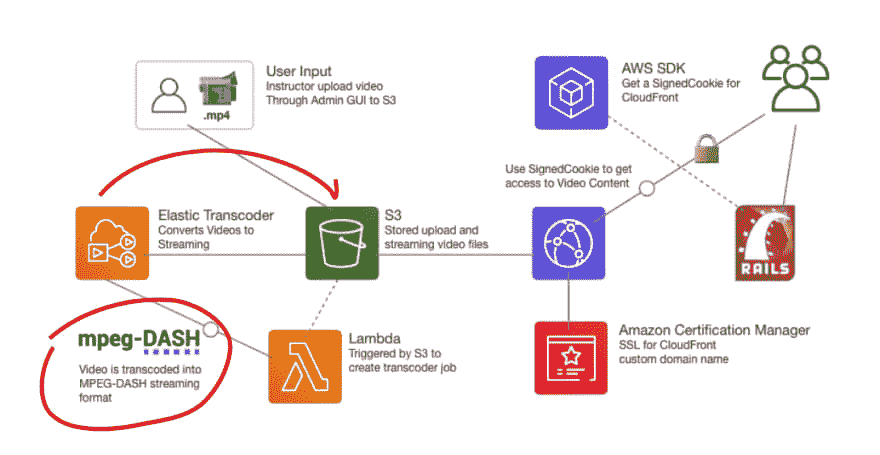

# 如何从 AWS 提供点播流视频(构建您自己的网飞)

> 原文：<https://dev.to/exampro/how-to-serve-on-demand-videos-from-aws-4fo4>

⚠️开发的视频播放器处于测试阶段，不会为人们播放，导致错误代码，但不要担心，因为我们也上传我们的视频到 youtube，所以[这里是视频的 youtube 链接。](https://www.youtube.com/watch?v=kQwZUupLeqE&t=1s)。如果你碰巧去我们的 YouTube，考虑给我们订阅，因为它可以帮助我们制作更多的免费视频内容。

* * *

因此，在 ExamPro，我们有大量的视频内容，而不是使用现有的提供商来提供点播视频流，我们在 AWS 上推出了自己的内容。这使我们能够完全控制数据，也使我们能够以比使用第三方提供商更低廉的价格拥有视频管道。

