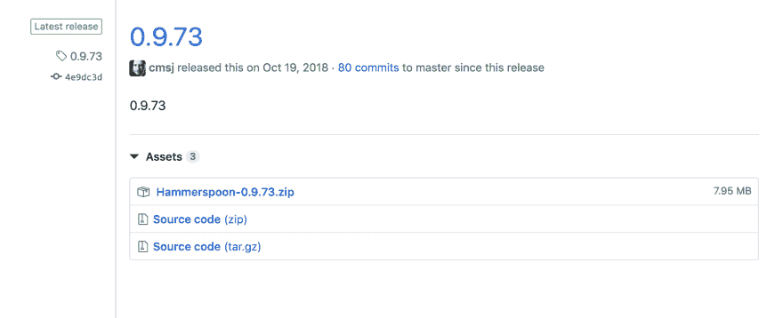
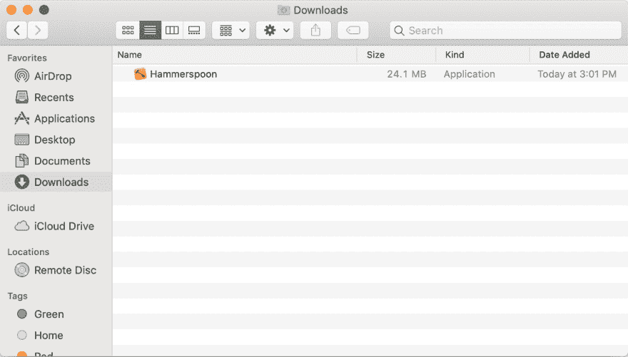
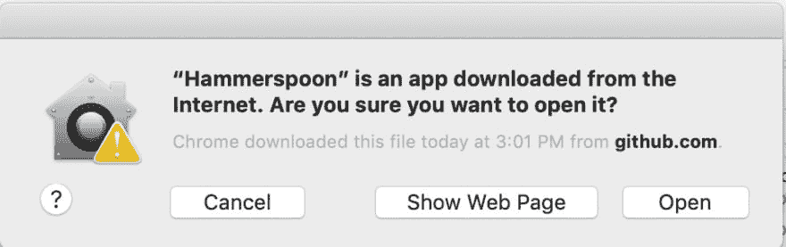

# 将 mac 配置为在菜单栏上显示 wifi 名称

> 原文：<https://dev.to/mcrowder65/configuring-your-mac-to-display-the-wifi-name-on-the-menu-bar-3p8b>

[](https://res.cloudinary.com/practicaldev/image/fetch/s--Qycq2vqs--/c_limit%2Cf_auto%2Cfl_progressive%2Cq_auto%2Cw_880/https://thepracticaldev.s3.amazonaws.com/i/2mlam08hguywxrpwo8kx.png)

如果您发现自己不知道如何在菜单栏上显示您所连接的网络的名称，请按照以下说明操作。

我们将使用一个名为 [hammerspoon](https://www.hammerspoon.org/) 的应用程序，它允许你的计算机在后台运行 lua 脚本！

*   [进入 hammerspoon 的 github 发布版](https://github.com/Hammerspoon/hammerspoon/releases)安装最新版本。你会发现这样的东西:

[](https://res.cloudinary.com/practicaldev/image/fetch/s--Uew8KT4Y--/c_limit%2Cf_auto%2Cfl_progressive%2Cq_auto%2Cw_880/https://thepracticaldev.s3.amazonaws.com/i/wsmoo6ds5ca4sigmbq1s.png)

*   点击第一个选择，`Hammerspoon-0.9.73.zip`
*   下载完成后，解压到你的下载文件
    [](https://res.cloudinary.com/practicaldev/image/fetch/s--BzjM7DGS--/c_limit%2Cf_auto%2Cfl_progressive%2Cq_auto%2Cw_880/https://thepracticaldev.s3.amazonaws.com/i/oufu8gn6b3p2ogoka7im.jpg)

*   将 Hammerspoon 应用程序拖到您的应用程序中

*   一旦进入应用程序，用 spotlight 打开 Hammerspoon(按 command 和 space，键入 Hammerspoon，然后按 enter)

*   一旦第一次打开 Hammerspoon，您应该会看到一个安全提示:
    [](https://res.cloudinary.com/practicaldev/image/fetch/s--NsDzvrXk--/c_limit%2Cf_auto%2Cfl_progressive%2Cq_auto%2Cw_880/https://thepracticaldev.s3.amazonaws.com/i/fdagv6jgbmie1nml2qd1.jpg)

*   单击打开

*   检查`Launch Hammerspoon at login`

*   太好了，现在我们可以添加初始化脚本了！

*   打开你的终端，输入`touch ~/.hammerspoon/init.lua`，

*   现在打开 init.lua，(位于`~/.hammerspoon/init.lua`)

*   粘贴以下代码:

```
wifiMenu = hs.menubar.newWithPriority(2147483645)
wifiMenu:setTitle(hs.wifi.currentNetwork())

wifiWatcher = nil

function ssidChanged()
    local wifiName = hs.wifi.currentNetwork()
    if wifiName then
        wifiMenu:setTitle(wifiName)
    else
        wifiMenu:setTitle("Wifi OFF")
    end
end

wifiWatcher = hs.wifi.watcher.new(ssidChanged):start() 
```

Enter fullscreen mode Exit fullscreen mode

*   使用`cmd+q`退出 hammerspoon，(不只是按红色的 x)
*   重新打开哈默斯普恩

瞧啊。我们现在在菜单栏上有了我们网络的名称！