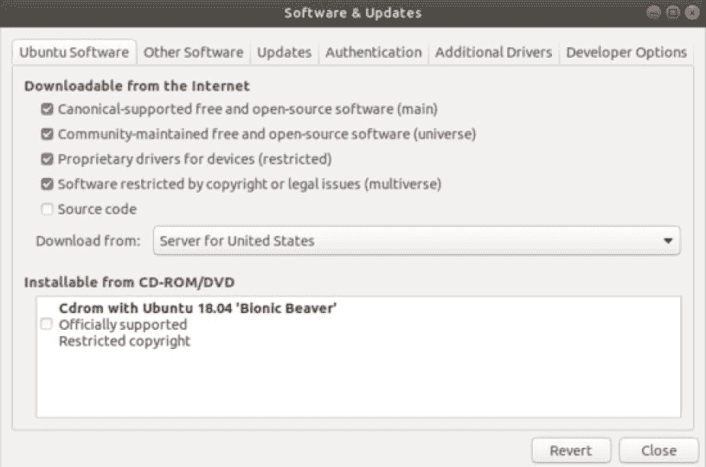

# 第 1 部分:安装 ROSS 可能很难，让我们简化一下

> 原文：<https://dev.to/benjaminblouin/part-1-installing-ross-can-be-hard-let-s-make-it-easy-45hg>

这是一个跟踪在 Ubuntu 18.04LTS 上设置 ROS 的帖子，因为第一次尝试让我感叹不止。

# 玫瑰旋律莫雷尼亚(2023 年 5 月停产)

[ROS 的 Ubuntu 安装指南](https://wiki.ros.org/melodic/Installation/Ubuntu)

*****我假设你已经安装了全新的、未经修改的 Ubuntu 18.04LTS！*****

# 知识库初始化

1.  `sudo apt update && sudo apt upgrade`
2.  允许 Ubuntu 存储库“受限”、“宇宙”和“多元宇宙”
3.  在同一窗口中，选择“其他软件”选项卡。选择添加，从下面粘贴:`deb [http://mirror.umd.edu/packages.ros.org/ros/ubuntu](http://mirror.umd.edu/packages.ros.org/ros/ubuntu) bionic main` *这个回购托管在马里兰大学。ROS 的指南里给的链接坏了。如果您想使用不同的，请单击下面。* [罗斯魔镜](https://wiki.ros.org/ROS/Installation/UbuntuMirrors)
4.  应用/关闭窗口。很有可能会抛出一个错误，说没有可用的公钥。
5.  There's a good chance a missing public key error is thrown. Open Terminal and run the command below:

    `sudo apt-key adv --keyserver keyserver.ubuntu.com --recv-keys 5523BAEEB01FA116`

现在是凌晨 12 点 37 分，我要去🛌😴 💤
让🤖 🌚 💀 😂