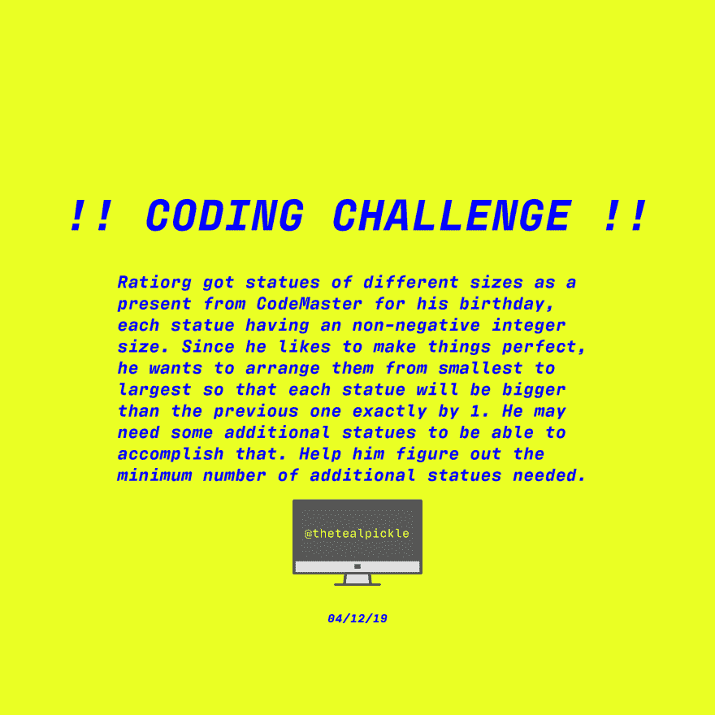
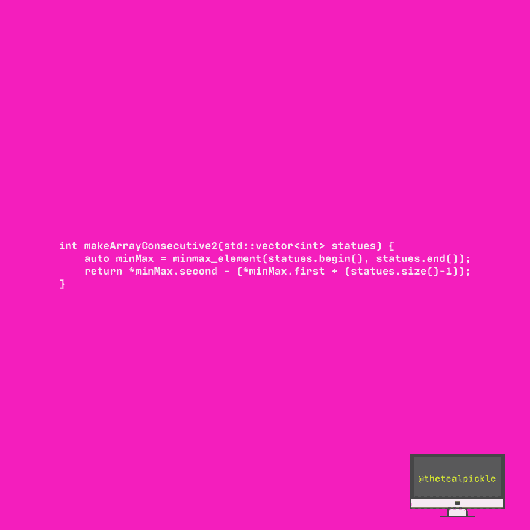

# [C++代码]使数组连续 2

> 原文：<https://dev.to/thetealpickle/c-code-make-array-consecutive-2-1jng>

TEAL PICKLE 编码挑战！！不同大小的雕像，需要一些排序(C++)。

尝试👀，查看我的解决方案，分享！！

[T4】](https://res.cloudinary.com/practicaldev/image/fetch/s--mQjkTv0y--/c_limit%2Cf_auto%2Cfl_progressive%2Cq_auto%2Cw_880/https://thepracticaldev.s3.amazonaws.com/i/vedrwjp7d9yded1of92u.png)