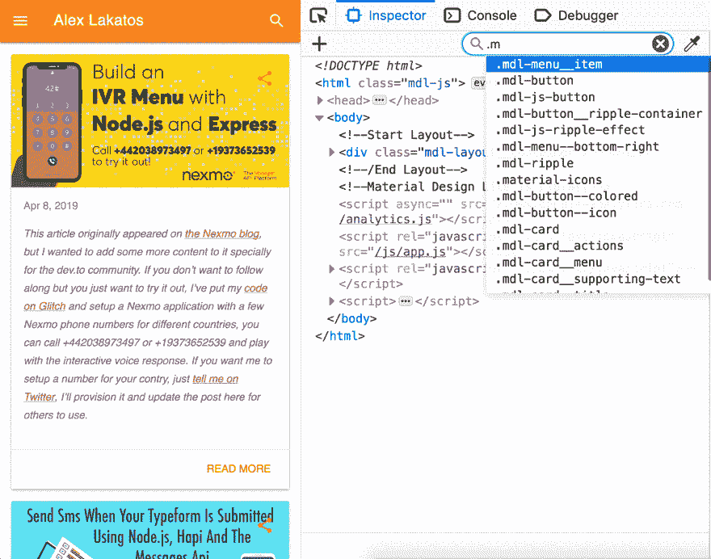
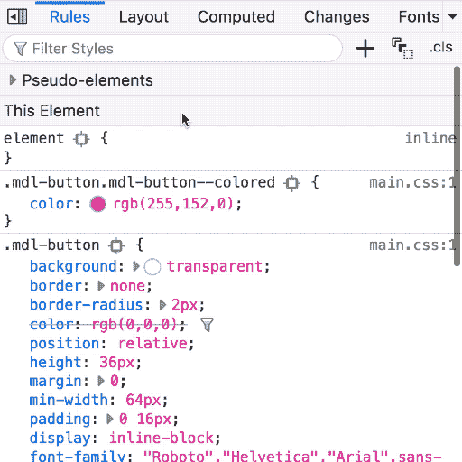
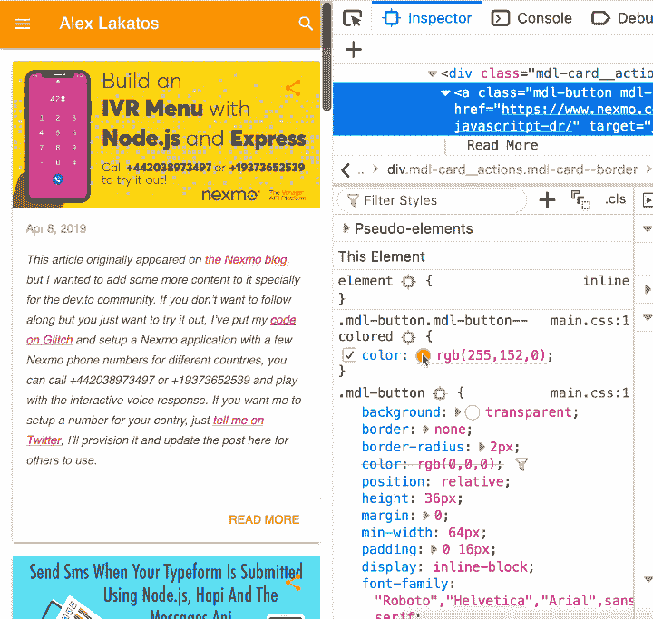
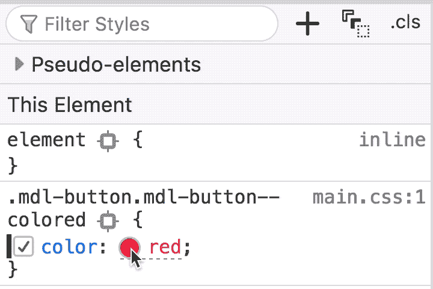
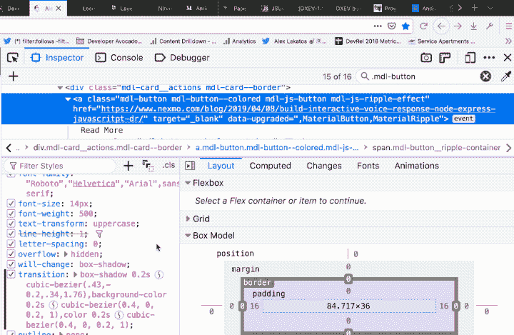

# Firefox DevTools -页面检查器的 5 个提示和技巧

> 原文：<https://dev.to/lakatos88/5-tips-and-tricks-for-firefox-devtools-page-inspector-2p95>

*这是[系列](http://alexlakatos.com/devtricks/)中的第一篇文章，这是一系列帮助你用 Firefox Devtools 调试 web 应用程序的技巧和窍门。它向你展示了在 Firefox 开发者工具中使用页面检查器的 5 个技巧&。*

## 页面检查器中的 CSS 选择器搜索

你可以在火狐开发者工具[页面检查器](https://developer.mozilla.org/en-US/docs/Tools/Page_Inspector)搜索框中使用 [CSS 选择器](https://developer.mozilla.org/en-US/docs/Learn/CSS/Introduction_to_CSS/Selectors)。它非常方便:

*   不能直接右键单击带有`z-index`的元素
*   寻找您知道选择器的通用文本元素
*   寻找视觉上相同但具有特定类/选择器的元素

## 规则视图中的过滤样式

您可以通过任何选择器或属性在检查器的“样式”视图中过滤 CSS 规则。对于选择器，它突出显示了规则列表中的选择器，对于属性，它扩展了包含过滤器的所有属性(例如，border 速记中有 border-color)，它突出显示了包含过滤器的属性，并隐藏了不包含过滤器的规则。当你在一个框架中使用竞争选择器时，只关注相关的东西，这真的很方便。或者当您有像 border 或 background 这样的合成属性时，因为它会将它们扩展为包含筛选属性的合成属性。

## 规则视图中的  颜色选择器&吸管工具

单击任何颜色属性旁边的彩色点，它会打开一个带有便捷吸管工具的颜色选择器。当您悬停页面时，滴管会放大，因此更容易从特定像素中选取颜色。如果你是一个视觉型的人，想要在适当的位置调整颜色，或者如果你想使用页面不同部分的颜色，而不需要改变规则来获得颜色，这真的很方便。

## 规则视图中的颜色表示

按住 SHIFT 键并单击颜色属性旁边的任何彩色点，它会在该颜色可用的 3 种或 4 种颜色表示之间变化(并非所有颜色都有名称，因此这些颜色只有 3 种表示):`name`、`hex`、`hsl`和`rgb`。对于角度也是一样，如果你按住 SHIFT 键并点击一个`rotate`度数单位旁边的点，它会在`deg`、`rad`、`grad`和`turn`之间转换显示。当你的风格指南要求十六进制颜色，但你更熟悉 hsl 或 rgba 时，这真的很方便。

## 定时功能贝塞尔曲线编辑器中的规则视图

你可以点击任何带有计时功能的属性(如过渡、动画)旁边的曲线点，它会打开一组预定义的过渡和一个贝塞尔曲线编辑器。测试过渡真的很方便，有一个动画滑块显示你的时间，如果你想要一个自定义函数，它会为你计算三次贝塞尔曲线。

## 这是每周的事

如果你想知道为什么会这样，原因很简单:

*   自从 Firefox DevTools 被开发出来以来，我每天都在使用它们。最初，我是其中一部分的质量保证负责人，之后，在我的日常工作中，我是一名开放网络的 JavaScript 开发人员。
*   Chrome DevTools 在互联网上更受欢迎，但 Firefox DevTools 背后有一个了不起的工程团队，提供了许多有用的功能。有些与 Chrome 不相上下，有些更好，有些甚至还没有进入 Chrome。当然，有些在 Chrome 中更好(我正看着你呢，调试器)，当两者之间有差异时，我一定会指出我所展示的技巧的差异。

我试着把这个变成每周一次的事情，这些年来我已经收集了这么多技巧。如果你喜欢这个或者想看更多，我是推特上的[@ Lakatos 88](https://twitter.com/lakatos88)，跟我去吧，那里是[魔法发生的地方](https://twitter.com/lakatos88/status/1116698023810224128)。