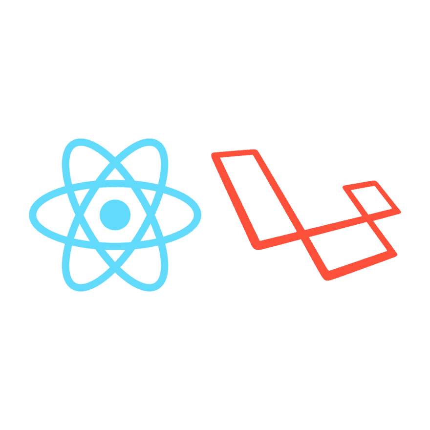

# 设置 React + Laravel，无 Laravel 混合

> 原文：<https://dev.to/emeka/setup-react-laravel-without-laravel-mix-4437>

 
说到 web 开发，我在前端的 goto 库是 [React](https://reactjs.org) ，在后端，我喜欢使用 [Laravel](https://laravel.com) ，因为它包含了许多内置的好东西。

我不止一次发现自己不得不分别托管我的后端和前端，并运行多个部署。虽然它有它的好处，但维护起来可能相当昂贵。将 react 和 laravel 应用程序部署在同一台服务器上，仍然可以获得将它们分开部署的大部分好处。它们可能位于同一个服务器上，但是它们仍然是两个相互通信的可重用实体。让我展示如何在一台服务器上设置 laravel 和 react 项目。

对于这个任务，我们将利用 [Babel](https://babeljs.io) 、 [webpack](webpack %0Ahttps://webpack.js.org) 和 [react-hot-loader](https://github.com/gaearon/react-hot-loader) 将我们的 react 资产编译到 laravel 视图中。

## Laravel

首先，我们将创建我们的 laravel 项目。我们可以通过运行命令来实现。

`laravel new react-laravel`

你可以在这里了解更多关于创建 laravel 项目[的信息。](https://laravel.com/docs/5.8/installation)

在我们的`/resources/view/`文件夹中，我们可以找到一个名为`welcome.blade.php`的文件。删除该文件，并创建一个名为`index.blade.php`的新文件，内容如下。