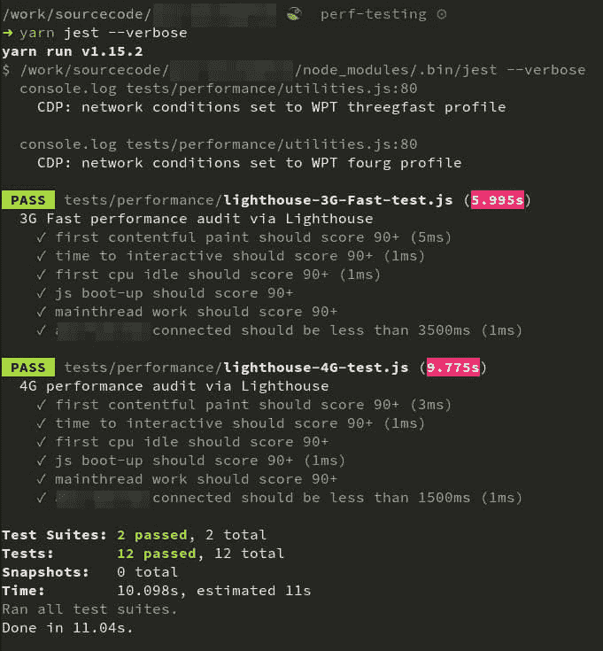

# 使用 Lighthouse、Puppeteer 和 Jest 进行 Web 性能测试

> 原文：<https://dev.to/justinribeiro/using-lighthouse-puppeteer-and-jest-for-web-performance-testing-1im3>

在过去的几个月里，我有很多机会帮助一些公司改进 web 性能测试。大量的工作是将 [lighthouse](https://github.com/GoogleChrome/lighthouse) 与 [jest](https://jestjs.io/) 集成在一起，我发现随着人们在各自的团队中转向更现代的工具，这种方法越来越受欢迎。

这不是我第一次走上整合灯塔这条路。我之前用 mocha 的例子作为起点仍然很受欢迎(尽管可以使用它自己的更新)。但是我确实想在节流方面做一些稍微不同的事情，所以我决定使用[木偶师](https://github.com/GoogleChrome/puppeteer)来处理网络条件，使用[网页测试连接概要示例](https://github.com/WPO-Foundation/webpagetest/blob/master/www/settings/connectivity.ini.sample)作为基线。

最终结果: [lighthouse-jest-example](https://github.com/justinribeiro/lighthouse-jest-example) ，一个基本项目，展示了如何一起使用这些工具来测试您的 web 应用程序。这个示例做了几件事:

1.  它将启动一个带有 HTTPS 的本地网络服务器(你可以通过`certutil`添加到你的证书链中)来运行你的网站。或者，如果您愿意的话，您可以关闭该功能，并针对远程端点进行测试。
2.  您可以为每个测试定义一个 URL，如果您想测试一种方法的变体，这与单个入口点相反。
3.  如果愿意，您可以进一步定义多种连接类型。

这反过来看起来与您可能运行的任何其他 jest 测试没有什么不同，如下图所示:

回购协议有所有的细节。有问题或修复？归档票证和拉动请求总是受欢迎的。