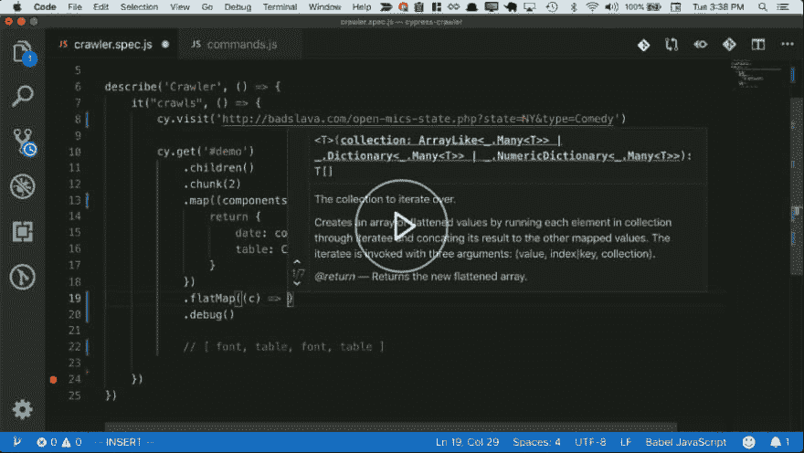

# 让我们用柏树造一个刮网器吧！

> 原文：<https://dev.to/brettshollenberger/let-s-build-a-web-scraper-with-cypress-1g5l>

如果你有一个 web scraper，你会构建什么？

*   可能你的健身追踪器没有公共 API？
*   还是你想永远胜过你的竞争对手？
*   也许您想要关联和可视化来自多个互不相连的平台的数据？
*   想要在外部站点上自动执行常见任务吗？

或者你可能和我一样，列出你所有开放式麦克风喜剧活动的网站没有任何搜索、过滤或在地图上显示活动地点的能力。

那么我们如何摄取这些数据以获得乐趣和利润呢？

## 柏来救驾

Cypress 是一个非常快的端到端测试框架。由于它可以与任何网页交互，我们也可以用它来自动与外部网站交互！

在这个免费的 Egghead.io 课程中，和我一起建造它吧！

