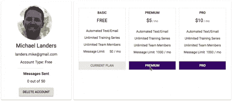
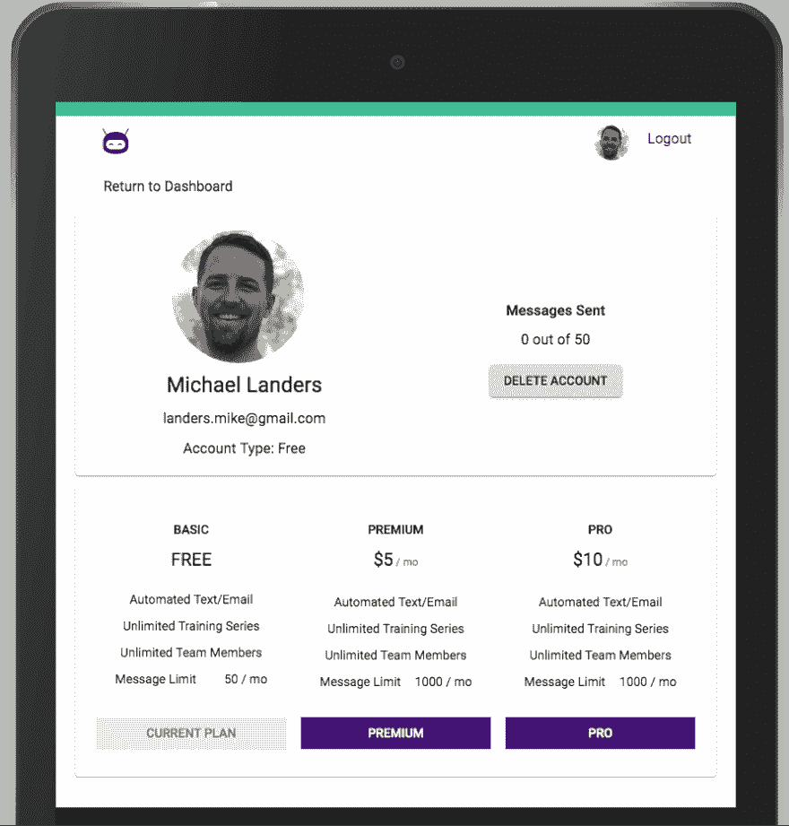
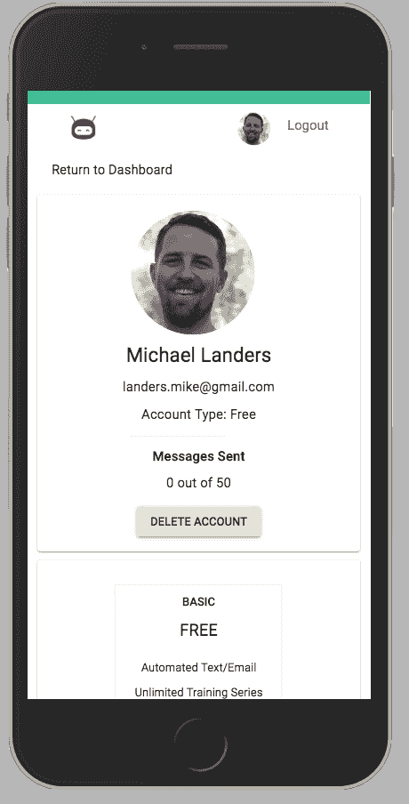
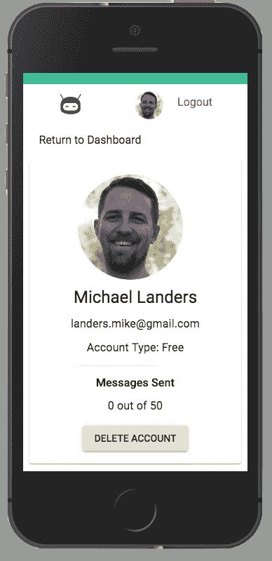
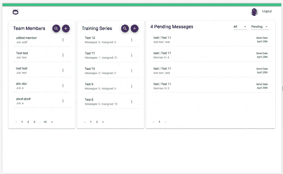

# 实验第 4 周:回顾

> 原文：<https://dev.to/mlanders/labs-week-4-a-review-5dfn>

本周的主题是用户体验。从周一开始，我们就用户体验和应用缺乏流畅度进行了激烈的讨论。我们都退后一步，摘下开发人员的帽子，戴上用户的帽子，最终退后一步，讨论用户实际上是如何使用应用程序的。我们带了一位朋友来体验这款应用，并向他们讲述了如何使用这款应用。这是一个大开眼界的机会，我们都需要它来帮助我们在本周剩下的时间里重新集中精力。

* * *

我这周刮了几次大风。首先是个人资料页面。在亚历克斯的帮助下，它得到了几个大的更新。全面响应，新的定价指南和灵活的支付交互

当你选择一个支付选项时，它会添加一个漂亮的动画，一旦支付被接受，它会在指南中切换你的计划，并在简介卡的左侧。

| 苹果平板电脑 | iPhone 大号 | iPhone 小号 |
| --- | --- | --- |
|  |  |  |

本周的第二个重大胜利是让主仪表板完全响应。这需要操作多个组件。需要使用样式组件和材料 UI 样式来调整样式。

让仪表板完全响应有点挑战性。当你缩小窗口时，能够让所有三张卡适当地调整并不像我预期的那么容易。在某一点上，卡片变得越来越小，但很快就变得更小，而且不流动了。在对 4 个组件的样式进行了一些调整后，我能够让仪表盘上的所有卡片都流畅起来。

* * *

本周我们团队合作得非常好。我们在周一停止了编码，以确保我们在用户体验方面有明确的优先级。在那次讨论中，我们在最后两周变得雄心勃勃，我们不得不重新关注我们可以在剩下的时间里完成什么。

我们从周一的用户测试中学到了一切，并将这些项目放入 Trello。然后，讨论转移到细化一些设计决策，以帮助它们在整个应用程序中更加统一。一个例子是我们的按钮样式和位置。让多人在没有清晰设计指南的情况下构建应用程序，我们最终得到了许多不同的按钮样式和布局。

在整个星期中，我们在星期一讨论的每一个项目开始汇集在一起。周四，我们做了另一个用户测试，结果更好，但并不完美。一些错误已经出现，一些风格仍然需要调整，但我们可以看到终点线。

下周将是一个磨砺，以获得最后剩余的项目敲定和应用程序的视频。

* * *

轮廓

> [https://trello . com/c/hkgnro 2k/317-profile-pages-responsibility-and-pricing-design](https://trello.com/c/HKgNRO2k/317-profile-pages-responsiveness-and-pricing-design)
> [https://trello . com/c/1 kpaa 58k/336-loading-animation-should-be-just-on-the-payment-section-and-not-the-pricing](https://trello.com/c/1kpAa58k/336-loading-animation-should-just-be-on-the-payment-section-and-not-the-pricing)
> [https://github . com/training-bot/labs 11-training bot-FE/pull/108](https://github.com/training-bot/labs11-trainingBot-FE/pull/108)

培训系列中显示的分配数量

> [https://github . com/training-bot/labs 11-training bot-FE/pull/102](https://github.com/training-bot/labs11-trainingBot-FE/pull/102)

图标和加载器

> [https://github . com/training-bot/labs 11-training bot-FE/pull/99](https://github.com/training-bot/labs11-trainingBot-FE/pull/99)

按钮设计更新

> [https://trello . com/c/zdf 5 cs 4f/309-replace-all-buttons-with-text-buttons](https://trello.com/c/ZDf5cS4F/309-replace-all-buttons-with-text-buttons)
> [https://github . com/training-bot/labs 11-training bot-FE/pull/88](https://github.com/training-bot/labs11-trainingBot-FE/pull/88)

配置文件开始时定价

> [https://trello . com/c/kgvd 5a hx/302-pricing-info-on-user-profile-in-subscriptions-section](https://trello.com/c/KgVd5ahx/302-pricing-info-on-user-profile-in-subscriptions-section)
> [https://github . com/training-bot/labs 11-training bot-FE/pull/88](https://github.com/training-bot/labs11-trainingBot-FE/pull/88)