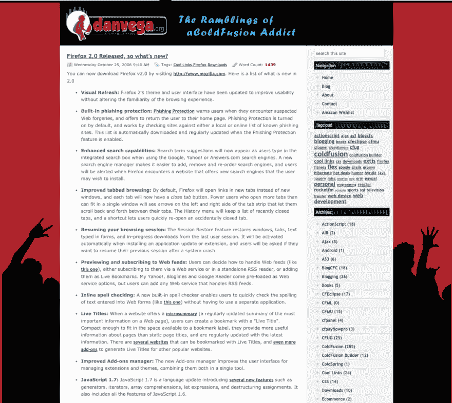
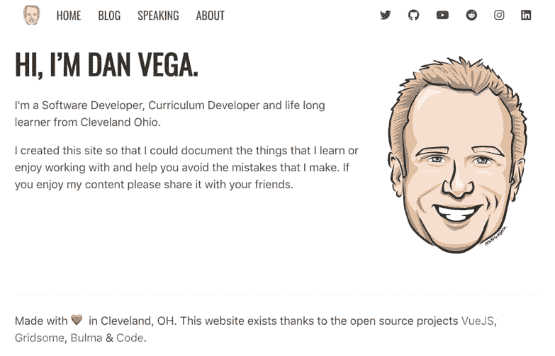

# 个人博客:不要称之为东山再起！

> 原文：<https://dev.to/therealdanvega/personal-blogs-don-t-call-it-a-comeback-43fo>

我不知道你是否注意到了，但是个人博客正在卷土重来。如今不仅有更多的人写博客，还有更多的人建立了自己的博客，这真的很棒。在这篇文章中，我会给你一些我为什么开始写博客的背景，我相信这是你开始写博客的好理由，如果你还没有。

## 我为什么开始写博客

我从 2005 年 10 月开始写博客，已经写了近 1000 篇博文。如果这听起来很多，我可以向你保证，大声说出来对我来说很奇怪，因为我无法相信。然而，我清楚地记得我开始写博客的时间和原因。

2005 年，我是一名 ColdFusion 开发人员，我想练习构建真正的应用程序。像大多数初级开发人员一样，我知道我变得更好的唯一方法是实践。你必须记住，当时我们没有 Github 或我们今天拥有的大量资源。

我们所拥有的，尤其是在 ColdFusion 社区，是一些喜欢写博客和分享他们的经历的人。我很崇拜这些开发者，并想追随他们的脚步。我认为这是一个建立自己博客的好机会。

我发现了一个用 ColdFusion 编写的名为 [BlogCFC](http://www.blogcfc.com/) 的开源博客平台。在我开始写博客之前，我学会了如何建立和使用一个开源项目，这是一次很棒的经历。我有机会看到我或我当时工作的公司以外的人是如何创建和分发软件的。

我真的很喜欢这个博客主题的想法，给它一个独特的外观来匹配我的个性。现在，我从来没有因为我的设计技巧而出名，但直到今天，这仍然是我喜欢做的事情。这是我博客早期版本的截图，使用的是[时光倒流机](https://archive.org/web/)。

现在我有了自己的新博客，我记得我早期的很多帖子都是关于我在创建博客时学到的东西。我写博客的动机总是归结为两个简单的目标。

首先，我想帮助那些试图和我做同样事情的人，但允许他们避免我犯的所有错误。如果我能帮助某人避免对着显示器大喊大叫和用头撞桌子的不适(这是我的经验之谈)，那么我认为这是成功的。

第二，我想要一个我刚刚解决的问题的参考，我可以稍后再回来。我不得不告诉你，对我来说最酷的事情之一是谷歌搜索你一直困扰的东西，结果却发现你自己的博客文章解决了你的问题。这是一个很好的方式来提醒你为什么要做这些事情。

## 开发者为何停止建设个人博客

现在你已经了解了我的一些背景，我可以谈谈为什么我认为开发者不再创建他们自己的博客了。

### 碎碎念

在这篇文章中，我真的开始和自己约会了，但是当我开始写博客的时候，Twitter 甚至还不存在。事实上，我直到 2008 年 5 月才加入 Twitter，我甚至不记得我是从什么时候开始认真使用它这个平台来管理信息的。

我提到 Twitter 的原因是许多博客作者使用他们的博客与他人分享信息和链接。如果我有一个很酷的工具、产品或网站链接，我会写博客。现在，除非我对我刚刚发现的这个很酷的东西有更多的话要说，否则我只会在 Twitter 上分享它。

现在这并不是一件坏事，因为我是 Twitter 的忠实粉丝，但我真的很享受一个开发者对使用这个工具的洞察力和经验，我以后还可以回来。

### 文字出版社

WordPress 是一个神奇的 CMS +博客平台，被整个互联网的 33%的人使用。这个数字令人震惊，但如果你曾经使用过它，就不会感到震惊。当我离开 ColdFusion 时，有很多我一直在寻找的功能，而 WordPress 似乎拥有所有这些功能，所以我换了。

我已经用了一段时间了，并且很喜欢它的大部分功能。我遇到的 3 个主要问题是:

*   托管:WordPress 是一个资源猪，托管每月花费我 30 美元
*   插件:安装大量插件会导致性能问题
*   PHP:我不是 PHP 开发人员，也不想成为。

我认为最后一个对我来说是个大问题。我知道的足够多，可以进去把一些东西拼凑起来，但是每当我想更新主题的时候，它似乎对我来说太难了。我认为这可能是很多开发者的情况。也许他们搬到了 WordPress，买了一些主题，只是把它作为一个博客平台。

我并不是说这有什么不对，但这可能是导致像我这样的开发者建立个人博客的原因。再说一次，当我说建造时，我只是指从头开始创造一些东西，并赋予它一些风格以符合他们的个性。

### 中等

2012 年，Medium 推出，它为作家提供了一个平台，让他们无需建立博客就可以开始写作。几年前，我开始在那里写作，起初我真的很喜欢它，但我总是回到这样一个事实上，我没有自己的内容。我当时也不想迁移我的 700 篇文章，所以它很快就变成了我从自己的博客上整合文章的地方。

快进到今天，我看到许多开发人员确实转向了媒体，离开了它。Medium 获得了大量资金，所以你必须知道在某个时候他们需要开始赚钱。如果你最近在 Medium 上阅读一篇帖子，你可能会突然发现一个付费墙。我也不认为这对开发者来说是一次很好的写作体验。

*如果你正在寻找一个像中型但面向开发者的解决方案，我建议你看看 [http://www.dev.to](http://www.dev.to) 。*

## 不叫东山再起

我给出了一些原因，为什么我认为有一段时间开发者没有建立他们自己的博客。我在这里告诉你，时代在改变！我认为有几件事促成了这次回归。

*   静态站点生成器
*   JavaScript 框架的演变
*   JavaScript 摇滚🤘🏻

### JAMStack(静态站点生成器)

我认为静态站点生成器是卷土重来的一个重要原因。我知道对我个人来说，像 WordPress 这样伟大的平台对于我想做的事情来说太多了。我的访问者来到我的网站，阅读我的内容，查看我提供的课程信息。他们不会长时间访问我的网站，偶尔会出现资源不足的错误。

静态站点生成器允许我们构建整个站点，这样当我们的访问者获得内容时，他们看到的是 HTML/CSS/JS，速度非常快。这一直是静态网站的吸引力所在，但直到最近，它们所能做的还相当有限。随着 JavaScript 框架、工具和云计算的进步，我们现在有了一个非常棒的工作流。

我在 markdown 中写了很多文档、教程和练习，所以从一个简单的 Markdown 文件开始对我很有吸引力。从那里我可以写一篇新的博客文章，当我准备好提交文件到我的 git 库并推送它的时候。我的主机提供商建立了我的静态网站，部署它，并让每个人都可以看到。

我在这篇文章中几次提到 Gridsome，我选择它是因为它使用 Vue。有很多很好的选择，包括一个非常受欢迎的叫做[盖茨比](https://www.gatsbyjs.org/)的选择。我建议看看你的选择，尝试一些适合你的组合，然后从那里开始。

如果你有兴趣听更多关于 JAMStack 的消息，请发推特给我，让我写那篇文章！我喜欢它的一切，对这个话题有很多话要说。

### JavaScript 框架的演变

如果没有 JavaScript 框架的发展，我们就不会有这些惊人的静态站点生成器。在过去的 5 年里，我们看到 Angular、React & Vue 等框架脱颖而出。这些框架和 JavaScript 语言本身再次让前端开发变得有趣起来。

无论您的项目需求是什么，三大框架中的任何一个都有可能为您提供答案。开发人员喜欢卷入框架战争，但是如果你只是喜欢构建东西，他们中的任何一个都不会出错。

我总是告诉人们，在“我应该选择哪个框架”的问题上，他们不应该听任何人的。尝试使用它们中的每一个构建一些组件或应用程序，然后自己决定。

### JavaScript 石头🤘🏻

每一个伟大的框架背后都是一门伟大的语言。多年来，JavaScript 受到了很多批评(这是理所应当的)，但作为“网络语言”，它经受住了时间的考验。在 jQuery 变得很酷之前，我不得不学习 JavaScript，我无法告诉你今天它有多好。

在过去的几年里，JavaScript 真正获得了自己的地位，我认为 ES6 为这种语言带来了许多让开发人员兴奋的特性。一些写得很好的 JavaScript 非常简洁优雅，我迫不及待地想看看这种语言的未来会带来什么。

## danvega.dev

如果你没有在我的博客上阅读这篇文章，并想看看，请前往 https://www.danvega.dev 。我还有几篇文章介绍了我为什么迁移到 Gridsome 以及我是如何构建某些特性的。如果你感兴趣，我的整个网站都是开源的，你可以[在这里](https://github.com/danvega/danvega-dev)获得代码。

## 结论

我用 grid some 建立了我的新个人网站，从中获得了很多乐趣。这真的让我回到了我热爱软件开发的地方。我喜欢做东西，并告诉人们我是怎么做的，这样其他人就可以学习并避免犯和我一样的错误。如果你是第一次来这个博客，这是你可以期待的，所以我希望你会再次访问。

如果你移动了你的博客或者在一个新的框架或者静态站点生成器上创建了一个新的，请告诉我。我很想去看看，我会转发一些我最喜欢的。一如既往...

快乐编码

丹

*这篇文章最初是在 https://www.danvega.dev/blog 的[发表在我的博客上的。如果你觉得这篇文章有趣，请考虑](https://www.danvega.dev/blog)[订阅我的时事通讯](https://www.danvega.dev/signup/)或者在 [Twitter](http://twitter.com/therealdanvega) 上关注我。*