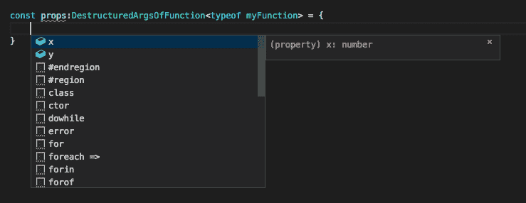

# TypeScript 教程- 'infer '关键字

> 原文：<https://dev.to/aexol/typescript-tutorial-infer-keyword-2cn>

您好，这是高级 TypeScript 教程系列的开篇文章。今天我将讲述:
的基本用法

```
infer 
```

Enter fullscreen mode Exit fullscreen mode

对我来说，一开始很难理解我能用`infer`做什么。让我们从一个非常基本的例子开始。

```
type FlattenIfArray<T> = T extends (infer R)[] ? R : T 
```

Enter fullscreen mode Exit fullscreen mode

让我们来分析这段代码:

1.  我们检查我们的泛型类型是否是数组
2.  如果是数组，从数组中提取真实类型
3.  如果它不听其自然

尽管如此，还不清楚 infer 在做什么，所以让我们继续另一个例子

```
type Unpromisify<T> = T extends Promise<infer R> ? R : T 
```

Enter fullscreen mode Exit fullscreen mode

这个看起来更清楚，因为它没有括号:

1.  我们检查类型是否扩展了承诺
2.  如果是，我们从承诺中提取类型
3.  如果它不听其自然

看到了吗？如果你使用 extends 只是为了检查类型是否是 promise，你可以使用

```
type Unpromisify<T> = T extends Promise<any> ? T : never 
```

Enter fullscreen mode Exit fullscreen mode

在 infer 而不是任何关键字中，您从类型中推断值。让我们试试更高级的类型:

```
type FuncWithOneObjectArgument<P extends { [x: string]: any }, R> = (
  props: P
) => R;

type DestructuredArgsOfFunction<
  F extends FuncWithOneObjectArgument<any, any>
> = F extends FuncWithOneObjectArgument<infer P, any> ? P : never;

const myFunction = (props: { x: number; y: number }): string => {
  return "OK";
};

const props: DestructuredArgsOfFunction<typeof myFunction> = {
  x: 1,
  y: 2
}; 
```

Enter fullscreen mode Exit fullscreen mode

智能感知对于道具的作用是这样的:
[](https://res.cloudinary.com/practicaldev/image/fetch/s--r9O8ywe---/c_limit%2Cf_auto%2Cfl_progressive%2Cq_auto%2Cw_880/https://thepracticaldev.s3.amazonaws.com/i/17vpwjlkz8taqzifwq20.png)

你可以利用它来推断 React 组件属性，或者其他使用析构参数的函数。