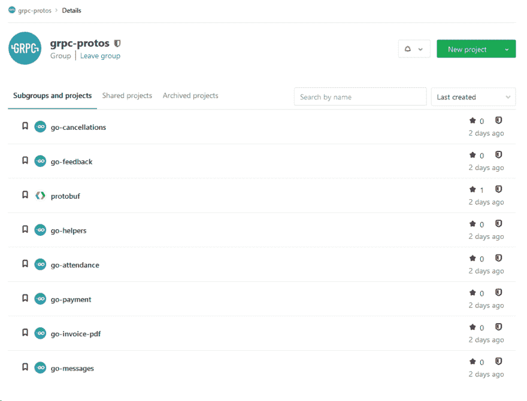
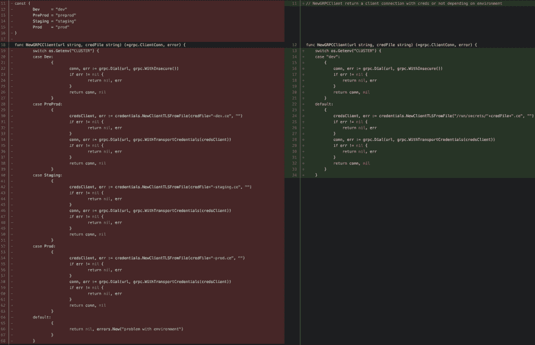

# 我们如何在微服务架构中利用 gRPC

> 原文：<https://dev.to/side/how-do-we-leverage-grpc-in-a-microservices-architecture-at-side-4bll>

# 我们如何在微服务架构中利用 gRPC

另外，我们已经使用 gRPC 和 T2 Golang 和 T3 一年多了。我们内部微服务架构的很大一部分依赖于这些技术。我们喜欢用结构化的方式来声明我们的服务的好处，以及这些技术提供的高性能。

正如您所料，第一次实现并不是没有问题。

这篇文章的目的是分享我们围绕这个话题的经验。我们将展示我们认为好的东西，以及如果您要开始 gRPC 的冒险，您应该避免的东西。

我们不会深入研究这些技术，而是主要关注我们认为至关重要的两个不同部分:

*   **第 1 部分**是关于我们在现有微服务环境中实施 gRPC 时的**开发者体验**。
*   **第 2 部分**是关于**DevOps 工具箱* *，我们利用它来确保开发人员以及开发和生产环境与 gRPC 一起正常工作。

### 第一部分:开发者体验

#### 生成代码

我们必须处理的第一件事是管理 [Protobuf](https://developers.google.com/protocol-buffers/) 文件。简而言之:
*Protobuf* 文件是我们服务的方法和参数的描述。
它们是用非特定语言的语法编写的，以后可以用来生成多种语言的代码。

我们首先将原型文件放在“服务器的”回购中，因为我们认为这是一个好主意:与给定服务相关的所有内容都包含在它的回购中。

然而，它很快就变成了一种痛苦，原因如下:

**1。本地设置**每次对*原型*文件进行更改时，我们都必须在本地生成代码。这意味着每台计算机都需要安装编译器及其依赖项。我们本来可以使用 [Docker](https://www.docker.com/) 来完成这个任务，但是我们也想避免在本地生成代码。

在试图找到解决问题的方法时，我们从[这篇文章](https://medium.com/namely-labs/how-we-build-grpc-services-at-namely-52a3ae9e7c35)中了解到*即*是如何管理他们的 *protobuf* 文件的。这个想法很简单:将每个服务的定义放在一个存储库中，这样每当有更新时，它就会使用 Gitlab 管道自动填充生成的代码。

然后，生成的代码将被推送到不同的存储库中——每个服务对应一种语言——命名为 *-* 。

另外，我们只为 Golang 生成代码，但如果需要，它可以很容易地更新。

我们的 *proto* 文件在 *protobuf* repo 中，正如你在上面的截图中所看到的，所有的 *go-* 都是生成代码回购，它们随后被导入到我们的项目中。

**2。MR 可读性**起初，我们习惯于在服务器 repo 中推送生成的代码，我们的合并请求包含许多与 MR 无关的嘈杂代码，用于在*中更新的一行。proto* 文件，我们在生成的代码中至少有十几处修改(生成代码的[示例)。](https://github.com/golang/protobuf/blob/master/ptypes/struct/struct.pb.go)

几个月来，我们一直在分离服务定义、生成的代码和服务实现。

因此，我们的 MRs 只包含相关代码，更加高效，并且专注于我们试图通过产品解决的问题。

**3。文档**如果你想查看 gRPC 服务的所有定义，你必须浏览所有的服务器报告。如果您只有很少的服务，这可能是可以接受的，但是当寻求可伸缩性和效率时，这是一个阻碍点。

我们设法引入了一个工具，这样每次你推原型文件的更新(在单一回购中)时，你也可以生成文档。

我们正在使用能够以多种格式(markdown、gitbook、html)输出文档的 [proto-gen-doc](https://github.com/pseudomuto/protoc-gen-doc) 工具。

#### 错误处理

另一个改进是 gRPC 服务器中的错误处理。

每当服务器端发生错误时，我们都会原样返回。由于缺乏上下文，当我们试图理解一个给定调用失败的原因时，这导致了一些挫折。

后来，我们意识到 gRPC 已经通过他们的[状态包](https://godoc.org/google.golang.org/grpc/status)为我们提供了解决方案。

通过使用这个包，您将能够返回状态代码和消息，就像您对 HTTP 调用所做的那样。

这里有一篇很好的文章以更详细的方式展示了这一点。

#### API 指南

我们知道这有点显而易见，但是我们强烈建议您为如何编写 proto 文件提供指导。

至少，你的服务、方法和参数要有一个命名约定。

我们从优步的团队在 [protobuf 指南](https://github.com/uber/prototool/blob/master/etc/style/uber/uber.proto)方面所做的事情中获得了一些灵感。
例如:

*   服务应该在服务中结束。
*   请求应以请求结束。
*   回应应该在回应中结束。
*   请求和响应应该总是与 RPC 名称相匹配。

#### 接下来我们打算改进什么？

*   **跟踪** —我们使用 [AWS X 射线](https://aws.amazon.com/xray/)来跟踪我们系统内的请求。虽然它和 HTTP 请求一起使用很简单，但是使用 gRPC 会更复杂。到目前为止，我们发现的唯一可行的方法是在客户机和服务器上使用 gRPC 拦截器。虽然，最终结果缺少一些信息，我们将改进这一部分。
*   **超时** —更多地依靠超时，这样我们就不会让 gRPC 调用永远持续下去。实际上，在我们目前的使用情况下，这种情况还没有发生，但我们希望做好准备，以防止将来出现问题。
*   **上下文** —我们计划改进的另一个主题是共享客户端< >服务器上下文的使用。我们可以添加一个**用户 ID** ，这样服务器就会知道是谁发出的请求，以及它是否被授权。

### 第二部分:DevOps 工具箱

#### 实施新协议

除了开发人员的好处之外，gRPC 最棒的地方是它提供了额外的安全层。

使用 [HTTP/2](https://en.wikipedia.org/wiki/HTTP/2) 在网络上直接处理调用，并且在客户端和服务器端都使用证书。它确保只有需要的服务才能相互作用。

为了实现 gRPC，基础设施和网络部分并不是最难的。尽管它展示了我们如何利用之前做出的选择。

使用带有专用网关和自制 DNS 的本地网络并不适合连接所有开发人员的机器以及测试 gRPC。

同一台机器上的两个服务将能够一起通信，但是如果一个 gRPC 客户机(部署在机器 A 上)需要调用一个 gRPC 服务器(部署在机器 B 上)，事情就变得复杂了。大多数情况下，您需要在生产中以更复杂的方式实现这一点。你也可以不允许任何在安全的内的[拨号，这将要求你创建和部署证书。](https://godoc.org/google.golang.org/grpc#WithInsecure)

由于我们的工作负载是由 Swarm 集群处理的，因此我们将展示我们实现的两块砖，这两块砖在此次过渡中成为了我们的最佳盟友。

#### Traefik

你知道 [Traefik](https://traefik.io/) : the *(best？)*开源反向代理/负载均衡器？如果你从未听说过，我们推荐你看一看[这个演示](https://containous.github.io/slides/online-meetup-201901/#/traefik) *(点击右下角开始)*

当我们开始 gRPC 的实现时，我们的团队已经在使用 Traefik 了，我们对修改它的想法并不满意。这是一个优雅而有效的解决方案，尤其是当你需要在团队中加入一个新的开发人员时。

我们最初对 Traefik 的研究有点令人担忧:我们只发现了那些尝试过但未能正确启用它的人的故事。然而，没有其他有价值的选择，所以我们仍然继续进行。

幸运的是，自从* Traefik* 1.5.2*以来，已经有了关于如何在其网络内处理 gRPC 呼叫的良好文档:[https://docs.traefik.io/v1.5/user-guide/grpc/](https://docs.traefik.io/v1.5/user-guide/grpc/)。
它需要很少的网络配置。

通过这样做，你将在同一个网络上拥有所有的服务，并且能够通过 *Traefik* 进行交互。现在，只需要一个处理证书的好方法

**请注意，随着 Traefik 新版本的推出，它变得越来越流畅和快速。试一试！(双关语)*

#### 码头工人的秘密

证书和它们的安全性很好，但是如果你不知道如何存储它们，也不给它们干净服务的访问权限，你最终会失去所有的好处。

由于您可能有一个、两个、三个、四十二个环境需要处理:*预生产、试生产、生产，可能还有演示或团队环境*，您很可能希望有一种可扩展的方式来处理证书。

为了满足这个需求，我们使用了 [Docker secrets](https://docs.docker.com/engine/swarm/secrets/) 。这是我们发现的唯一一种解决方案，它有一种体面的、可伸缩的方式来为相应的服务提供良好的证书。它也为你在配置文件中得到的不可维护的 *200* 线长的开关案例提供了答案。

它为我们提供了一种检索证书的方法，这种方法不依赖于环境、服务或其他任何东西。

我们使用 OpenSSL 制作证书，按照相同的名称将它们存储在我们的群中，并为我们的所有服务安装在相同的路径*上。

这样，我们就有了一种灵活的方法来存储我们的证书，并在管理器上加密。事实上，我们确信它们只对正确的服务集可用。

*如果你不习惯使用 secrets，默认路径是/run/secrets/*

#### 话题上的额外内容

*   [下面是一个关于 Go 中 gRPC 服务最佳实践的有趣演讲](https://www.youtube.com/watch?v=Z_yD7YPL2oE)。

由我们 TechOps 团队的 **Bilel** 和 **Lucien** 共同撰写。非常感谢他们！

如果你对我们正在研究的主题感兴趣，请随时查看我们的空缺职位。

### [身边](https://medium.com/@_Side)

灵活的#工作和不灵活的#关爱欧洲所有学生// #Jobs
灵活和保护不灵活是为了所有欧洲学生

建设工作的未来