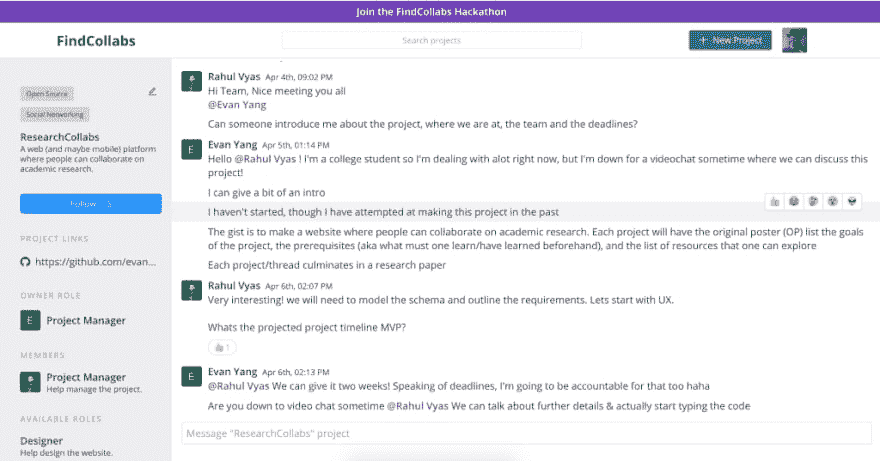
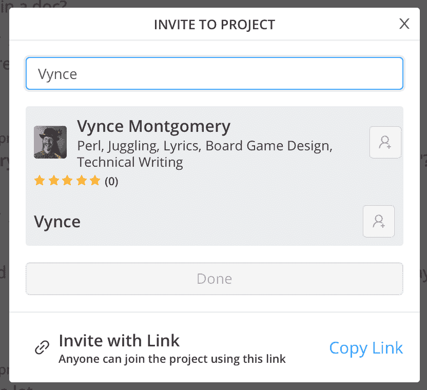

# 合作就合作

> 原文：<https://dev.to/vyncemontgomery/collaborating-on-collaborating-3jm9>

 

<figcaption>在一个项目的早期，两个合作者正在确保他们在同一页上并安排会议。</figcaption>

对我来说，我在 [FindCollabs](https://findcollabs.com/) 上发现的一个更有趣的项目是[researchcolllabs](https://findcollabs.com/project/hZ1neEyPPcJManI6PQD1)，一个专门用于学术研究的协作工具。我想知道既然 FindCollabs 已经存在，为什么这样的工具会有用。答案是多方面的。一部分是人们更好地使用一个范围正确的工具。如果太窄，你永远得不到用户群；太宽了，你的用户很难找到他们的群体。试图让学术研究在 FindCollabs 上进行可能会吓跑那些不是学术研究的项目，或者让研究人员费力地通过不相关的项目而相互错过。研究实验室通常不在四方或公共食堂是有原因的。

但更重要的是，他们希望 ResearchCollabs 成为一个合作研究的平台，而 FindCollabs 旨在成为一个寻找合作者的平台。

FindCollabs 并不打算取代 Slack、Trello 或 Github 或任何能让你达到目的地的东西。为什么要重新发明轮子？FindCollabs 专注于寻找项目和合作者的工具。个人可以搜索看起来有趣的项目，项目所有者可以邀请个人加入他们的项目。用户简档还可以在有机项目发现中发挥作用，因为用户参与的每个项目都列在他们的简档中。更重要的是，用户的个人资料还显示了他们过去合作的回顾。这是一个信誉系统的开始，这个系统将能够与经过验证的、有效的贡献者一起工作。

 

<figcaption>我得到了五颗星。可能是帽子的原因。</figcaption>

有，有讨论项目的聊天室，但无意成为团队交流工具；更像是接待处。“嗨，这是我们做的，你有兴趣吗？”如果是这样，你加入这个团队，然后一起工作，无论这个团队如何合作。在聊天室中，您可以看到与项目相关的附件和链接；对于一个小的或短暂的项目，这可能就足够了。“让我们把这首歌放在一起”可能不需要比 FindCollabs 提供的更多。但是，如果 5 个人要组成一个乐队，制作一张专辑，进行巡回演出，销售商品，他们可能希望找到彼此，然后带着一套更有针对性的工具进入他们自己的团队空间。

 

<figcaption>软件反馈和近乎即时的满足感。</figcaption>

记住这一点，如果还有你想要的特性，好消息是 FindCollabs 还年轻，还在成长。你可以通过 [FindCollabs 元项目](https://findcollabs.com/project/Mg2m7LnwHDn6rY6naCF8)页面就网站的未来进行合作。

不幸的是，无论你贡献多少，Meta 都没有资格获得现金奖励。但是，你启动的任何项目都是合格的。FindCollabs 黑客马拉松将持续到太平洋时间 4 月 14 日午夜。它不仅限于软件；任何有创意的合作项目都欢迎参加。详情请见[https://findcollabs.com/hackathon](https://findcollabs.com/hackathon)。