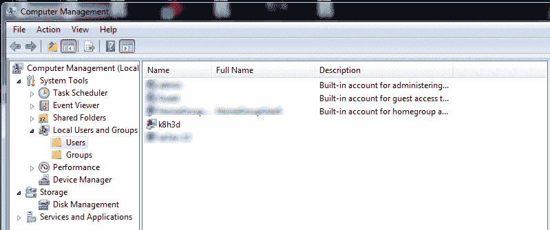

# k8h3d 木马/僵尸网络解释&它如何破坏整个网络-现在检查你的计算机！

> 原文：<https://dev.to/mjraadi/k8h3d-trojan-botnet-explained-how-it-disrupts-the-entire-network-check-your-computers-now-48d4>

### TL；速度三角形定位法(dead reckoning)

在本帖中，我将与您分享我最近排除客户网络重大中断的经验，分析 Microsoft Windows 计算机上的`k8h3d`特洛伊木马足迹，如何击败它，以及一些实用技巧来保护您的组织免受网络攻击，避免成为僵尸网络的受害者。

### 什么问题？

最近，我和我的团队受雇对一个客户的网络进行故障排除，以了解他们为什么会有持续不稳定的互联网连接问题和高延迟响应时间。该公司高度依赖互联网连接，员工抱怨他们的计算机速度非常慢，他们遇到这些问题是收入的重大损失。他们希望我们立即解决问题，所以我们开始挖掘。

### 第一条线索

起初，我们从检查他们的网络设备开始。我们仔细检查了每个交换机、接入点、防火墙和路由器，它们似乎都在按预期工作。然而，我们注意到从 TCP 端口`65533`到互联网上某个 IP 地址的连接数量很奇怪。大量的连接会导致路由器无响应并反复崩溃。

### 第二条线索

一些员工报告说，他们突然在登录屏幕上看到一个名为`k8h3d`的新用户帐户。这让我们相信网络可能已经被特洛伊恶意软件破坏，并且它已经在整个网络中传播。

### 连接圆点

我们怀疑计算机可能已经被入侵，所以我们试图将受感染的主机与网络的其余部分分开，看看是否有什么不同，结果确实如此。一旦切断网络，一切都会恢复正常。然后，我们将其中一台受感染的计算机带到实验室，进一步分析恶意软件。根据我们的发现并在互联网上查找，我们意识到特洛伊木马首先必须通过访问恶意网站并下载和执行 Office 文档来到达系统。然后，它通过利用微软 Windows SMB 服务器中的 [MS17-010](https://docs.microsoft.com/en-us/security-updates/securitybulletins/2017/ms17-010) 漏洞，通过 SMB (TCP/445)或 MS SQL (TCP/1433)进行传播。它会将宿主变成一个`zombie`，并试图尽可能多地传播自己，以扩展其僵尸网络。

### 什么是僵尸网络？

虽然你无法获得僵尸网络，但你可以在不知不觉中成为其中的一员。最基本的，僵尸网络是由庞大的“僵尸”计算机网络组成的，所有这些计算机都服从一个名为“命令和控制中心”的主计算机。一旦这些东西到位，僵尸网络应该准备好引起一些混乱。当计算机被木马感染时，它会打开一个“后门”,允许黑客访问和控制连接设备的某些方面。

### 僵尸网络的危害

你的机器和网络会变慢，有时会很慢。僵尸网络通常执行的任务需要大量的 CPU 能力和带宽，这甚至会使基本的网页浏览变得缓慢。僵尸网络攻击基本上也可以使用任何系统资源，这意味着你在与罪犯分享你的性能。目标不是伤害你，但这通常是一个后果。反而是利用你去害人。

### 如何打败`k8h3d`恶意软件

我真的不确定这个恶意软件叫什么，因为我没有找到太多关于它的信息，但我只是叫它`k8h3d`恶意软件。好消息是移除这种恶意软件并不困难。你所需要做的就是用最新的反恶意软件扫描和清理你的电脑，删除一些防火墙规则，删除一些注册表项，清理一些预定的任务。你可以在这里了解更多信息。

### 为什么会这样？

当我们分析网络时，我们发现大量过时且未打补丁的 Windows 计算机在没有任何保护软件的情况下连接到互联网。MS17-010 漏洞已经存在了一段时间，修补这些安全漏洞至关重要。我相信黑帽黑客几乎总是领先一步，我们至少可以认真对待网络安全，并确保我们执行合理的安全政策。

### 如何保持安全和受到保护

教育自己防范互联网威胁是个人网络安全的最佳防线之一。虽然传统的互联网安全软件程序可以在威胁到达您之前捕捉到许多威胁，但它无法捕捉到所有威胁。网络罪犯会尝试任何策略来获取您的个人信息，包括非数字方法，如技术支持电话诈骗、税务欺诈和社会工程。这里有一些提示和最佳实践供您考虑:

*   避免弹出窗口、未知电子邮件和链接
*   使用强密码保护和验证
*   连接到安全 Wi-Fi
*   安装安全软件更新并备份您的文件
*   在工作和家庭中启用防火墙保护
*   投资安全系统
*   咨询您的 IT 部门
*   避免每次登录都使用相同的密码
*   保持您的操作系统完全补丁和更新
*   锁定您的个人和隐私信息
*   使用不会记录你流量的 VPN 软件提供商
*   最后，认真对待安全性

### 你可以成为英雄

掌握正确的知识有助于最大限度地减少您公司的漏洞。记住:只需点击一个损坏的链接就可能让黑客进来，而一次未能迅速修复漏洞可能让你容易受到网络攻击。

如果你认为我错过了一个技巧或者你也有类似的故事，请在评论区与我和社区分享。

### 关于我

我是一名安全顾问、全栈 web 开发人员，也是一个由才华横溢的专业人士组成的小组 Bits n Bytes Dev Team 的联合创始人，该小组在系统管理、Linux 管理、云部署、虚拟化、服务器监控、性能调整和高可用性方面拥有超过 10 年的经验。

我可以被雇佣，你可以查看[我的投资组合网站](https://www.bitsnbytes.ir/portfolio/sysadmin)或通过 raadi[at]bitsnbytes.ir 联系我。