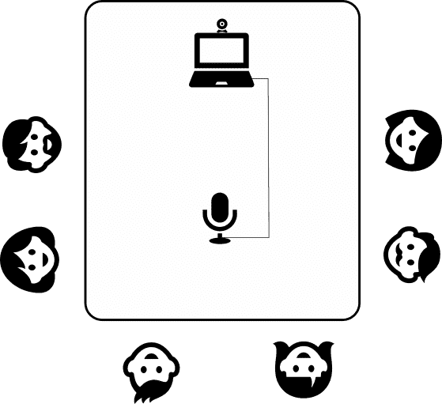

# 改善办公室和远程员工之间的沟通

> 原文：<https://dev.to/peterdev/improving-communication-between-office-and-remote-employees-1jc9>

远程工作具有挑战性。远程工作的人需要完美的沟通技巧和纪律，因为没有人在背后监视。然而，当我们试图将办公室和远程员工结合起来时，真正的斗争就开始了。我们将面临什么问题，我们如何改善这种情况？

我厌倦了在拥挤嘈杂的露天场所工作，所以换到一份偏远的工作对我来说是一大解脱。然而，我仍然不得不与坐在办公室里的人合作，这对我们所有人来说都是一个相当大的挑战。幸运的是，在团队中每个人的理解下，事情很快得到了改善。

## 让别人知道你在哪里，你是谁

你的同事应该知道你是否有空。设置一个状态，显示*“在办公室”*或*“远程朝九晚五”*。休息时使用*，需要安静时使用*【请勿打扰】*。*

 *在某个时候，我的雇主强迫每个人在 Slack 上把他们的照片设为个人资料图片。所有作为头像的搞笑猫现在都没了。拥有真实的图片是整合人们的一个好方法，特别是当远程的家伙不时地访问办公室的时候。

## 提高电话会议

我们经常接到这样的电话，一群人坐在办公室里，而另一群人在远处。最大的挑战是为团队中的每个人创造平等参与的机会。

办公室人员和远程人员都必须有良好的连接和麦克风，这样每个人都可以明白其他人在说什么。远程人员通常有耳机；请提前检查他们的音质！如果你的麦克风听起来像旧电话，那就买更好的。

<figcaption>The best table setup for a call with remote people. Every person maintains the same distance from a microphone. A webcam captures everyone at the table, so that remote participants see exactly what’s happening.</figcaption>

办公组可以在桌子上有一个**共享麦克风。你可以找到一些 100 美元左右的带全向麦克风和集成扬声器的好产品。**音质更加重要**因为人们会坐在离话筒较远的地方，因此远处的人会听到更多的房间反射声。与麦克风保持相等的距离，这样每个人都能听到同样大的声音。**

当办公室团队参加会议时，他们共享一个用户帐户。远处的人不知道房间里到底有谁。解决方法很简单:**打开相机！**最好的办法是有一个能看到会议室全景的外接摄像头。如果你没有的话，只要在别人开始讲话的时候转动笔记本电脑就可以了。

任何新人都应该介绍自己，比如*“你好，我是马克，我是 X 的负责人，我参加会议是因为……”*

很高兴知道谁和为什么加入我们，很高兴看到人们微笑。偏远地区的人们也应该启动他们的相机。

## 分享办公室墙上挂的任何值钱的东西

有时候办公室的人觉得在墙上画东西很方便，或者到处贴一些卡片。远程工作人员看不到这些墙壁。你至少需要**分享一张你在墙上画的任何图表的图片**。确保远程人员能够以某种方式为这些绘图做出贡献。

这同样适用于任何印刷公告，比如*“嘿，我们明天有个聚会”*。当然，如果遥远的人能理解他们。例如，你不必分享一台坏掉的咖啡机的信息。

## 不时亲自见面

你们应该见见面，一起找点乐子。当你可以分享疯狂旅行和聚会的记忆时，团队精神会更强。一个组织可以通过组织不同的活动来促进这一点，如培训、会议、闪电谈话等。当然你也可以有自己的主动性，即使只是吃披萨和喝啤酒。

混合办公室和远程工作人员可以带来很多乐趣。它增加了多样性，因为一家公司不会局限于只雇佣特定地区的人才。然而，需要一些实践来做好它，并消除任何沟通障碍。*