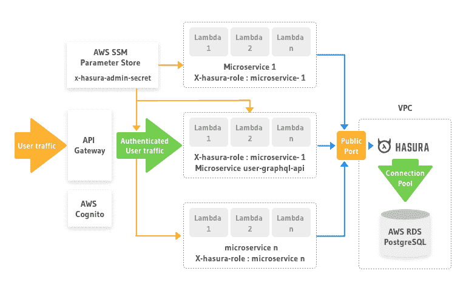

# 探索 Hasura 作为无服务器架构中的数据访问层

> 原文：<https://dev.to/hasurahq/exploring-hasura-as-a-data-access-layer-in-serverless-architecture-3ka9>

### 对于流量模式不一致的产品，使用无服务器+ GraphQL 实现效率最大化。

本教程由 Himshwet Gaurav 编写，并作为 [Hasura 技术作者计划](https://blog.hasura.io/the-hasura-technical-writer-program/)的一部分发布，该计划旨在支持为开源 Hasura GraphQL 引擎编写指南和教程的作者。

## **简介**

这篇文章总结了我们在使用 AWS Lambda 的无服务器框架开发 graphql API 时遇到的问题，以及 Hasura 如何帮助我们解决这些问题。

我们的产品是一个利基客户关系管理工具，以迎合特定群体的专业人士。在高峰使用时，系统预计每秒接收 200 个请求，而大部分时间保持空闲。基于不一致的流量模式，为了将服务器管理任务降至最低，我们决定采用无服务器框架。我们选择 GraphQL 而不是 REST，因为它更适合我们的数据模式。

## **挑战**

我们的团队第一次使用 GraphQL 和 AWS Lambda。虽然这些技术符合我们的需求清单，但我们并没有彻底研究它们的缺点以及它们对整个系统架构的限制。

### **graph QL 的问题**

如果您必须通过 API 公开嵌套和互连的资源，GraphQL 是一个很好的解决方案。它在查询方面为前端和移动开发人员提供了灵活性，节省了他们将来自多个 API 调用的数据拼接在一起的任务，因此也减少了对后端的调用数量。

然而，上述好处是有代价的。将来自多个调用的数据拼接在一起的任务基本上被交给了后端开发人员。

#### **复杂 SQL 查询**

我们依赖 KnexJS 和 ObjectionJS 与 Postgres 数据库进行交互。生成 sql 查询的代码的复杂性随着我们在 graphql 查询模式中添加的每个参数或字段而增加，以便为 API 消费者提供更大的灵活性。

有人可能会说，如果我们选择构建 REST API，复杂性会是相似的，但如果您真的想利用 graphql api 的全部功能，您肯定需要提高您的 SQL 技能。

#### **N+1 查询问题**

当在单个 graphql 查询中处理嵌套资源时，我们发现我们已经创建了大量的 N+1 查询问题。尽管我们对通过 API 提供的功能感到满意，但我们不知道如何解决隐藏在解析器函数中的所有 N+1 查询问题。

Dataloader 是在我们的搜索中频繁出现的解决方案，如果我们没有发现 Hasura，我们就会使用它。

### **AWS Lambda 的问题**

大多数展示 AWS Lambda 或无服务器框架的例子都使用 DynamoDB 作为数据存储。我们排除了 DynamoDB，因为 AWS 关系数据库服务(RDS) PostgreSQL 更适合我们的数据模式。我们不知道选择 AWS RDS 和 AWS Lambda 来构建我们的 graphql 后端会带来怎样的噩梦。

#### **没有数据库连接池**

数据库连接池在 AWS Lambda 领域并不存在。Lambda 本质上是一个无状态函数，运行在一个由 AWS 魔术为你管理的容器内。作为开发人员，我们无法控制 Lambda 函数运行所在的容器的生命周期。一旦该容器在后续请求之间被破坏或冻结，就没有直接的方法来保持数据库连接活动。

除了增加延迟和执行时间之外，不能使用 DB 连接池也限制了 lambda 函数的并发执行。理论上，您可能能够同时运行 1000 个 lambda 函数，但是如果您的数据库不准备接受 1000 个连接，请准备好发送 HTTP 500 响应。

在我们寻找解决方案的过程中，我们看到了杰里米·戴利的这篇文章。他详细介绍了如何在 lambda 函数中管理 DB 连接。Jeremy 的策略确实帮助我们暂时解决了这种情况，但我们内心深处知道，我们部署的解决方案最终会在系统投入生产时向我们发送可怕的凌晨 2:00 警报。

### **AWS VPC&AWS Lambda**的问题

AWS RDS 必须部署在 AWS 虚拟私有云(VPC)内。把 VPC 想象成你在 AWS 基础设施中的私有网络。从安全的角度来看，在 VPC 内部部署我们的 RDS postgres 实例是完全有意义的，但是当涉及到通过 lambda 函数访问 RDS 时，问题就开始复杂化了。

#### **VPC 或者互联网**

为了访问 RDS，要么将数据库端口暴露给 Internet，要么在同一个 VPC 中部署 lambda 函数。我们选择在 VPC 内部部署 lambda 函数。

当在 VPC 内部部署 lambda 功能时，VPC 内部的所有资源都是可访问的，但是它不再能够访问许多 AWS 服务，包括 AWS 简单通知服务(SNS)、AWS 简单排队服务(SQS)或互联网上的任何其他资源。

您必须在您的 VPC 中提供 NAT 网关或 SNS/SQS 端点，以使您的 lambda 函数能够访问这些服务或互联网上的任何其他资源。提供网关或端点会增加成本。

我们有大量的 lambda 函数访问 Postgres 并向 SNS 主题或 SQS 队列发布消息。我们有 4 个独立的帐户，分别用于开发、测试、试运行和生产。增加一个 VPC 端点会使我们每月的账单增加大约 60 欧元。

#### **冷启动问题被放大**

如果你不知道冷启动的问题，并打算去无服务器，我强烈建议通过崔琰的这篇文章。TLDR；AWS Lambda 函数的每次并发执行都会发生一次冷启动。根据编写函数的编程语言及其依赖关系，冷启动会显著增加延迟。

当您在 VPC 内部部署一个 lambda 函数时，它会被分配一个弹性网络接口(ENI ),请将其视为一个虚拟以太网卡。冷启动时间被放大了，因为配置 ENI 有时可能需要 10 秒钟！！

如果你使用云形成，ENI 会使你的生活更加复杂。我们不会在这里进入血淋淋的细节，只要说让你的 lambda 远离 VPCs 就够了

#### **AWS 认知不等人**

我们的苦难还在继续。我们使用 AWS Cognito，这是一种托管用户认证和授权服务。Cognito 允许您使用触发器挂钩到注册和登录过程。触发器是在注册/登录过程的特定阶段执行的 lambda 函数。

我们有两个 lambda 函数，在注册前和确认后阶段被触发。当这些触发器开始表现出异常行为时，AWS Cognito 对触发器 lambda 函数施加了以下约束:“ *Amazon Cognito 同步调用 Lambda 函数。当被调用时，你的 Lambda 函数必须在 5 秒内响应。如果没有，Amazon Cognito 会重试调用。尝试 3 次不成功后，该功能超时。该 5 秒超时值不可更改*

现在想象一个场景，你有你的 lambda 函数部署在一个 VPC 里面。由于 ENI 的供应增加了冷启动的延迟，对于很大比例的请求，您肯定会超时。你必须非常幸运，你的 lambda 能在冷启动后 5 秒内做出反应。

在与所有这些问题搏斗之后，我们清楚地看到，我们当前的架构正走向灾难。我们要么放弃无服务器架构，要么为我们遇到的大量问题找到可靠稳定的解决方案。

## **哈苏拉前来救援**

一旦概念验证完成，我们就在寻找解决方案来:

*   数据库连接池
*   从 lambda 访问 Postgres，而不在 VPC 内部部署 lambda
*   为我们的 graphql 解析器构建 sql 查询的更简单的解决方案
*   N+1 查询问题

我们偶然发现了 Prisma 和 Hasura。老实说，由于时间的压力，我们没有时间对两者进行深入的评估。我们一直在寻找能够以最低的迁移成本解决上述四个问题的解决方案。

### **为什么是哈苏拉**

我们最初对 Hasura 持怀疑态度，因为有了 **alpha** 发布标签，但以下事实说服了我们:

*   它是用 Haskell 写的。在 JS 世界里，你每隔一天就要解决一个“未定义的”变量问题，我们对 Haskell 的可靠性很有信心。
*   Hasura 团队在他们的 Discord 频道上对我们的询问做出了非常积极的回应。
*   部署轻量级的 Hasura docker 图像是小菜一碟
*   使用自动生成的 graphql API 查询数据，而不用担心 SQL 连接，这是一种纯粹的乐趣。
*   它满足了我们的需求。他们的 graphiql 仪表盘上的“分析”按钮非常有用。

### **新建筑**

在我们的 graphql 模式中，在处理查询和变异之前，会执行许多业务逻辑。Hasura 提供了一种挂钩远程模式的方法，但这将使我们回到起点。

#### **Hasura 作为数据访问层**

相反，我们决定使用 Hasura 作为数据访问层。

*   我们把它放在 VPC 的 Postgres 数据库前面。
*   我们将 Hasura 配置为使用基于 AWS RDS 规范的连接池
*   我们在部署了 Hasura 的 EC2 实例上打开了一个公共端口。
*   所有访问 Postgres 的 lambda 函数都被移出了 VPC。
*   我们配置了一个强 x-hasura-admin-secret，并将其作为安全字符串存储在 AWS 系统管理器参数存储中。每个微服务/lambda 函数在部署期间读取该值，并配置其 graphql 客户端头。
*   每个微服务都被分配了一个 x-hasura-role，并在 hasura 引擎上配置了相应的访问权限。
*   在最后一步中，我们从微服务中删除了 KnexJS 和 ObjectionJS 模块。每个微服务现在都会生成一个 graphql 查询来从 Hasura 获取数据，而不是构建 SQL 查询。

我们现在有一个可靠和高性能的系统。

### **当前挑战**

有两个问题仍然让我们保持清醒。

#### **GraphQL 查询注入**

因为我们已经放弃了 KnexJS，并且正在生成 graphql 查询来通过 Hasura 访问 Postgres 中的数据，所以我们需要非常小心地净化用于构建这些查询的用户输入。

#### **VPC 公共港口**

理想情况下，我们希望保持 Hasura 端点只能由我们的微服务访问。目前它对互联网开放。我们依靠 Hasura 的内置安全性来阻止任何未经授权的访问，并考虑到 Hasura 的设计是为了直接接受来自互联网的流量，我们没有处于恐慌模式。

## **总之**

我们以 Hasura 作为数据访问层的新架构已经为我们的测试客户运行了两个月，我们还没有一个‘WTF’时刻。我们的团队目前正致力于使用 Hasura 来管理我们的模式迁移，以提升我们的 CI/CD。

如果你打算使用无服务器架构，我们强烈建议你远离 VPC。我们找到了哈苏拉，否则我们的处境会很糟糕。如果你打算构建一个 graphql API，我们强烈建议给 Hasura 一个机会。虽然他们当前的版本被标记为 alpha-40，但该产品是可靠和稳定的。

在最坏的情况下，如果它的行为出乎意料，请放心 Hasura 团队在他们的 discord 频道上的响应。

## **关于作者**

这个帖子是由 Himshwet Gaurav 在 [Hasura 技术作家计划](https://blog.hasura.io/the-hasura-technical-writer-program/)下撰写的。他在爱沙尼亚的塔林领导一个数码产品工作室。现在，他正在为软件开发团队制作一个[规范管理工具](https://immutabledoc.com/)的原型。你可以通过他工作室的[网站](https://krafteer.com/about)联系他。

*想知道哈苏拉如何帮助你的团队？[安排一次演示](https://calendly.com/team-hasura/enterprise?month=2019-04)。*