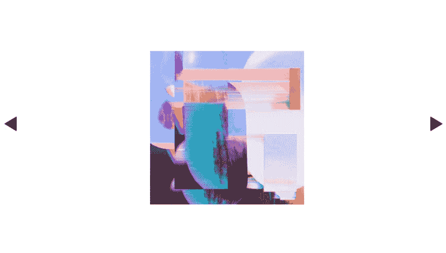
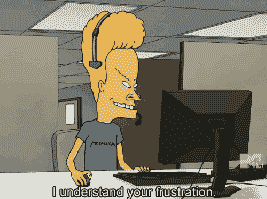

# scrollIntoView 是自切片面包以来最好的东西

> 原文：<https://dev.to/steveblue/scrollintoview-is-the-best-thing-since-sliced-bread-3iog>

让元素滚动到视图中过去很难，尤其是动画。现在用`Element.prototype.scrollIntoView`超级简单！

我一直在为 [@sueish](https://www.instagram.com/sueish/) 做一个网上艺术画廊。她是一位了不起的艺术家。策展人需要专注于她的作品，所以要追求超简约的外观。

[](https://res.cloudinary.com/practicaldev/image/fetch/s--gtIbrQyo--/c_limit%2Cf_auto%2Cfl_progressive%2Cq_auto%2Cw_880/https://thepracticaldev.s3.amazonaws.com/i/qqwgdk4rxzqh39dc6xwe.png)

我需要穿过画廊的数字等价物，所以这里我再次建立了一个图像旋转木马。我试着回想我编码旋转木马的所有时间，但后来我想起来我很久以前就数不清了。有一点，我建立的图像传送带被用在美国的每一个 lexus.com 汽车模型页面上。

几年前，将幻灯片放入和移出视图需要大量的代码。该解决方案涉及一些简单的数学和动态计算每个幻灯片和整个容器宽度的机制。一旦你弄清楚了旋转木马的起始位置和它必须到达的位置，你就必须实现一种方法来改变元素的位置。这需要几行代码。现在你只需要一个。

```
document.querySelector('some-element').scrollIntoView({behavior: 'smooth'}); 
```

Enter fullscreen mode Exit fullscreen mode

[](https://i.giphy.com/media/1lDEF1FpUmag6r37rc/giphy.gif)

上面的代码行选择了一个元素，并让它滚动到视图中。

我用 Angular 编写这个应用程序，只是因为我一直在用它。我最近一直在尝试 web 组件，但是我需要尽快发布这个网站。我的角形组件的模板是这样的。

```


<div class="gallery" #gallery>
  <div class="slide" #slide *ngFor="let media of (media$ | async)" >
    
  </div>
</div> 
```

Enter fullscreen mode Exit fullscreen mode

这里发生了一些事情。click 的事件侦听器被绑定到左右按钮。`ngFor`循环通过一个数据模型，一个媒体数组。我用的是`async`管道，因为`media$`是可观测的。在服务中，http 请求获取数据模型，该组件订阅响应。每个图像的`src`由`Media`对象的属性设置。

我选择角度分量中带有`ViewChildren`的每张幻灯片。

```
@ViewChildren('slide') slides: QueryList<ElementRef>; 
```

Enter fullscreen mode Exit fullscreen mode

在模板中，我用`#slide`标记了每个 div，允许我选择幻灯片元素。

当用户单击任一箭头按钮时，在我的组件上调用 slide 方法。

```

 
```

Enter fullscreen mode Exit fullscreen mode

在 slide 方法中，我们跟踪当前索引并调用`animate`方法，确保用户不能越过第一张幻灯片进入负区域或超过最后一张幻灯片。

```
 slide(ctrl: string) {
    if (ctrl === '-') {
      if (this.index > 0) {
        this.index = this.index - 1;
        this.animate('-');
      }
    }
    if (ctrl === '+') {
      if (this.index < this.length - 1) {
        this.index = this.index + 1;
        this.animate('+');
      }
    }
  } 
```

Enter fullscreen mode Exit fullscreen mode

当我开始编写这个旋转木马时，我认为`animate`需要知道方向。如果您还记得以前，制作幻灯片动画需要大量的数学运算。正方向或负方向对于判断转盘需要向左还是向右移动至关重要。原来`scrollIntoView`不需要解读方向。`scrollIntoView`只是在元素中活跃。

这是我最后用的方法，让这个转盘里的幻灯片有了动画效果。

[](https://i.giphy.com/media/9Jcw5pUQlgQLe5NonJ/giphy-downsized-large.gif)T3】

```
animate() {
  this.slides.toArray()[this.index].nativeElement.scrollIntoView({behavior: 'smooth'});
} 
```

Enter fullscreen mode Exit fullscreen mode

要获得 element . prototype . scrollintoview 的完整参考资料，请访问 MDN 。

我只是认为这是自切片面包以来最好的东西。至少如果你像我一样❤️碳水化合物。将元素滚动到视图中是向用户提供反馈的一种非常好的方式。通过`Element.prototype.scrollIntoView`，我们几乎可以免费获得这种行为。像所有其他明亮闪亮的新 API 一样，我想知道我是否能在每个浏览器中使用它。

看一下[我能使用](https://caniuse.com/#feat=scrollintoview)表，几乎每个浏览器都只显示部分支持，忽略了我真正关心的唯一特性:流畅的行为！

[](https://i.giphy.com/media/sANGK3xBT0ipq/giphy.gif)

幸运的是，有一个 polyfill 可以修复这个问题，直到浏览器广泛支持“平滑”,如果他们真的支持的话。

在这个旋转木马上还有一些工作要做，但到目前为止，我对我能如此快速地制作图像动画印象深刻。这种方法是有成本的。原生滚动条保持不变。这个旋转木马在 Windows 中看起来不会那么小。看起来我又要想办法过渡幻灯片了。好在我们有网络动画 API。

[](https://i.giphy.com/media/NHUONhmbo448/giphy.gif)

待续...