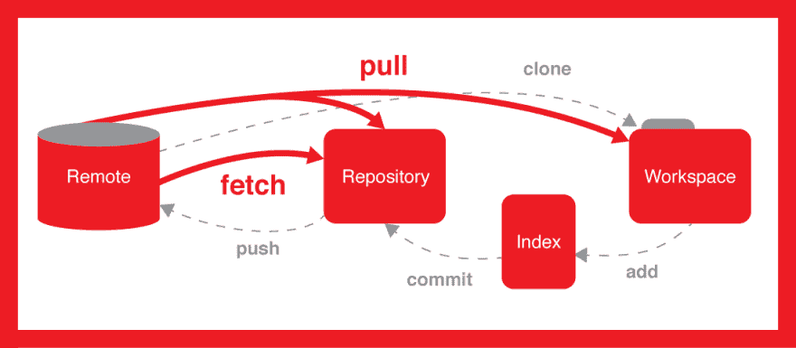
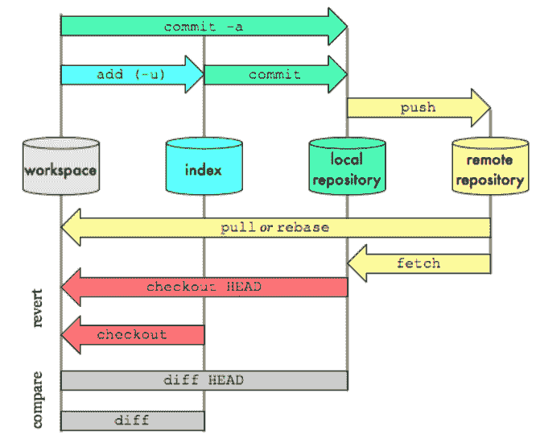
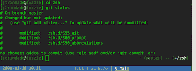
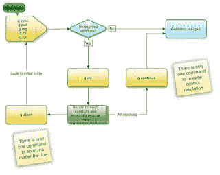

# 深入学习 Git 和 Github 的 5 门免费课程

> 原文：<https://dev.to/javinpaul/5-free-courses-to-learn-git-and-github-in-depth-jpp>

*披露:这篇文章包括附属链接；如果您从本文提供的不同链接购买产品或服务，我可能会收到报酬。*

程序员的一个重要技能是学习和掌握 Git，我一直在寻找一些好的教程和课程。互联网上充满了 git 教程，简单的谷歌搜索会给你留下成千上万的教程，但最大的问题是你从哪里开始？

如果你有一些关于什么是 Git 的背景知识，选择一个教程或者一篇博客文章是很容易的。以及如何使用它，但如果你没有太多的背景知识，那么你需要一门课程，从头开始告诉你所有的信息。

> 我个人喜欢在转到博客帖子之前从一本书或在线课程中学习，因为它们通常结构良好。

当你在热门的在线课程网站上搜索 Git 课程时，如 [Udemy](https://click.linksynergy.com/deeplink?id=JVFxdTr9V80&mid=39197&murl=https%3A%2F%2Fwww.udemy.com%2F) 、 [Pluralsight](http://pluralsight.pxf.io/c/1193463/424552/7490?u=https%3A%2F%2Fwww.pluralsight.com%2Flearn) 或 [Coursera](https://coursera.pxf.io/c/3294490/1164545/14726?u=https%3A%2F%2Fwww.coursera.org%2F) ，你会发现一些综合性的课程，如[**Git Complete:Udemy 上的权威指南**](https://click.linksynergy.com/fs-bin/click?id=JVFxdTr9V80&subid=0&offerid=562016.1&type=10&tmpid=14538&RD_PARM1=https%3A%2F%2Fwww.udemy.com%2Fgit-complete%2F) 和 Pluralsight 上的[**Git Fundamentals**](https://pluralsight.pxf.io/c/1193463/424552/7490?u=https%3A%2F%2Fwww.pluralsight.com%2Fcourses%2Fgit-fundamentals)，它们会一步一步地教你关于 Git 的一切。这些是从 Git 开始的极好的资源。

但是，一些程序员更喜欢从免费资源中学习，我的许多读者问我是否可以分享一些不错但免费的 git 课程，他们可以使用这些课程在线自学 Git。

在这篇文章中，我将分享一些**最好的免费 git 在线课程**,你可以在家里或办公室舒适地学习。

这些资源在法律上是免费的，我的意思是它们是由它们的创造者出于教育和营销目的免费提供的。如果你发现事实并非如此，请留言，我会删除该课程。

> Btw，如果你不 Git，它是最流行的**分布式源代码控制系统**之一。

你肯定用过其他源代码控制软件，如 CVS、SVN、VSS、DFS 等，Git 是另一个，但它有点不同，因为它是一个**分布式源代码控制系统**，这意味着你在本地分支上提交更改，然后在完成后将它们推送到远程服务器(GitHub 存储库)。

> 另一方面， [Github](https://github.com/) 是一个源代码库，也就是你可以存储你的源代码的地方。
> 
> 在当今世界，程序员的 Git 仓库就像你的 Linkedin 或脸书账户一样重要。

这是成为一名程序员的社会证明，这也是为什么我建议每个程序员都有自己的 won Github 账户，里面有他们最好的代码。

你还应该记住，如果你不得不做一个带回家的编码测试，比如用 Java 设计一个自动售货机，现在许多公司用它来筛选不是 T2 优秀编码者的候选人，那么

> 不要把你的程序以 zip 文件的形式发送给他们，你最好把它上传到你的个人 Github 库，并给他们发送一个链接。\
> 
> 我发现许多面试官对这个简单的行为印象深刻，并希望看到你如何将带有增量提交历史的解决方案编码到 Github 中。Github 中的代码审查也很容易。

如果您必须向任何公司提交测试代码，下次请记住这个技巧。

## 5 门免费在线课程，供初学者学习 Git 和 Github

这里列出了一些最好的在线课程，你可以免费参加[学习 Git 和 Github](https://javarevisited.blogspot.com/2019/05/10-free-websites-to-learn-git-online.html)。

这些课程很好地介绍了作为版本控制的 Git，并且概述了一些基本命令，如果你想从命令行使用 Git 的话，比如 push、pull、checkout 等等。

### [**1。Git 以 GitHub** 开始](https://click.linksynergy.com/fs-bin/click?id=JVFxdTr9V80&subid=0&offerid=562016.1&type=10&tmpid=14538&RD_PARM1=https%3A%2F%2Fwww.udemy.com%2Fgit-started-with-github%2F)

本课程旨在展示 Git 和 GitHub 如何协同工作，重点是 Git 的基本工作流程。

学生可以期望在大约 30 分钟内学会开始使用 Git 所需的最低要求。

您将学习如何为 Windows 和 Mac OS X 设置 Git，以及如何使用 Git 的 help 命令。

在安装部分之后，课程将介绍整个 Git 基本工作流程，例如从 GitHub 开始，在本地工作，然后将我们的更改发布回 GitHub。

简而言之，本课程将教你 Git 和 GitHub 的基础知识，由一位评价很高的老师进行清晰的分步指导。

### [**2。终极 GIT 5 日挑战赛**T5】](https://click.linksynergy.com/fs-bin/click?id=JVFxdTr9V80&subid=0&offerid=562016.1&type=10&tmpid=14538&RD_PARM1=https%3A%2F%2Fwww.udemy.com%2Fthe-ultimate-git-5-day-challenge%2F)

本课程循序渐进地介绍一些基本的 GIT 操作。该课程不会潜得太深，并且在五天中的每一天都是小步前进。

随着您继续学习本课程，我们将了解一个基本的单人工作流程，该流程允许任何人在 Github 或 BitBucket(两个流行的公共 GitHub 存储库)上存储文件。

如果你正在寻找一个实践课程来一步一步地学习 Git，这就是适合你的[课程](https://click.linksynergy.com/fs-bin/click?id=JVFxdTr9V80&subid=0&offerid=562016.1&type=10&tmpid=14538&RD_PARM1=https%3A%2F%2Fwww.udemy.com%2Fthe-ultimate-git-5-day-challenge%2F)。你可以在 [Udemy](http://javarevisited.blogspot.sg/2018/01/top-10-udemy-courses-for-java-and-web-developers.html) 找到这个，完全免费，不需要优惠券。

### 3。 [**Git 和 GitHub——初学者循序渐进**](https://click.linksynergy.com/deeplink?id=JVFxdTr9V80&mid=39197&murl=https%3A%2F%2Fwww.udemy.com%2Fgit-and-github-step-by-step-for-beginners%2F)

这是另一个针对初学者的 git 课程。在本课程中，您将学习如何为您的本地环境安装和配置 Git。

您还将学习与本地和远程源存储库通信，向本地和远程存储库添加内容，为您的代码创建注释，理解基本的**分支和合并，以及从存储库中排除内容类型。**

简而言之，这是一门很好的课程，通过一步一步的例子来学习基本的 git 操作。

### [**4。命令行基础:Git Bash for Windows**T5】](https://click.linksynergy.com/fs-bin/click?id=JVFxdTr9V80&subid=0&offerid=562016.1&type=10&tmpid=14538&RD_PARM1=https%3A%2F%2Fwww.udemy.com%2Fgit-bash%2F)

本课程旨在提供在 Windows 上使用 Git 命令行的实践经验。

您将在 [Bash 命令行](http://javarevisited.blogspot.sg/2011/03/unix-command-tutorial-working-fast-in.html)中学习关键概念并专注于基本任务，以便快速提高工作效率。

为了在 windows 的命令行上使用 [Git](https://dzone.com/articles/top-5-free-courses-to-learn-git-and-github-in-2019) ，你可以安装 GitBash，一个允许你从你的 Windows 机器上访问 Github 的工具或软件。

学生可以在不到一个小时的时间里学会开始使用 Bash shell 所需的最低要求。

本课程还包含测验，这将有助于您记住所学的知识。

简而言之，对于不熟悉 [Bash](http://bit.ly/2DavlMs) 或终端环境的 Windows 用户来说，这是一个循序渐进的指南。

### [**5。简洁明了:现在就开始使用 Git 和 GitHub**](https://click.linksynergy.com/fs-bin/click?id=JVFxdTr9V80&subid=0&offerid=562016.1&type=10&tmpid=14538&RD_PARM1=https%3A%2F%2Fwww.udemy.com%2Fshort-and-sweet-get-started-with-git-and-github-right-now%2F)

你是一个想现在就开始使用 Git 和 GitHub 的软件开发人员吗？如果你听说过 Git 和 GitHub，但不知道如何开始，本课程将消除猜测

在短短的 30 分钟内，这个“**简短而甜蜜”**的课程涵盖了你前进所需的基本思想，没有很多填充。

在课程结束时，您将能够设置 GitHub 帐户，安装 Git，创建和配置新的 Git 和 [GitHub 库](https://medium.com/javarevisited/7-best-courses-to-master-git-and-github-for-programmers-d671859a68b2)，为您的软件项目创建变更历史，并将您的软件项目发布到 GitHub

这就是为程序员提供的一些最好的免费 Git 在线课程。可以利用这些课程深入学习和掌握 Git。

如果你之前没有听说过 git 或者对 Git 有一点了解，这些课程将帮助你填补知识的空白，掌握 Git，比如学习使用 Github，在 Windows 中使用[命令行 Git 客户端](http://bit.ly/2Q37e50)等。

在这个过程中，您还将学到一些提高生产率的技巧，以增强您的 Git 工作体验。

完成这些课程后，你最好创建一个 Github 帐户(如果你还没有的话),并在那里存储一些你最好的代码。没有什么比一个好的 Github 库更能证明你的编程技能了。这将帮助你找到下一份工作。

您可能想探索的其他**免费编程资源**:

1.  [面向初学者的 15 门免费 Python 课程](https://medium.com/swlh/5-free-python-courses-for-beginners-to-learn-online-e1ca90687caf)
2.  [面向 Java 开发者的 5 门免费 Spring 框架课程](http://www.java67.com/2017/11/top-5-free-core-spring-mvc-courses-learn-online.html)
3.  [5 门免费学习核心 Java 的在线课程](http://javarevisited.blogspot.sg/2017/11/top-5-free-java-courses-for-beginners.html#axzz4zuIICRs9)
4.  [5 门免费学习 Angular 的在线培训课程](http://www.java67.com/2018/01/top-5-free-angular-js-online-courses-for-web-developers.html)
5.  [面向 Java 和 Web 开发人员的 5 个节点 JS 课程](http://javarevisited.blogspot.sg/2018/01/top-5-nodejs-and-express-js-online-courses-for-web-developers.html)
6.  [学习大数据和 Apache Spark 的 5 门课程](http://javarevisited.blogspot.com/2017/12/top-5-courses-to-learn-big-data-and.html)
7.  [5 门学习数据结构和算法的免费课程](http://javarevisited.blogspot.sg/2018/01/top-5-free-data-structure-and-algorithm-courses-java--c-programmers.html#axzz55lOcYrUM)
8.  【Java 开发者学习 Android 的 5 门课程
9.  [5 门面向程序员的免费数据结构和算法课程](https://javarevisited.blogspot.com/2018/01/top-5-free-data-structure-and-algorithm-courses-java--c-programmers.html)
10.  [Git 分支互动指南](https://learngitbranching.js.org/)
11.  [Bitbucket Git tutorial](https://www.atlassian.com/git/tutorials/learn-git-with-bitbucket-cloud)

#### 期末备注

感谢您阅读本文。如果你发现这些免费课程对学习 Git 有用，请与你的朋友和同事分享。如果您有任何问题或反馈，请留言。

如果你喜欢这篇文章，请与你的朋友和同事分享，不要忘记在 Twitter 上关注[javarestived](https://twitter.com/javarevisited)，在 Twitter 上关注 [javinpaul](https://twitter.com/@javinpaul) ，当然还有 Dev.to！

**P.S.** -如果你不介意在值得学习的东西上花点钱，那么你也可以在 Udemy 上查看 [**GitHub Ultimate:主 Git 和 GitHub -初学者到专家**](http://bit.ly/2Q37e50) 和来自 Pluralsight 的 [**Git 基础**](https://pluralsight.pxf.io/c/1193463/424552/7490?u=https%3A%2F%2Fwww.pluralsight.com%2Fcourses%2Fgit-fundamentals) 。学习 Git 的两个最全面的资源。顺便说一句，如果你买任何不是免费的课程，我会得到报酬。