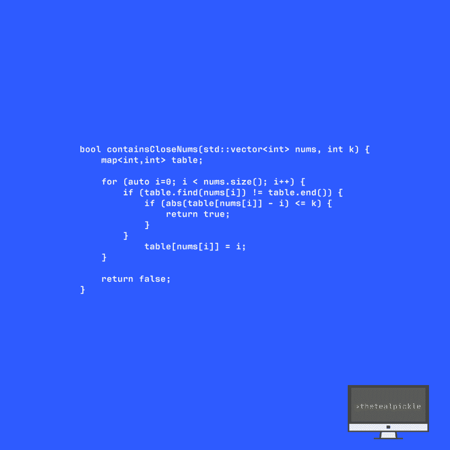

# [C++代码]包含封闭的 num

> 原文：<https://dev.to/thetealpickle/c-code-contains-close-nums-2l9e>

TEAL PICKLE 编码挑战！！确定数组是否包含封闭的 num。我用 bae (C++)解决了这个问题。尝试👀

查看我的解决方案并分享您的解决方案！！我的解决方案运行时间为 O(n ),使用 O(n)额外内存。~💻 💻

