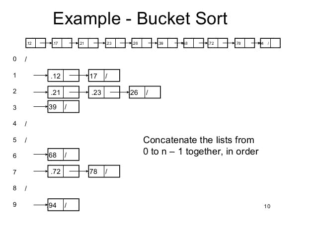

# 第 2 部分:排序算法

> 原文：<https://dev.to/yogeswaran79/part-2-sorting-algorithm-17p5>

### 合并排序

归并排序分治算法。它将输入数组分成两半，为这两半调用自身，然后合并排序后的两半。merge()函数用于合并两半。merge(arr，l，m，r)是一个关键过程，它假设 arr[l..m]和 arr[m+l..r]被排序并将两个排序的子数组合并成一个。

```
def mergeSort(arr):
    if len(arr) > 1:
        mid = len(arr)
        L = arr[:mid]
        R = arr[mid:]
        mergeSort(L)
        mergeSort(R)
        i = j = k = 0
        while i < len(L) and j < len(R):
            if L[i] < R[j]:
                arr[k] = L[i]
                i += 1
            else:
                arr[k] = R[j]
                j += 1
            k += 1
        while i < len(L):
            arr[k] = L[i]
            i += 1
            k += 1
        while i < len(R):
            arr[k] = R[j]
            j += 1
            k += 1

def printList(arr):
    for i in range(len(arr)):
        print(arr[i], end=" ")
    print()

if __name__ == '__main__':
    arr = [12, 11, 13, 5, 6, 7]
    print("Given array is", end="\n")
    printList(arr)
    mergeSort(arr)
    print("Sorted array is", end="\n")
    printList(arr)

# Output Given array is
12 11 13 5 6 7
Sorted array is
5 6 7 11 12 13 
```

下面的函数是递归的，因此它使用函数调用堆栈来存储 l 和 h 的中间值。函数调用堆栈存储其他簿记信息和参数。此外，函数调用涉及开销，如启动调用函数的激活记录，然后继续执行。

```
def merge(left, right):
    if not len(left) or not len(right):
        return left or right
    result = []
    i,j = 0,0
    while (len(result) < len(left) + len(right)):
        if left[i] < right[j]:
            result.append(left[i])
            i += 1
        else:
            result.append(right[j])
            j += 1
        if i == len(left) or j == len(right):
            result.extend(left[i:] or right[j:])
            break
    return result

def mergesort(list):
    if len(list) < 2:
        return list
    middle = len(list)/2
    left = mergesort(list[:middle])
    right = mergesort(list[middle:])
    return merge(left, right)
seq = (12, 11, 13, 5, 6, 7)
print("Given array is")
print(seq)
print("\n")
print("Sorted array is")
print(mergesort(seq))

# Output Given array is
12 11 13 5 6 7
Sorted array is
5 6 7 11 12 13 
```

与迭代快速排序不同，交互式合并排序不需要显式的辅助堆栈。

```
def mergeSort(a):
    current_size = 1
    while current_size < len(a) - 1:
        left = 0
        while left < len(a) - 1:
            mid = left + current_size - 1
            right = ((2 * current_size + left - 1,
                    len(a) - 1) [2 * current_size + left - 1 > len(a) - 1])
        merge(a, left, mid, right)
        left = left + current_size * 2
    current_size = 2 * current_size

def merge(a, l, m, r):
    n1 = m - l + 1
    n2 = r - m
    L = [0] * n1
    R = [0] * n2
    for i in range(0, n1):
        L[i] = a[l + i]
    for i in range(0, n2):
        R[i] = a[m + i + 1]
    i, j, k = 0, 0, l
    while i < n1 and j < n2:
        if L[i] > R[j]:
            a[k] = R[j]
            j += 1
        else:
            a[k] = L[i]
            i += 1
        k += 1
    while i < n1:
        a[k] = L[i]
        i += 1
        k += 1
    while j < n2:
        a[k] = R[j]
        j += 1
        k += 1

a = [12, 11, 13, 5, 6, 7]
print("Given array is")
print(a)
mergeSort(a)
print("Sorted array is")
print(a)

# Output Given array is 
12 11 13 5 6 7
Sorted array is
5 6 7 11 12 13 
```

### 堆排序

Heapsort 是一种基于二进制堆数据结构的基于比较的排序技术。这类似于选择排序，我们首先找到最大值元素，并将最大值元素放在最后。

**什么是二进制堆？**
二进制堆是一种采用二叉树形式的堆数据结构。二进制堆是实现[优先级队列](https://en.wikipedia.org/wiki/Priority_queue)的常见方式。

二进制堆被定义为具有两个附加约束的二叉树:

1.  Shape 属性:二叉堆是一棵完整的二叉树；也就是说，除了可能的最后一级(最深的)之外，树的所有级别都被完全填充，并且，如果树的最后一级不完整，则该级的节点从左到右被填充。
2.  堆属性:每个节点中存储的键要么大于等于(≥)要么小于等于(≤)该节点子节点中的键，按照某种总的顺序。

父键大于或等于(≥)子键的堆称为最大堆；小于或等于(≤)的堆称为最小堆。[(在维基百科上了解更多)](https://en.wikipedia.org/wiki/Binary_heap)

**为什么要用数组表示二进制堆？**
由于二进制堆是一个完整的二叉树，它可以很容易地表示为一个数组，基于数组的表示是空间高效的。如果父节点存储在索引 1 处，则左侧子节点可以通过 2*I+1 计算，右侧子节点可以通过 2*I*2 计算。

**按升序排序的堆排序算法:**

1.  从输入数据构建最大堆。
2.  最大的项存储在堆的根。用堆的最后一项替换它，然后将堆的大小减 1。之后，他把树根刨平。
3.  当堆的大小大于 1 时，重复上述步骤。

```
def heapify(arr,n,i):
    largest = i
    l = 2*i+1
    r = 2*i+2
    if l < n and arr[i] < arr[l]:
        largest = l
    if r < n and arr[largest] < arr[r]:
        largest = r
    if largest != i:
        arr[i],arr[largest] = arr[largest],arr[i]
        heapify(arr,n,largest)

def heapSort(arr):
    n = len(arr)
    for i in range(n,-1,-1):
        heapify(arr,n,i)
    for i in range(n-1,0,-1):
        arr[i], arr[0] = arr[0], arr[i]
        heapify(arr,i,0)

arr = [12, 11, 13, 5, 6, 7]
heapSort(arr)
n = len(arr)
print("Sorted array is")
for i in range(n):
    print("%d" %arr[i])

# Output Sorted array is
5 6 7 11 12 13 
```

### 计数排序

计数排序是一种基于特定范围之间的键的排序技术。它通过计算具有不同键值的对象的数量来工作。然后做一些算术来计算每个对象在输出序列中的位置。

```
def countSort(arr):
    output = [0 for i in range(256)]
    count = [0 for i in range(256)]
    ans = ["" for _ in arr]
    for i in arr:
        count[ord(i)] += 1
    for i in range(256):
        count[i] += count[i-1]
    for i in range(len(arr)):
        output[count[ord(arr[i])] -1] = arr[i]
        count[ord(arr[i])] -= 1
    for i in range(len(arr)):
        ans[i] = output[i]
    return ans

arr = "Yogeswaran"
ans = countSort(arr)
print("Sorted character array is %s" %("".join(ans)))

# Output Sorted character array is Yaaegnorsw 
```

### 基数排序

基数排序是一种非比较整数排序算法，它通过按共享相同有效位置和值的单个数字对键进行分组，对带有整数键的数据进行排序。位置符号是必需的，但是因为整数可以表示字符串(例如，姓名或日期)和特殊格式的浮点数，所以基数排序不限于整数。[(来源维基百科)](https://en.wikipedia.org/wiki/Radix_sort)

[你可以在这里查看基数排序算法的例子](http://www.geekviewpoint.com/python/sorting/radixsort)

### 桶排序

<figure>

当输入在一个范围内均匀分布时，桶排序非常有用。
[T3】](https://res.cloudinary.com/practicaldev/image/fetch/s--fkZ31tog--/c_limit%2Cf_auto%2Cfl_progressive%2Cq_auto%2Cw_880/https://thepracticaldev.s3.amazonaws.com/i/vitfsn4ku1zs5vwueheo.jpg)

<figcaption>Picture from SlideShare.net</figcaption>

</figure>

```
def insertionSort(b):
    for i in range(1, len(b)):
        up = b[i]
        j = i - 1
        while j >= 0 and b[j] > up:
            b[j+1] = b[j]
            j -= 1
        b[j+1] = up
    return b

def bucketSort(x):
    arr = []
    slot_num = 10
    for i in range(slot_num):
        arr.append([])
    for j in x:
        index_b = int(slot_num * j)
        arr[i] = insertionSort(arr[i])
    k = 0
    for i in range(slot_num):
        for j in range(len(arr[i])):
            x[k] = arr[i][j]
            k += 1
    return x

x = [0.897, 0.565, 0.656,
    0.1234, 0.665, 0.3434]
print("Sorted array is")
print(bucketSort(x))

# Output Sorted array is
0.1234 0.3434 0.565 0.656 0.665 0.897 
```

### ShellSort

Shellsort 也称为 Shell sort 或 Shell 的方法，是一种就地比较排序。它可以被看作是交换排序(冒泡排序)或插入排序(插入排序)的推广。该方法首先对彼此远离的元素对进行排序，然后逐渐减小要比较的元素之间的间隙。从相距很远的元素开始，它可以比简单的最近邻交换更快地将一些错位的元素移动到位。[(来源:维基百科)](https://en.wikipedia.org/wiki/Shellsort)

```
def shellSort(arr):
    n = len(arr)
    gap = n
    while gap > 0:
        for i in range(gap,n):
            temp = arr[i]
            j = i
            while j >= gap and arr[j-gap] > temp:
                arr[j] = arr[j-gap]
                j -= gap
            arr[j] = temp
        gap

arr = [12, 34, 54, 2, 3]
n = len(arr)
print("Array before sorting")
for i in range(n):
    print(arr[i])
shellSort(arr)
print("\nArray after sorting")
for i in range(n):
    print(arr[i])

# Output Array before sorting
12 34 54 2 3
Array after sorting
2 3 12 34 54 
```

### 胸腺排序

Timsort 是一种混合的稳定排序算法，源自合并排序和插入排序，旨在对多种真实世界的数据执行良好。

1.  一个稳定的排序算法在 O(nLogn)时间内有效。
2.  在 Java 的 Arrays.sort()以及 Python 的 sorted()和 sort()中使用。
3.  首先使用插入排序对小块进行排序，然后使用合并排序的合并对小块进行合并。

```
RUN = 32

def insertionSort(arr, left, right): 
    for i in range(left + 1, right+1): 
        temp = arr[i] 
    j = i - 1
    while arr[j] > temp and j >= left: 
        arr[j+1] = arr[j] 
        j -= 1
    arr[j+1] = temp 

def merge(arr, l, m, r): 
    len1, len2 = m - l + 1, r - m 
    left, right = [], [] 
    for i in range(0, len1): 
        left.append(arr[l + i]) 
    for i in range(0, len2): 
        right.append(arr[m + 1 + i]) 
    i, j, k = 0, 0, l 
    while i < len1 and j < len2: 
        if left[i] <= right[j]: 
            arr[k] = left[i] 
        i += 1
    else: 
        arr[k] = right[j] 
        j += 1
        k += 1 
    while i < len1: 
        arr[k] = left[i] 
        k += 1
        i += 1
    while j < len2: 
        arr[k] = right[j] 
        k += 1
        j += 1
def timSort(arr, n): 
    for i in range(0, n, RUN): 
        insertionSort(arr, i, min((i+31), (n-1))) 
    size = RUN 
    while size < n: 
        for left in range(0, n, 2*size): 
        mid = left + size - 1
        right = min((left + 2*size - 1), (n-1)) 
        merge(arr, left, mid, right) 
        size = 2*size 

def printArray(arr, n): 
    for i in range(0, n): 
        print(arr[i], end = " ") 
    print() 

if __name__ == "__main__": 
    arr = [5, 21, 7, 23, 19] 
    n = len(arr) 
    print("Given array is") 
    printArray(arr, n) 
    timSort(arr, n) 
    print("After sorting array is") 
    printArray(arr, n)

# Output Given array is
5 21 7 23 19
After sorting array is
5 7 19 21 23 
```

加入我的[社区](https://t.me/theprogrammersclub)