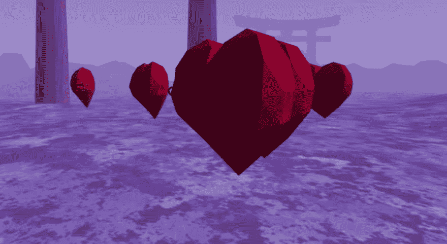
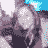
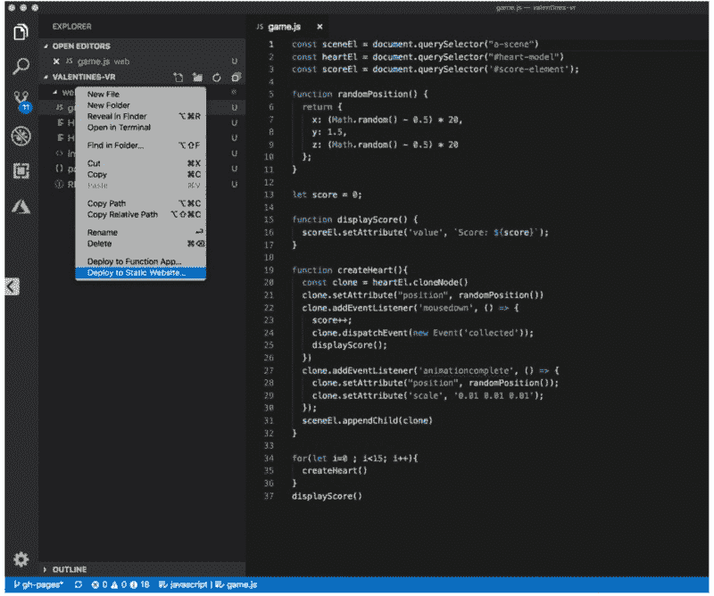
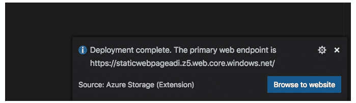
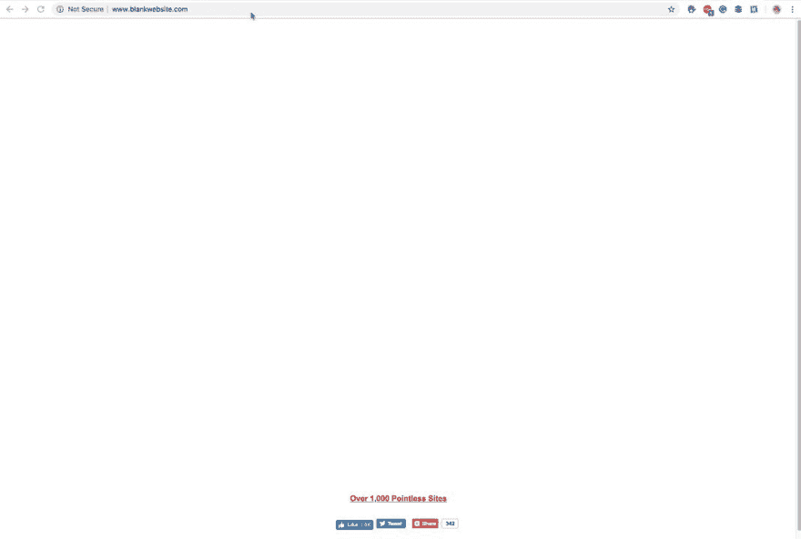

# 如何用 A-Frame 构建一个 WebVR 游戏

> 原文：<https://dev.to/azure/how-to-build-a-webvr-game-with-a-frame-4ifg>

🐦在 [Twitter](https://twitter.com/AdiPolak) 上关注我，很乐意接受您的话题建议。

🕹️ [玩游戏](https://adipola.github.io/valentines-vr/web/index.html)
💻 [Git 库](https://github.com/adipola/valentines-vr)

➡️几个月前，我收到了我的第一副 MR 耳机。作为一个极客，我很兴奋，开始玩它。没过多久，我就觉得自己需要构建一些包含编写代码的东西。

多年来，我做后端开发，对前端开发如何工作一无所知。我对 CSS 的记忆包括 90%的沮丧和 10%的欣慰。

### 然而，我的一个朋友也很好奇，我们决定调查一下。

我们聚在一起，泡了一杯好咖啡，吃了些饼干，打开电脑，开始阅读。我们决定尝试一下 A 型框架。几个小时过去了，我们有了一个旋转的 gltf 模型和一个游戏场景。厉害！那天学到了很多东西，所以我们承诺与社区分享我们的发现。我们为情人节安排了一次聚会。然而，我们在设计游戏方面毫无经验。想了想，我们决定简单点。我们设计了一个只有一个手势的游戏，收集红心。这是最终决定。我们安排了一次现场编码会议。在这里，我们展示了世界上每个开发者如何构建一个简单的 WebMR 游戏。我们将用旋转的心、分数和收集心的手势建立一个场景。对于额外的香料，这将是一个无限的游戏，其中每收集一颗心，另一颗心将在随机位置弹出。

等等，什么是 WebVR 或者 WebMR？

> <video loop="" controls=""><source src="https://video.twimg.com/ext_tw_video/1105234448310784006/pu/pl/WU5NAdcESafYtRLt.m3u8?tag=8" type="application/x-mpegURL"></video>阿迪波拉克[@阿迪波拉克](https://dev.to/adipolak)👩‍🎓👨‍🎓[# termOfTheDay](https://twitter.com/hashtag/termOfTheDay)
> 
> WebVR
> 
> Spec，让你在浏览器中体验 [#XR](https://twitter.com/hashtag/XR) / [#VR](https://twitter.com/hashtag/VR) 成为可能。我们的目标是让每个人都更容易进入体验，不管你有什么设备。
> 
> 部分工具:[@ aframevr](https://twitter.com/aframevr)[@ play canvas](https://twitter.com/playcanvas)[@ react js](https://twitter.com/reactjs)VR、@Sketchfa 等等！2019 年 3 月 11 日 22:30 分[](https://twitter.com/intent/tweet?in_reply_to=1105234467181027328)[](https://twitter.com/intent/retweet?tweet_id=1105234467181027328)1[](https://twitter.com/intent/like?tweet_id=1105234467181027328)8

你兴奋吗？我们开始吧！

先决条件:

1.  [Azure 账户](https://azure.microsoft.com/en-us/free/?WT.mc_id=devto-blog-adpolak)
2.  [Visual Studio 代码(VScode)](https://azure.microsoft.com/en-us/products/visual-studio-code?WT.mc_id=devto-blog-adpolak) - VS 代码
3.  [VScode Azure 存储扩展](https://marketplace.visualstudio.com/items?itemName=ms-azuretools.vscode-azurestorage)
4.  [npm](https://docs.npmjs.com/downloading-and-installing-node-js-and-npm)

重要的事情先来。让我们创建一个项目:转到所需的目录或创建一个目录并运行 npm init。在 bash 中会是这样的:

```
mkdir valentines_game
cd valentines_game
npm init -g 
```

最后一个命令将询问项目名称、版本、描述等等。你不必回答所有的问题，我们可以以后再改。Npm 创建一个 package.json，并提供所有细节。为了从本地机器上调试游戏，我们还需要配置服务器，所以你需要做的是打开 *package.json* 文件并更新*脚本*以包含以下内容:

```
 "scripts":  {  "start":  "live-server web"  } 
```

这将确保我们以后可以使用`npm start`并从本地机器调试游戏。

接下来，运行:

```
npm install 
```

打开 VScode 并创建一个名为 index.html 的 html 文件。创建 html 和 head 标签。head 标签包含元数据定义。添加一个脚本标记，用于导入项目的 aframe 脚本。

```
<html lang="en">
<head>
  <meta charset="UTF-8">
  <meta name="viewport" content="width=device-width, initial-scale=1.0">
  <meta http-equiv="X-UA-Compatible" content="ie=edge">
  MR Valentines
  <script src="https://aframe.io/releases/0.9.2/aframe.min.js"></script>
  <script src="https://rawgit.com/feiss/aframe-environment-component/master/dist/aframe-environment-component.min.js"></script>
</head>
</html> 
```

让我们运行它，这样我们就可以在浏览器中实时看到更新:

```
npm start 
```

下一步是创建一个带有场景标签的 html 主体。在游戏中，场景定义了我们所处的位置和我们看到的东西。 **a-entity** 是定义实体的标签。目前，我们用它来定义我们的环境，如下图所示，它是“日本”。

```
<body>
  <a-scene>
    <a-entity environment="preset:japan"></a-entity>
  </a-scene>
</body> 
```

有一些内置的环境。比如:*埃及、棋盘、森林、goaland、亚瓦派、金矿拱门、日本、梦幻、火山*等等。

接下来是动画模型:心脏。下载[心脏模型](https://poly.google.com/view/8RA5hHU5gHK)。
解压压缩文件。将 bin 和 gltf 文件放在项目目录中。接下来，添加心形标签:

```
 <a-entity id="heart-model" gltf-model="Heart.gltf" position="0 1.5 -5"
    scale="0.01 0.01 0.01" >
 </a-entity> 
```

心脏标签实体被添加到场景标签的之外的*，因为我们希望以编程方式灵活地添加它。*

添加动画。
按照示例添加动画功能。将启动事件命名为“收集的”。Collected 是我们将用来启动动画的触发事件的名称。

```
<a-entity id="heart-model" gltf-model="Heart.gltf" position="0 1.5 -5"
    scale="0.01 0.01 0.01"
    animation="property: rotation; to: 0 360 0; loop: true; easing: linear; dur: 2000"
    animation__collect="property: position; to: 0 0 0; dur: 300; startEvents: collected"
    animation__minimize="property: scale; to: 0 0 0; dur: 300; startEvents: collected">
</a-entity> 
```

添加分数标签。
在相机标签内添加文本标签。这样，用户可以从各个角度看到它。下一步，收集心脏，添加一个光标。

```
<a-camera>
      <a-text id="score-element" value="Score" position="-0.35 0.5 -0.8"></a-text>
      <a-cursor></a-cursor>
</a-camera> 
```

最后但同样重要的是，添加一个 JavaScript 文件，我们可以在其中编写游戏动作和处理程序。
创建一个文件，命名为 **game.js** 和 html 文件中的另一个 html 标签:

```
<script src="game.js"></script> 
```

完整的 html 文件应该如下:

```
<!DOCTYPE html>
<html lang="en">
<head>
  <meta charset="UTF-8">
  <meta name="viewport" content="width=device-width, initial-scale=1.0">
  <meta http-equiv="X-UA-Compatible" content="ie=edge">
  MR Valentines
  <script src="https://aframe.io/releases/0.9.2/aframe.min.js"></script>
  <script src="https://rawgit.com/feiss/aframe-environment-component/master/dist/aframe-environment-component.min.js"></script>
</head>
<body>
  <a-scene>
    <a-camera>
      <a-text id="score-element" value="Score" position="-0.35 0.5 -0.8"></a-text>
      <a-cursor></a-cursor>
    </a-camera>

    <a-entity environment="preset:japan"></a-entity>
    <a-entity laser-controls></a-entity>
  </a-scene>

  <a-entity id="heart-model" gltf-model="Heart.gltf" position="0 1.5 -5"
    scale="0.01 0.01 0.01"
    animation="property: rotation; to: 0 360 0; loop: true; easing: linear; dur: 2000"
    animation__collect="property: position; to: 0 0 0; dur: 300; startEvents: collected"
    animation__minimize="property: scale; to: 0 0 0; dur: 300; startEvents: collected"></a-entity>

  <script src="game.js"></script>
</body>
</html> 
```

为了控制标签，从 DOM 中获取它们。实现这一点的方法之一是使用查询选择器。获取 a 场景标签、心脏模型实体和评分元素实体。注意，当获取一个标签时，我们使用完整的标签名称，不带符号' # '。当通过 id 获取标签时，我们使用符号' # '。注意心脏模型和分数元素查询选择器。参数是常量，因此不会改变。

```
const sceneEl = document.querySelector("a-scene")
const heartEl = document.querySelector("#heart-model")
const scoreEl = document.querySelector("#score-element"); 
```

在游戏过程中，分值会发生变化。定义分数参数并定义一个函数来更新分数标签:

```
let score = 0;
function displayScore() {
  scoreEl.setAttribute('value', `Score: ${score}`);
} 
```

因为心脏实体不是场景的一部分，所以它不会出现在屏幕上，除非我们添加它。通过克隆标签并添加随机位置，以编程方式将其添加到场景中。添加一个用于按鼠标的事件监听器，或 MR 控制器，并将其附加到场景中。请注意，您现在正在使用事件名称“已收集”绑定心脏动画。对于无限游戏，使用新的随机位置属性将“animationcomplete”事件绑定到缩放动画。这将创造一个新的心脏弹出的感觉。

```
function randomPosition() {
  return {
    x: (Math.random() - 0.5) * 20,
    y: 1.5,
    z: (Math.random() - 0.5) * 20
  };
} 
```

```
function createHeart(){
  const clone = heartEl.cloneNode()
  clone.setAttribute("position", randomPosition())
  clone.addEventListener('mousedown', () => {
    score++;
    clone.dispatchEvent(new Event('collected'));
    displayScore();
  })
  clone.addEventListener('animationcomplete', () => {
    clone.setAttribute("position", randomPosition());
    clone.setAttribute('scale', '0.01 0.01 0.01');
  });
  sceneEl.appendChild(clone)
} 
```

为了更有趣，我们将添加一个“for 循环”来创建心脏 15 次:

```
for(let i=0 ; i<15; i++){
  createHeart()
} 
```

这是完整的 JavaScript 文件:

```
const sceneEl = document.querySelector("a-scene")
const heartEl = document.querySelector("#heart-model")
const scoreEl = document.querySelector('#score-element');

function randomPosition() {
  return {
    x: (Math.random() - 0.5) * 20,
    y: 1.5,
    z: (Math.random() - 0.5) * 20
  };
}

let score = 0;

function displayScore() {
  scoreEl.setAttribute('value', `Score: ${score}`);
}

function createHeart(){
  const clone = heartEl.cloneNode()
  clone.setAttribute("position", randomPosition())
  clone.addEventListener('mousedown', () => {
    score++;
    clone.dispatchEvent(new Event('collected'));
    displayScore();
  })
  clone.addEventListener('animationcomplete', () => {
    clone.setAttribute("position", randomPosition());
    clone.setAttribute('scale', '0.01 0.01 0.01');
  });
  sceneEl.appendChild(clone)
}

for(let i=0 ; i<15; i++){
  createHeart()
}
displayScore() 
```

### 你快好了。您只需部署:

在项目内部，创建另一个与项目同名的文件夹。将所有项目文件移动到其中。在 VScode 中，转到项目库，右键单击 web 目录并选择*部署到静态网站*。确保您拥有第二代存储。

[](https://res.cloudinary.com/practicaldev/image/fetch/s--yH6wk3b9--/c_limit%2Cf_auto%2Cfl_progressive%2Cq_auto%2Cw_880/https://cdn-images-1.medium.com/max/800/1%2AqfmoUhJfJirWmN9Haes14Q.png)

选择您的订阅和您创建的存储帐户。您还可以使用 VScode 创建新的存储帐户。完成后，转到 Azure 门户网站并复制您的网站 URL。它应该是这样的:

[](https://res.cloudinary.com/practicaldev/image/fetch/s--cQZ1JshM--/c_limit%2Cf_auto%2Cfl_progressive%2Cq_auto%2Cw_880/https://cdn-images-1.medium.com/max/800/1%2AvQaaCX4BM4_oLdBw4cdceQ.png)

另一个例子是个人博客。在这里查看:

> <video loop="" controls=""><source src="https://video.twimg.com/ext_tw_video/1105156938063638535/pu/pl/eFFLCDhrfpo2hfBj.m3u8?tag=8" type="application/x-mpegURL"></video>阿迪波拉克[@阿迪波拉克](https://dev.to/adipolak)🔥终于我的个人 [#webVR](https://twitter.com/hashtag/webVR) 原型站点在 [@aframevr](https://twitter.com/aframevr) 使用 HTML 和 [@css](https://twitter.com/css) 做好了！
> 看看->[buff.ly/2tXQrXV](https://t.co/q4x38rLz9f)
> 
> 博客接下来需要的是“关于我”，你会怎么做？
> 
> [【web VR】](https://twitter.com/hashtag/webVR)[【web xr】](https://twitter.com/hashtag/webXR)[【dmarcos】](https://twitter.com/dmarcos)[@ andgokevin](https://twitter.com/andgokevin)[@ donrmccurdy](https://twitter.com/donrmccurdy)2019 年 3 月 11 日下午 17:22[](https://twitter.com/intent/tweet?in_reply_to=1105157068883927042)[](https://twitter.com/intent/retweet?tweet_id=1105157068883927042)3[](https://twitter.com/intent/like?tweet_id=1105157068883927042)

有了微软 Azure 云，你可以和朋友分享你的游戏。没有它，您也可以在本地运行它，或者在其他平台上托管它。

这个游戏是与 Uri Shaked 合作开发的。