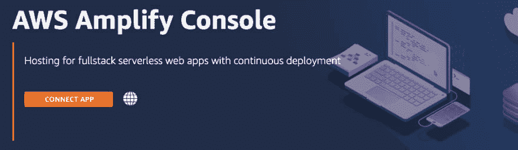
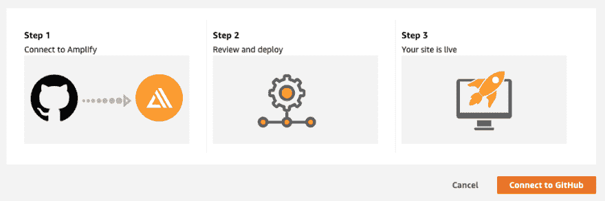
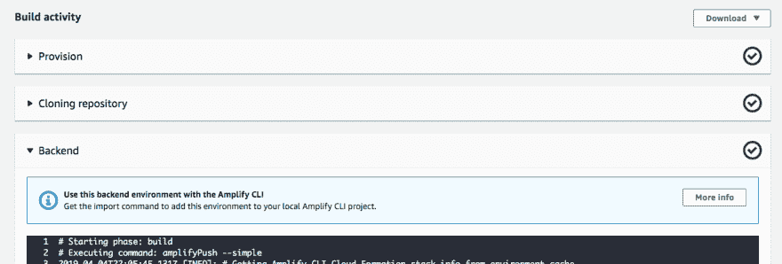
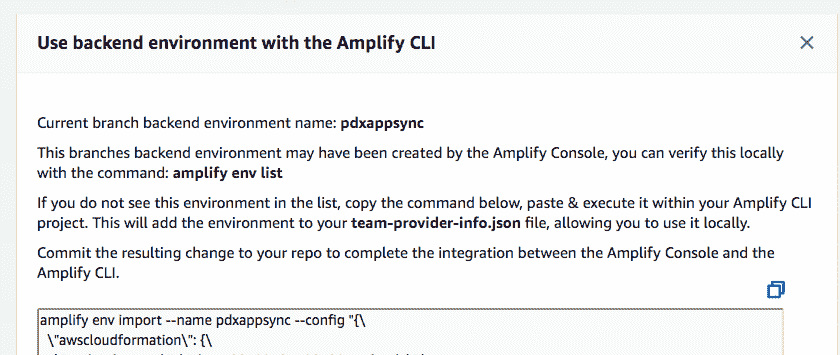
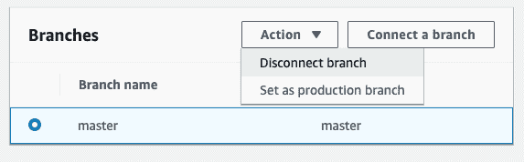
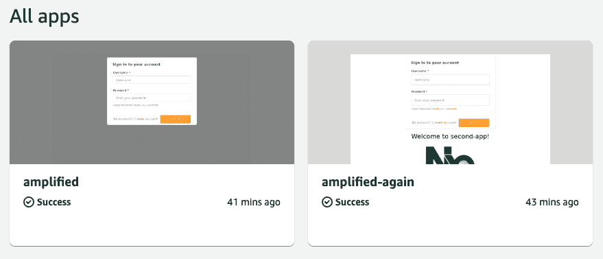

# 使用 Git Flow 和 AWS Amplify 控制台的个人成长——第 3 部分

> 原文：<https://dev.to/beavearony/personal-growth-with-git-flow-and-aws-amplify-console-part-3-1f6c>

在使用 [Angular](https://angular.io) 和 [Nx](https://nx.dev) 工具的 [AWS Amplify CLI](https://aws-amplify.github.io/docs) 的帮助下，我们在[第一部分](https://dev.to/beavearony/getting-started-with-a-angularnx-workspace-backed-by-an-aws-amplify-graphql-api---part-1-24m0)和[第二部分](https://dev.to/beavearony/creating-angular-ui-components-and-connecting-them-to-the-graphql-appsync-api-part-2-33n0)中用 GraphQL API 构建了一个个性化的 Todo 应用程序，实际上我们有相当多的时间。
我们不必构建身份验证和授权，我们不必考虑如何为其他未来应用程序或团队成员设置工作区，我们节省了编写冗长的 GraphQL 模式(带有分页、过滤、输入对象、解析器和所有权)的时间，我们用代码编写了所有内容，以便轻松地将整个后端环境推送到云中。

# 使用 Git Flow 和 AWS Amplify 控制台的个人成长-第 3 部分

我们对自己的人生选择感觉良好！自由时间专注于我们的健康和个人成长！于是，我们周末去参加一个研讨会，听一个著名的人生教练讲课。这是一个伟大的演讲，让我们学会了感恩和欣赏生活中的一切。他鼓励每个人告诉小组我们感谢的事情。所以，当我们感觉良好时，我们会站起来告诉每个人我们的成就。关于编写一个个性化的待办事项应用程序，关于未来计划和其他团队成员的大思考。我们还分享了我们关于在全球范围内发布应用程序、添加 git 流和持续集成的计划的想法。当然，我们不能忽略“您构建，您拥有”的概念，以及我们如何通过编写一些强大的 Amplify 和 Angular 命令来轻松构建全服务云环境，从而实现快速迭代。

谈论“两个比萨饼小组”会闪过我们的脑海，但我们很快就放弃了这个想法，不想去吃兔子的健康营养。

我们不确定我们对房间里的每个人有多大意义，但教练非常兴奋！为自己设定个人目标，并在完成后进行核对，这是让我们获得更大成就的好方法。构建事物并对其负责，同时不断地将这种流动融入我们的生活，这将把我们与“此时此地”和云端之外的环境联系起来。在发号施令的同时保持全方位的服务将会促进我们的个人成长。

哇，我们完全没有想到会有这样的反应！在峰会和会议上的走廊聊天中，我们会留下来与演讲者交谈。他告诉我们他计划建立一个在线生活指导平台来分享视频、文章和文件。付费会员和追踪个人目标的应用程序之间的聊天组也应该是这项服务的一部分。他说，他喜欢我们提前思考的方式。在我们的腰带上有一个生产就绪的 todo-app 和这些奇妙的工具，我们是建立一个小团队来进行这项努力的完美候选人。

在交换了我们的社交媒体联系信息后，我们承诺会给他发送一个我们 web 应用程序的链接。在回家的路上，我们开始思考如何快速将我们的 todo-app 发布到全世界。我们可以使用`amplify hosting`命令简单地建立一个静态网站，但是因为我们觉得将来需要发布几个登台环境和分支，我们决定使用 git-flow 工作流。

建立一个完整的 CI/CD 管道通常是一项重要的任务，但是自从 [Amplify 控制台](https://amplify.aws)的引入，它被缩短到了几分钟。

## 准备回购

好的，让我们从上次停止的地方开始。我们在 GitHub 上有一个 GIT 存储库，有一个主分支。当我们之前运行`amplify init`和`amplify push`时，我们有一个名为“主”的单一放大环境。

我们希望以两个永久的 git 分支“master”和“develop”结束。这些分支应该各自连接到云中一个类似的命名为 amplify 的堆栈。关于我们的云资源的信息应该存储在每个分支中。

如果我们希望使用现有的环境，并使用*开发*作为新名称，我们可以通过键入`amplify init`并选择*否*来添加新的云环境。下一个问题是关于我们想要使用的 AWS 概要文件，所以我们也选择了我们用于 master 的概要文件。

在一个非开源团队中工作，我们应该恢复我们在第一部分中所做的改变，我们把 team-provider-info.json 放在`.gitignore`中。查看这个文件，我们将看到我们新创建的*开发*环境被添加进来。

到目前为止，我们已经

1.  一个“主”git 分支在本地和原点
2.  `team-provider-info.json`中的两个后端环境“主”和“开发”
3.  一个“主”后端环境堆栈被推送到云(到目前为止，仅在本地“开发”环境)

## 在我们的工作区创建另一个应用程序

我们还没有对另一个应用程序的要求，但当我们创建了一个工作空间，支持多个应用程序连接到一个后端时，我们感觉到我们肚子里的冲动，无论如何都要测试一下。

我们通过键入`ng g app second-app`并接受所有缺省值来使它变得快速([记住我们在第 1 部分](https://dev.to/beavearony/getting-started-with-a-angularnx-workspace-backed-by-an-aws-amplify-graphql-api---part-1-24m0)中已经非常全面地介绍了这个过程)。还需要做一些调整:

1.  将“全局”添加到`polyfills.ts`
2.  在`styles.css`中导入 css 主题
3.  将 *AppsyncModule* 连接到`app.module.ts`中的*导入*数组
4.  将`app.component.html`的内容加上第一行的`<amplify-authenticator></amplify-authenticator>`
5.  将另一个构建命令追加到`package.json`的脚本部分:`"build:second": "npm run rename:aws:config || ng build second-app --prod; ng build second-app --prod"`

一旦我们确保使用`ng serve second-app`和`npm run build:second`在本地运行，我们就提交变更并将其推送到‘主’分支。

## 添加 Git-Flow

由于我们决定使用 git-flow，并且喜欢有一个自以为是的工作流，我们同意在我们的 Mac 上安装一个助手库作为指导。如果我们遇到未知的 git 流领域，我们可以在任何时候回到这个[备忘单](https://danielkummer.github.io/git-flow-cheatsheet)。

```
brew install git-flow-avh 
```

在我们工作空间的根层，我们运行

```
git flow init 
```

同时保留所有默认值。这样做，我们在一个新的*开发*分支上结束，我们可以通过使用这个命令
将它推送给我们的源代码控制提供者

```
git push -u origin develop 
```

这里没什么变化。我们只是有一个新的分支“开发”,没有任何新的提交。

## AWS 放大器控制台

我们已经准备好启动 CI/CD 渠道。我们转到 [AWS Amplify 控制台](https://aws.amazon.com/amplify/console/)，点击 ***连接 APP*** 按钮。

[](https://res.cloudinary.com/practicaldev/image/fetch/s--N3Vo2nye--/c_limit%2Cf_auto%2Cfl_progressive%2Cq_auto%2Cw_880/https://thepracticaldev.s3.amazonaws.com/i/zr6uon3f21yd7oup1hp3.png)

设置我们的构建和部署管道的四个简单步骤:

### 步骤 1 -添加存储库服务

选择我们的 GIT 提供者并赋予 Amplify 控制台只读权限

### 第二步-添加存储库分支

从下拉选项中选择我们的存储库和*‘master’*分支

### 步骤 3 -配置构建设置

正如 ***App 名称*** 我们喜欢‘放大’。应该可以检测到来自`team-provider-info.json`的两个后端环境。我们可以选择在这里创建一个新环境，稍后我们可以通过导入在 Amplify CLI 中重用它，但是我们之前已经设置了两个环境。所以，我们在这一步选择*‘master’*环境。

我们需要在我们的 AWS 帐户中选择一个服务角色。如果我们没有现有的，我们可以创建一个新的，这样放大器控制台可以访问我们的资源。

我们可以编辑 yaml 构建设置文件，并为不属于源代码控制的任何秘密设置自定义的 ***环境变量*** 。AWS 在我们的构建脚本中提供了一些变量，比如

*   AWS_JOB_ID
*   AWS_APP_ID
*   AWS_BRANCH

### 第四步-回顾

嗯，...我们审核并点击 ***保存并部署***

## 添加‘开发’分支

完成这四个步骤应该已经开始了我们对*‘master’*的构建。在等待结束的时候，我们可以深呼吸一两次，看看指尖的力量。

心情平静、神清气爽后，我们返回将第二个分支*“develop”*连接到同名的后端。这次只需要经过两个步骤:

### 步骤 1 -添加存储库分支

### 第二步-回顾

到目前为止，我们的 todo-app 的分支 master 和 develop 都连接到 Amplify 控制台。无论何时我们进入这些分支中的任何一个，我们都会在边缘看到我们的前端更新，我们的后端资源与我们的回购代码同步。

## 放大控制台区域支持

如果 Amplify Console 还不支持我们地区怎么办？根据我们尝试的时间，我们在配置 Amplify CLI 时选择的区域可能还不被 Amplify 控制台支持。没什么大不了的，选择 Amplify 控制台支持的区域，我们可以在构建脚本中的`amplify push`命令之前添加一行:

```
backend:
  phases:
    build:
      commands:
        # replace {our-region} with the previously used region
        - echo -e "[default]\nregion={our-region}" > ~/.aws/config
        - '#  Execute  Amplify  CLI  with  the  helper  script'
        - amplifyPush --simple 
```

这将在当前构建容器实例的默认 AWS 概要文件中设置我们的区域。

## 部署第二个应用

查看 Amplify 控制台中的构建脚本，我们看到了为每个 git 分支指定一个前端应用程序和一个后端堆栈的方法。前端应用程序将在特定分支的唯一 URL 处结束，如`https://master.ourappid.amplifyapp.com`，后端堆栈将在具有类似命名模式的区域中创建唯一资源。但我们希望在同一个分支的每个应用程序的 URL，即

*   `https://master.app-one.ourappid.amplifyapp.com`
*   `https://master.app-two.ourappid.amplifyapp.com`
*   `https://master.app-x.ourappid.amplifyapp.com`

不幸的是，这目前是不可能的。

Amplify Console 的设计似乎是为了让我们可以非常简单地将“Amplify Console”应用程序连接到 git 存储库。不同的前端和后端堆栈通过 git 分支进行配置或连接。这使我们能够将我们的全栈应用部署到各种暂存环境，如生产、开发、测试或功能沙盒。

为同一个回购创建一个**新的放大器控制台应用连接**怎么样？

尝试在 Amplify 控制台中连接另一个应用程序，我们会很快发现，我们不能再次选择同一个存储库。选择**一个不同的地区**并连接来自同一个回购的应用是一种变通办法，这可能行得通，但我们对未来管理这一点不太满意。

但还有另一个连接应用程序的选项，我们可以探索一下，看看它是否能帮助我们:

## 一键部署按钮

最近 AWS 增加了一个新功能，即[一键部署按钮](https://docs.aws.amazon.com/amplify/latest/userguide/one-click.html)来部署 GitHub 库以放大控制台。只需点击一个按钮，回购就部署在我们的 AWS 帐户中。我们可以用它来与世界分享我们的开源项目，或者在几分钟之内就能找到一个新的队友！根据我们的 todo-app 的增长速度，当新的招聘到来时，这可能会很方便。

我们可以将它放在 README.md 文件或博客帖子中，因此下面是我们对应的 repo 按钮:

 [
T4】](https://console.aws.amazon.com/amplify/home#/deploy?repo=https://github.com/BeaveArony/amplify-angular-nx-todo)

点击这个按钮打开一个新的浏览器标签，我们的区域和 GitHub 链接编码在 URL:

```
https://{aws-region}.console.aws.amazon.com/amplify/home#/deploy?repo={github-url} 
```

[](https://res.cloudinary.com/practicaldev/image/fetch/s--aFgxkr55--/c_limit%2Cf_auto%2Cfl_progressive%2Cq_auto%2Cw_880/https://thepracticaldev.s3.amazonaws.com/i/7mtoxin83mexlv67d97b.png)

当点击 **Connect to GitHub** 按钮时，我们键入名称‘amplified-again ’,在几乎什么都没检查过之后，我们将 GitHub repo 的默认分支连接到一个新的后端环境栈，名为*‘amplify’*。的确，非常简单快捷！

### 重用新创建的‘amplify’后端

一旦连接和构建#1 完成，我们可以告诉我们的 Amplify CLI 这个新的后端环境，这样我们就可以重用它。或者在我们的例子中，因为我们想要现有的后端，所以我们想要删除新创建的堆栈。

在**构建活动**中找到**后端**构建步骤将揭示所需的信息和指令:

[](https://res.cloudinary.com/practicaldev/image/fetch/s--I0zdcI55--/c_limit%2Cf_auto%2Cfl_progressive%2Cq_auto%2Cw_880/https://thepracticaldev.s3.amazonaws.com/i/917oiexzx3uuu6mqtuzu.png)

选择*‘更多信息’*按钮将会给出一个在我们项目的根目录下运行的 amplify cli 命令:

[](https://res.cloudinary.com/practicaldev/image/fetch/s---259FqDi--/c_limit%2Cf_auto%2Cfl_progressive%2Cq_auto%2Cw_880/https://thepracticaldev.s3.amazonaws.com/i/vext1g3nimqeddk55p2p.png)

在我们这样做之后，*“放大”*后端环境将在我们的`team-provider-info.json`文件中结束，准备在我们的命令行中选择。

```
$ amplify env list

| Environments |
| ------------ |
| amplify      |
| master       |
| *develop     | 
```

> 复制的命令包括 aws 概要文件*‘default’*，所以如果需要的话，我们应该记得将它调整为我们的概要文件名称

我们可以只使用它并将更改提交给 GitHub，但是我们希望删除云中和本地的后端堆栈。

```
amplify env remove amplify 
```

这看起来有点奇怪，要求 amplify 删除自己...好了，结果出来了，什么都没坏！

```
$ amplify env list

| Environments |
| ------------ |
| master       |
| *develop     | 
```

几乎没有，如果我们在 Amplify 控制台中运行构建，我们会看到它失败，因为它已经在其眼皮底下移除了后端。

### 重用我们以前的‘主’后端

我们现在在哪里？我们有第二个“放大控制台”——应用程序连接到同一个回购。默认的主分支使用新创建的(并秘密删除)*【Amplify】*后端环境，但我们希望重用与我们原来的“Amplify Console”应用相同的“主”和“开发”后端环境。

为此，我们必须在 ***App 设置中断开总分行:常规*** :

[](https://res.cloudinary.com/practicaldev/image/fetch/s--Z7SHbbS2--/c_limit%2Cf_auto%2Cfl_progressive%2Cq_auto%2Cw_880/https://thepracticaldev.s3.amazonaws.com/i/kboljceskpfqa41xavny.png)

完成后，我们可以将“主”和“开发”分支连接到同名的环境。

## 一键部署第二个 app

构建设置仍在构建我们的第一个应用程序。要改变这一点，我们进入**App settings:Build settings**查看，我们必须授予对 GitHub 库的访问权限。

> 这就是我们意识到我们实际上可以从其他人那里部署存储库而不需要首先分叉它们的地方！

为了构建和部署第二个前端应用程序，我们在 yaml 文件中编辑两行:

```
version: 0.1
backend:
  phases:
    build:
      commands:
        - '#  Execute  Amplify  CLI  with  the  helper  script'
        - amplifyPush --simple
frontend:
  phases:
    preBuild:
      commands:
        - npm ci
    build:
      commands:
        - npm run build:second # <-- Change to second app
  artifacts:
    baseDirectory: dist/apps/second-app # <-- Change to second app
    files:
      - '**/*'
  cache:
    paths:
      - node_modules/**/* 
```

保存构建设置并在两个分支中点击**重新部署这个版本**按钮后，我们就都准备好了！

Violà!

[](https://res.cloudinary.com/practicaldev/image/fetch/s--f9pqZtJn--/c_limit%2Cf_auto%2Cfl_progressive%2Cq_auto%2Cw_880/https://thepracticaldev.s3.amazonaws.com/i/lv8k1s7kj6cgj7kwkqaf.png)

添加另一个前端应用程序的帮助下，一键部署按钮！当我们将新代码推送到我们的“主”或“开发”分支时，这两个应用程序都将构建和部署一切。

开玩笑地探索 Amplify Console 的新功能向我们展示了一种可以将更多前端应用程序添加到后端的方法。像管理控制台，客户视图，支持票，经理图表等应用程序是可能的。即使我们可能会发现这条路线在未来过于复杂或受限，我们仍然有办法使用我们的第一个应用程序中的构建设置来安装、构建和部署任何东西，就像我们在 Amplify Console 出现之前所习惯的那样。

## 重述

我们对 AWS Amplify 的进一步发展充满信心。我们了解我们的回购、分支机构和后端环境之间的联系。新队友的加入将是一件乐事。

我们可以使用我们最喜欢的 git 提供者的管道功能，将我们的静态网站持续部署到 S3 和 CloudFront，并手动编写命令来部署后端。我们仍将受益于典型的 AWS 特性，如

*   全球可用的 CDN 托管
*   免费 SSL 证书
*   无服务器后端

在过去创建和构建了几个构建管道后，我们可以欣赏使用 Amplify Console 托管无服务器全栈应用程序的简单性，但我们还获得了什么？

*   使用 Route53 轻松定制域设置
*   原子部署
*   CDN 失效
*   受密码保护的功能分支
*   不同手机分辨率下的应用截图

好了，我们越来越兴奋了——是时候冷静下来，闭上眼睛，想象我们脸上的笑容，深呼吸一两次...