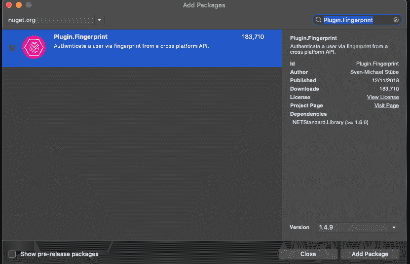
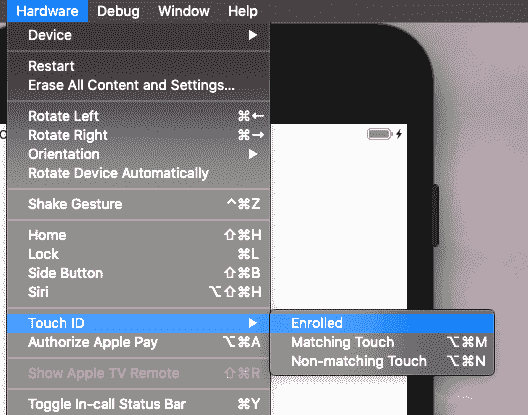
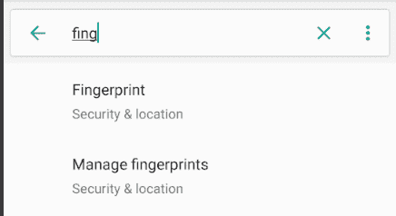
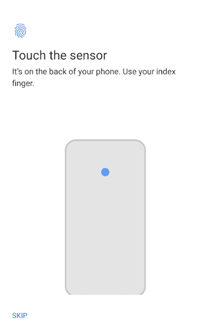

# 在 Xamarin 表单中添加指纹验证

> 原文：<https://dev.to/eatskolnikov/adding-fingerprint-authentication-in-xamarin-forms-ggd>

为多平台项目添加指纹认证从未比使用[插件](https://github.com/smstuebe/xamarin-fingerprint) [更容易。指纹](https://github.com/smstuebe/xamarin-fingerprint) nuget 包。

## 但首先…

关于生物识别/指纹认证，需要澄清一些事情。这些是由技术本身造成的实现限制，而不是由 Xamarin Forms 实现以任何方式引入的:

1.  您无法保存“指纹”。这有两个原因:
    *   指纹检测是在读取手指的硬件内部完成的[。](https://www.androidcentral.com/how-does-android-save-your-fingerprints)
    *   根据法律规定，你**不能** , **不应该**,**目前还不能**获得这些信息
2.  如果您的设备有多个注册指纹，您**无法**判断哪个指纹用于认证。
3.  您只能判断传感器是否收到了有效的指纹。

## 现在来看主要事件

首先，你需要包含插件。所有解决方案项目中的指纹。

然后你必须做一点设置。不要害怕，Android 只有三行，iOS 只有几行。

### 安卓上:

*   请求 AndroidManifest.xml 中所需的权限
*   设置运行应用程序的活动，以便插件可以在请求指纹时显示请求对话框。在插件库中，他们使用 CurrentActivity 插件，但是我注意到你可以通过添加关键字 **this** 在 MainActivity 中设置它

    ### iOS 上的  :

*   因为这个插件对人脸和指纹认证都有效，根据 [iOS 文档，](https://developer.apple.com/library/archive/documentation/General/Reference/InfoPlistKeyReference/Articles/CocoaKeys.html#//apple_ref/doc/uid/TP40009251-SW75)你需要在**信息中添加一个 **NSFaceIDUsageDescription** 的条目。** **plist** 文件。如果你不添加这个条目，插件就不会工作，你的应用甚至会崩溃。此条目描述了在使用面部身份验证的情况下，您将使用面部 id 的用途。

设置完成后，您需要调用 AuthenticateAsync 方法。当您要求用户进行身份验证时，您应该传递您希望用户看到的文本。返回的是一个布尔值，表明指纹是有效用户的还是用户取消了对话。如果没有注册的指纹，它也会立即返回 false。

<figure> 

<figcaption>一加 6</figcaption>

</figure>

上运行示例

## 奖励内容:配置您的仿真器和模拟器进行指纹认证

### iOS 模拟器上的  :

*   确保您“注册”了触控 ID。
*   要发送有效或无效的触控 id，您可以使用菜单中的选项或以下键盘快捷键 Shft+Cmd+M 和 Shift+Cmd+N

<figure> 

<figcaption>在 iPhone 8 plus 模拟器上注册触控 ID
</figcaption>

</figure>

### Android 模拟器上的  :

*   只需进入模拟器选项，并看到指纹部分。从那里你可以获得固定数量的指纹。
*   继续将它们注册到设备中。

<figure> 

<figcaption>寻找指纹管理部分</figcaption>

</figure>

<figure> 

<figcaption>配置指纹。每当你被问到</figcaption>

</figure>

时，只需点击模拟器选项中的“触摸该传感器”按钮

我希望你觉得这是有用的。我认为在 Xamarin.Essentials 中加入这样的内容会非常有用。[从我收集的信息来看](https://github.com/xamarin/Essentials/issues/71)他们正在计划添加它，但还没有，所以也许这是一个做点什么的好机会…无论如何，祝你愉快，如果你喜欢这篇文章，我鼓励你在社交媒体上分享它或传真给你的爸爸妈妈，他们可能会喜欢它，相信我。

在 Xamarin 表单中添加指纹认证的帖子最早出现在 [Enmanuel Toribio](https://blog.torib.io) 上。