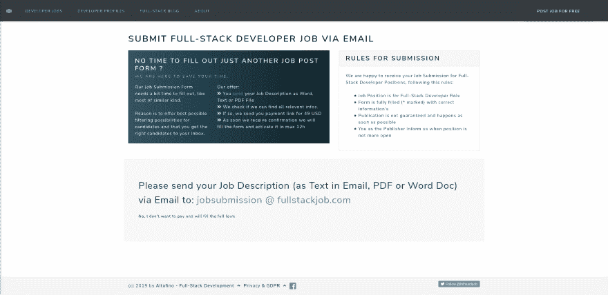

# 为什么我还没有建立很酷的“在这里上传文件”功能。

> 原文：<https://dev.to/golangch/why-i-don-t-built-the-cool-upload-the-file-here-feature-yet-41hc>

在我的日常工作中，我总是为生产率、做正确的事情、专注、质量等事情而奋斗。这只是我作为软件开发团队领导的工作。

但说真的，说到做副业，我做的大多是副业。最后，更多的是乐趣，学习新东西。

但是现在有了# full stack job([https://fullstackjob.com](https://fullstackjob.com))和潜在的，我有了其他的目标，包括从中赚点钱。然后就是我上面列出的日常工作职责。

这就是现在关于“在这里上传文件”这个很酷的问题。

我计划了一个新的小功能，职业招聘人员可以上传他们的工作订阅，而不是填写一个安静的大表格，支付合理的费用。首先，我开始检查现有的 Vue 上传组件，纱线已经添加了一些东西和第一行代码，然后商业声音告诉我“嘿，伙计，停止”...首先检查，如果这项功能将被使用，如果有人愿意为这项服务付费。好吧，当我与一些招聘人员交谈时，我得到了一些积极的反馈，但这从来不是 100%的答案。

于是我做了一个[简单版](https://fullstackjob.com/submitjobdescription)。只需内容和行动号召，通过电子邮件发送描述。

干杯斯特凡

