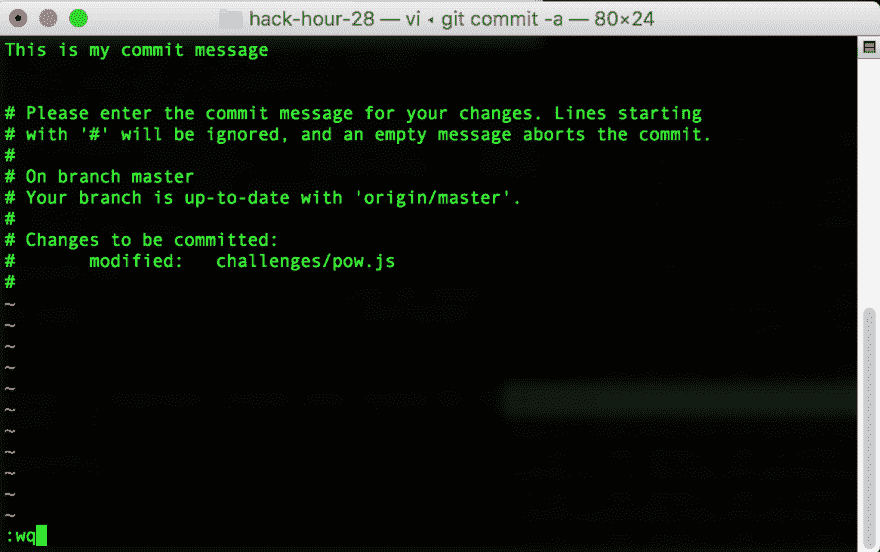

# BASH Pt:1 脚本的乐趣

> 原文：<https://dev.to/sirclesam/fun-with-bash-pt-1-scripting-51l9>

# BASH 的乐趣

### 第 1 部分:脚本

有没有发现自己一遍又一遍地输入同样长的命令行组？

BASH 脚本可以提供帮助！

假设您希望在一个命令中提交和推送 git repo，而不是分别执行。

(注意代码示例:> $将用于指示终端，而->输入该命令的输出)

让我们开始吧:
打开你的终端——我们将进入你的根目录。创建一个新文件。的。sh 扩展通常用在 BASH 脚本上

`>$ touch commitpush.sh`

在我们编辑脚本之前，我们需要使这个文件可执行。因为现在如果我们试图执行它，我们会得到一个错误。

`>$ ./commitpush.sh --> bash: ./commitpush.sh: Permission denied`

为此，我们使用 chmod 命令，它代表更改模式。我们将在脚本中用标志 a+x 调用它。这将使这个文件对所有用户都是可执行的。有关其他选项，请参见 chomod 的手册页。如果你想删除可执行性，使用标志 a-x

`>$ chmod a+x commitpush.sh`

在我们开始编写脚本之前，还有最后一件事，我们需要找到 BASH 在计算机上的位置，这样我们就可以告诉脚本在哪里执行它自己。

`>$ whereis bash --> /bin/bash`

注意我的 OSX 系统在根 bin/文件夹中有 bash，但是你的可能不同。

是时候开始编辑脚本文件了！

首先是使用我们从那里得到信息来告诉脚本在哪里执行它自己。这是用#完成的！性格。将以下内容添加到您的文件

```
#!{yourBASHPATH}
echo This is Working!!! 
```

现在您可以执行这个脚本了

`>$ ./commitpush.sh ---> This is Working!!!`

不错，但对我们没有太大帮助，让我们改变它，让它实际上有一些功能。

```
#!/bin/bash
git commit -a
git push 
```

注意在 git commit 上使用-a 标志只会提交已经被 git 跟踪的文件的更改，您仍然需要 git 添加任何新文件。

现在有了一个脚本，让我们每次都不用输入两行，但是调用它并不容易。您可能习惯于通过键入名称来运行 bash 命令，但是如果您已经注意到，每次我们运行这个脚本时，我们都在它的前面加上。/

这是因为作为一种安全措施，BASH 不允许您按名称执行任何文件，即使您在目录中。

`>$ commitpush.sh --> -bash: commitpush.sh: command not found`

还有另一个不方便的问题——尽管 bash 脚本在当前目录下执行，但您仍然需要引用它的当前位置来执行它。如果你有好几层，这可能会令人恼火。

假设您的 git 项目位于~/codesmith/gitre PS/my project/中，为了在您的主目录中运行脚本，您必须输入:

`../../../commitpush.sh`

幸运的是，我们可以使用一个内置系统，即$PATH 环境变量。您可以使用 echo 命令查看您的:

`>$ echo $PATH --> /usr/bin:/bin:/usr/sbin:/sbin:/usr/local/bin`

BASH 将在这些目录中查找以执行命令。所以我们可以做的一件事就是把我们的脚本放在这些目录中的一个。我推荐使用/usr/local/bin，因为它不太可能干扰任何内置的系统命令。

我们可以使用 move (mv)命令将其移入。

`>$ cd`-让我们回到主目录
`>$ sudo mv commitpush.sh /usr/local/bin` -将脚本移动到本地 bin。

我们将它放入的目录是受保护的，所以你需要使用`sudo`并输入你的密码来获取它。

现在，您只需在任何有活动 git repo 的目录中键入 commitpush.sh，剩下的工作就交给它了！

需要注意的一点是，使用这种方法意味着您的提交消息将在 vi 中打开。按 I 键进入“插入”模式，然后输入您的信息。点击“[Esc] : w q [enter]”，退出并保存在 vi 中

[](https://res.cloudinary.com/practicaldev/image/fetch/s--JsAf8Mdw--/c_limit%2Cf_auto%2Cfl_progressive%2Cq_auto%2Cw_880/https://thepracticaldev.s3.amazonaws.com/i/43w4m4sqosam3zqvt1dv.png)

如果您不喜欢这样，那么请继续阅读，我将介绍如何在不影响 vi 的情况下做到这一点。

### 第 2 部分-检查错误和变量

所以这在理想情况下是可行的，但是如果提交有错误呢？我们不想在有问题的时候推，所以这应该有一些逻辑来防止这种情况发生。我们可以在我们的脚本中用退出代码和一些条件来做到这一点。

#### 退出代码

BASH 中运行的每个命令都应该返回一个退出代码。如果一切按预期进行，这是 0，否则不是 0。通常，它是 1，但非零是重要的部分。

这存储在 BASH 变量$中。您可以使用 echo 命令来查看它。

成功范例

```
>$ cp cp.sh commitpushCOPY.sh
>$ echo $? ----> 0 
```

故障示例

```
>$ cp MADEUPFILE.sh commitpushCOPY.sh  ---> No such file or directory
>$ echo $? ----> 1 
```

这里有些棘手的地方是“echo $？”它本身是一个命令，所以它会在运行
时设置退出代码

```
>$ cp MADEUPFILE.sh commitpushCOPY.sh  ---> No such file or directory
>$ echo $? ----> 1
>$ echo $? ----> 0 
```

现在把它放到我们的脚本中。

```
#!/bin/bash
git commit -a 

if [ $? = 0 ] 
then
  git push
fi 
```

请注意如何使用 fi 而不是 curley 括号来结束块。让我们添加一些输出，使其更加用户友好，并展示 if then/else 在脚本中是如何工作的。比较是用单个=操作符完成的，而不是 JS 中常见的===操作符。

```
#!/bin/bash
git commit -a 

if [ $? = 0 ] 
then
  echo 'Commit success, pushing'
  git push
else
  echo 'Commit failure, aborting push'
fi 
```

现在，至少它会更健壮一些，不会在我们不希望它推的时候推任何东西。

但是这个脚本仍然有一个烦人的地方，那就是强迫我们在 vi 中输入提交消息，然后试图记住如何写——退出 vi。

这里的最后一项将是如何避免使用参数。

你已经习惯用这些了。您正在使用的命令后面的任何内容都是参数。这通常是程序需要使用的保存标志或文件名。

在 bash 脚本中使用它们非常简单。每个空格分隔的值将作为一个 bash 变量，后面跟一个数字。

脚本 foo.sh

```
#!/bin.bash

echo $1
echo 'Line of text'
echo $2
echo 'More text'
echo $3
echo 'and even more text' 
```

运行上面的脚本，我们得到

```
>$ ./foo.sh bar baz
bar
Line of text
baz
More text

and even more text 
```

看看 bar 和 baz 是如何列出的，因为没有提供$3 参数，所以有一个空行。

所以在 git commit 中使用这个和-m 标志，我们可以避免 vi。

```
#!/bin/bash
git commit -a -m $1

if [ $? = 0 ] 
then
  echo 'Commit success, pushing'
  git push
else
  echo 'Commit failure, aborting push'
fi 
```

现在你可以用一行代码提交并推动你的改变了！

` > $ commitpush.sh '提交并推送当前分支的进度'

你必须在你的信息周围加上引号，否则你的提交信息将只是一个词。

如果您想避免这种情况，请添加错误检查，如果提供了多个参数，将会中止整个脚本。

编码快乐！！！

Pt 2:别名
[https://dev.to/sirclesam/fun-with-bash-pt-2-aliases-2imj](https://dev.to/sirclesam/fun-with-bash-pt-2-aliases-2imj)