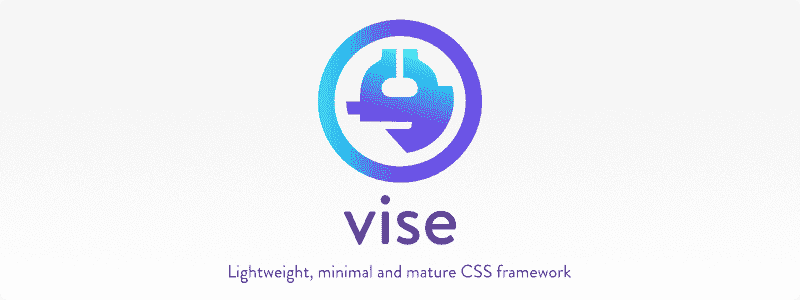

# CSS-Vise:一个非常小的纯 CSS 框架。

> 原文：<https://dev.to/appforgelab/css-vise-an-exceptionally-minimal-pure-css-framework-710>

精心打造的轻量级、最小化和成熟的香草 CSS 框架。它可以作为主要框架使用，也可以和其他框架一起作为次要框架使用。查看[该演示页面](http://appforgelab.com/vise/)进行快速展示。

## 为什么要老虎钳

有几十种 CSS 框架可用，但为什么要用 Vise 呢？

*   你可能不需要一个**沉重的**框架来构建一个伟大的用户体验。

*   你可能想在同一个 HTML 文档中使用不止一个框架。

*   你可能想要一个**更聪明的**和**更容易的**来学习最小框架。

*   你需要一个被 98%的网络浏览器支持的库。

## Github

Vise 在 github 上的项目[https://github.com/Appforge-lab/CSS-Vise](https://github.com/Appforge-lab/CSS-Vise)