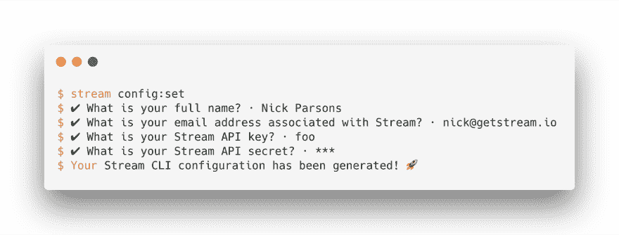

# Stream CLI &我作为开发人员传道者的角色

> 原文：<https://dev.to/nickparsons/stream-cli-my-role-as-a-developer-evangelist-nmi>

[](https://res.cloudinary.com/practicaldev/image/fetch/s--dpzAHGvu--/c_limit%2Cf_auto%2Cfl_progressive%2Cq_auto%2Cw_880/https://thepracticaldev.s3.amazonaws.com/i/6nv3sm10tbqwdxdydc20.png)

长期以来，Stream 一直以提供一个大规模支持活动订阅源的平台而闻名——专门迎合那些构建类似于脸书、Instagram、Twitter 甚至 Quora 的订阅源驱动体验的团队。几个月前，我们的团队开始了一项新的冒险——为聊天应用程序构建一个高度可用的基础设施。由我们自己的首席执行官([蒂埃里·谢伦巴赫](https://twitter.com/tschellenbach)和首席技术官([托马索·巴布格利](https://twitter.com/tommasobarbugli)撰写的概念证明很快就变成了我们知道适合市场的产品，主要是因为当前的解决方案根本不符合要求，我指的是字面上的意思。

除了价格，我们还必须贴近我们的根。我们开始构建一个动态的产品；这是一款迎合各种聊天产品的产品，这些聊天产品旨在更好地帮助个人在其应用程序中进行交流。为了做到这一点，我们知道我们必须赢得开发人员的心(类似于我们对活动提要的方法)，这需要一种与传统产品发布不同的思维方式。以开发人员为中心意味着你必须对开发人员友好，这需要一个令人敬畏的 API、各种 SDK，当然，还有一个强大而直观的命令行界面。

传统上，我在 Stream 作为一名开发人员传道者的工作是致力于新特性发布、错误修复等的营销材料和公告。，此外还有您的正常任务，如帮助开发人员/产品采用和一般客户支持。我非常喜欢我每天所做的工作，但是，我的编码天赋开始让我发痒，所以我开始设计最好的 CLI 来支持聊天，最终支持活动提要。

也许我最喜欢的是，我有机会在我们的 chat 开发中发挥我的作用，允许我针对我们当时处于测试阶段的 SDK 编写代码，创建了一个很好的反馈循环，用于查找 bug 和更好的方法来处理我们如何从 JavaScript SDK 调用 API。

# 上市

虽然 CLI 目前处于测试开发阶段，但它功能强大，涵盖了我们的整个聊天 API——从频道初始化到推送通知支持。实际上，您可以在命令行中深入了解您的 Stream powered 聊天基础设施。我真的为我在这个项目上所做的工作感到骄傲，并且很高兴地宣布，它目前(公开和开源地)存在于 [GitHub](https://github.com/getstream/stream-cli) 上。

> 注意:CLI 最终将支持聊天和活动提要。目前，我们正在努力为 feeds 添加服务器端支持，以适应 CLI。请在 [Twitter](https://getstream.io/nickparsons) 上关注我，继续关注 CLI 更新。

# 入门

假设 CLI 是我们的 JavaScript SDK 的包装器，可以使用 npm 或 yarn 通过以下命令全局安装 CLI:

```
$ npm install -g getstream-cli 
```

Enter fullscreen mode Exit fullscreen mode

**或**

```
$ yarn global add getstream-cli 
```

Enter fullscreen mode Exit fullscreen mode

一旦安装了 CLI，请确保使用您的流凭据进行初始化。您可以在支持聊天的应用程序的 Stream dashboard 上找到它们。要初始化，只需跳转到您的终端并运行以下命令:

```
$ stream config:set 
```

Enter fullscreen mode Exit fullscreen mode

您将立即被提示输入您的姓名、电子邮件、api 密钥和 api 秘密。

[](https://res.cloudinary.com/practicaldev/image/fetch/s--xo7DpAs---/c_limit%2Cf_auto%2Cfl_progressive%2Cq_auto%2Cw_880/https://i.imgur.com/bEYRG8n.png)

一旦初始化，你将可以访问几十个命令——所有这些都 100%记录在 [CLI 文档](https://github.com/getstream/stream-cli)中。几乎所有的命令都默认采用交互方式来捕获信息。也就是说，如果你想绕过交互支持，或者作为 [bash](https://github.com/GetStream/stream-cli/tree/master/examples/bash) 命令运行，它们都接受命令行参数。在 bash 中运行这些命令允许您用几个命令编写聊天基础设施的整个设置(当用`--json`标志调用时，它们甚至会将完整的响应负载作为 JSON 返回)。

# 堆栈

如果你和我一样，你可能正在阅读这篇文章，并且想知道我是如何在如此短的时间内构建一个强大的 CLI 工具的。虽然我将把内部的内容留到以后(请继续关注更新)，但我要说的是，由于 Heroku 背后的团队开源了一个基于 JavaScript 的 CLI 框架 [Oclif](https://oclif.io) ，它变得特别容易。你可能知道，Heroku 有一个非常棒的 CLI，我想尽我所能模仿它的行为，这也是我最终选择在 Oclif 之上构建的原因。

一眼看去，Oclif 为我提供了从头构建 Stream CLI 和构建定制集成的所有必要工具，以通过其易于使用的插件进一步改善 CLI 体验。

当我向 Oclif 团队提出关于 GitHub 的问题时，他们给了我极大的帮助，我非常感谢他们在这个过程中对我的帮助。他们对待开源的方式真的令人惊讶，我非常感谢他们对社区的开源贡献。

非常感谢那边的团队让这个项目在开源许可下公开可用。如果你喜欢这个项目，请在这里给它一颗星。

# 最后的想法

我在上面提到了我对 Oclif 背后团队的感谢；然而，我也想对霍拉休恩喊一声👏，一位非常有才华的软件工程师，在我们的阿姆斯特丹办公室工作。Horatiu 在整个 CLI 构建过程中提供了巨大的帮助，特别是在实现我们的推送支持时——当你错过了来自 Slack、脸书或其他你最喜欢的社交媒体/信使平台的精彩消息时，那些通知会出现在你的移动设备上。

随着我们在新产品 chat 以及服务器端对活动订阅源的支持方面继续取得进展，我和团队将确保 CLI 始终领先于 SDK 更新，因此它永远不会中断。

请继续关注，订阅未来的更新，或者在 Twitter 上关注我。你可能也喜欢阅读[打造开发者喜欢的命令行体验](https://dev.to/nickparsons/crafting-a-command-line-experience-that-developers-love-4451)。

> 如果你有兴趣在[流](https://getstream.io/chat)的基础上构建一个聊天产品，你会想从看一看[开始，我们必须提供](https://getstream.io/chat/)的许多功能。我可以保证不会让你失望。