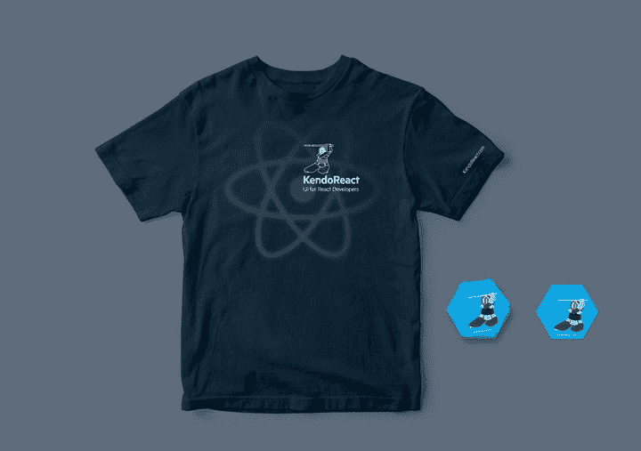

# 亲自会见 KendoReact 团队:阿姆斯特丹、巴黎、盐湖城

> 原文：<https://dev.to/progresstelerik/meet-the-kendoreact-team-in-person-amsterdam-paris-salt-lake-city-1j30>

每个人的背后都有一个故事，我们想知道你的故事！这就是为什么 KendoReact 团队今年要去与 React 社区会面。你可以在本文末尾看到我们将参加哪些活动，但在此之前，让我与你分享一些我们的故事，以此开始对话。

你可能在以前的活动中，在推特上，或者在 [Telerik 博客](https://www.telerik.com/blogs/author/carl-bergenhem)上看到过 [Carl 的](https://twitter.com/carlbergenhem)明显的北欧胡子，因为他从 KendoReact 成立以来就一直和它在一起。不要问他是哪里人，除非你手里有一杯咖啡，有一个可以舒服地坐着的地方。另一方面，作为 KendoReact 产品经理，Carl 有很多关于团队、我们如何构建路线图以及如何在平衡大量工作职责的同时保持健康的话要说。

如果你想了解更多关于 React hooks 的信息，Eric 的名字可能会出现在你的谷歌搜索结果中，因为他撰写了一个受欢迎的[系列文章](https://www.telerik.com/blogs/author/eric-bishard)，深入探讨了它们的复杂性。除了 hooks 之外，关于这位 React 开发人员还有很多值得了解的地方，他来自于 Tesla Progress，获得了他的第一个开发人员倡导者角色(在这个职位上他是天生的！)并且奇迹般地总是出现在保加利亚索非亚团队的电话旁，尽管有 10 个小时的时差(他的工作地点在加利福尼亚)。

然后，我也鼓励你询问 [Kiril](https://twitter.com/kspeyanski) 关于与 Gatsby 一起重建我们 [KendoReact 网站](https://www.telerik.com/kendo-react-ui/)的先前版本，以及这种架构变化对生产中的构建时间有何影响。提示:他成功地将开发和生产构建时间缩短了 10 倍，并使网站运行得非常快。是的，他有故事要讲。

如果您对 KendoReact 组件的工作方式有任何疑问，请务必咨询 Stefan，他是我们的解决方案专家。他也是团队中唯一一个你可以询问所有和任何 KendoReact UI 组件并获得专业建议的人。由于他是回答支持问题时最积极的团队成员之一，您甚至可能已经与他交换了电子邮件！

然后还有我，[诺拉](https://twitter.com/nora_init)。如果你想轻松一下，可以问我最喜欢的关于函数的笑话——每次我讲的时候都会笑。我也有很多搞笑的开发者故事。除此之外，我在 IT 行业做市场营销的时间比你想象的要长，而且我对沟通充满热情，所以你可以问我任何问题。别担心，如果你来找我，就不会有营销谈话，因为我发现很难不直截了当(只要问团队)。

在建立关系或了解他人时，没有什么可以取代面对面的交流。这就是为什么 KendoReact 团队，由刚刚介绍的这些优秀的人代表，将在今年夏天去的地方！

来我们的展位参加以下会议:

*   [React Amsterdam](https://react.amsterdam/) 于 4 月 10-12 日在阿姆斯特丹举行。我们将会在咖啡点，1 号摊位旁边，并且会穿上蓝色的 React！卡尔很少错过锻炼，当我们在那里时，他可能会在荷兰自行车手之间跑一跑。如果你想用跑步者的快感来提升你的幸福感，那就去找他吧。此外，我们还将收到一些来自您的超酷礼物，包括 Bose 耳机抽奖、T 恤衫和更多 KendoReact 糖果。

*   [React Europe](https://www.react-europe.org/)5 月 21-24 日在巴黎。每次想到巴黎，我都会想到艾莉森·戈普尼克(Alison Gopnik)的爆笑对比，“当一个婴儿是什么感觉？喝了三杯双份浓缩咖啡后，第一次在巴黎坠入爱河。”我希望我会有一些新的联想，因为这将是我第一次来巴黎！
*   [React Loop](https://reactloop.com/speakers)6 月 21 日芝加哥。虽然我们不会在那里展出，但请务必参加 Eric 的演讲，因为他是芝加哥首届 React 大会的演讲者之一。
*   [React Rally](https://www.reactrally.com/) 于 8 月 22 日至 23 日在犹他州盐湖城举行。还有几个月的时间，但是如果你打算去那里和 KendoReact 团队见面，请在你的日历上做好标记！

期待见到您本人！如果您想建议我们参观其他 React 活动，请给我们写信，我们会查看的。