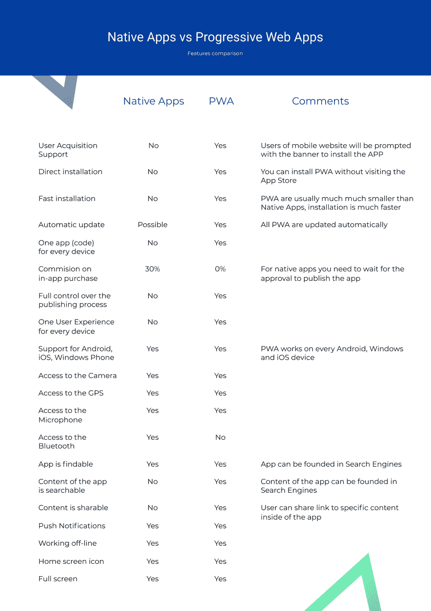

# 电子商务的 PWA 还是原生应用？

> 原文：<https://dev.to/tomik99/pwa-or-native-app-for-ecommerce-2e67>

尽管在方法或设计上存在差异，但原生应用和渐进式网络应用让我们能够与移动用户建立强有力的互动，从而提高销售额。哪个更适合电子商务？

让我们从业务角度来看一下这两种解决方案之间最重要的区别

# 用户采集流程

原生应用需要从专门的应用市场下载。对于已经在使用移动网站的用户来说，这是用户旅程中的额外一步，也是一种干扰。在访问 AppStore 或 Google Play 时，用户会接触到其他品牌的应用。通常，电子商务会支付额外的费用来获得本地应用的用户，即使用户已经在移动设备上访问他们的网站。

PWAs 有一个“添加到主屏幕”按钮，可以直接从手机网页保存。它降低了用户获取成本，缩短了流程。此外，PWAs 的可链接性简化了用户之间的信息和喜爱产品的共享，因为 PWA 中的产品页面可以作为链接复制并在任何浏览器中使用。

## PWA 网站将获得更多用户

搜索引擎也支持渐进式网络应用(看看谷歌移动优先索引)。与本地应用相比，pwa 很容易直接从浏览器中找到并安装。

# 生产和维护成本

构建和维护原生应用相当昂贵。品牌必须为每一个操作系统建立独立的应用程序，然后定期更新。更重要的是，有必要为访问应用市场付费，并在其上使用额外的推广。

PWAs 是作为网页构建的，因此其开发成本要低得多。当 PWAs 连接到电子商务后端时，更新会自动完成。它们独立于操作系统或市场。

# 商业模式

本地应用被高达 30%的市场佣金覆盖。这个价格相当高，销售实物商品的企业负担不起。市场还控制了应用程序的发布，这使得在商店中计划新的发布或促销变得困难。

公共福利援助不受任何委托或控制。网店自行发布，可以自由策划多样促销，短时间内对市场变化做出反应。

# 用户体验

原生应用程序通常会在移动设备上使用大量存储空间，并迫使用户频繁更新。此外，原生应用程序的安装过程需要一段时间，用户在进入应用程序之前必须等待。这些都是市场上任何新应用的高起点。此外，由于它们需要针对移动设备进行单独设计，因此降低了从一种设备转移到另一种设备的全渠道用户的转化率。

# PWA 特性

PWA 要小得多(Twitters 的 PWA 只有 0.6 MB，相比之下他们的 Android 应用程序只有 23 MB)，因此它们更容易安装。此外，安装在后台进行，因此用户可以在此过程中使用 PWA。PWAs 在所有设备上具有一致的设计，这支持全渠道方法。

# PWA vs Native App

尽管原生移动应用程序为用户提供了更广泛的功能，但渐进式网络应用程序将自己呈现为移动优先解决方案的新标准。PWAs 是一项快速发展的技术，每天我们都会看到新的引人入胜的功能。

这一标准已经被主要的电子商务和社交媒体公司所采用，这些公司的大部分流量来自移动设备。你可以  看看他们是如何实施 PWA 并检查结果的。

如果你有时间，可以去看看我们做的开源 PWA 框架 Vue 店面。