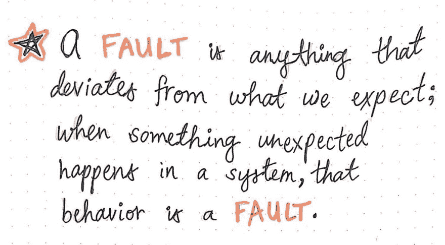
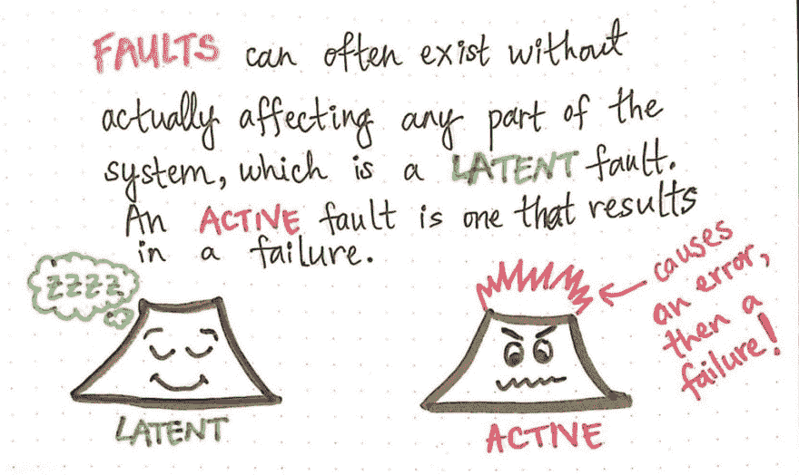
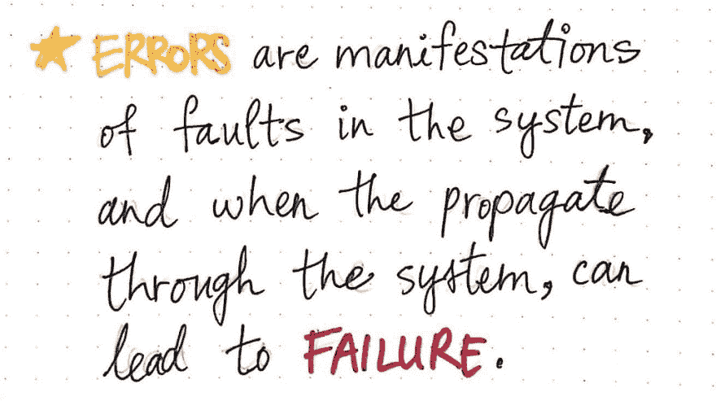
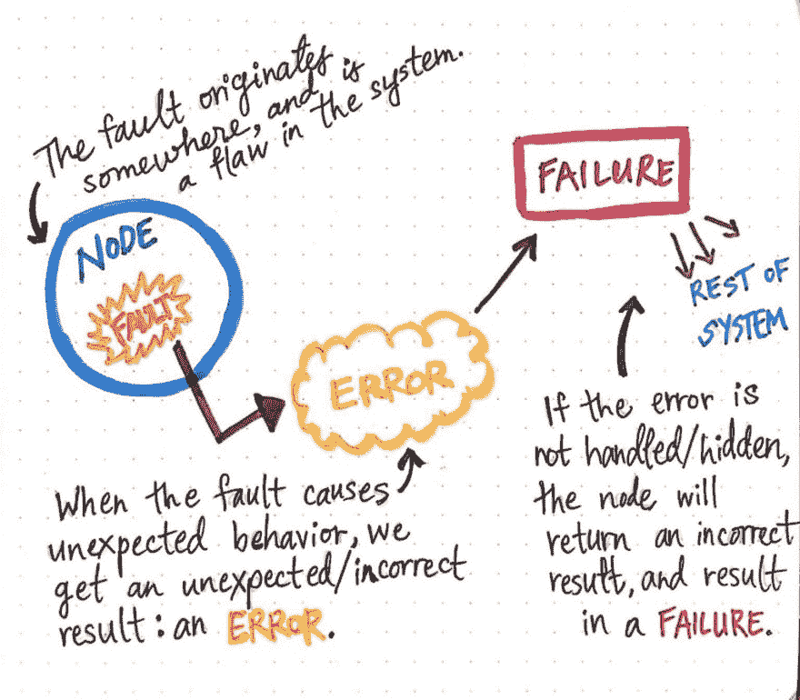
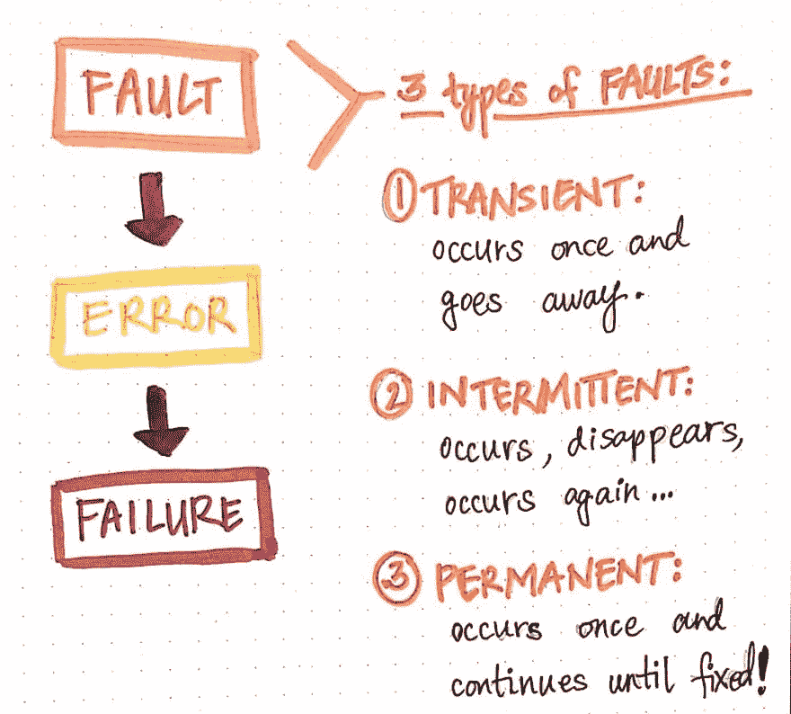
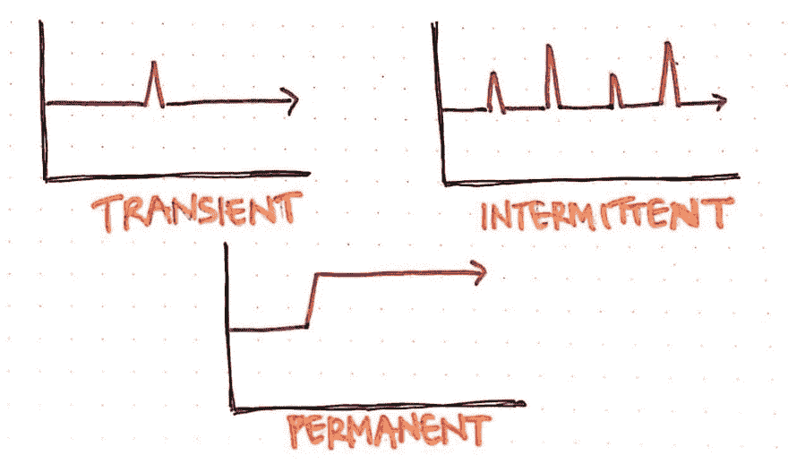
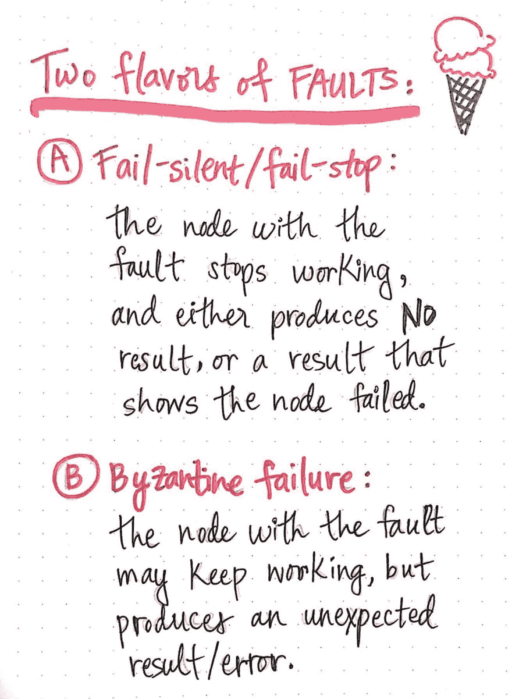

# 奇异的缺点以及如何称呼它们

> 原文：<https://dev.to/vaidehijoshi/fantastic-faults-and-what-to-call-them-2djb>

当我们开始学习分布式系统时，我们知道这个主题可能有点难。在本系列的开始，我们甚至没有深入讨论是什么使分布式系统变得困难。

相反，我们关注的是它们到底是什么，以及什么构成了一个好的、设计良好的系统(剧透:完美的系统甚至不存在，但我们正在努力实现它！).直到最近，当[我们探索像停机时间、可用性和容错系统这样的主题](https://dev.to/vaidehijoshi/ready-and-available-distributed-systems-bck)时，我们才真正深入到使分布式系统难以处理的事情中。这一周，是时候更深入了，深入到我们系统中开始出错的地方。

既然我们已经了解了错误，并对一些可能出错的事情有了更好的了解，现在是时候理解我们在谈论错误时真正谈论的是什么，它们看起来像什么，以及它们可能导致的后续头痛。因此，让我们深入研究，并尝试在遇到错误时更好地处理我们正在处理的问题！

#### 到底是谁的错？

在我们最近遇到的故障中，我们以一种非常具体的方式讨论了它们:以某个硬件失控的形式(理解为:失败)。但是，故障不仅仅发生在硬件损坏的情况下。术语“故障”的*实际*定义和用法比我们最初想象的更加模糊。

<figure> 

<figcaption>故障:一个定义。</figcaption>

</figure>

一个 ***故障*** 实际上就是我们系统中与我们期望的不同的任何东西。每当我们系统的某个部分偏离了它的预期行为，或者每当我们的系统中发生了意想不到的事情，这个行为本身就是一个错误！

现在，仅根据这个定义，我们可以开始看到，不仅仅是故障或损坏的硬件会“行为异常”。不，在我们的系统中有大量不同的潜在点可以做到这一点，是的——你猜对了——所有这些潜在点只是我们系统中的错误，等待发生。

> 重要的是要区分“等待发生的错误”和“已经在我们面前爆发的错误”这两个概念！

谢天谢地，这里有两个术语派上了用场。如果我们的系统中有一个点有可能表现出意想不到的行为，但它实际上还没有表现出这种“意想不到的”行为，我们可以将其称为 ***潜在故障*** ，因为它存在，但处于休眠状态，并且实际上没有以任何方式影响我们系统的任何部分(…还没有！).

<figure> 

<figcaption>主动 vs 潜在缺点</figcaption>

</figure>

然而，当一个断层实际上暴露了它自己——也就是说，当一个断层不再仅仅具有以一种意想不到的方式表现的*潜力*,而是它实际上*做了*意想不到的事情——我们用另一个名字来称呼它。一个 ***活动故障*** 是一个实际上偏离我们预期的故障，并且上升到我们系统的表面，并影响它的其他部分。

当我们的系统中出现活动故障时，它会波及整个系统并导致多米诺骨牌效应。通常，故障(根据定义，是某种意外行为)会导致错误，然后导致失败。但是这到底意味着什么呢？是时候找出答案了！

#### 【不良】多米诺效应

虽然故障是潜在的，但它可能处于休眠状态，在我们系统中任何允许发生意外行为的地方等待着。通常，意外行为是我们没有考虑或以任何方式处理的事情。一旦一个故障变得活跃，就更容易理解*它来自哪里*。

我们还记得，分布式系统是由相互通信的节点组成的，所以故障可能来自系统中的任何节点——无论系统中意外的缺陷发生在哪里。因此，为了我们的目的，我们可以足够抽象地谈论故障，说故障起源于系统中的某个节点。

一旦一个节点中的故障实际上表现出来并变得活跃，它就引起一些意想不到的行为；正如我们可能猜测的那样，不同的错误会导致不同的行为，但这里的共同点是它们是*意想不到的*。我们系统中的预期行为实际上意味着我们系统的某个部分做了我们没有计划的事情！意外的行为导致我们的系统做了一些我们没有计划的事情，这产生了一个不正确的结果:一个错误！

<figure> 

<figcaption>错误:一个定义</figcaption>

</figure>

无论是作为软件或硬件的创造者，还是作为它的消费者，我们都可能在生活中遇到某种方式、形状或形式的错误。在分布式系统的上下文中，错误实际上是故障出现的一种方式。 ***错误*** 是我们系统内部故障的表现，当一个错误发生，然后在系统中扩散或传播……这就是事情开始真正引起我们注意的时候。

<figure> 

<figcaption>一个故障通过一个分布式系统的流向。</figcaption>

</figure>

如果因为故障而发生错误，并且没有以某种方式处理，事情就开始失控了。

> 具体来说，由一个节点内的单个故障导致的未处理错误现在可以开始影响系统的其余部分。

如果一个错误没有对系统的其他部分隐藏，那么这个错误就会向外传播；从系统其余部分的角度来看，产生故障的节点现在表现异常，因为它以一个错误来响应，而不是系统*期望*它以什么来响应！该节点的这种意外行为被系统视为 ***故障*** ，或者该“故障”节点的不正确结果或行为。

在分布式系统中，失败本身是一个完整的话题，我保证，我们很快会再次讨论它们！但是现在我们对故障是如何出现、变得活跃、导致错误(以及后来的故障)的流程有了更好的理解，让我们试着理解可能发生的不同类型的故障。这将让我们更好地洞察未来可能会出现什么样的失败。

#### 故障的类型和种类

正如我们现在所了解的，断层的定义比我们最初认为的要宽泛。由于故障是任何表现出乎意料的事情，因此故障可能是任何硬件、软件、网络或系统的操作方面做了我们没有计划到的事情！因此，故障本身可能是由许多原因引起的，而不仅仅是源于一个地方。

但是既然错误可能看起来像许多不同的东西——因为它们可能来自不同的地方——我们如何更好地理解它们呢？好吧，谢天谢地，我们可以使用一些预先确定的类别来帮助我们理解我们正在处理的是什么样的错误。故障主要有三种:*瞬时*、*间歇性*和*永久性*。

***瞬时*** 故障是发生一次，然后就再也不会发生的故障。例如，网络故障可能导致从一个节点发送到另一个节点的请求超时或失败。但是，如果在两个节点之间再次发出相同的请求并成功，则该故障已经消失，这就是我们可以将其定义为瞬态的原因。

<figure> 

<figcaption>三种主要故障类型</figcaption>

</figure>

***间歇性*** 故障是指出现一次，似乎消失，然后再次出现的故障！间歇性故障是最难调试和处理的故障之一，因为它们一开始伪装成瞬时故障，但随后又会出现——有时还会出现不一致。一个很好的例子是硬件中的松散连接，有时连接看起来工作正常，但偶尔(通常不稳定)连接会停止工作一会儿。

<figure> 

<figcaption>瞬时、间歇和永久性故障，形象化。</figcaption>

</figure>

最后，一个 ***永久性*** 故障是指在它第一次发生后就不会消失的故障。永久性故障发生一次，然后继续存在，直到它被解决。例如，如果系统的一部分内存不足，遇到无限循环，或者意外崩溃，这种“崩溃”状态将继续保持不变，直到有人(或系统的某个部分)修复它或完全替换它。

<figure> 

<figcaption>两种主要“风味”的缺点。</figcaption>

</figure>

最后但同样重要的是，这三种类型的错误都有两种味道！这就是错误变得更加棘手的地方。每一个瞬时的、间歇的或永久的故障都有可能成为故障静默故障或拜占庭故障。

一个 ***失效-无声故障*** (有时也称为 ***失效-停止*** 故障)是指故障*起源的节点*实际上停止工作。在这种特定类型的故障中，当源节点停止工作时，它要么不产生任何结果(错误/输出),要么产生某种输出，表明该节点实际上发生了故障。在无故障故障中，不能保证有故障的节点会给我们一个错误，所以我们甚至可能不知道发生了故障！

相比之下，在一个 ***拜占庭故障*** 中，原节点确实会产生一个错误输出，但它并不总是产生与*相同的*错误输出。而且，令人困惑的是，即使节点产生错误，它仍然继续运行！在 Byzantine 故障中，节点在其出现的确切错误中的行为可能不一致，这意味着节点中的单个故障实际上可能导致节点以各种不同的错误做出响应，所有这些错误都可能互不相同！

正如我们可以想象的那样，自动防故障故障和拜占庭故障看起来都像是危险的场景。我们的系统应该致力于为那些情况而构建(尽管，重要的是要注意我们不能构建完全无故障、容错的系统…尽管努力朝那个方向努力是很好的)。错误是关键分布式系统讨论的基石，特别是因为在构建我们的系统时，它们很难处理、推理和考虑。但是现在我们知道如何谈论它们，它们叫什么，它们可能看起来像什么，我们比以前更有能力在分布式系统的荒野中遇到这些狡猾的生物！

#### 资源

故障是分布式系统中的一个大话题，特别是因为许多人已经写了如何理解和设计系统中的容错。关于错误以及它们如何融入分布式系统的更大叙事中，有很多好的内容，但是下面的资源是我最喜欢的一些。

1.  [分布式系统中的容错](https://www.slideshare.net/sumitjain2013/fault-tolerance-in-distributed-systems)，Sumit Jain
2.  [容错:来自不可靠组件的可靠系统](https://ocw.mit.edu/resources/res-6-004-principles-of-computer-system-design-an-introduction-spring-2009/online-textbook/faults_open_5_0.pdf)，杰罗姆·h·萨尔茨和 m·弗兰斯·卡舒克
3.  [分布式系统:容错](https://www.cs.helsinki.fi/webfm_send/1262)，Jussi Kangasharju 教授
4.  [恢复与容错](http://cse.csusb.edu/tongyu/courses/cs660/notes/recovery.php)，汤礼贤教授
5.  [容错](https://www.cs.rutgers.edu/~pxk/rutgers/notes/content/ft.html)，Paul Krzyzanowski

* * *