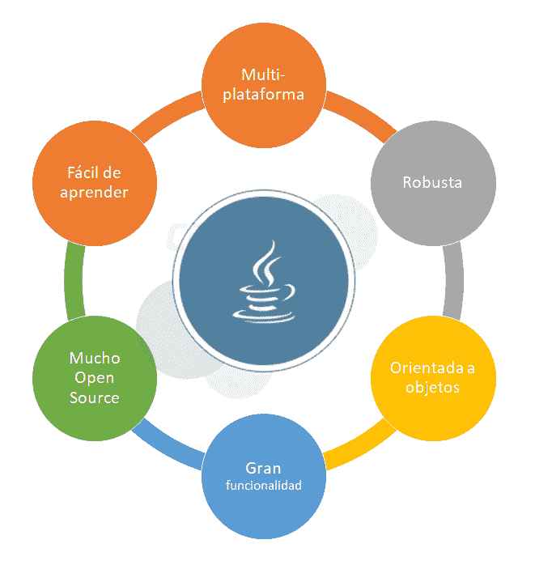

# 5 使用 Java 开发应用程序的原因

> [https://dev . to/campus MVP/5-原因-为什么-使用-Java-to-开发-tus-applications-2k 32](https://dev.to/campusmvp/5-motivos-por-los-que-utilizar-java-para-desarrollar-tus-aplicaciones-2k32)

> Post 原件:https://www . campus MVP . es/resources/post/5-reason-why-to-use-Java-to-develop-tus-applications . aspx

Java 是一种通用的[开发平台](https://www.campusmvp.es/recursos/post/Descifrando-Java-lenguaje-plataforma-ediciones-implementaciones.aspx)，其主要的价值主张一直是“写一次，到处执行”。如今，它几乎无处不在:您可以从小型连接的“物联网”(IoT)设备到服务器、桌面管理应用程序、移动开发、视频游戏等，找到 Java 应用程序-我...。

Java 的普及有各种技术和非技术原因，但**是与 Java 一起开发的主要技术价值主张吗？**

当然还有很多，当然，下面的并不是 Java 所独有的大部分，但是所有这些的结合，让我们了解一下我们的 Java 学生，这是企业通常看重的:

## 1。- Es 多平台格式

虽然 Java 目前的优势不如它诞生时那么大，而且还有许多其他平台提供了多平台，但事实上 Java 在几乎任何设备、服务器或操作系统上运行仍然是许多人的主要吸引力之一。

对于我们想到的几乎任何系统，都有一种“t0”Java 虚拟机“”的实现。

此外，我们不要忘记，Java 最初设计用于在具有许多内存和电源限制的嵌入式设备上运行，因此，取决于运行 Java 的位置，依赖语言可能会有很大帮助。

## 2 .-Java 代码很强

C++等其他语言提供了更高的性能和更好的控制，但如果不加控制，则更难处理。Java 是一种提供自动内存管理的语言，其对象不会引用自身或其他 Java 对象之外的数据。这使得 Java 语句无法损坏内存，也无法“踩”或损坏其他应用程序或操作系统本身的数据。虚拟机执行各种检查以确保完整性，从而防止它中断操作系统或其他程序。

也是[自动处理内存释放](https://www.campusmvp.es/recursos/post/Modelos-de-gestion-de-memoria-II-Garbage-collector.aspx)，因此可以高效地使用它，而无需程序员担心任何事情。

同样，这也不是 Java 独有的，因为其他平台(如. NET)具有相同的保护，但与更传统的平台相比具有优势。

## 3。-这是东方的一个目标

另一个目前没有引起特别注意的问题是，在 1990 年代中期 Java 问世时，这个问题并没有现在那么普遍。物件导向可让您更轻松地建立模组化应用程式，并重复使用部分模组化应用程式，同时提供更佳的经过测试的设计模式，协助您维持上一节所述的稳定性。

这也是平台本身具有如此大的可扩展性和如此多的本机或附加功能的原因之一。

这导致我们-我...。

## 4.-基本功能和大量开源

除了平台本身已经包含的大量基本功能之外，Java 还提供了许多现成的第三方代码。

在我们之间已有二十多年的时间，而且社区规模庞大的情况下，我们创建了大量的库和实用程序来扩展功能并改进 Java 平台。

几乎任何你可能需要的东西，我敢肯定，你会发现它已经在一些开源项目中创建。不仅如此:许多最著名和最常用的图书馆都是由 Google、Facebook 或 Apache 基金会等大型组织创建和维护的，这始终是额外的保证。

这大大简化了程序员的生活，而且没有许多其他平台能够提供同样丰富的可用代码。

## 5。- Java 是相对的

当然，与 c 或 C++等经典语言相比。一般来说，Java 并不比任何其他语言更难学习，特别是像 C#或 Swift 这样的其他现代语言，但它比许多其他语言更容易学习。

感谢[专用工具](https://www.campusmvp.es/recursos/post/Los-mejores-entornos-de-desarrollo-para-Java.aspx)(∞免费！)与 NetBeans 和其他编辑器或开发环境一样，编译、调试和部署非常简单，并且非常容易开始。

像任何这样复杂的通用平台一样，在学习它时，您面临着两个挑战:

1.  功能如此之多，以至于很难知道从哪里开始，以及您需要学习成千上万个课程中的哪一个。
2.  随着你学习和加深，事情变得越来越复杂，你需要更好地掌握基础才能前进。

这些优点都不是 Java 独有的，可以应用于其他平台，特别是. NET 和 C#语言。但是，将我们所说的话与长期投入市场、世界各地庞大的开发人员群体以及企业和机构的巨大需求相结合，形成了一个“良性循环”，使 Java 多年来一直是最重要的开发平台。

> Post 原件:https://www . campus MVP . es/resources/post/5-reason-why-to-use-Java-to-develop-tus-applications . aspx