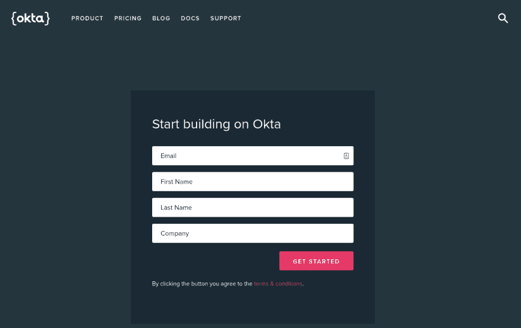
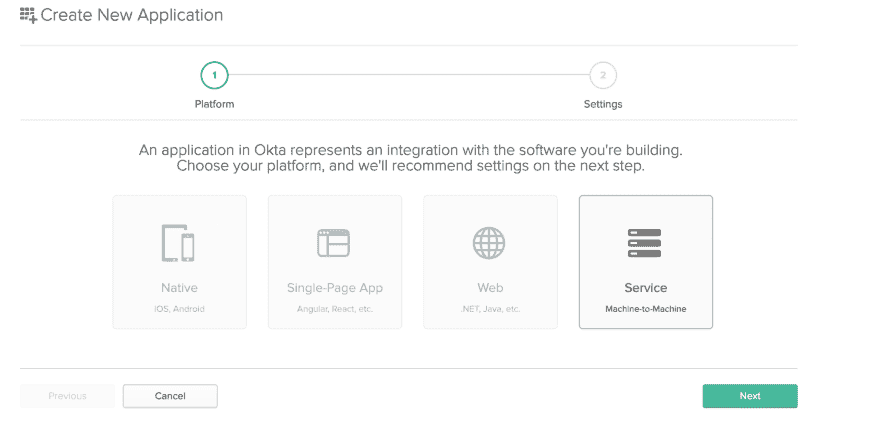
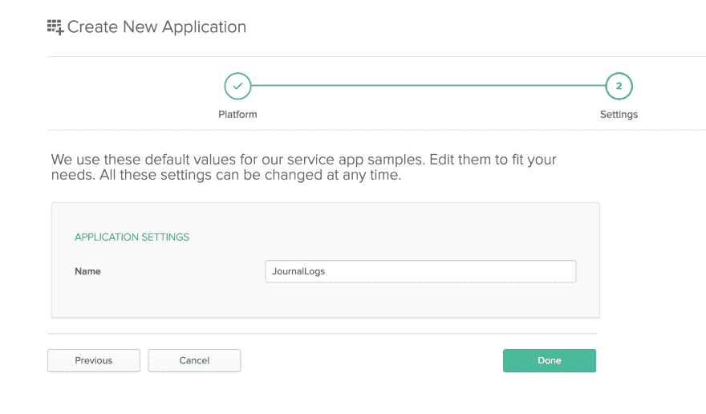
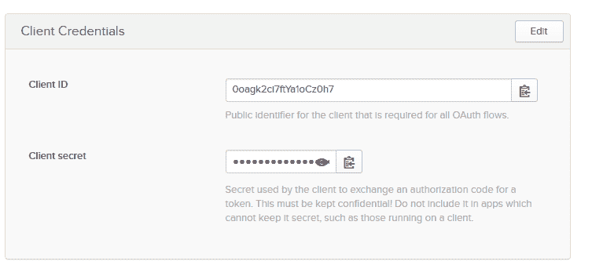

# 用 ASP.NET 核心 2.2 构建一个 REST API

> 原文：<https://dev.to/oktadev/build-a-rest-api-with-asp-net-core-2-2-5f9k>

ASP.NET 核心是完全开源的，免费的，有内置的 DI 和日志，与一个奇妙的 ORM 顺利工作，并在 Web API 框架内有大量的内置功能。还有，你得到微软对 C#和 ASP.NET 的免费、成熟和灵活的支持；很明显，ASP.NET 核心很容易成为构建 REST APIs 的最佳选择之一。

很多人都写日记，它本质上是一个详细的日志，你可以用它来比较你的计划和你的成就。在本教程中，我将向您展示如何构建一个 REST API 来跟踪简单的日志。

## ASP.NET 核心 REST API 的先决条件

如果你有最新的就最好了。NET Core SDK。可以从这里[安装。网芯 SDK](https://www.microsoft.com/net/download) 。

之后，你就准备好了。这个演示将使用 VS 代码，但是您可以随意使用您喜欢的编辑器或 IDE。

## 向您的 ASP.NET 核心 REST API 添加认证

对于大多数应用程序来说，身份验证是必需的，Okta 让它变得简单。 [Okta](https://developer.okta.com) 是一种云服务，允许开发者创建、编辑和安全存储用户账户和用户账户数据，并将它们与一个或多个应用程序连接。我们的 API 使您能够:

*   [认证](https://developer.okta.com/product/authentication/)和[授权](https://developer.okta.com/product/authorization/)您的用户
*   存储用户数据
*   执行基于密码的[社交登录](https://developer.okta.com/authentication-guide/social-login/)
*   通过[多重身份验证](https://developer.okta.com/use_cases/mfa/)保护您的应用
*   还有更多！查看我们的[产品文档](https://developer.okta.com/documentation/)

注册一个[永远免费的开发者账户](https://developer.okta.com/signup/)(或者[登录](https://login.okta.com/?SAMLRequest=fc%2B7CsJAEAXQXvAflu1NNJUMeZBGELTx1a%2FrYILJTtyZGD%2FfSBRiYzlw77lMnD3rSj3Qc0ku0YtgrhU6S5fSXRN9PKxmS52l00nMpq6iBvJWCrfDe4ss6vStRe9aDzmGIZfo1jsgwyWDMzUyiIV9vt1AH4XGk5ClSvewUgMNa%2BYW%2FVj5jxhm9NLP67QQaSAMu64L6CYmsFSHlnzT4ZlLwTgcL6Sf8%2FeX9AU%3Dhttps://login.okta.com/?SAMLRequest=fc%2B7CsJAEAXQXvAflu1NNJUMeZBGELTx1a%2FrYILJTtyZGD%2FfSBRiYzlw77lMnD3rSj3Qc0ku0YtgrhU6S5fSXRN9PKxmS52l00nMpq6iBvJWCrfDe4ss6vStRe9aDzmGIZfo1jsgwyWDMzUyiIV9vt1AH4XGk5ClSvewUgMNa%2BYW%2FVj5jxhm9NLP67QQaSAMu64L6CYmsFSHlnzT4ZlLwTgcL6Sf8%2FeX9AU%3D)，如果你已经有一个的话)。

[](https://res.cloudinary.com/practicaldev/image/fetch/s--_uDsBNeK--/c_limit%2Cf_auto%2Cfl_progressive%2Cq_auto%2Cw_880/https://developer.okta.com/assets-jekyll/blog/aspnetcore-restapi/okta-signup-accab135cb5e7cb06a3446679d6aef0958ea31b3b9444d87ffb2f70e5882d045.png)

在您完成登录(和注册)之后，您应该会看到仪表板，在右上角，应该会有您唯一的 Org URL。留着以后用。

[](https://res.cloudinary.com/practicaldev/image/fetch/s--KNe8-X-m--/c_limit%2Cf_auto%2Cfl_progressive%2Cq_auto%2Cw_880/https://developer.okta.com/assets-jekyll/blog/aspnetcore-restapi/okta-org-url-c4043a91b2e40b8bb69fa886de2afd1a831156a8d710b1ae2a9e30fa5bdc26b7.png)

现在，您需要通过浏览到 Applications 选项卡来创建一个新的应用程序。点击**添加应用**，从向导首页选择**服务**。

[](https://res.cloudinary.com/practicaldev/image/fetch/s--GtHywA9O--/c_limit%2Cf_auto%2Cfl_progressive%2Cq_auto%2Cw_880/https://developer.okta.com/assets-jekyll/blog/aspnetcore-restapi/okta-choose-platform-45ed0454eb407d738d00ea3f416e1c35996e25d806e6f0a0afc75b14fcec6e63.png)

在“设置”页面上，输入应用程序的名称:

[](https://res.cloudinary.com/practicaldev/image/fetch/s--8qgKJo_H--/c_limit%2Cf_auto%2Cfl_progressive%2Cq_auto%2Cw_880/https://developer.okta.com/assets-jekyll/blog/aspnetcore-restapi/okta-app-name-7ec7b37b8b61334da2cc03465c6c09313ec0b9f935a473f64eae3bc6b063eb04.png)

你现在可以点击**完成**。

既然您的应用程序已经创建，请将客户端 ID 和客户端密码值复制到下一页，您很快就会需要它们(当然，您的会有所不同)。

[](https://res.cloudinary.com/practicaldev/image/fetch/s--kD4MxiLk--/c_limit%2Cf_auto%2Cfl_progressive%2Cq_auto%2Cw_880/https://developer.okta.com/assets-jekyll/blog/aspnetcore-restapi/okta-client-credentials-fc61b85256ab539cc2ae02a699b7397e8147843458538dcce09d1270b24eb5b2.png)

## 创建您的 ASP.NET 核心 REST API 和客户端项目

您将创建一个 API，负责在 Okta 服务的帮助下验证令牌。我们的客户端将是一个简单的 ASP.NET 核心 MVC 应用程序，将访问 API。

在您的根项目文件夹中，创建两个文件夹:`api`和`client`。在你的`client`文件夹中运行以下命令:

```
dotnet new mvc 
```

在您的`api`文件夹中运行以下命令:

```
dotnet new webapi 
```

执行此命令后，您将拥有 ASP.NET 核心 Web API 应用程序的基本模板。这是一个创建新 REST APIs 的基本模板。我们需要对此进行扩展。

由于 ASP.NET 核心模板应用程序运行在 5001 端口(非 HTTPS 为 5000)，我们需要确保 API 使用不同的端口。在`Program.cs`文件中，用下面的代码更新`CreateWebHostBuilder`方法:

```
 public static IWebHostBuilder CreateWebHostBuilder(string[] args) =>
  WebHost.CreateDefaultBuilder(args)
    .UseUrls("https://localhost:9001")
    .UseStartup<Startup>(); 
```

### 为您的 ASP.NET 核心 REST API 和客户端添加模型和数据库

在您的主项目中，创建一个名为`JournalLog` :
的类

```
public class JournalLog
{
  public string Id { get; set; }
  public string Content { get; set; }
  public DateTime DateTime { get; set; }
} 
```

现在您需要建立与数据库的连接。对于本教程，您将使用带有实体框架核心的 InMemory 数据库。

在您的 ASP.NET 核心项目中创建一个新文件`ApplicationDbContext.cs`，它包含以下内容:

```
using Microsoft.EntityFrameworkCore;

namespace Api
{
  public class ApplicationDbContext : DbContext
  {
    public ApplicationDbContext(DbContextOptions<ApplicationDbContext> options) : base(options)
    { }

    public DbSet<JournalLog> JournalLogs { get; set; }
  }
} 
```

是时候向应用程序添加 DbContext 了。在`Startup`类内部，找到`ConfigureServices`方法，并在开头添加以下内容:

```
services.AddDbContext<ApplicationDbContext>(context =>
{
  context.UseInMemoryDatabase("JournalLogs");
}); 
```

上面这段代码告诉实体框架使用名为`JournalLogs`的内存数据库。这种类型的数据库通常用于测试，您不应该在生产中使用它。然而，这应该足够满足你的发展需求了。

因为您使用的是内存数据库，所以每次新启动应用程序时，数据都会丢失。我们可以在应用程序启动时简单地植入数据库。用以下内容更新`Program.cs`文件中的`Main`方法:

```
public static void Main(string[] args)
{
  var host = CreateWebHostBuilder(args).Build();
  using (var scope = host.Services.CreateScope())
  {
    var context = scope.ServiceProvider.GetRequiredService<ApplicationDbContext>();
    context.JournalLogs.AddRange(
      new JournalLog
      {
        Content = "First message",
        DateTime = DateTime.UtcNow,
      },
      new JournalLog
      {
        Content = "Second message day after",
        DateTime = DateTime.UtcNow.AddDays(1),
      }
    );

    context.SaveChanges();
  }
  host.Run();
} 
```

### 创建 ASP.NET 核心 REST API 端点

一旦有了计划用于端点的模型，就很容易生成使用 DbContext 和您的实体的基本 CRUD。首先，你需要`Microsoft.VisualStudio.Web.CodeGeneration.Design` NuGet 包。在你最喜欢的终端里输入以下内容:

```
dotnet add package Microsoft.VisualStudio.Web.CodeGeneration.Design --version 2.2.0 
```

现在我们可以基于模型和 DbContext:
搭建控制器

```
dotnet aspnet-codegenerator controller -api -async -m JournalLog -dc ApplicationDbContext -name JournalLogsController -outDir Controllers -udl 
```

上面的命令应该会生成一个新文件，其中包含一个类。该类的代码应该如下所示:

```
[Route("api/[controller]")]
[ApiController]
public class JournalLogsController : ControllerBase
{
  private readonly ApplicationDbContext _context;

  public JournalLogsController(ApplicationDbContext context)
  {
    _context = context;
  }

  // GET: api/JournalLogs
  [HttpGet]
  public async Task<ActionResult<IEnumerable<JournalLog>>> GetJournalLogs()
  {
    return await _context.JournalLogs.ToListAsync();
  }

  // GET: api/JournalLogs/5
  [HttpGet("{id}")]
  public async Task<ActionResult<JournalLog>> GetJournalLog(string id)
  {
    var journalLog = await _context.JournalLogs.FindAsync(id);

    if (journalLog == null)
    {
      return NotFound();
    }

    return journalLog;
  }

  // PUT: api/JournalLogs/5
  [HttpPut("{id}")]
  public async Task<IActionResult> PutJournalLog(string id, JournalLog journalLog)
  {
    if (id != journalLog.Id)
    {
        return BadRequest();
    }

    _context.Entry(journalLog).State = EntityState.Modified;

    try
    {
      await _context.SaveChangesAsync();
    }
    catch (DbUpdateConcurrencyException)
    {
      if (!JournalLogExists(id))
      {
        return NotFound();
      }
      else
      {
        throw;
      }
    }

    return NoContent();
  }

  // POST: api/JournalLogs
  [HttpPost]
  public async Task<ActionResult<JournalLog>> PostJournalLog(JournalLog journalLog)
  {
    _context.JournalLogs.Add(journalLog);
    await _context.SaveChangesAsync();

    return CreatedAtAction("GetJournalLog", new { id = journalLog.Id }, journalLog);
  }

  // DELETE: api/JournalLogs/5
  [HttpDelete("{id}")]
  public async Task<ActionResult<JournalLog>> DeleteJournalLog(string id)
  {
    var journalLog = await _context.JournalLogs.FindAsync(id);
    if (journalLog == null)
    {
      return NotFound();
    }

    _context.JournalLogs.Remove(journalLog);
    await _context.SaveChangesAsync();

    return journalLog;
  }

  private bool JournalLogExists(string id)
  {
    return _context.JournalLogs.Any(e => e.Id == id);
  }
} 
```

这就创建了一个注入了您的`DbContext`的构造函数。`DbContext`用于所有获取和操作数据的 CRUD 方法。这是一个标准的 ASP.NET 脚手架，它生成列出条目、通过 ID 获取单个条目、更新条目、删除条目以及创建新条目的方法。

### 验证 ASP.NET 核心 API 中的访问令牌

由于 ASP.NET 核心提供了足够多的 JWT 助手来帮助我们验证 JWT 令牌，完成这一步将非常容易。

在您的`Startup`类中添加下面的`using`语句:

```
using Microsoft.AspNetCore.Authentication.JwtBearer; 
```

之后，在`ConfigureServices`方法中添加以下内容:

```
services.AddAuthentication(options =>
{
  options.DefaultScheme = JwtBearerDefaults.AuthenticationScheme;
})
.AddJwtBearer(options =>
{
  options.Authority = "https://{yourOktaDomain}/oauth2/default";
  options.Audience = "api://default";
  options.RequireHttpsMetadata = false;
}); 
```

您还需要调用 ASP.NET 核心的认证中间件。这个中间件应该在我们调用 MVC 中间件之前调用。在`app.UseMvc();`线上方放置以下内容:

```
app.UseAuthentication(); 
```

## 设置您的 ASP.NET 核心 MVC 客户端应用

处理认证和授权总是一个麻烦和令人沮丧的过程。使用 Okta 使得整个过程非常简单。

首先，将 Okta 细节添加到您的`appsettings.json`文件中。在`Logging`部分，添加以下内容:

```
"Okta":  {  "ClientId":  "{yourClientId}",  "ClientSecret":  "{yourClientSecret}",  "TokenUrl":  "https://{yourOktaDomain}/oauth2/default/v1/token"  }, 
```

`TokenUrl`属性是默认授权服务器的 URL。您可以在 Okta 中找到它，方法是转到仪表板并将鼠标悬停在菜单栏中的 API 菜单项上，然后从下拉菜单中选择 Authorization Servers。“默认”服务器的发行者 URI 是用于`TokenUrl`属性的 URI。`ClientId`和`ClientSecret`属性来自 Okta 中 API 应用程序的通用设置页面。

您应该创建一个与配置文件中的`Okta`部分匹配的类`OktaConfig`。创建一个名为`OktaConfig.cs` :
的新文件

```
namespace Client
{
  public class OktaConfig
  {
    public string TokenUrl { get; set; }
    public string ClientId { get; set; }
    public string ClientSecret { get; set; }
  }
} 
```

是时候将这个类添加到 ASP.NET 核心的配置系统中了。在`Startup`类中的`ConfigureServices`方法顶部添加以下内容:

```
services.Configure<OktaConfig>(Configuration.GetSection("Okta")); 
```

您将需要一个位于应用程序内部的服务，处理与令牌相关的所有事情。它将在需要时获取新的访问令牌，并在可能时重用现有的令牌。由于 ASP.NET 核心附带了一个内置的 DI 容器，所以当我们想要向应用程序添加新服务时，我们通常会创建一个新的接口。

创建一个名为`TokenService.cs`的新文件，并将接口放在文件
中

```
public interface ITokenService
{
  Task<string> GetToken();
} 
```

该实现将决定是获取新的访问令牌还是返回它先前接收到的令牌。对于接口的实现，创建下面的类:

```
public class TokenService : ITokenService
{
  private OktaToken _token = new OktaToken();
  private readonly IOptions<OktaConfig> _oktaSettings;

  public TokenService(IOptions<OktaConfig> oktaSettings) => _oktaSettings = oktaSettings;

  public async Task<string> GetToken()
  {
    if (_token.IsValidAndNotExpiring)
    {
      return _token.AccessToken;
    }
    _token = await GetNewAccessToken();
    return _token.AccessToken;
  }
} 
```

如您所见，您还需要`OktaToken`类来存储来自 Okta 服务的令牌结果。因为这个类将只在您的`TokenService`内部使用，您可以将它作为一个嵌套类，或者创建一个单独的文件并使它成为内部类。下面是这个类的代码:

```
internal class OktaToken
{
  [JsonProperty(PropertyName = "access_token")]
  public string AccessToken { get; set; }

  [JsonProperty(PropertyName = "expires_in")]
  public int ExpiresIn { get; set; }

  public DateTime ExpiresAt { get; set; }

  public string Scope { get; set; }

  [JsonProperty(PropertyName = "token_type")]
  public string TokenType { get; set; }

  public bool IsValidAndNotExpiring
  {
    get
    {
        return !String.IsNullOrEmpty(this.AccessToken) && this.ExpiresAt > DateTime.UtcNow.AddSeconds(30);
    }
  }
} 
```

Okta 令牌服务的第一次传递从应用服务注入的`OktaConfig`开始。它还有一个类级别的变量，用于保存`OktaToken`对象(稍后您将创建该对象)。`GetToken()`方法只是检查令牌是否有效，是否过期(或即将过期),并获取新的访问令牌或返回当前令牌。

正如您已经看到的，我们需要一个代码来获取新的访问令牌。下面是`GetNewAccessToken()`方法的代码:

```
private async Task<OktaToken> GetNewAccessToken()
{
  var client = new HttpClient();
  var clientId = _oktaSettings.Value.ClientId;
  var clientSecret = _oktaSettings.Value.ClientSecret;
  var clientCreds = System.Text.Encoding.UTF8.GetBytes($"{clientId}:{clientSecret}");

  client.DefaultRequestHeaders.Authorization = new AuthenticationHeaderValue("Basic", Convert.ToBase64String(clientCreds));

  var postMessage = new Dictionary<string, string>
  {
    {"grant_type", "client_credentials"},
    {"scope", "access_token"}
  };

  var request = new HttpRequestMessage(HttpMethod.Post, _oktaSettings.Value.TokenUrl)
  {
    Content = new FormUrlEncodedContent(postMessage)
  };

  var response = await client.SendAsync(request);
  if (response.IsSuccessStatusCode)
  {
    var json = await response.Content.ReadAsStringAsync();
    var newToken = JsonConvert.DeserializeObject<OktaToken>(json);
    newToken.ExpiresAt = DateTime.UtcNow.AddSeconds(_token.ExpiresIn);
    return newToken;
  }

  throw new ApplicationException("Unable to retrieve access token from Okta");
} 
```

这种方法主要是设置`HttpClient`来调用授权服务器。有趣的部分是`clientCreds`值，它获取一个字符串的字节，该字符串包含客户端 ID 和密码，两者之间用冒号连接。当这个值被添加到前面有“Basic”的`Authorization`头中时，它被 base64 编码。注意单词“Basic”没有编码。

还有两个作为`FormUrlEncodedContent`发送的键-值对:`grant_type`，其值为“client_credentials”，以及`scope`，其值为“access_token”这只是告诉授权服务器，您正在发送客户端凭证，并且您希望获得一个访问令牌作为交换。`OktaTokenService`(带有使用指令)的全部内容应该是这样的:

```
using System;
using System.Collections.Generic;
using System.Net.Http;
using System.Net.Http.Headers;
using System.Threading.Tasks;
using Microsoft.Extensions.Options;
using Newtonsoft.Json;

namespace Client
{
  public interface ITokenService
  {
    Task<string> GetToken();
  }

  public class TokenService : ITokenService
  {
    private OktaToken _token = new OktaToken();
    private readonly IOptions<OktaConfig> _oktaSettings;

    public TokenService(IOptions<OktaConfig> oktaSettings) => _oktaSettings = oktaSettings;

    public async Task<string> GetToken()
    {
      if (_token.IsValidAndNotExpiring)
      {
        return _token.AccessToken;
      }

      _token = await GetNewAccessToken();

      return _token.AccessToken;
    }

    private async Task<OktaToken> GetNewAccessToken()
    {
      var client = new HttpClient();
      var clientId = _oktaSettings.Value.ClientId;
      var clientSecret = _oktaSettings.Value.ClientSecret;
      var clientCreds = System.Text.Encoding.UTF8.GetBytes($"{clientId}:{clientSecret}");

      client.DefaultRequestHeaders.Authorization = new AuthenticationHeaderValue("Basic", Convert.ToBase64String(clientCreds));

      var postMessage = new Dictionary<string, string>
      {
        {"grant_type", "client_credentials"},
        {"scope", "access_token"}
      };

      var request = new HttpRequestMessage(HttpMethod.Post, _oktaSettings.Value.TokenUrl)
      {
        Content = new FormUrlEncodedContent(postMessage)
      };

      var response = await client.SendAsync(request);
      if (response.IsSuccessStatusCode)
      {
        var json = await response.Content.ReadAsStringAsync();
        var newToken = JsonConvert.DeserializeObject<OktaToken>(json);
        newToken.ExpiresAt = DateTime.UtcNow.AddSeconds(_token.ExpiresIn);

        return newToken;
      }

      throw new ApplicationException("Unable to retrieve access token from Okta");
    }
  }
} 
```

### 将令牌服务类注入 ASP.NET 核心应用

像往常一样，当向 DI 系统添加依赖项时，在`Startup`类中找到`ConfigureServices()`方法，并在方法顶部添加以下内容:

```
services.AddSingleton<ITokenService, TokenService>(); 
```

您的`Startup.cs`文件应该是这样的:

```
using Microsoft.AspNetCore.Builder;
using Microsoft.AspNetCore.Hosting;
using Microsoft.AspNetCore.Mvc;
using Microsoft.EntityFrameworkCore;
using Microsoft.Extensions.Configuration;
using Microsoft.Extensions.DependencyInjection;

namespace Client {
  public class Startup
  {
    public Startup(IConfiguration configuration)
    {
      Configuration = configuration;
    }

    public IConfiguration Configuration { get; }

    // This method gets called by the runtime. Use this method to add services to the container.
    public void ConfigureServices(IServiceCollection services)
    {
      services.AddSingleton<ITokenService, TokenService>();

      services.Configure<OktaConfig>(Configuration.GetSection("Okta"));

      services.AddDbContext<ApplicationDbContext>(context =>
      {
        context.UseInMemoryDatabase("JournalLogs");
      });

      services.AddMvc().SetCompatibilityVersion(CompatibilityVersion.Version_2_2);
    }

    // This method gets called by the runtime. Use this method to configure the HTTP request pipeline.
    public void Configure(IApplicationBuilder app, IHostingEnvironment env)
    {
      if (env.IsDevelopment())
      {
        app.UseDeveloperExceptionPage();
      }
      else
      {
        // The default HSTS value is 30 days. You may want to change this for production scenarios, see https://aka.ms/aspnetcore-hsts.
        app.UseHsts();
      }

      app.UseHttpsRedirection();
      app.UseMvc();
    }
  }
} 
```

不要担心是否一切都不一样——方法在`ConfigureServices()`中的顺序并不重要。然而，在`Configure()`内部，顺序很重要，一般来说，这是最重要的事情。

### 从 ASP.NET 核心 MVC 客户端调用受保护的 REST API

找到`HomeController.cs`文件，并使用以下代码更新其内容:

```
using System;
using System.Collections.Generic;
using System.Diagnostics;
using System.Net.Http;
using System.Net.Http.Headers;
using System.Threading.Tasks;
using Microsoft.AspNetCore.Authentication.JwtBearer;
using Microsoft.AspNetCore.Mvc;
using Newtonsoft.Json;

namespace Client
{
  public class HomeController : Controller
  {
    private readonly ITokenService _tokenService;
    private readonly HttpClient _httpClient = new HttpClient();

    public HomeController(ITokenService tokenService)
    {
      _tokenService = tokenService;
    }

    public async Task<IActionResult> Index()
    {
      var logs = await GetJournalLogs();
      return View(logs);
    }

    public IActionResult Privacy()
    {
      return View();
    }

    private async Task<List<JournalLog>> GetJournalLogs()
    {
      var token = await _tokenService.GetToken();
      _httpClient.DefaultRequestHeaders.Authorization = new AuthenticationHeaderValue(JwtBearerDefaults.AuthenticationScheme, token);
      var res = await _httpClient.GetAsync("https://localhost:9001/api/values");
      if (res.IsSuccessStatusCode)
      {
        var content = await res.Content.ReadAsStringAsync();
        var journalLogs = JsonConvert.DeserializeObject<List<JournalLog>>(content);
        return journalLogs;
      }
      return null;
    }

    [ResponseCache(Duration = 0, Location = ResponseCacheLocation.None, NoStore = true)]
    public IActionResult Error() => View(new ErrorViewModel { RequestId = Activity.Current?.Id ?? HttpContext.TraceIdentifier });

    public class JournalLog
    {
      public string Id { get; set; }
      public string Content { get; set; }
      public DateTime DateTime { get; set; }
    }
  }
} 
```

## 测试您的 ASP.NET 核心 REST API

让我们来看看我们的应用程序。通过在 bash 的`api`文件夹中运行以下代码来运行 ASP.NET 核心 API:

```
dotnet run 
```

现在，您可以通过在 bash 的`client`文件夹中运行以下代码来启动 ASP.NET 核心 MVC 应用程序:

```
dotnet run 
```

您现在可以安全地创建日志条目了！

## 了解关于 ASP.NET 核心、安全 REST APIs 和认证的更多信息

如你所见，ASP.NET 核心使得创建 REST APIs 变得非常简单。凭借大量的内置特性，它可以帮助您编写应用程序所需的最少代码。您不关心如何处理 REST 动作，而是专注于编写面向业务的代码。

你可以在 [GitHub](https://github.com/oktadeveloper/okta-aspnetcore-22-rest-api-example) 中找到完整应用的源代码。

如果你想了解更多关于俄克拉荷马州大学或 ASP.NET 核心大学的信息，请访问俄克拉荷马州大学发展博客。

这里还有一些其他值得一试的内容:

*   [使用 ASP.NET 内核构建一个安全的 CRUD 应用程序并做出反应](https://developer.okta.com/blog/2018/07/02/build-a-secure-crud-app-with-aspnetcore-and-react)
*   [用 ASP.NET 内核和 Vue 构建一个简单的 CRUD 应用](https://developer.okta.com/blog/2018/08/27/build-crud-app-vuejs-netcore)
*   [ASP.NET 核心 2.0 中的令牌认证-完整指南](https://developer.okta.com/blog/2018/03/23/token-authentication-aspnetcore-complete-guide)

一如既往，我们希望听到您的意见。请在评论中或在 Twitter [@oktadev](https://twitter.com/oktadev) 上提出问题或反馈。