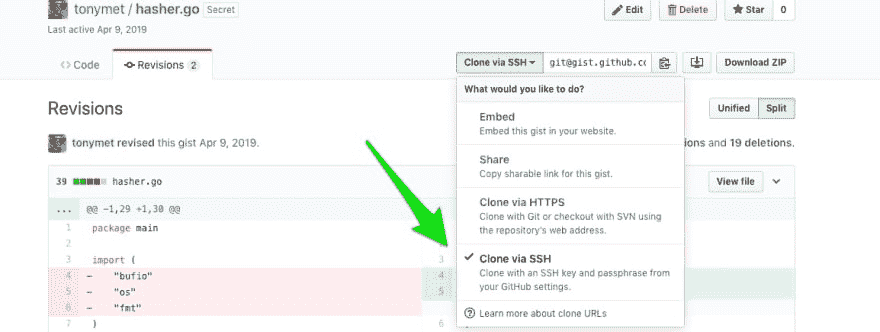

# 科学有原则:共享实验室

> 原文：<https://dev.to/tonymet/being-scientific-with-gists-the-sharable-laboratory-21di>

下一次你用代码片段写文章的时候——就像 dev.to 或 stackoverflow 上的文章——考虑分享一个可工作的和可构建的要点。通过这样做，其他人可以更容易地克隆、复制您的结果，并提交新的变体。

通过下面的过程，你的要点变成了一个可共享的实验室。由于 gist 包含所有的代码变体和测试用例，任何团队成员都可以创建一个变体，并针对所有现有的变体运行测试。

在下面的例子中，我们讨论了简短的 Perl 和 Golang 代码片段之间的性能差异，大概做了同样的事情。原始版本的 Perl 代码快了 90%。后来，我们通过实验过程加快了 go 代码的速度。

我将原始文件保存到 gist 中，这样我就可以轻松地进行修改并分享历史，而不必转换回 markdown。

(这里假设你使用 gists，但是如果你是 gists 新手，这里有一些基础知识:
[创建 Gists](https://help.github.com/en/articles/creating-gists) )

## 获取遥控器

一旦要旨被创造出来
[](https://res.cloudinary.com/practicaldev/image/fetch/s--gKlIw22x--/c_limit%2Cf_auto%2Cfl_progressive%2Cq_auto%2Cw_880/https://thepracticaldev.s3.amazonaws.com/i/eddu9e5rd9ks4r29grzu.jpg)

## 克隆

像克隆任何遥控器一样克隆

```
git clone git@gist.github.com:6dec6bd8acb816f946b823af1f780035.git 
```

## 标注测试变量

如果你想一丝不苟，为每个变体添加标签

在这种情况下，原始版本是`v-control`,我所做的更改在其他事情中增加了 IO 缓冲

```
git tag v-control 2172
git tag v-buffering aaa9320 
```

通过这种方式，任何人都可以检验任何变体——比如用`git checkout v-control`——并且你的实验正好是在他们的环境中进行的。

## 运行测试

现在测试在回购中，所以任何人都可以用一个简单的克隆来运行测试并运行`sh test-perl.sh`

## 结论

我喜欢这个例子，因为这是一个微不足道的工作流变化，它鼓励协作和可重复的结果——这两者对我管理的团队都是重要的价值。

你在使用常用工具时有没有创造性的和不明显的方式？请在评论中分享。