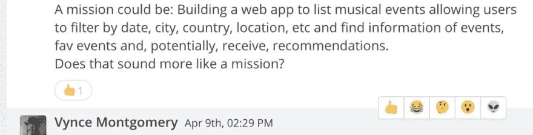
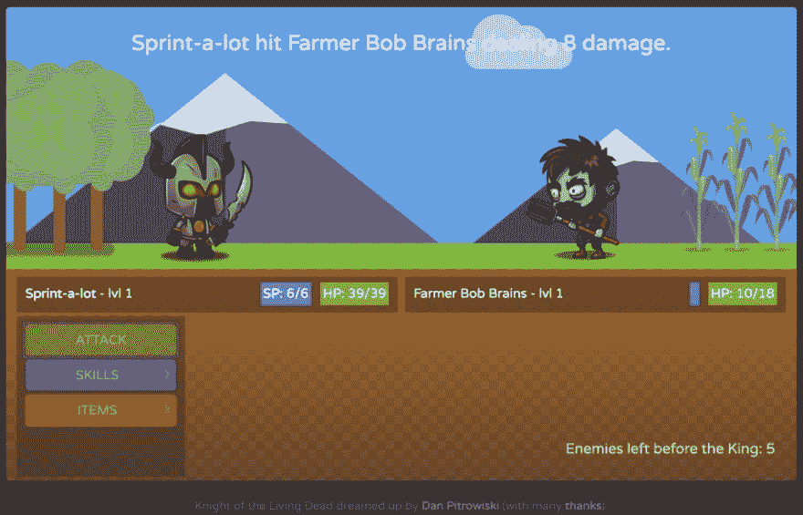
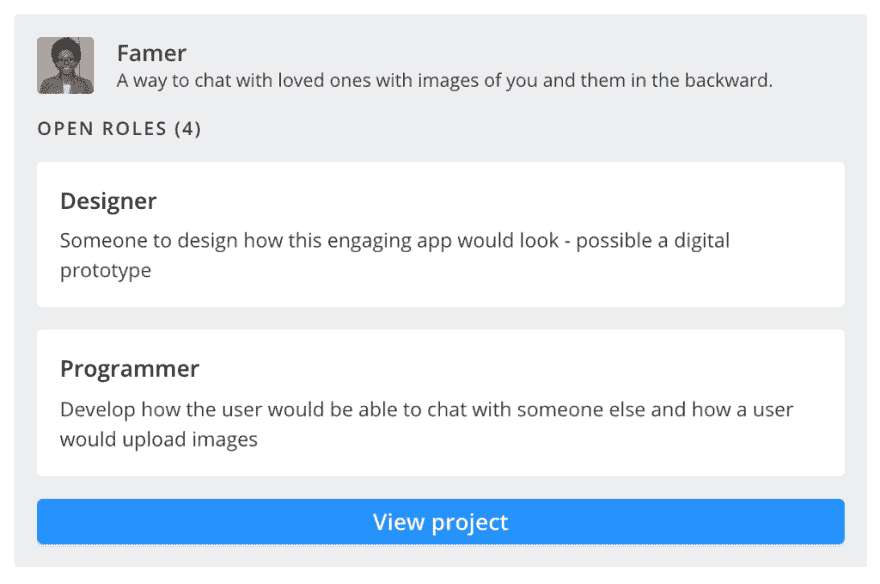

# 传统智慧和召集会议的价值

> 原文：<https://dev.to/vyncemontgomery/conventional-wisdom-and-the-value-of-convening-40bk>

上周六，我带着电池走进 App Academy 的教室，不知道自己会做什么。我知道那里会挤满陌生人，但我不确定有多少。我所知道的是，我打算在接下来的六个小时里，在就职[FindCollabs](https://findcollabs.com/)T2 黑客马拉松的聚会上，和我还没有见过面的人一起从事创造性的项目。在我知道我将要做什么之前，我就感到兴奋和充满活力。

组装；聚集；团结起来；走到一起。我们创造了许多词语来表达这一基本理念，这一理念如此强大，以至于词语本身充满了内涵和共鸣。原因当然是多种多样的。心理学家会讲人际交往的价值；拥有好朋友和强大社区的人如何活得更久、更健康、更快乐。他们将宣扬那些“面对面”的人际关系——这个词本身就充满了判断和含义——因此它可以包括短信和电子邮件永远无法捕捉的非语言交流，无论我们精心制作和散布多少表情符号。(但是，为了在不面对面交流时获得最佳体验，FindCollabs 项目聊天室确实支持反应表情符号。)

 

<figcaption>阅读房间是一项重要技能；表情符号反应让你在半个世界之外异步地做这件事。</figcaption>

这都是真的，但是协作除了给人们带来好处之外，对想法和项目本身也有价值。在一起，每个人都能取得更大的成就；人多力量大；等等。在过去的几周里,“思想的多样性”已经得到了很多关注，虽然在这个范围之外还有很多东西要说，但是很容易看到多种观点可以提供更好的理解。但实际上，合作的好处甚至在那之前就开始了。

经过介绍，我登录了丹·皮特罗维斯基的[活死人骑士](http://danpitrowiski.github.io/knight-of-the-living-dead/)浏览器游戏，希望对游戏设计有所帮助。最初是为一个班级项目创建的，他想扩展它；但首先，他做了一个演示。当你解释正在发生的事情时，在解决问题的过程中会发生一种魔力；只有当你试图解释一些你非常了解而认为理所当然的事情时，你才能找到某种明确性。你首先把它分解成可以交流的大块；然后，在新的眼睛真正看到它们之前，你就好像从新的眼睛里看到了这些作品。当丹向我们展示他所拥有的东西时，他发现了他已经忘记的缺陷；试图解释这个游戏是如何运行的，他能够看到它可以运行得更好的方法。而且，有一个固定的时间和其他人见面是当时做这件事的动力，而不是推迟。一天下来，他几乎没有改变，但正如他所说，他已经摆脱了蜘蛛网。

玛丽安娜·坎贝尔在介绍时没有提到一个项目。她提到了很多技能，一些成就，以及从事其他工作的热情。但后来，她开始解释，并对自己的一个想法感到非常兴奋。在与家人的远程聊天中，通过运行该应用程序，用户将看到相同的图片。这将使数码相册(否则会在云中收集数码灰尘)得到很好的利用:为对话提供记忆、情感联系和共享背景。作为一个全新的想法，她真的不知道如何与其他人合作。在进行了几次用户访谈以确定哪些方面引起了他人的共鸣后，她制作了一个带有任务列表的 Trello 板，并开始组织它们，就好像她会把它们交给别人一样。突出了依赖性和优先性；这为接下来的步骤提供了方向，即使是她自己去做。

作为一名游戏设计师，我经常经历这种情况。我有一个很棒的游戏创意。我真的很投入，和自己讨论曲线、节奏和边缘情况。然后我试着做一些人们可以玩的东西，却发现我没有可用的东西。但是当我试着用它的时候，cruft 消失了，细节变得清晰起来。然后我教游戏，就是火二试，下一次蜕变。到 2:30 左右，我让四个玩家围坐在一张桌子旁，手里拿着牌，评估他们的选择。我的[游戏](https://findcollabs.com/project/tafk8Hp97iWnX9JWQKQr)简单明了，而且——到 3 点钟的时候——令人愉快。我希望你有机会尝试一下。