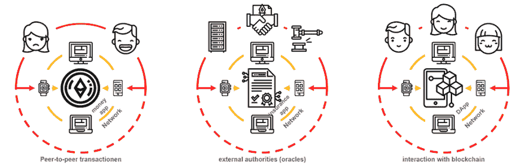
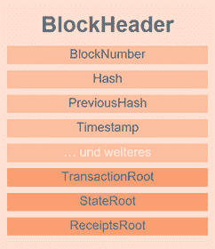
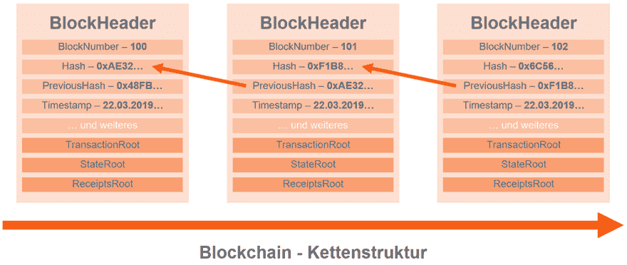

# Blockchain -重要术语

> [https://dev . to/x37 ts 52/block chain-重要术语-42lc](https://dev.to/x37ts52/blockchain-wichtige-begriffe-42lc)

索引

1.  前言
2.  区块链
3.  比特币与以太坊
4.  对等网络(P2P)
5.  智能合同
6.  数字孪生
7.  工作证明
8.  堆栈验证
9.  信任证明
10.  分散应用(DApp)
11.  街区
12.  创世街区
13.  Kettenstruktur
14.  钱包
15.  星际文件系统(IPFS)
16.  结节
17.  主代码
18.  私钥和公钥

# 1 序言

在这篇博客文章中，我想让你更深入地了解块链的主要术语，同时也马上向你解释一下这些术语背后的含义。你不需要一下子理解所有的事情，因为术语会更频繁地出现，只有那些术语以前听说过。这样我们就有了语言基础，你知道演讲内容。

# 2 -区块链

一般:
区块链是分散的对等网路。加密可生成安全、透明和可选的伪匿名系统。这将最大限度地减少不确定性。用户对系统的信任已经过时，因为每个用户都在监视系统中的其他用户。

技术:
分块链是基于链结构的分布式数据库。一个称为 genesisblock 的块构成了起点，其他块依次附加到后面。Clou 就是每个块只知道自己和它在链结构中的前块。除了基因区块。块链是每个参与用户的映像。这可以解决用户之间的不信任/不信任问题。

# 3 -比特币与以太坊

这两种协议都是在 P2P 网络上运行的协议，并使用块链技术成为加密货币平台。比特币和 Ethereum 可以进行数字货币交易。Ethereum 还可以管理数字 Twins 和 Smart Contracts。

# 4 -对等网络(P2P)

在一个分散的组织结构 P2P 网络中，所有相关用户平等地协作。用户可以直接连接在一起，无需使用中央服务器即可自主操作。参与者可以是 P2P 网络中的功能、资源、服务和文件的提供者和/或消费者。

# 5 -智能合约

智能合同是一种特定的数字合同。和现实世界一样，SM 谈判的规则被写入。不同之处在于，根据 SM 中指定的事件，它们会自动运行。在块链中，SM 等于用户的状态。这样块链中的其他用户就可以监视它们的合规性，而不是操纵它们。

# 6 位数字双位

数字双子座是存在于现实世界中的物体的数字图像。理想情况下，数据块链中应只存在一个 DT，以保持其唯一性。与智能合同一样，DT 将等同于用户的状态。这样块链中的其他用户就可以监视它们不受操纵。

# 7 -工作证明(PoW)

矿工在一场比赛中，试图用特殊的交易验证硬件来解决一个数学难题。成功解决后，系统将验证事务并生成新角点。作为对他工作的奖励，矿工会得到角点奖励。

# 8 -堆栈验证(PoS)

验证器取代了 Miner，并具有与此类似的所有权利和义务。验证器将拐角的一部分作为 Stake(镶件)放置在侧面。Stake 是为了防止欺诈行为。惩罚会导致他的堆栈的一部分丢失。堆栈越高，被视为验证者的机会就越大。

# 8 -可信证明(PoT)

与 PoW(适用于计算能力较高的矿工)和 PoS(适用于计算能力较高的验证者)不同的是，PoT 应平均分配验证机会。每个参与用户都应获得平等的机会来验证块条目，而无需事先通知或预先共享。

# 9 -分散应用(DApp)

与块链交互的桌面或 Web 应用程序。

有三种类型:

*   应用程序 die Geld verwalten:
*   涉及金钱的应用程序:
*   应用程序包括选择、控制或权限元素:

# 10 块

块由块标题中包含的几个信息组件组成。所有这些信息将汇总为整个块的散列值。因此，链中的每个块都是唯一的。

*   TransactionRoot
    就像一种按照特征树原理工作的装载机。这是 Smart Contracts 和事务处理的存储位置。

*   state root & receipts srot
    按 Patricia 排序起作用。

# 11 - GenesisBlock

genesisblock 就像普通的块一样。只不过 genesisblock 知道自己是块链中的第一个块。

# 12 链结构

块具有引用以前块散列值的预测散列值。此过程将对每个新附着的块执行。这样就形成了链结构。

# 13 -钱包

公事包是一种银行帐户系统，您可以在其中管理自己的加密金钥。它还存档接收和发送的事务。您也可以在公事包中管理多个帐户。

您可以区分以下墙类型:

*   desktop wallet〔t0〕在本地计算机上使用的软件。

*   mobile wallet
    是在其智能手机上使用的应用程序。

*   线上公事包
    伺服器外部运作及管理的公事包。

*   浏览器 Wallet
    在浏览器(Chrome，Firefox)中作为插件运行的 wallet

# 14 -星际文件系统(IPFS)

IPF 是一个分布式 P2P 文件系统。它提供了内容寻址块存储模型，并结合了分布式哈希表、激发式块交换和自我认证的命名空间。您可以将 IPF 看作 P2P 网络上的独立服务器，后者自己管理自己及其存储的数据。

# 15 节点

节点可以是块链中的计算机/笔记本电脑(用户)、智能手机/平板电脑(用户)、IPF、服务器或 MasterNode。要充当节点，参与设备必须运行块链协议。以使所有节点能够相互通信。

# 16 -主节点

某些块链(通常使用 stack proof 或 trust proof 方法)具有主节点。主节点可视为功能更强大的服务器。在 trust proof 方法中，主节点还可以完全执行块验证任务，而不是由矿工或验证者执行。大多数情况下，它们还托管 IPF，并且可以是 DAO 的成员。主节点还旨在为数据块链带来更好的可扩展性和安全性。

# 17 -私钥与公钥

私钥:
私钥仅用于自己，访问密钥用于自己的密码。这家伙绝不能出卖陌生人！私钥可以看作是自己 Wallet 的密钥。如果没有这些访问密钥，您将无法执行事务或签署 Smart Contracts 和 Digital Twins。

公钥:
公钥是与其他跨国用户共享的地址密钥。你可以把它想象成一个 IBAN。其他用户可以向这些 IBAN 发送事务。也可以将公钥视为访问加密 Smart Contracts 或 Digital Twins 的权限密钥。以前由另一个用户使用其私钥进行加密。私钥生成公钥。