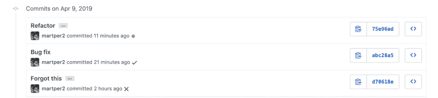
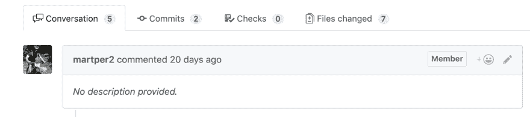
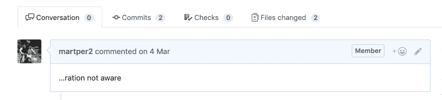
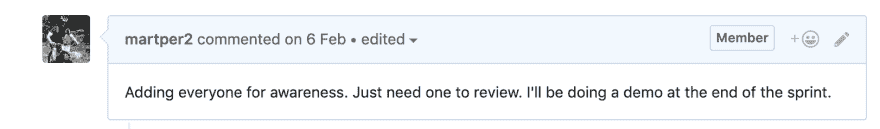
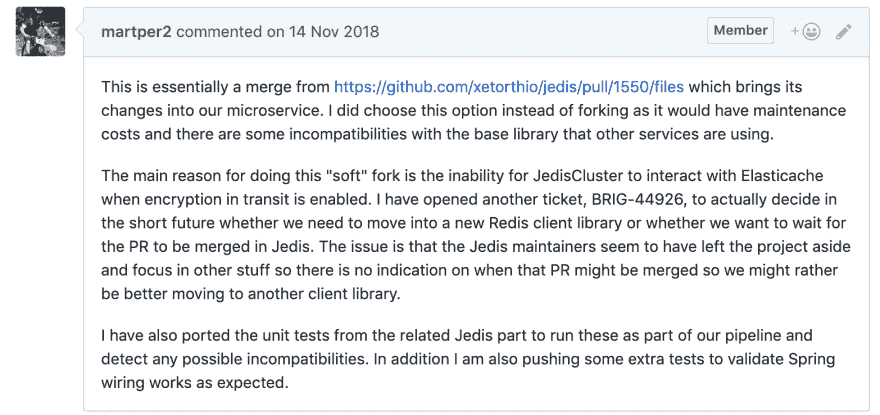
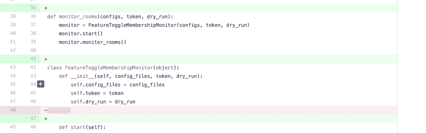
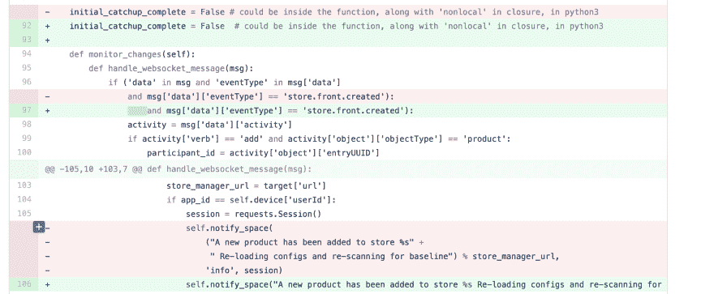
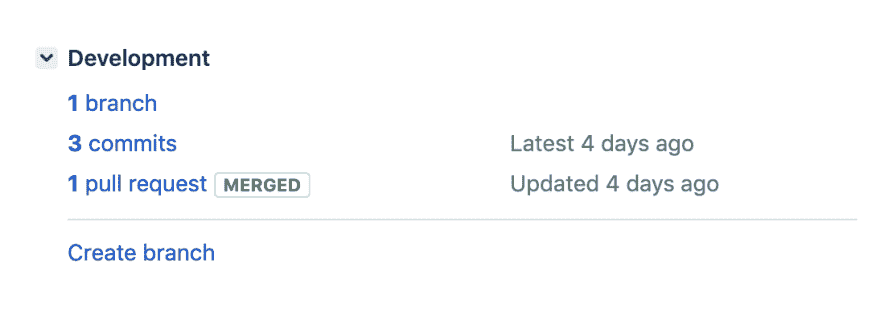

# 如何创建有效的拉式请求

> 原文：<https://dev.to/mpermar/how-to-create-effective-pull-requests-2m8e>

[Pull Requests](https://help.github.com/en/articles/about-pull-requests) ，从现在开始在本文内简称为 PRs。这是一个不太性感但必要的步骤，位于你的精彩闪亮的新承诺和你的主分支之间。pr 是不性感的，因为我们实际上知道我们的代码是整洁的，我们不希望那些邪恶的代码审查者提出所有那些关于我们心爱的代码库的无用和肮脏的评论，或者我们有吗？

当然，我们有。一般来说，代码评审并不邪恶:)代码评审是在团队中传播知识的一种方式，也有助于让更多的人关注你的代码。有些人可能会认为结对是代码审查的替代方法。这是对的，只要你能让团队中只有一个人知道你的代码。然而，你可能与某人配对几个小时，然后那个人仍然可以提出与你最初工作完全不同的东西。因此，代码审查是一个机会，可以确保每个人都在同一页上，还可以获得对您工作的高质量反馈。

拉取请求的质量经常被忽视。一个写得不好的拉请求不仅会导致代码评审时的摩擦(争论、争斗、时间浪费和最终烧毁)，而且还会降低生产率并增加在生产中引入问题的机会。干净整洁的拉请求有助于更快的管道，更快的代码审查周期，并提高我们产品的整体质量。

因此，这里有一些关于如何写有效的拉请求的提示(注意，这里的例子完全是虚构的)。

# 确保你的公关有测试支持

这对我来说是个大问题。可能是最重要的。如果你必须选择一个建议，那就选这个。

我们所有人都是大忙人。对吗？我们有大量的事情要做。那么，你有没有收到过一个正在改变代码(也就是说，不是一个微不足道的打字错误修正类型的事情)并且没有测试的拉请求？我有。很多次了。这些天来，我对这些问题的反应几乎是一样的:“请你提供一些测试，证明你所做的改变确实得到了验证”。

为什么我这么苛刻？嗯，真的是因为，没有测试，我实际上被迫做了很大的努力，不仅试图理解逻辑，而且找出任何实际上可能破坏代码的小事情和依赖性。这可能会发生，尤其是如果你是某个领域的专家。在这种情况下，有相当大的机会，你总是会得到这种类型的 PRs，提交者实际上只是想让你在费心为它编写任何测试之前验证整体方法和源代码。不用说这是不好的。相当糟糕。不要误解我的意思，寻求帮助没有什么不好，但是有更好的方法，比如请求结对编程或者结对进行非正式的代码评审。这样，评审者的时间会比完全不同步的 PR 更有效地被利用。

通过与您的 PR 一起编写测试，您向评审者提供了实际的证据，证明您已经亲自测试了代码。你写的测试应该超越通常的*快乐路径*场景。再一次，通过提供负面测试，你证明了你的功课已经完成，并且你已经考虑了当事情出错时会发生什么。测试也将帮助你的逻辑，他们将表面上隐藏的问题，可能会被忽视。

最重要的是，测试将不仅提供证据，而且为你的评论者提供关于你试图证明什么以及为什么你认为你确实在证明它的很好的文档。这两件事，即*为什么*和*如何*提供了基本信息来决定 PR 是否有效，或者它是否可能是不完整的，或者只是遗漏了某些部分，或者完全遗漏了要点。

# 写一个有意义的公关标题

这听起来有点琐碎，但实际上很常见，而且经常被忽视。尤其是当你在一个人的项目中工作时，你很匆忙，没有把太多的注意力放在细节上。但是，如果你考虑未来，人们很可能会在以后加入，如果你不太关注头衔，那么你最终会得到这样的东西:

你能说出我在那里做什么吗？嗯，你可以看出我在重构一些代码，修复一些错误，但是你完全不知道有什么变化。这是一个虚构的例子。但是，作为一种惯例，类似这样的事情意味着必须点击每一个 PR 来弄清楚发生了什么。假设你是这个项目的新手。累死人。

一个标题需要简短，但同时，它需要传达变革的总体目的。如果你不能用一个标题来总结你的 PR，那么很可能你的改变做了太多的事情，在这一点上，你应该重新考虑你是否应该把你的工作分成多个 PR。

# 写出有意义的描述

PR 的描述要有意义。请记住，在 PR 标题之后，评论者看到的下一个内容是描述。一份好的公关描述应该告诉我们:

。你想做的事。
。你是怎么做的。
。为什么你决定那样做。
。你如何支持这个公关。

例如，比较这些:

下面这个:

因此，尽管在第一个例子中没有描述，或一些 PR 标题的裁剪描述，或指向未来发生的一些演示的完全无用的描述，但在这里，工程师给出了一些关于该问题的良好背景，解释了为什么需要该 PR 以及为什么要这样做。最后，它还提供了一些关于为什么 PR 是安全的和尝试的测试的信息。可能并不完美，但肯定比其他例子更有用，更有解释力。

# 尽可能避免大而小的 PRs

谁不害怕神话中的 100+档案 PR？我做过一些，并不引以为豪。庞大的 PRs 通常是长期分支、大规模重构、大量新功能的结果，或者仅仅是来自极富创造力的贡献者，他们有能力非常快速地创建复杂的代码和测试。然而，这些都不是证明巨额减记合理的真正理由。即使我们足够幸运，拥有技术高超的工程师，可以像孩子吞下糖果盒一样快速地编写代码，但这并不意味着我们的评审员也有同样的思维能力来处理经过数百次修改的 PRs。

另一方面，如果每一个代码变更都是一个单独的 PR，那么这会给代码和 PR 审查过程带来很大的负担，并且可能会因为不断的中断而影响开发。与大型 PR 不同，有些时候除了拥有一个小型 PR 之外没有其他选择，因为我们可能只需要更改一个文件，而且只需要很少一部分。那完全没问题。我们不应该做的是，例如，为一些功能创建五个不同的 PR，每个 PR 有一个文件，这些功能具有足够的内聚性和逻辑相关性，因此可能属于同一个 PR。

我不会设定一个理想的公关规模，因为我不认为有一个，但我相信一旦我们超过 20 个文件，它就开始变得复杂，一个评论家实际上有一个心理地图，所有的变化和这些变化带来的后果。进行测试可以缓解这个问题，但是在发送一个开始让人感觉很大的 PR 之前，我们应该问问自己，我们是否愿意审查这么多文件。如果我们觉得这对我们自己来说太多了，那么我们应该考虑到我们的审查者，将 PR 分成更小的相关部分。

# 将单一责任原则应用于您的 PRs

单一责任原则在某种意义上也适用于 PRs。就像你希望一个模块、类或函数拥有并封装一个单一的职责一样，你希望你的 PR 封装并拥有一组逻辑上相互关联和封装的变更。换句话说，你不希望有一个包含多个不相关的逻辑变化的 PR。

在同一个 PR 中合并不相关的变更的一个典型问题是，如果代码审查花费的时间比预期的长，那么 PR 中包含的所有功能都将被阻塞。因此，想象一个紧急的 bug 修复和一个不相关的 PR 一起提交，其中有几个部分需要评审。重要的 bug 修复将在 PR 修复时被阻止。然而，如果您提交两个独立的 PR，那么快速简单的 bug 修复可以进行到主分支，而更长更有冲突的 PR 得到审查。

通常，当您总是在主分支上工作时，这个问题可能会发生，很多时候是不由自主的。如果您要交付连续的变更，这是非常好的。但是一旦你预见到多个并行的变化，那么你应该考虑切换到你的分支上的临时本地分支，这将允许你提交多个独立的 PRs。

# 避免无效变化

诸如添加或删除新行、空格、制表符等更改。添加根本不会改变文件，只是给你的 PR 添加噪音，让它看起来比实际更长。你应该避免这样的改变，因为这样的改变会让你的公关看起来更乱更粗心。你不是粗心的，是吗？老实说，当我得到一个看到这些模式的评论时，我的内在自我会立即对整个公关产生警惕。我不知道为什么。这可能是一种心理模式，就像那些解释盘子里看起来整洁的食物味道更好的模式一样。同样，清洁度差的钻杆排放系统整体看起来更差，并发出警报。

# 避免格式更改

类似于上面的观点，至少在心理方面，你应该避免在你的 PRs 中做代码格式的改变。如果你需要在格式上做些改变，那就专门为此开一份简历，并和你的同事讨论一下。格式上的改变，比如用空格替换制表符，或者用制表符替换空格，或者改变括号的位置，或者将一行分成两行，或者将两行分成一行，都会将审阅者的注意力转移到与 PR 本身无关的主题上。

猜猜上面发生了什么变化？是的，你猜对了。没有，或者几乎没有，或者肯定没有相关的。

请记住，审查员可能已经做了很好的精神努力，以跟进你的公关，并试图理解你在试图做什么。你越不想通过引入不相关的风格变化来增加混乱。

# 确保你的代码被注释了。尤其是难的部分。

对于软件工程师来说，沟通是关键。我不能经常说这句话。虽然我完全同意干净和自我记录的代码原则，但很多时候命名和结构是不够的，工程师需要提供几行代码来解释代码试图做什么或为什么这样做。

再一次，你需要把自己放在评审者的皮肤里，想:“如果有人给我同样的代码来评审，我会泪流满面吗？”“如果我完全不知道正在做什么，我能理解吗？”。我们可能不需要走极端，比如“*一个蹒跚学步的孩子应该理解它*”，但是希望你明白这个想法。

我们越容易、越有效地传达我们正在做的事情，PR 就能越快得到审查，错误也能越快被发现。因此，实际上花一些时间尝试以一种有效的方式进行交流，无论如何都会有巨大的回报。不用说，在这一步之后，代码以文档形式结束，这对新员工来说是一个巨大的奖励。每个人都喜欢优雅且文档化良好的代码。

# 提供上下文提前提供自己的 PR 评审意见

大多数源代码管理系统，比如 Github，允许你回顾你自己的 PRs。你可以利用这一点提前提供反馈。也就是说，超出 PR 描述的信息可能与任务本身相关，或者可能特定于某些文件，或者可能只是一般的上下文、外部注释、历史记录等。

例如，像“*这是我们前几天在 Sprint*开始时讨论的异步任务执行器方法”或“*Joe 建议的度量聚合器线程在这个文件*上实现”这样的注释不应该出现在代码本身中，并且可能过于上下文相关而不能出现在描述中。然而，将这些作为注释添加可以为评审提供重要和有用的上下文，我们可以将它们作为我们自己的代码评审附加到 PR 本身的顶部或单独的文件中。

# 利用外部工具集成

一些工具理解并可以将拉取请求与现有的跟踪系统联系起来。例如，在 JIRA，如果您在公关标题中包含机票 id，那么 JIRA 将自动在机票中包含所有公关信息。这对于跟踪不同的任务并将它们映射到实际的工程工作中是非常方便的。

大多数项目管理工具都与 Git 有某种程度的集成，所以继续使用它吧！

*额外收获:*如果您将您的源代码管理工具(例如 Github)与您的协作工具(例如 Slack、Webex 团队、Microsoft 团队...)，并且您的 PRs 是整洁的，那么您将获得一个美妙的团队空间，其中包含所有的代码更改，供您的团队审阅，或者只是了解，或者只是在几个月后重新访问，以检查过去的一些事情。全部免费，只要你的公关待遇好。

# 将拉取请求视为有价值的文档

当以负责任的方式创建时，PR 可以是非常重要的文档来源。它对你试图做的事情进行了有意义的描述。它确实包含了一组旨在实现您的任务的变更，并且包含了一组验证需求确实得到满足的测试。

如果操作正确，现有的工程师或新员工可以很容易地浏览关闭的 pr 列表，以获得最显著的变化的历史分段视图，这些变化是由团队或个人在过去几个月或几年中逐渐引入到项目中的。

然而，为了有价值，拉请求真的需要像我们的代码应该的那样好和整洁。

希望上面的提示能帮到你。感谢阅读。