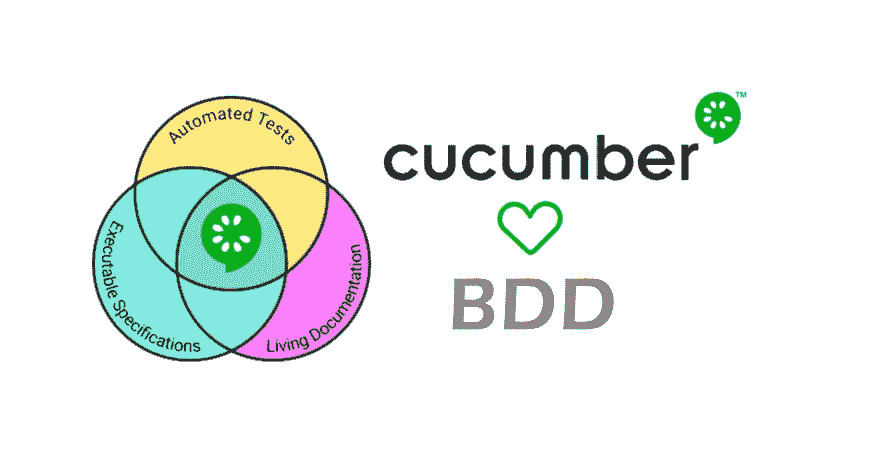
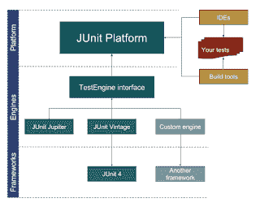
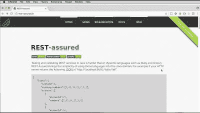
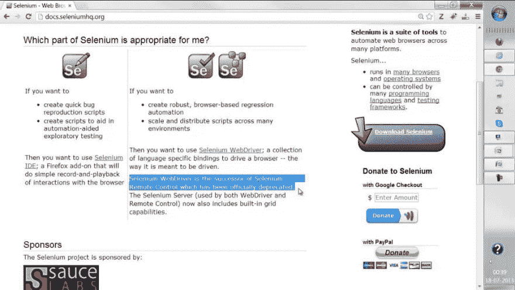
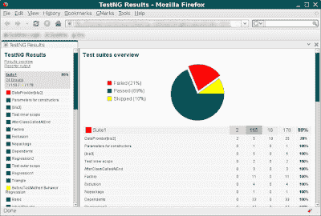
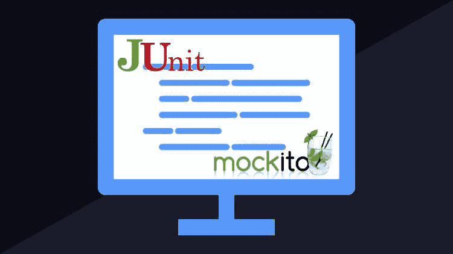
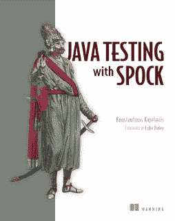
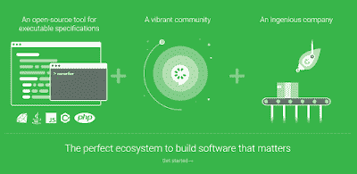
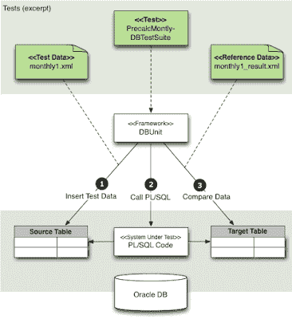
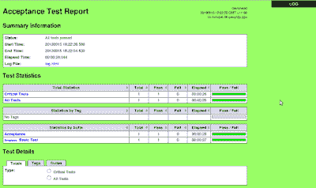

# Java 程序员的 10 个基本测试框架和库

> 原文：<https://dev.to/javinpaul/top-10-java-test-framework-for-automation-in-2019-1mgb>

*披露:这篇文章包括附属链接；如果您从本文提供的不同链接购买产品或服务，我可能会收到报酬。*

 
大家好，如果你一直在做编程那么你就知道持续学习是非常重要的。你需要让自己与时俱进，并不断努力提高。为了重申这一点，最近，我写了一些关于 Java 开发人员今年应该学习什么的文章，像[编程语言](http://www.java67.com/2017/12/10-programming-languages-to-learn-in.html)、[库](http://javarevisited.blogspot.sg/2018/01/top-20-libraries-and-apis-for-java-programmers.html)和[框架](http://javarevisited.blogspot.sg/2018/01/10-frameworks-java-and-web-developers-should-learn.html)，但是如果你只想改进或学习一样东西，那么那一定是你的*自动化测试技能*。

测试是区分专业开发人员和业余开发人员的学科之一。这不是关于遵循 TDD、BDD 或任何测试方法，但在最起码的水平上，您必须编写代码来自动测试您的代码。

许多 Java 开发人员编写在构建期间自动运行的[单元测试](http://javarevisited.blogspot.sg/2015/02/simple-junit-example-unit-tests-for-linked-list-java.html#axzz569M501zG)和[集成测试](https://javarevisited.blogspot.com/2018/01/10-unit-testing-and-integration-tools-for-java-programmers.html)，主要是通过使用持续集成工具，如[詹金斯](http://www.java67.com/2018/02/6-free-maven-and-jenkins-online-courses-for-java-developers.html)或 TeamCity。

如果你们中的一些人想知道为什么程序员应该专注于自动化测试，那么让我告诉你，由于更多的意识和 [DevOps](https://javarevisited.blogspot.com/2018/09/the-2018-devops-roadmap-your-guide-to-become-DevOps-Engineer.html) 的出现，自动化测试的重要性正在呈指数增长。

公司一般更喜欢擅长编写单元测试，并对各种单元测试框架、库和工具有很好了解的程序员，如 [JUnit](http://www.java67.com/2018/02/5-free-eclipse-and-junit-online-courses-java-developers.html) 、 [Selenium](http://javarevisited.blogspot.sg/2018/02/top-5-selenium-webdriver-with-java-courses-for-testers.html) 、放心、 [Spock framework](http://javarevisited.blogspot.sg/2018/01/10-frameworks-java-and-web-developers-should-learn.html) 等。

作为一名 Java 开发人员，我们在非常不同的领域工作，从编写核心 Java 代码到创建 JSP 页面，编写[REST API](http://javarevisited.blogspot.sg/2018/01/7-reasons-for-using-spring-to-develop-RESTful-web-service.html#axzz55a8rTeu7)，有时甚至为构建自动化创建 Groovy 脚本。这就是为什么我们还需要知道我们可以用来自动化测试的不同工具。

例如，我只知道 JUnit 很长一段时间，但是当我必须测试我的 JSP 页面时，我一无所知，直到我发现了 Selenium。放心也是一样，因为我通常使用 [curl 命令](http://www.java67.com/2017/10/how-to-test-restful-web-services-using.html)来测试我的 REST API，但是放心将 REST API 的单元测试提升到了另一个层次。

## Java 开发人员必备的 10 个测试工具

因为我相信程序员和他们的工具一样优秀，所以我总是在空闲时间尝试学习和探索新的工具和库，这个列表是研究的一部分。

在这篇文章中，我将分享 10 个最好的和最基本的[工具](http://javarevisited.blogspot.sg/2017/03/10-tools-used-by-java-programming-Developers.html#axzz55lrMRnNC)、[框架](http://www.java67.com/2018/02/top-10-open-source-frameworks-and-libraries-java-web-developers.html)和[库](https://dzone.com/articles/20-useful-open-source-libraries-for-java-programme)，它们可以帮助 Java 开发人员在他们的各种 Java 项目上编写单元测试和集成测试。

### 1。*朱尼特*

我不认为 JUnit 需要任何介绍。即使你是一个初学 Java 的程序员，你也可能听说过它。它允许你为你的 Java 代码编写单元测试。

几乎所有主要的 ide，如 [Eclipse](http://www.java67.com/2018/01/how-to-remote-debug-java-application-in-Eclipse.html) 、 [NetBeans](http://javarevisited.blogspot.sg/2013/03/how-to-write-unit-test-in-java-eclipse-netbeans-example-run.html#axzz569M5kyoZ) 和 [IntelliJIDEA](https://javarevisited.blogspot.com/2018/09/top-5-courses-to-learn-intellij-idea-java-and-android-development.html) ，都提供了 JUnit 集成，这意味着你可以直接从这些 ide 中编写和运行单元测试。

我们大多数人仍在使用 JUnit 4，但 JUnit 5 已经发布，可能是今年的下一个目标。您可以使用 JUnit 进行单元测试和集成测试，它还支持 Java 8 特性。

顺便说一句，如果你是单元测试领域的新手，尤其是 Java 单元测试，那么这个 [**JUnit 和 Mockito 速成班**](https://click.linksynergy.com/fs-bin/click?id=JVFxdTr9V80&subid=0&offerid=323058.1&type=10&tmpid=14538&RD_PARM1=https%3A%2F%2Fwww.udemy.com%2Fjunitandmockitocrashcourse%2F) 是一个很好的起点。

### 2。*放心*

用 Java 测试和验证 REST 服务比用动态语言如 [Groovy](https://javarevisited.blogspot.com/2017/08/top-5-books-to-learn-groovy-for-java.html) 更难。

放心将使用这些语言的简单性带入 Java 领域。对于 REST API 集成测试来说，这是一个很好的工具。

如果想了解更多，还可以查看 [**REST API 测试自动化:via 放心& HTTP 客户端**T3】课程。](https://click.linksynergy.com/fs-bin/click?id=JVFxdTr9V80&subid=0&offerid=562016.1&type=10&tmpid=14538&RD_PARM1=https%3A%2F%2Fwww.udemy.com%2Fapi-testing-rest-api-automation-testing-from-scratch%2F)

### 3。*硒*

Selenium 可能是最流行的 Java UI 测试工具，它允许您测试您的 [JSP 页面](http://www.java67.com/2018/02/5-free-servlet-jsp-and-jdbc-online-courses-for-java-developers.html)，而无需在浏览器中启动它们。

您可以使用 [JUnit](https://medium.com/javarevisited/top-10-courses-to-learn-eclipse-junit-and-mockito-for-java-developers-4de1e8d62b96) 和 [Selenium](https://javarevisited.blogspot.com/2018/02/top-5-selenium-webdriver-with-java-courses-for-testers.html) 来测试您的 web 应用程序 UI。它甚至允许您编写 web 应用程序验收测试。

如果你想学习 Selenium，[**Selenium web driver with Java-Basics to the Advanced**](https://click.linksynergy.com/fs-bin/click?id=JVFxdTr9V80&subid=0&offerid=323058.1&type=10&tmpid=14538&RD_PARM1=https%3A%2F%2Fwww.udemy.com%2Fselenium-real-time-examplesinterview-questions%2F)课程是最好的入手点。

### 4。 *TestNG*

TestNG 是一个受 JUnit 和 NUnit 启发的测试框架，但引入了许多新功能，使它更强大、更易于使用，例如[注释](http://javarevisited.blogspot.sg/2012/06/junit4-annotations-test-examples-and.html#axzz56lq0jrxn)，在任意大的线程池中运行测试，有各种可用的策略(所有方法都在自己的线程中，每个测试类一个线程，等等)。

由于使用了 JUnit 4 的注释并集成了 Hamcrest 匹配器，JUnit 和 TestNG 之间的差距已经缩小，但这取决于您。

如果你决定学习 TestNG 来对你的 Java 代码进行单元测试，那么[**TestNG Complete boot camp For 初学者-新手到忍者**](https://click.linksynergy.com/fs-bin/click?id=JVFxdTr9V80&subid=0&offerid=562016.1&type=10&tmpid=14538&RD_PARM1=https%3A%2F%2Fwww.udemy.com%2Ftestng-complete-bootcamp%2F) 是一个很好的开始课程。

#### 5\. Mockito

有很多针对 Java 类的模仿框架，比如 PowerMock 和 JMock，但我个人更喜欢 [Mockito](http://site.mockito.org/) ，因为它们简单的 API、出色的文档和大量的例子。

模仿是现代单元测试的基本技术之一，因为它允许你在没有任何依赖性的情况下孤立地测试你的代码，这就是为什么我鼓励每个 Java 开发人员学习模仿框架和 JUnit。

我最喜欢的嘲讽框架是 Mockito，但是如果你愿意，你也可以探索 PowerMock 或者 JMock。

如果你也喜欢 Mockito 并决定学习这个框架，那么 [**Mockito 教程:用 25 个 Junit 例子学习 mock**](https://click.linksynergy.com/fs-bin/click?id=JVFxdTr9V80&subid=0&offerid=562016.1&type=10&tmpid=14538&RD_PARM1=https%3A%2F%2Fwww.udemy.com%2Fmockito-tutorial-with-junit-examples%2F)是一个很好的开始课程。

#### 6。Spock 框架

Spock 是另一个针对 Java 和 T2 Groovy 应用程序的测试和规范框架。它是用 Groovy 编写的，这使它成为一种非常有表现力和切中要点的规范语言。

当您使用 [Spock](https://javarevisited.blogspot.com/2020/09/top-10-scala-and-groovy-frameworks-java.html) 时，您的测试将变得更具可读性并且更易于维护，并且由于它的 JUnit runner，Spock 与大多数 ide、构建工具和持续集成服务器兼容。

不幸的是，我没有找到学习 Spock 框架的有用课程，但是用 Spock 的书进行 Java 测试是一个很好的开始资源。

#### 7。黄瓜

Cucumber 是自动化集成测试的另一个很好的工具，但是使它不同于其他同类工具的是它的规范能力。

Cucumber 将规格说明和测试文档合并成一个完整的活文档，因为它们会被 Cucumber 自动测试，所以您的规格说明总是最新的。

如果你想建立一个从开始到结束的 web 自动化测试框架，并在 web 应用程序上模拟用户行为，那么[**Selenium web driver with Java&Cucumber BDD**](https://click.linksynergy.com/fs-bin/click?id=JVFxdTr9V80&subid=0&offerid=562016.1&type=10&tmpid=14538&RD_PARM1=https%3A%2F%2Fwww.udemy.com%2Fautomate-tests-using-selenium-webdriver-with-java-cucumber%2F)是一门很好的课程，可以在你的项目中学习和实现 Cucumber。

#### 8。弹簧试验

Spring MVC 附带了一个非常有用的测试框架，允许进行深入的测试，甚至不需要涉及到 web 容器。

它是为 Spring 应用程序编写自动化测试的最有用的库之一。它为 Spring 驱动的应用程序编写单元和集成测试提供了一流的支持，包括 [MVC 控制器](http://www.java67.com/2012/08/spring-interview-questions-answers.html)。

还有集成了 Spring 测试框架和 DbUnit 的 Spring 测试 DbUnit 和集成了 Spring 测试 MVC 框架和 HtmlUnit 的 Spring 测试 MVC HtmlUnit。

通过使用这些工具，你可以很容易地以自动化的方式测试你的 Spring MVC 应用程序。

如果你想了解更多关于如何测试 Spring 应用程序的知识，我建议你看看 Udemy 网站上由[易小轩·汤普森](https://medium.com/@jst418_68785)开设的 [**测试 Spring Boot:初学者到大师**](https://click.linksynergy.com/deeplink?id=JVFxdTr9V80&mid=39197&murl=https%3A%2F%2Fwww.udemy.com%2Ftesting-spring-boot-beginner-to-guru%2F) 课程。

#### 9。DBUnit

数据库是许多 Java 应用程序不可或缺的一部分，包括核心 Java 和 web 应用程序，并且可能是进行单元测试时最大的障碍。

连接到开发或 UAT 数据库进行集成测试是不可靠的，因为任何人都可以更改数据和模式，比如表和[存储过程](http://javarevisited.blogspot.sg/2013/04/spring-framework-tutorial-call-stored-procedures-from-java.html)，这将导致您的自动化集成测试失败。

DbUnit 是一个 JUnit 扩展，可用于在每次集成测试之前将数据库初始化为已知状态，以确保数据库包含正确的数据。

> DbUnit 有它自己的问题，但是它是一个非常有用的工具，因为它帮助我们将测试数据的创建与被测试的代码分开。

#### 10。机器人框架

Robot 框架是一个基于 [Python](http://javarevisited.blogspot.sg/2013/11/java-vs-python-which-programming-laungage-to-learn-first.html#axzz55UE6mabh) 的通用测试自动化框架，用于验收测试和验收测试驱动开发。

它是一个关键字驱动的测试框架，使用表格测试数据语法。您可以使用它来测试分布式的、异构的应用程序，在这些应用程序中，验证需要接触多种技术和接口。

如果你决定为集成测试学习这个奇妙的框架，那么 Udemy 的 [**机器人框架测试自动化**](https://click.linksynergy.com/fs-bin/click?id=JVFxdTr9V80&subid=0&offerid=562016.1&type=10&tmpid=14538&RD_PARM1=https%3A%2F%2Fwww.udemy.com%2Frobot-framework-level-1%2F) 是一个很好的资源。

这是一门由两部分组成的课程，涵盖了机器人框架的基本功能和高级功能。顺便说一句，如果你购买这里提到的任何课程，我会得到报酬。

### 结论

这就是为 Java 开发人员准备的一些基本的单元测试和集成测试[工具](https://www.java67.com/2018/04/10-tools-java-developers-should-learn.html)、[框架](https://medium.com/javarevisited/5-essential-frameworks-every-java-developer-should-learn-6ed83315f1fb)和[库](https://javarevisited.blogspot.com/2018/01/top-20-libraries-and-apis-for-java-programmers.html)。

还有很多我没有包括在这个列表中的库，比如 AssertJ 和 Hamcrest，它们可以帮助你写出漂亮流畅的测试——但是要慢慢来。

首先，学习一个可以在日常工作中使用的工具或库。例如，如果您正在使用 Java UIs，那么您应该首先学习 Selenium，因为这样您就可以更专注于这个工具。

类似地，如果你正在开发 REST APIs，那么学习放心(参见 [REST with Spring](http://courses.baeldung.com/p/rest-with-spring-the-master-class?affcode=22136_bkwjs9xa) )。如果您正在做大量的核心 Java 工作，那么 JUnit 5 可能是您应该考虑的第一个库。

其他**文章你可能喜欢**探讨
[2021 年 Java 和 Web 开发者应该学会的 10 件事](http://javarevisited.blogspot.sg/2017/12/10-things-java-programmers-should-learn.html#axzz53ENLS1RB)
[10 个测试工具 Java 开发者应该知道的](http://javarevisited.blogspot.sg/2018/01/10-unit-testing-and-integration-tools-for-java-programmers.html)
[5 个框架 Java 开发者应该学会的 2021 年](http://javarevisited.blogspot.sg/2018/04/top-5-java-frameworks-to-learn-in-2018_27.html)
[5 门课程学习 Java 中的大数据和 Apache Spark](http://javarevisited.blogspot.sg/2017/12/top-5-courses-to-learn-big-data-and.html)
[最后 Java 有 var 来声明局部变量](http://javarevisited.blogspot.sg/2018/03/finally-java-10-has-var-to-declare-local-variables.html)
[每个 Java 程序员都应该读的 10 本书](http://www.java67.com/2018/02/10-books-java-developers-should-read-in.html)
[Java 开发人员在日常工作中使用的 10 个工具](http://javarevisited.blogspot.sg/2017/03/10-tools-used-by-java-programming-Developers.html#axzz55lrMRnNC)
[10 门免费的 Spring Boot 课程](https://medium.com/javarevisited/10-free-spring-boot-tutorials-and-courses-for-java-developers-53dfe084587e)
[Java 开发人员如何破解 Spring 认证](https://medium.com/javarevisited/spring-professional-certification-vmware-edu-1202-the-ultimate-guide-to-pass-spring-11dab8d311c3)

#### 期末备注

谢谢，你坚持到了文章的结尾...祝你测试之旅好运！这当然不容易，但是通过遵循这个指南和框架，你离成为你一直想成为的职业程序员又近了一步。

如果你喜欢这篇文章，那么请分享给你的朋友和同事，别忘了在 Twitter 上关注 [javinpaul](https://twitter.com/javinpaul) ！

#### 附:如果你只是想从 JUnit 和 Mockito 开始，我认为 [JUnit 和 Mockito 速成班](https://click.linksynergy.com/fs-bin/click?id=JVFxdTr9V80&subid=0&offerid=323058.1&type=10&tmpid=14538&RD_PARM1=https%3A%2F%2Fwww.udemy.com%2Fjunitandmockitocrashcourse%2F)是最好的开始。