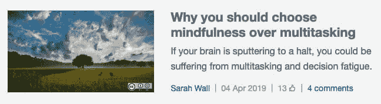
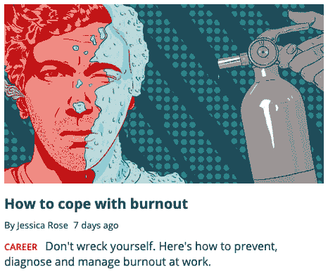
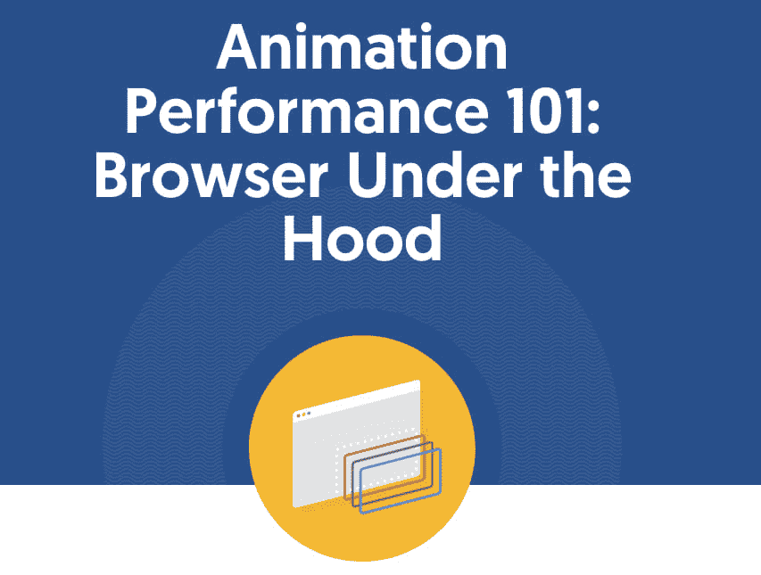
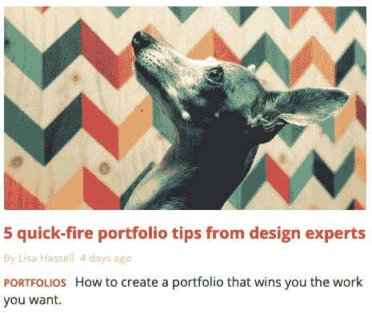
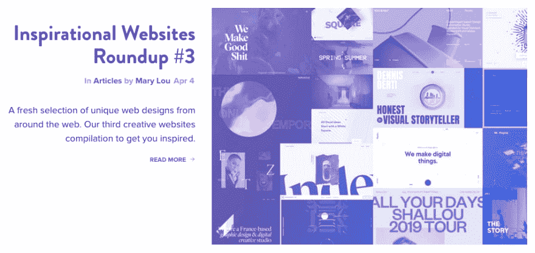

# 本周值得一读的 5 篇外星人文章👽📖

> 原文：<https://dev.to/xenoxdev/5-alien-articles-of-the-week-worth-reading-3c8>

嘿伙计们！我希望你喜欢我以前的文章。我来这里是为了给你带来过去一周的另一篇精彩的外星人文章。这些是在 Dev.to 之外发布的文章，因此被称为“alien”。👽
尽情享受吧！

# 1。为什么你应该选择正念而不是多任务

在不同的任务之间切换真的很痛苦。你一定也观察到了，有时候你的大脑进入了一种无法处理任何新信息的状态，它突然停止工作，因为这种东西叫做“决策疲劳”。Sarah Wall 的这篇文章解释了为什么你应该选择正念而不是多任务处理，以及小休息如何有利于你的心理健康和提高你的生产力。

# 2。如何应对职业倦怠

你是否因为压力增加或过度劳累而感到工作疲惫不堪？你是否无法处理这件事，进而影响到你的个人和职业生活？那么你肯定需要看看杰西卡·罗斯的这篇文章，它解释了如何预防和恢复疲劳。

# 3。动画表演 101:引擎盖下的浏览器

谁不想要那些流畅丝滑的网页动画呢？但实现这一目标取决于许多变量。Chloe Hwang 解释了浏览器如何渲染元素，什么应该和不应该制作动画，为什么应该使用 CSS 而不是 javascript 制作动画，以及浏览器如何通过 CSS 过渡或关键帧动画自动硬件加速任何元素的变换或不透明度。

# 4。来自设计专家的 5 个快速组合技巧

设计作品集代表了你的天赋、技能和经验。拥有一个好的作品集可以推动你走向成功，吸引更多的观众，并得到你想要的作品，而一个糟糕的作品集可能会产生完全相反的效果。因此，花些功夫让你的投资组合处于最佳状态是值得的，丽莎·哈塞尔的这篇文章分享了一些你应该遵循的重要提示。

# 5。励志网站综述

Mary Lou 的这篇文章分享了一系列你可能会喜欢的独特网页设计。

# 让我知道你的想法！

在评论里告诉我你觉得哪篇文章最有用！另外，告诉我你最喜欢的 dev 博客，并分享你最近阅读的内容。祝你愉快！❤

