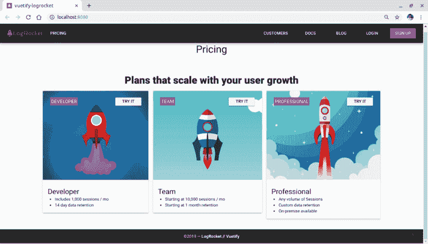
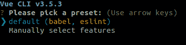
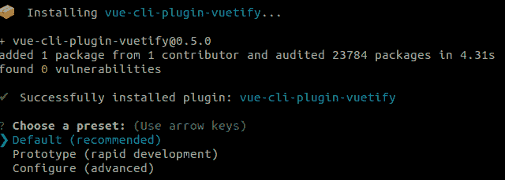
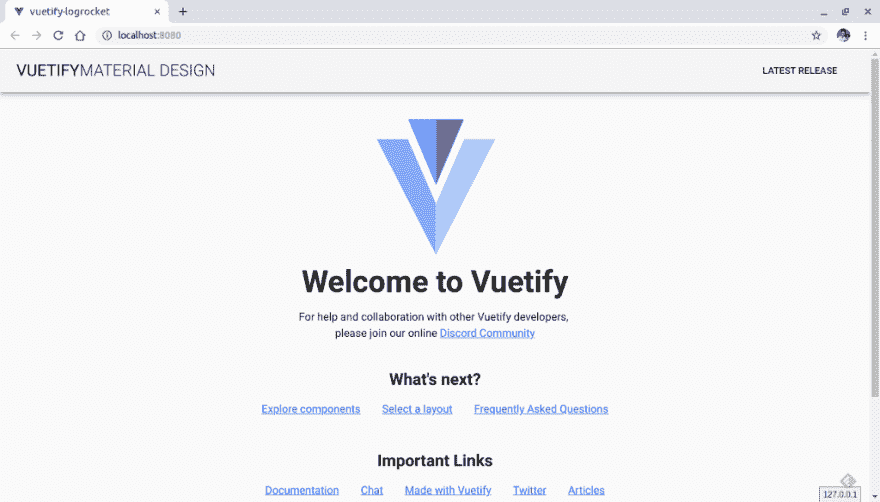
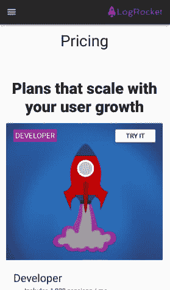
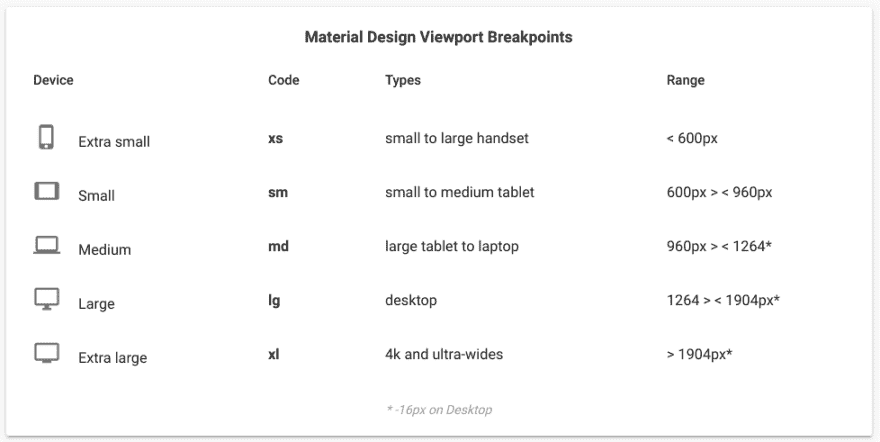

# Vue 组件框架比较:Vuetify 适合你吗？

> 原文：<https://dev.to/bnevilleoneill/vue-component-frameworks-compared-is-vuetify-right-for-you-29m3>

[](https://res.cloudinary.com/practicaldev/image/fetch/s--8vb-7JHP--/c_limit%2Cf_auto%2Cfl_progressive%2Cq_auto%2Cw_880/https://cdn-images-1.medium.com/max/1024/1%2AGyVBO6W1od-6z5IpH12VZQ.jpeg)

web 应用中可视化组件封装的新框架的出现凸显了许多其他需求:路由、安全性、SPA 和 PWA 支持、国际化，当然还有 UI。

Vue.js 就是如此，它已经被广泛用于 web 开发和混合移动应用程序。虽然它非常关注组件逻辑和整个应用程序，但是始终需要使用其他类型的 UI 库或框架来将样式和设计注入到页面中。

另一方面，在众多处理可视组件和屏幕设计的定制和简化的 UI 框架中，有一些框架采用了著名的[材料设计](https://material.io/design/)标准。社区已经广泛接受了这个选项，因为它包含了桌面和移动世界的响应性、灵活性和可扩展性。

既然大多数使用这两种范例的开发人员已经熟悉了它们的用法，为什么不加入这两个世界呢？那么，为什么不加入 Vue 的[物化](https://materializecss.com/)潮流呢？那就是 [Vuetify.js](https://vuetifyjs.com/en/) 诞生的地方。

### 为什么要用 Vuetify？

Vuetify 符合材料设计规范。这意味着默认情况下 Vue 和 Material 的核心特性都是可用的，并且可以由两个社区进行改进。此外，Vuetify 还提供:

*   与 Vue CLI-3 和 RTL 的兼容性
*   各种框架的模板(Cordova、webpack 等。)
*   国际化
*   SSR 和 PWA

然而，使用 Vuetify 意味着你想要，并将拥抱材料设计。例如，面向 iOS 世界的应用就不适合 Vuetify。同样，如果你需要一个整体风格的定制设计，Vuetify 可能也不适合你。和往常一样，您仍然需要对您的项目需求进行更深入的分析。

为了更好地理解 Vuetify 的工作原理，并体验一下它，请看下图:

[](https://res.cloudinary.com/practicaldev/image/fetch/s--wmvfWtKY--/c_limit%2Cf_auto%2Cfl_progressive%2Cq_auto%2Cw_880/https://cdn-images-1.medium.com/max/1024/0%2A9LC0RR8e-6QrnLQX)

让我们用来自 [LogRocket 的定价页面](https://logrocket.com/pricing/)(定价菜单中的计划选择)的元素从头开始创建一个简单、响应迅速、完全基于材料的页面。请注意，元素的布局非常直观，例如，卡片的模板让人想起 Bootstrap 如何使用网格。

[](https://logrocket.com/signup)

### 安装和设置

让我们先把项目需要的东西都摆出来。首先，你需要在你的机器上安装最新版本的 Node.js/npm。

要以全局方式安装 Vue CLI，记下所需版本非常重要。截至本文撰写时，最新版本为 **3.x.x** 。许多资料指出，这个命令是:

```
npm install -g vue-cli 
```

但是，这个命令实际上会安装以前版本的 Vue CLI，所以请注意这一点。

还要确保检查您的机器上是否已经安装了任何以前的版本:

```
vue — version 
```

要安装正确的版本，请运行以下命令:

```
npm install -g @vue/cli 
```

下一步是搭建我们的应用程序。我们将使用一系列预置文件来使我们的生活变得更容易——就像一些。vue 模板文件，index.html 和 main.js:

```
vue create vuetify-logrocket 
```

安装指南将询问您需要哪些 JavaScript 和 lint 编译器预设:

[](https://res.cloudinary.com/practicaldev/image/fetch/s--UGaJB5pY--/c_limit%2Cf_auto%2Cfl_progressive%2Cq_auto%2Cw_880/https://cdn-images-1.medium.com/max/377/0%2AnZETO232IoZ3k1lC) 

<figcaption>*拿起一个预置*</figcaption>

让我们保留默认选项，继续输入。等待安装完成，然后 cd 创建的应用程序的目录，并运行命令将 Vuetify 添加到我们的项目:

```
cd vuetify-logrocket
vue add vuetify 
```

等到安装程序将您带到下一个预设选项，这次是从 Vuetify:

[](https://res.cloudinary.com/practicaldev/image/fetch/s--ToLJ2UvK--/c_limit%2Cf_auto%2Cfl_progressive%2Cq_auto%2Cw_880/https://cdn-images-1.medium.com/max/640/0%2A-dB_4KAdiaH4XIQm) 

<figcaption>*安装 vue-CLI-plugin-vue 化*</figcaption>

让它保持原样，等待安装完成。下图显示了添加插件后生成的目录和文件的基本结构:

[](https://res.cloudinary.com/practicaldev/image/fetch/s--8IF0PcP8--/c_limit%2Cf_auto%2Cfl_progressive%2Cq_auto%2Cw_880/https://cdn-images-1.medium.com/max/712/0%2An-XJ-RXij4T7z-Gq) 

<figcaption>*创建目录和文件*</figcaption>

要启动该应用程序，只需运行 npm run serve 命令。这也将导致文件更改监视器启动并监听我们的编辑，自动更新页面。

[](https://res.cloudinary.com/practicaldev/image/fetch/s--lVfMvasC--/c_limit%2Cf_auto%2Cfl_progressive%2Cq_auto%2Cw_880/https://cdn-images-1.medium.com/max/1024/0%2Aevh3CO0L0rXZjtwL) 

<figcaption>*自动生成首页*</figcaption>

### 定制我们的页面

在阅读本文之前，我建议您阅读一下 Vuetify 官方文档中的一些基本组件。这将有助于我们更好地认识未来，因为我们不会详细讨论每一个问题。

因为我们不会在 App.vue 中使用 Vuetify 生成的任何内容，所以你可以删除它的所有内容。我们将从构建屏幕的第一部分开始，其中包括三个部分:

*   导航(工具栏和菜单)
*   正文(我们将有定价的计划卡)
*   页脚

#### 导航

当通过桌面查看时，导航将遵循深度菜单显示模式，以及在智能手机上查看的移动应用程序或网站常见的导航抽屉(带有汉堡图标模板)。查看我们的网站在 iPhone X 上的显示效果:

[](https://res.cloudinary.com/practicaldev/image/fetch/s--bPB6mXOo--/c_limit%2Cf_auto%2Cfl_progressive%2Cq_auto%2Cw_880/https://cdn-images-1.medium.com/max/279/0%2AwRYL0QRiaJvVtYL3)

<figcaption>*iPhone X 上的页面可视化*</figcaption>

首先，在/src/components/文件夹中创建一个名为 navigation.vue 的新文件，并添加以下内容:

[https://medium . com/media/4671 a 98d 4 DDB 5 ff 9 c 35 a 09 f 2c 0 c 7 AC 7/href](https://medium.com/media/4671a98d4ddb5ff9c35a09f2cc0c7ac7/href)

请注意，第一个标签引用了在 Vue.js 中创建的模板的定义。该标签要求将一个且仅一个子元素添加到层次结构中；否则，我们将收到一个错误。为了“绕过”这一检查，我们添加了一个(或者任何其他封装了其他元素的中立 HTML 元素)。

我们将这样做，因为我们需要(移动可视化)和(桌面可视化)组件共存。

让我们看看其他一些重要的考虑因素:

*   两个组件中都使用了 app 指令，因此 Vuetify 知道它们在更全局的层次上属于应用程序——也就是说，如何相对于父元素调整它们的大小和重新调整它们
*   v-model 定义了我们正在使用的模型的类型——在本例中，是 drawer。这个元素很重要，这样菜单列表就不会出现悬挂。为您的项目提供信息的 JavaScript 在清单的末尾
*   内容的其余部分表示一个循环，它遍历 menu 元素，这是在 menus 元素中预定义的。这里，我们使用[组件](https://vuetifyjs.com/en/components/lists)来迭代和组合标题子元素()和分隔符()
*   在元素中，我们看到了 Vuetify 的默认夜间风格导入使用了 dark 指令

该组件代表我们的汉堡包图标。当然，它应该只在我们以移动模式查看时出现，这也是为什么工具栏的所有元素都接收了[材质设计视口断点](https://vuetifyjs.com/en/framework/breakpoints#breakpoints)的 CSS 类。

这是 Vuetify 基于当前视口控制元素显示的默认机制。请参见下面每个 Vuetify 前缀的官方尺寸表:

[](https://res.cloudinary.com/practicaldev/image/fetch/s--Zqqm7Hbu--/c_limit%2Cf_auto%2Cfl_progressive%2Cq_auto%2Cw_880/https://cdn-images-1.medium.com/max/978/0%2A2EQDzZwkGhCUsG51) 

<figcaption>*材质设计视口断点*</figcaption>

这些条件遵循格式[隐藏-{断点}-{条件}](https://vuetifyjs.com/en/framework/display) 。例如，hidden-md-and-up 类可以翻译如下:

> *断点*将视口大小设置为* *md(中型设备)*条件*应用* *和-up 上的类基。换句话说，它隐藏了指定断点(* *md)和 up (* *lg 到* *xl 断点)上的元素。**

 *工具栏的其余元素则相反:当设备视口较小(sm)或较低(down)时，它们将被隐藏。

至于颜色，Vuetify 提供了一个[预定义的调色板](https://vuetifyjs.com/en/framework/colors#colors)，你可以通过 CSS 类使用它。

最后，属性@click 定义了点击汉堡包图标将触发导航抽屉的激活；否则，点击不会生效。值得记住的是效果是一个切换。

#### 正文(定价计划)

现在让我们创建第二个模板:定价计划。为此，在同一目录中创建一个名为 plans.vue 的新文件，并添加以下内容:

[https://medium . com/media/31d 61283 BC 07 e 5b 14 c 6335 f 18624391 f/href](https://medium.com/media/31d61283bc07e5b14c6335f18624391f/href)

以下内容来自网格系统上的 Vuetify 文档[:](https://vuetifyjs.com/en/framework/grid)

> **v 型容器可以用于居中页面，或者使用* *流体道具来扩展其整个宽度。* *v-layout 用于分隔节，包含 __v-flex。**
> 
>  **你布局的结构会如下:****v-container v-layout v-flex****。网格的每个部分都是一个* *flex-box 元素。最后一个是* *v-flex，它会自动将其子对象设置为具有* *flex: 1 1 auto。**

 *我们的容器是一个 CSS 网格——简单且水平对齐。容器中的第一项是列:。在这里，我用以下道具在页面中央快速对齐了两个文本:

*   text-cs-center:将水平方向(x 轴)上的文本居中对齐
*   Display-1: Vuetify typography for a default

    #### element size. For more information, please refer to [typesetting document](https://vuetifyjs.com/en/framework/typography)

*   my-5:[的间距设置使页边距](https://vuetifyjs.com/en/framework/spacing)有效。这里 m 来自边距，y 来自垂直(y 轴)。根据材料设计规范，范围从 0 到 5
*   字体粗细-黑色:[字体粗细](https://vuetifyjs.com/en/framework/typography#font-weights)用于字体设计。将字体粗细设置为 900

下一个布局是由三张卡片组成的一行。每张卡(用 a 表示)由两个主要元素组成:

*   **映像:**vue tify 中的组件与 src 一起工作，直接指向可能在外部托管的映像。如果您想要本地访问这些文件(就像我们的例子一样)，您需要将它们作为数据属性公开，并使用它们各自相对于 assets 文件夹的路径(参见清单末尾的脚本)。您可以在本文末尾的 GitHub 项目链接中访问这些图像文件
*   在每个**图像**中，我们用道具流体创建另一个容器，用来扩展容器的宽度，使其与父容器相同。每个容器将包含一个 span 文本，其中包含每张卡片的标题和一个行动号召按钮。注意，这里我们使用了更多的小标题和对齐方式(px-1 代表水平填充值 1，共 5 个)
*   **标题:**组件定义了卡片的内容——通常是标题和描述，但也可能包含其他元素，比如按钮

当在移动模式下查看时，Vuetify 还会垂直重新排列卡片。

#### 页脚

要创建页脚，请转到我们项目的 components 目录并创建 footer.vue 文件。增加以下内容:

[https://medium . com/media/3c 576 ea 1c 5 D8 C5 e 5e 733 b 10 aa 15 f 156 c/href](https://medium.com/media/3c576ea1c5d8c5e5e733b10aa15f156c/href)

它是一个简单的页脚，由我们之前讨论过的项目组成。

请注意，对于每个。vue 文件，我们需要定义每个模板的名称，也就是说，它们如何被其他人从外部识别。vue 文件。

#### 主页面

对于主页面，我们将使用已经创建的文件:App.vue。

[https://medium . com/media/f1 d 757 e 997 a 20 EC 3 e 7 f 234 bfb 9d 900 df/href](https://medium.com/media/f1d757e997a20ec3e7f234bfb9d900df/href)

标记是 Vue 所必需的。它集中了构成其应用程序的其他元素。

其余的实现相对简单。我们所要做的就是通过 import *x* from *y* 指令导入其他组件文件，然后像往常一样导出它们。请注意，每个标签在用于模板之前必须用连字符连接。这就是 Vuetify 识别每个 camel 大小写如何被翻译成连字符分隔的方式。

### 结论

你可以从 [my GitHub repo](https://github.com/diogosouza/vuetify-logrocket) 获取完整的源代码。如果你喜欢它，请留下一个星级。

当开始一个新的框架时，必须考虑许多因素。Vuetify.js 的好处在于，很多利弊早已被 Vue.js 本身吸收:Vue 的所有权力都在你手中。句号。

另外，你还得分析你项目的真实需求。正如我们之前提到的，如果你依赖于设计本身，Vuetify 可能不适合你的项目。但是如果这样做了，你就有了一个高效且极其强大的工具来创建令人惊叹的网页。

你用过 Vuetify 吗？如果是，体验如何？请在评论中留下详细信息——你可能会帮助那些想追寻同样道路的人。:)

### Plug: [LogRocket](https://logrocket.com/signup/) ，一款适用于网络应用的 DVR

[](https://logrocket.com/signup/)

<figcaption>[https://logrocket.com/signup/](https://logrocket.com/signup/)</figcaption>

LogRocket 是一个前端日志工具，可以让你回放问题，就像它们发生在你自己的浏览器中一样。LogRocket 不需要猜测错误发生的原因，也不需要向用户询问截图和日志转储，而是让您重放会话以快速了解哪里出错了。它可以与任何应用程序完美配合，不管是什么框架，并且有插件可以记录来自 Redux、Vuex 和@ngrx/store 的额外上下文。

除了记录 Redux 操作和状态，LogRocket 还记录控制台日志、JavaScript 错误、堆栈跟踪、带有头+正文的网络请求/响应、浏览器元数据和自定义日志。它还使用 DOM 来记录页面上的 HTML 和 CSS，甚至为最复杂的单页面应用程序重新创建像素级完美视频。

[免费试用](https://logrocket.com/signup/)。

* * ***