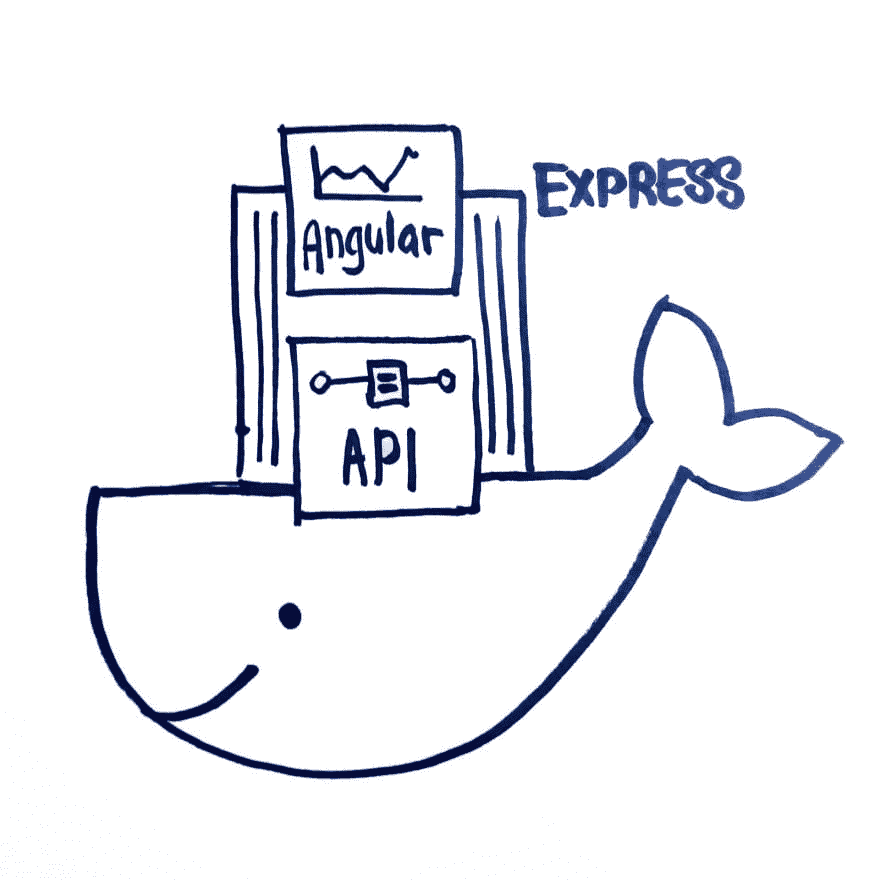

# 高山坞站+ ExpressJS +角度

> 原文：<https://dev.to/jellene4eva/docker-alpine-expressjs-angular-3l16>

这是为了我最近做的一个项目，该项目需要一个从 docker 映像提供的报告仪表板应用程序，该应用程序将存在于小型低功耗 linux 设备中。

应用程序必须满足这些标准:

1.  它需要在许多设备上快速复制
2.  它需要很小，没有很多空间
3.  它需要能够连接到本地主机网络中的 MariaDB 数据库
4.  某些字段可以从暴露在容器外部的 JSON 数据库中进行配置。

[](https://res.cloudinary.com/practicaldev/image/fetch/s--GRDvr-rB--/c_limit%2Cf_auto%2Cfl_progressive%2Cq_auto%2Cw_880/https://cdn.filestackcontent.com/jRzKPHWUSAKkdtTPETu6) 
*Docker 容器包含一个为 Angular 应用服务的 ExpressJS 应用*

## 码头工人

> 1.它需要在许多设备上快速复制

Docker 已经存在了相当长的时间，于 2013 年[发布](https://www.infoq.com/news/2013/03/Docker)，它旨在解决“但它在我的电脑上工作”的问题。

docker 的一个流行用法是将其与 kubernetes 配对，以旋转多个微服务来处理并发用户的大量峰值，然后在峰值之后删除它们以节省资源。每个微服务本身就是一个微型服务器。

因为 docker 镜像本质上就像一个微型服务器的备份副本，所以它总是以同样的方式运行，不需要太多的配置。这使得将图像复制到任何新设备都变得容易，并建立一个运行该应用程序的新 docker 容器。

## 架构解决方案

1.  使用 Docker 将应用程序容器化
2.  ExpressJS 作为前端 Angular 应用程序的 web 服务器。
3.  ExpressJS 使用 [lowdb](https://github.com/typicode/lowdb) 来读取/写入名为 data/的文件夹中的 JSON 文件的配置。
4.  ExpressJS 使用 [knex.js](https://knexjs.org/) 查询 SQL 数据库。

最终的工作文件夹看起来像这样—

```
 backend/
        |- src/...
        |- dist/
            |- server.min.js
    frontend/
        |- src/...
        |- dist/
            |- public/
                |- main.min.js
                |- vendor.min.js
                |- index.html
    docker/
        |- data/
            |- local-db.json
        |- server.min.js
        |- package.json
        |- public/
            |- main.min.js
            |- vendor.min.js
            |- index.html
        |- Dockerfile
        |- .dockerignore 
```

前端和后端都被最小化以减少空间。最小化代码的内容被复制到 docker 文件夹中，这样我可以更容易地将它打包到 docker 映像中。

Express server 正在为根路由下的公共文件夹(Angular app)提供服务。而 API 的其余部分以`/api/`前缀开始。这也意味着 Angular 在调用 http 时可以使用`/api`,所以它总是调用同一个域中的东西。

```
 this.http.post('/api'+ reportUrl); 
```

后端的 Package.json 也包含在内，因为我需要安装 ExpressJS 应用程序所需的 node_modules。使用 Webpack 以某种方式捆绑依赖项可能是可行的，但是我时间紧迫，没有进一步研究如何这样做。

```
 import * as FileAsync from 'lowdb/adapters/FileAsync';
    const low = require('lowdb');

    low(new FileAsync(path)).then(db => {
        db.defaults({
            maxEntries: MAXENTRIES,
            configs: []
        })
        .write();
    }); 
```

这将把一个默认的 JSON 配置写入 data/local-db.json。

## Dockerfile

> 2.它需要很小，没有很多空间

开发过程中的一个常见做法是将所有源文件放入 docker 容器中，并运行一个完整的 node.js 服务器来为您的应用程序提供服务。很简单，快速，无痛。

但是 debian 服务器上的一个完整的 node.js 是相当大的——从一开始就有将近 650MB。在安装了我们的 ExpressJS 应用程序和 Angular 之后，它变成了大约 1.3GB。

所以我们选择了基于 [Alpine](https://alpinelinux.org/) linux 的新准系统，这是一个巨大的 50MB。安装好所有东西后，它达到了大约 300MB。仍然比完整的服务器映像小得多。

可用节点基础映像的完整列表在这里是。

准系统意味着我们需要一些额外的文件来安装节点模块。

```
 FROM node:10.15.3-alpine

    ENV JWT_SECRET 512FF7B2EMCKAHG24C
    ENV BCRYPT_SALT 12
    ENV PORT 8080
    ENV TOKEN_EXPIRES_IN 24h

    WORKDIR /usr/src/app
    COPY . .
    RUN apk --no-cache add --virtual native-deps \
        bash g++ gcc libgcc libstdc++ linux-headers make python && \
        npm install --quiet node-gyp forever -g &&\
        npm install --production --quiet
    EXPOSE 8080
    CMD forever server.min.js 8080 
```

关于如何编写 docker 文件，有一个非常详细的[文档](https://docs.docker.com/engine/reference/builder/)，但本质上 docker 文件类似于一个 bash 脚本，它按顺序运行命令，最终服务于应用程序。

`FROM node:10.15.3-alpine`是我如何选择图像作为容器的基础。

我正在用`ENV`命令设置环境变量。然后可以通过`process.env`在 ExpressJS 应用程序中读取。

`WORKDIR`选择我想在容器中使用的当前文件夹。如果不存在目录，Docker 会创建它们。

我包含了构建节点所需的几个安装(gcc、python 等)。

然后最后用[永远](https://github.com/foreverjs/forever)伺候`server.min.js`。

Forever 是一个 CLI 工具，它将节点服务器作为守护进程运行，不会被意外终止。

## Docker 运行

> 3.它需要能够连接到本地主机网络中的 MariaDB 数据库

现在有趣的部分来了——运行应用程序。首先我们必须建造它。

```
 $ docker build --tag node-app:alpine . 
```

Docker build 从 Dockerfile 中读取命令并构建一个映像。

允许我命名 docker 图像，以便以后更容易找到它。

构建完成后，`docker images`表示我确实构建了一个图像

```
 $ docker images

    REPOSITORY     TAG          IMAGE ID         CREATED          SIZE
    node-app       alpine       f4ca2e0425a0     3 days ago       354MB 
```

现在运行 docker 镜像

```
 $ docker run \
        --name node-app \
        --network host \
        --restart 'unless-stopped' \ 
        --detach \
        node-app:alpine 
```

让我设置一个自定义名称。如果没有提供，docker 将为您创建一个类似 precious-grauss 或类似的名称。

`--restart`将使正在运行的容器永远运行，除非特别停止。

我会让它在后台运行，释放我的终端来做其他事情。如果你不使用这个，你将需要第二个终端来停止你的 docker 容器。

`--network`是这里的*关键选项*。需求之一是 docker 容器应该能够连接到 localhost 上的数据库。通过使用选项`host`，我们可以做到这一点。还有其他方法可以创建 docker 网络并将容器连接在一起。你可以在这里阅读更多。

使用这个命令，我现在可以看到应用程序在`localhost:8080`上运行。我的应用程序能够成功连接到数据库。🎉

[](https://res.cloudinary.com/practicaldev/image/fetch/s--KbYUlD8N--/c_limit%2Cf_auto%2Cfl_progressive%2Cq_auto%2Cw_880/https://cdn.filestackcontent.com/B920t0WCRs2gzdLGFOg6)

## Docker 卷

> 4.某些字段可以从暴露在容器外部的 JSON 数据库中进行配置。

docker 容器现在应该可以平稳运行了，直到我发现 local-db json 并没有真正更新。我无法从容器外部控制配置。

这是因为我在 docker 运行期间省略了`--volume`选项，该选项允许我将一个文件夹挂载到 docker，然后可以在主机和 docker 容器之间共享该文件夹。你可以在 docker [这里](https://docs.docker.com/storage/)阅读更多关于数据持久性的内容。

```
 $ docker run \
        --name node-app \
        --volume $(pwd)/data:/usr/src/app/data \
        --network host \
        --restart 'unless-stopped' \ 
        --detach \
        node-app:alpine 
```

`$(pwd)`将当前工作目录插入到命令中。如果我从不同的文件夹中调用 docker，pwd 将会不同。

这里，volume 命令将数据文件夹挂载到 docker 容器`/usr/src/app/`文件夹中的数据文件夹。如果目标文件夹不存在，`--volume`会为我创建它。

运行这个，现在我可以从外部控制配置。

## 保存和加载图像

现在我已经有了运行的映像。我需要将图像导出为可以导入不同设备的格式，并启动同一个实例。

```
 $ docker save -o ./node-app-image.tar node-app:alpine 
```

`save`命令将当前图像状态导出到一个 tarball 中。我确保没有添加任何自定义配置，因为我不想将它们保存到映像中。

```
 $ docker load -i ./node-app-image.tar 
```

在我将 tarball 下载到机器中之后，我运行`load`命令。加载图像会将图像包含到`docker images`中。然后我像以前一样执行`run`命令，它应该会找到我保存的同一个`node-app:alpine`图像。

## 思想

Docker 真的挺厉害的。它让开发人员可以立即自信地扩展应用程序，因为环境总是完全一样的。

也就是说，我认为 docker 文档可能更容易处理。有如此大量的配置需要学习，难怪 docker 设置是一项独立的职业。

不管怎样，学习 docker 是令人兴奋的。有没有更好的办法告诉我！

[](https://res.cloudinary.com/practicaldev/image/fetch/s--F_1QTM1x--/c_limit%2Cf_auto%2Cfl_progressive%2Cq_auto%2Cw_880/https://cdn.filestackcontent.com/8L2FP8g0TSqfltStIKHN)

## 资源

[1][https://github.com/nodejs/docker-node](https://github.com/nodejs/docker-node)
【2】[https://github.com/nodejs/docker-node/issues/282](https://github.com/nodejs/docker-node/issues/282)
【3】[https://stack overflow . com/questions/43316376/what-does-net-host-option-in-docker-command-really-do](https://stackoverflow.com/questions/43316376/what-does-net-host-option-in-docker-command-really-do)
[https://stack overflow . com/questions/12701259/how-to-make-a-node-js-application-run-permanually](https://stackoverflow.com/questions/12701259/how-to-make-a-node-js-application-run-permanently)