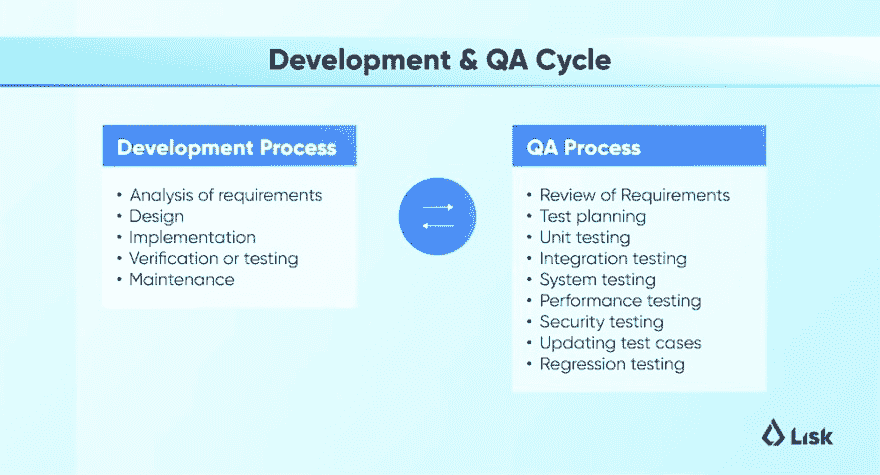
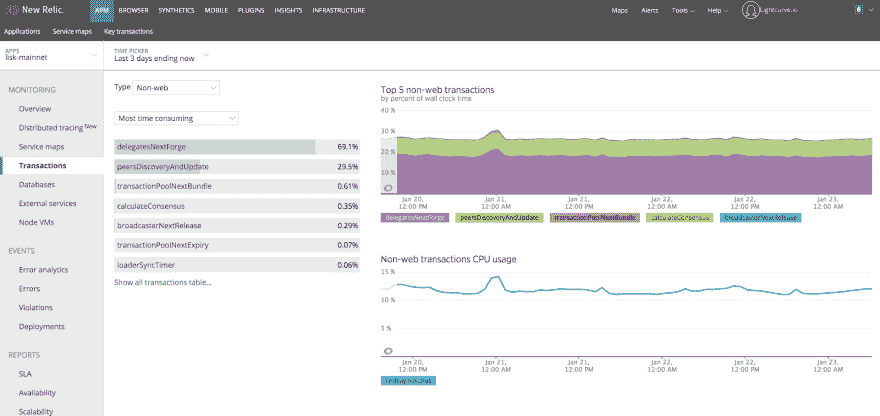
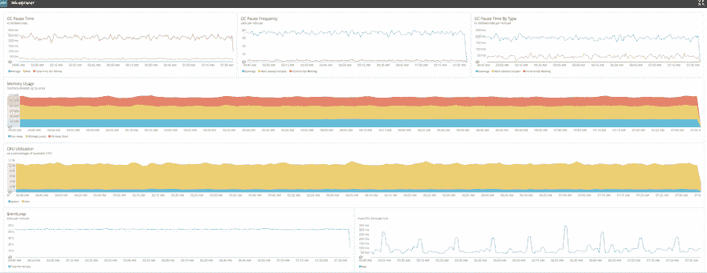
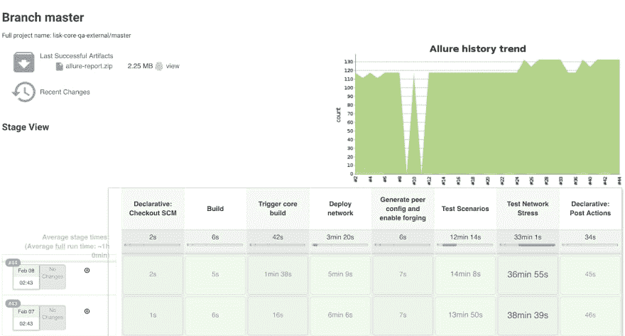

# 区块链的测试自动化——如何提高开发速度和代码质量，第 2 部分

> 原文：<https://dev.to/4miners/test-automation-for-blockchain-how-to-improve-development-speed-and-code-quality-part-2-3ppe>

*Today we discuss the importance of software testing in blockchain, outline benefits of automation testing and explain how to get involved in the Quality Assurance of our open source project. This is part two of the two part blog post.*

许多区块链项目在达到初始生产状态后并没有持续很长时间。对大多数人来说，缺乏适当的软件测试是他们死亡的主要原因之一。据估计，仅去年一年就有超过 5 亿美元的加密货币因错误代码而丢失。你可能听说过[DAO 的代码漏洞](https://medium.com/swlh/the-story-of-the-dao-its-history-and-consequences-71e6a8a551ee)，它允许攻击者从基于以太坊的智能合约中流出 360 万 ETH(当时价值 7000 万美元)。另一个臭名昭著的案例是[奇偶错误](https://elementus.io/blog/which-icos-are-affected-by-the-parity-wallet-bug/)，导致超过 1 . 5 亿美元被永久冻结。甚至比特币本身也不能幸免于黑客攻击。去年年底，代码中发现的一个漏洞允许恶意个人通过双重输入人为增加比特币的供应量。如果这个漏洞没有被迅速发现和解决，它可能会对网络造成灾难性的影响。这只是冰山一角——还有许多由缺乏经验或粗心的开发人员引起的小事故没有成为头条新闻。

这告诉我们什么？在开发过程中，事情可能会很快出错，结果可能会很糟糕。这就是为什么软件测试对于任何利用区块链技术的项目都是如此重要，比如区块链平台、区块链应用程序或区块链服务。

在本文中，我们将讨论我们在开发区块链应用平台 [Lisk](https://lisk.io) 时的软件测试经验和最佳实践。我们还将向您展示实现自动化测试是如何改进我们的内部工作流程和代码可靠性的。最后，我们将向您展示如何参与测试我们的开源软件。

**This is a long blog post, but we've broken it down into bite-sized pieces for you.**

第一部分:

 **1.  *区块链和 Lisk 简介*
2.  *什么是软件测试？*
3.  *测试区块链应用为传统软件测试增加了新的指标*
4.  *为什么区块链开发商需要更加关注细节*
5.  自动化测试可以大大减少发布过程
6.  *不同类型的自动化测试*
7.  *持续集成(CI)是自动化测试的最佳实践*
8.  *挑哪个 CI 平台？特拉维斯 CI vs 切尔莱西 vs 詹金斯*

第二部分:

1.  *软件测试是不够的——引入质量保证*
2.  *手动测试如何减缓我们的软件开发过程*
3.  *我们如何在 Lightcurve 实施质量保证*
4.  *QA 团队到位的结果*
5.  *我们区块链网络的质量保证测试流程*
6.  *参与我们的开源自动化测试*
7.  *如何开始为我们的质量保证做出贡献*
8.  我们可以为您提供哪些 QA 工具？

### 区块链和 Lisk 介绍(如果你是 Lisker，请随意跳过这一部分)

你可能听说过比特币等加密货币背景下的区块链，但是是什么让这项新技术如此特别呢？[区块链](https://lisk.io/academy/blockchain-basics/what-is-blockchain)，是一种分布式账本技术(DLT)，是一种开放的分布式数据库，能够以高效、可验证的方式永久记录各方之间的交易。那些交易被打包成块，[加密地](https://lisk.io/academy/blockchain-basics/how-does-blockchain-work/blockchain-cryptography-explained)签名，形成实际的链。存储在区块链的数据不能被更改或篡改，因为所有的记录都是[不可变的](https://lisk.io/academy/blockchain-basics/benefits-of-blockchain/why-is-blockchain-trustless)。数据一旦保存到分类账中，就永远保存在那里。区块链也是一个分散的网络，这意味着没有一个中央权力机构来控制它。

人们很容易对区块链感到兴奋，但是在它的基础上开发一个工作产品却非常困难。出于各种原因，区块链开发者似乎仍然是程序员中的稀有品种，包括所需的陡峭学习曲线。Lisk 计划正面解决这些问题，让每个开发人员都能轻松地用 JavaScript 构建和部署[区块链应用程序。Lightcurve 是一家位于德国柏林的区块链产品开发工作室和咨询公司。我们目前专注于开发 Lisk 的所有方面，包括产品、营销、社区和设计。](https://lisk.io/products)

### 软件测试是不够的——引入质量保证

虽然软件测试非常重要，但它属于更广泛的[质量保证](https://en.wikipedia.org/wiki/Software_quality_assurance)的范畴。这个术语是什么意思？质量保证(QA)不仅仅是测试。它包含了整个软件开发过程。质量保证包括需求定义、软件设计、编码、源代码控制、代码评审、软件配置管理、测试、发布管理和产品集成等过程。

#### 手动测试减缓了我们的软件开发过程

在科技创业公司中，在建立流程的最初几年面临挑战是很常见的，我们在 Lightcurve 也不例外。我们没有足够的资源专门用于软件测试，但我们仍然必须尽可能多地进行测试，以确保每个新软件版本的质量和可靠性。例如，在专用网络级别上测试错误修复或功能需要:

*   准备二进制文件(从源代码构建)
*   启动云基础架构(多台虚拟机，从 10 台到 500 台)
*   在所有机器上部署软件
*   执行实际的测试场景
*   收集日志以供进一步调查
*   清理实例(销毁虚拟机)
*   分析流程中收集的日志

我们的大多数测试最初都是手动的，因此非常耗时。在许多情况下，软件测试也需要我们 DevOps 团队的协调和大力帮助。我们无法在合理的时间内测试所有的协议特性和场景，因为所需的工作量和时间都非常高。因此，在对我们的产品套件进行改进和添加新功能时，我们遇到了延迟。然而，我很高兴地确认我们不再仅仅依赖手工测试。四个月前，我们在网络开发团队中建立了自己的 QA 团队，以涵盖与软件测试、实施流程、自动化测试和执行高质量标准相关的所有缺失部分。

#### 我们如何在 Lightcurve 实施质量保证

现在我们已经建立了不同类型的测试，让我们来看看在 Lightcurve 中 QA 是如何执行的，以及我们引入了哪些确切的过程来消除向产品交付不可靠代码的风险。

#### 拥有一个 QA 团队的结果是改善了以下方面

*   设计测试计划和测试场景。QA 团队与开发人员密切合作，确定正在开发的功能，然后准备好经过深思熟虑的测试场景。在实际发布之前需要这一步。在大多数情况下，QA 还负责编写测试，覆盖之前准备的场景，然后执行它们并评估结果。
*   自动化测试框架。我们实现了以自动化方式执行的各种测试场景。我们的自动化测试包括健全性测试、回归测试、网络测试(块和事务传播、p2p 通信、向后兼容性等)。)，安全和容错网络测试。那些测试是我们持续集成(CI)的一部分，也可以由开发人员按需执行。
*   **Jenkins 和 Ansible 进行持续集成。**在 Lightcurve，我们受益于 Jenkins 的灵活性，同时必须并行执行多个任务。我们还想完全控制整个工作流程。我们已经使用云提供商自动化了创建构建和旋转测试网络的过程。为了使我们的测试尽可能接近真实场景，我们在不同地区(美国、中国、欧洲、亚洲等)部署了节点。).我们也在使用 [Ansible](https://www.ansible.com/) ，它是一个编排工具。它使我们能够推出软件，只需按一下按钮就能启动这些网络。
*   用于性能测试的 NewRelic APM。区块链项目生命力的主要指标之一是网络的持续性能。这使得监控每个版本的性能变得非常重要。我们的 QA 团队使用 NewRelic APM 来确定性能是提高了还是降低了。然后，我们向开发团队提供反馈，以便在发布之前纠正问题。为了确保网络在高交易量期间的行为符合预期，我们运行了各种类型的压力测试(不同的交易类型，不同的工作负载)。我们正在监控 CPU 和内存使用、I/O 吞吐量和 API 响应时间等指标。另一个需要检查的重要因素是内存泄漏。当代码需要为一个特定的任务使用内存时，它会被自动分配(例如当创建一个对象时)，当不再需要它时，它应该被释放。有时情况并非如此，应用程序拒绝清理内存。然后，在没有真正需要的情况下，内存会一直被消耗。内存泄漏导致应用程序使用的内存增长缓慢(有时非常缓慢)，直到它最终耗尽所有可用内存并导致崩溃。为了提高开发中的整体灵活性和代码可靠性，我们目前正在整个产品套件中从[迁移到 TypeScript](https://lisk.io/help-center/roadmap/why-are-you-migrating-to-typescript) 的过程中。

*   Devnet 是一个临时的、短命的网络，我们创建它是为了针对新的变化执行测试，这些新的变化不是基于个案的发布的一部分。
*   Alphanet 是我们测试新发布的 **alpha** 版本的网络，在这个阶段，我们需要一个更大的网络来重现真实世界的场景。
*   Betanet 是一个公共网络，我们在其中测试 **beta** 版本。只有在代码库有非常大的变化时，才会发生这种情况。在大多数情况下，我们会跳过这个网络。
*   Testnet 是一个公共网络，我们将**发布候选**推送到这个网络。Lisk 的 Testnet 拥有大量的历史数据。你可以在这里查看我们的测试网。
*   **Mainnet** 是一个公共生产网络，包含实际的区块链。

#### 我们区块链网络的质量保证测试流程

在区块链，次要版本在进入生产网络之前需要经过测试阶段。在我们的例子中，我们有以下类型的网络:

*   **构建 [Lisk 核心](https://lisk.io/documentation/lisk-core)软件**:在这个阶段，Lisk 核心软件将从一个特定的分支(默认为*开发*)构建，成功的构建会创建一个名称中带有唯一 hash 的 tar 文件(例如:*Lisk-1 . 5 . 0-alpha . 2-b 430 af 6-Linux-x86 _ 64 . tar . gz*)。
*   **将软件部署到多台机器上**:一旦软件构建成功，它将被部署到多个节点上以复制网络行为。
*   **使[代表能够伪造](https://lisk.io/documentation/lisk-protocol/consensus#broadhash-consensus) :** 此时，所有节点都已经启动并加载了网络的 genesis 块。现在，我们需要让区块链移动，所以在这一步中，我们启用锻造，因为代理正在生产块。
*   **执行[协议](https://lisk.io/documentation/lisk-protocol)测试场景:**一旦网络移动，将针对网络执行 Lisk 协议特性测试。这些测试包括健全性、回归和新功能，这将确保所有基本协议相关场景按预期工作。
*   **管理网络压力测试:**为了确保网络即使在非常高的交易负载下也能保持可靠，我们进行了压力测试。它们涉及发送最大支持量的事务。我们希望网络能够处理负载，并接受给定块槽内的所有事务。

我们的自动化测试被配置为使我们的开发人员能够在 Devnet 或 Alphanet 上运行测试。实际的网络规模是可配置的，范围从 10 到 500 个节点。NewRelic APM 监控与我们的软件集成，并为每个节点启用。一旦执行了所有需要的测试并评估了它们的结果，就可以决定发布一个特性或修复 Testnet。在一段合理的时间后(取决于发布的规模和复杂性),我们将把它推向生产，也称为 Mainnet。

上图描绘了 Jenkins CI 管道流程和一份测试报告。Jenkins CI 渠道由多个阶段组成，包括:

管道被配置为每晚运行，这允许开发团队按时并以适当的质量创建每个版本。因此，开发人员可以在使用 QA 自动化框架进行网络级开发时测试特性。如果出现任何故障、向后兼容性问题或性能变化等，这将为开发人员提供即时反馈。

### 参与我们的开源自动化测试

Lisk 是本着[开源精神](https://opensource.com/article/18/6/blockchain-guide-next-generation)开发的。因此，我们鼓励所有开发者参与进来，用我们的 QA 工具来确保我们开源网络的持续质量和安全性。

#### 如何开始为我们的质量保证做出贡献

通过关注我们的公共 [Jenkins 界面](https://jenkins.lisk.io/job/lisk-core-qa-external/)来观察我们的质量保证进度。但是，如果您想尝试使用测试套件，您将需要设置您的节点和网络。为此，通读 Lisk 的官方[文档](https://lisk.io/documentation)。你尤其需要遵循 Lisk 核心[设置](https://lisk.io/documentation/lisk-core/setup)部分来启动和运行区块链网络。接下来，您可以按照 [Lisk Core QA 仓库](https://github.com/LiskHQ/lisk-core-qa-external#lisk-core-qa)中的说明来设置 QA 工具。

*   QA 周期清单[模板](https://github.com/LiskHQ/lisk-core-qa-external/blob/master/docs/qa_round_template.md)涵盖所有可能的场景
*   [BDD](https://github.com/LiskHQ/lisk-core-qa-external/tree/master/features) 特征场景及其 [step_definitions](https://github.com/LiskHQ/lisk-core-qa-external/tree/master/step_definitions) 实现
*   [支持](https://github.com/LiskHQ/lisk-core-qa-external/tree/master/support)和[实用程序](https://github.com/LiskHQ/lisk-core-qa-external/tree/master/utils)类进行测试
*   [网络配置工具](https://github.com/LiskHQ/lisk-core-qa-external#network-mode)
*   [压力测试场景](https://github.com/LiskHQ/lisk-core-qa-external#running-generic-stress-test)

#### 我们可以为您提供哪些 QA 工具？

现在您已经知道了如何设置您的 Lisk 核心节点，您可以参与以下活动:

如果你是一名开发人员，想要为 Lisk 的质量保证过程做出贡献，你可以遵循这些[贡献指南](https://github.com/LiskHQ/lisk-core-qa-external/blob/master/docs/CONTRIBUTING.md)。然后你可以分享你的见解或加入关于 [Lisk 的讨论。聊天的网络频道](https://lisk.chat/channel/network)。

### 最后的想法

从一成不变到权力下放，区块链的发展呈现出自己的一系列挑战。这使得软件测试对于我们的行业来说比集中式应用程序更加重要。让事情变得更复杂的是，软件测试本身就是一个选择的宇宙。在 Lightcurve 引入自动化测试以及专业化的 QA 部门，极大地提高了我们的开发速度，以及 Lisk 代码库的质量。然而，就区块链而言，社区等于安全。使用上述 QA 工具参与测试，从今天开始为我们的网络发展做出贡献。**