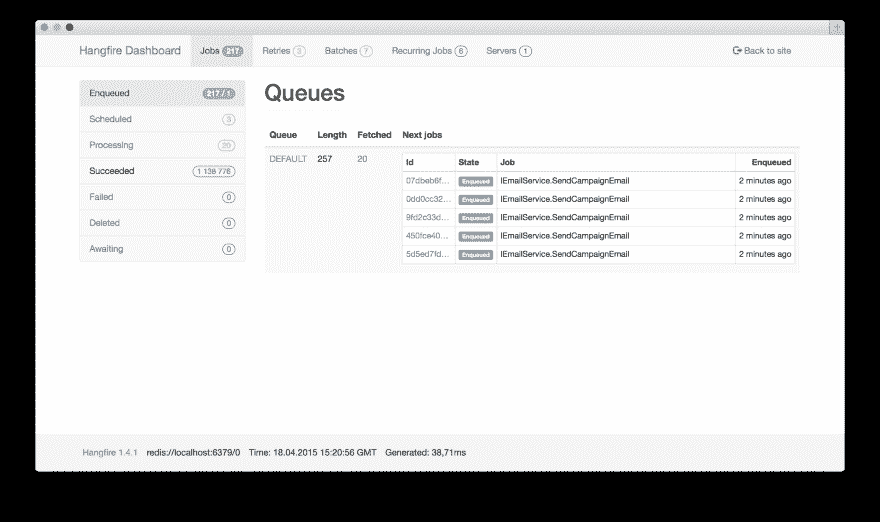
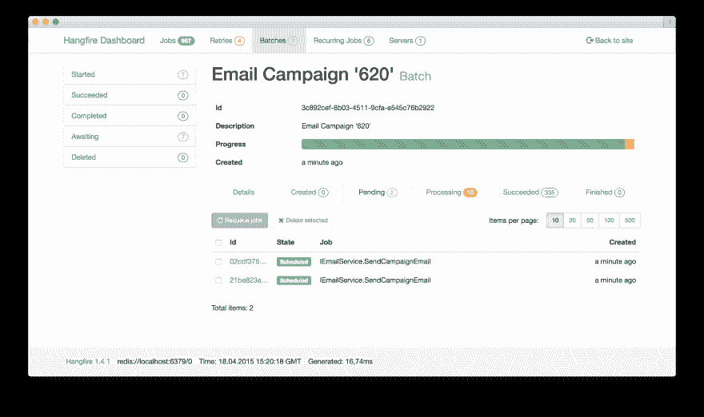
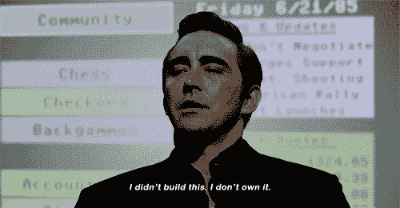

# 暂停和绞刑

> 原文：<https://dev.to/turnerj/halt-and-hangfire-3gnh>

*封面图片来自[停机并着火](https://en.wikipedia.org/wiki/Halt_and_Catch_Fire_(TV_series))T3】*

我有一个网站，我想计划每隔 X 分钟运行一次任务。大多数时候，你会伸手去拿 Cron T1，拼凑一个花哨的 Cron 表情，然后你就上路了。

这对于一个部署到 Linux 服务器上的世界来说是非常好的，但是对于在 Windows 上调度任务来说却不是这样。在 Windows 中，你有任务调度器，虽然它很强大，但我总是觉得它有点笨重。无论如何，使用 Cron 或 Task Scheduler，您已经实现了运行计划任务的目标。

现在，像许多项目一样，需求也在变化，你不仅需要一个计划好的任务，还需要特别的后台任务。这很好，你可以想出一些方法在后台实例化你代码的另一个“实例”来完成工作。这可能是一些不可靠的事情，比如网站向自己发出请求，而不等待响应，或者像在 shell 上运行命令这样简单的事情。再说一遍，你的问题“解决”了。

需求的另一个变化出现了(第三次魅力，我说的对吗？)现在，您需要一个仪表板来查看和管理这些任务...

我不能说你如何在其他框架中实现这一点，但是如果你使用。NET，你很幸运，感谢[谢尔盖·奥迪诺科夫](https://twitter.com/odinserj)的[绞刑。](https://www.hangfire.io/)

# 什么是 Hangfire？

Hangfire 是一个库，它允许你在应用程序中有计划的和特别的后台任务，由持久存储支持。然后，可以通过 Hangfire 仪表板查看这些任务，了解哪些任务正在运行，哪些任务将运行，哪些任务失败了。

[](https://res.cloudinary.com/practicaldev/image/fetch/s--3jKEUl9a--/c_limit%2Cf_auto%2Cfl_progressive%2Cq_auto%2Cw_880/https://thepracticaldev.s3.amazonaws.com/i/wju7gp69o0km09mvocm0.png)

Hangfire 支持任务的自动重试，并且可以链接到错误记录和依赖注入系统，从而可以轻松地连接到应用程序。

然而，Hangfire 的一个我最喜欢的特性是，由于它的构建方式，它自动支持跨多个服务器的分布式任务。考虑到这一点，有许多小任务来充分利用这一点是很好的。

它也不局限于 ASP.NET 应用程序，你可以让你的 Hangfire 服务器成为一个 Windows 服务。

Hangfire 是免费的个人和商业用途，但有一些高级功能，如批处理/分组任务在一起。

[](https://res.cloudinary.com/practicaldev/image/fetch/s--ntEsmIT0--/c_limit%2Cf_auto%2Cfl_progressive%2Cq_auto%2Cw_880/https://thepracticaldev.s3.amazonaws.com/i/ca00u4j0ncr8anjfic7h.png)

# 举例

在此之前，你需要从 Nuget 中添加 [Hangfire。](https://www.nuget.org/packages?q=hangfire)

对于 ASP.NET 核心应用程序，您需要更新启动类中的`ConfigureServices`方法，以包含以下内容:

```
public void ConfigureServices(IServiceCollection services)
{
    // ...

    services.AddHangfire(c =>
    {
        c.UseSqlServerStorage("YOUR_CONNECTION_STRING");
    });

    // ...
} 
```

Enter fullscreen mode Exit fullscreen mode

虽然我的例子使用的是 SQL Server，但 Hangfire 支持各种其他存储系统，包括 [MongoDB](https://github.com/sergeyzwezdin/Hangfire.Mongo) 或 [Redis](https://www.hangfire.io/pro/#hangfireproredis) 。

现在，在启动类的`Configure`方法中，您需要实际触发服务器和仪表板(尽管仪表板是可选的)。

```
app.UseHangfireDashboard("/hangfire");
app.UseHangfireServer(); 
```

Enter fullscreen mode Exit fullscreen mode

现在，当您的应用程序开始时，Hangfire 服务器将启动并能够处理任务。您还可以在`UseHangfireDashboard`上指定的路径查看 Hangfire 仪表盘。

这样就启动了服务器，那么在后台运行的任务呢？

## 预定任务

在你的启动类的`Configure`方法中，你需要为一个预定的任务添加如下内容:

```
RecurringJob.AddOrUpdate(() => Console.Write("Look ma, a recurring task!"), "0 * * * *"); 
```

Enter fullscreen mode Exit fullscreen mode

虽然这是一个简单的例子，但是您确实需要保持您的后台任务简单，因为表达式是序列化的。对于我如何使用 Hangfire 执行预定任务，它看起来更像:

```
RecurringJob.AddOrUpdate<MyBackgroundTaskClass>(instance => instance.RunTask("Whatever", "arguments", 1, "like"), "MY CRON EXPRESSION") 
```

Enter fullscreen mode Exit fullscreen mode

这将创建一个`MyBackgroundTaskClass`的实例(支持 DI ),并使用指定的参数调用`RunTask`方法。您可以向任务传递各种参数，但是为了兼容性和简单性，最好只提供最简单形式的基本参数。这是因为数据是序列化的，某些类型的序列化比其他类型更容易。就我个人而言，我会传递引用 DB 中项目的 id，然后任务应该自己查询。

在那个例子中，类`MyBackgroundTaskClass`和`RunTask`方法都不需要什么特别的东西。它们不需要特殊的属性，或者类是否需要从特定的类或接口继承。

## 临时任务

对于应用程序中任何地方的特殊任务，也一样简单:

```
BackgroundJob.Enqueue<MyBackgroundTaskClass>(instance => instance.RunTask("Whatever", "arguments", 1, "like")) 
```

Enter fullscreen mode Exit fullscreen mode

同样的规则也适用于循环作业——您希望参数保持简单，而不是传递复杂的对象。

# 总结

Hangfire 提供了一种简单的方法来管理后台任务，为您的。NET 应用程序。在这篇文章中，我只是触及了皮毛，还有许多更细微的功能让 Hangfire 变得更棒。

我强烈推荐[仔细阅读文档](https://docs.hangfire.io/en/latest/getting-started/index.html)，以便更深入地了解 Hangfire。

希望你喜欢阅读这篇文章，并在你的下一个项目中让 [Hangfire](https://www.hangfire.io/) 看看！

[](https://i.giphy.com/media/1179nmuBk7YPg4/giphy.gif)