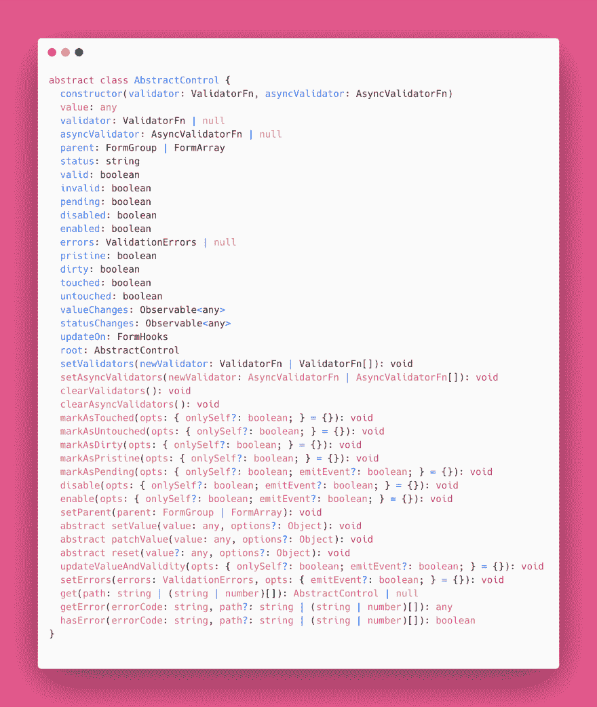
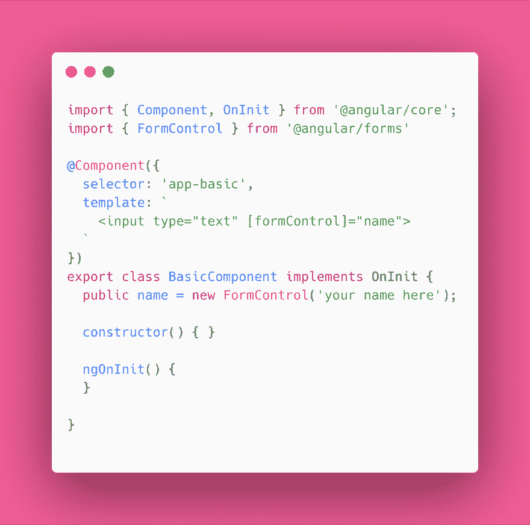
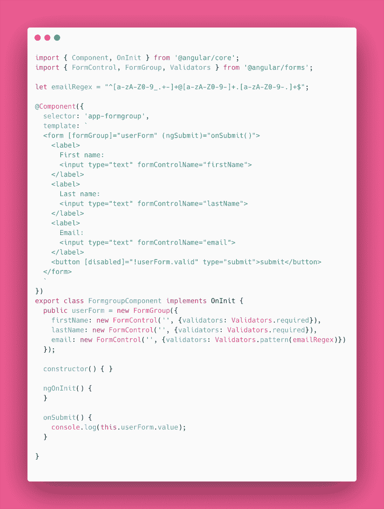
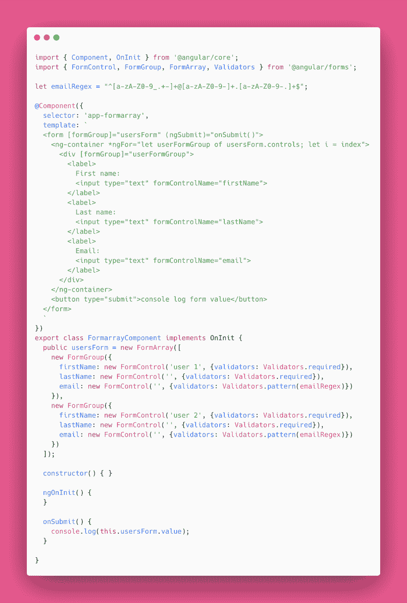
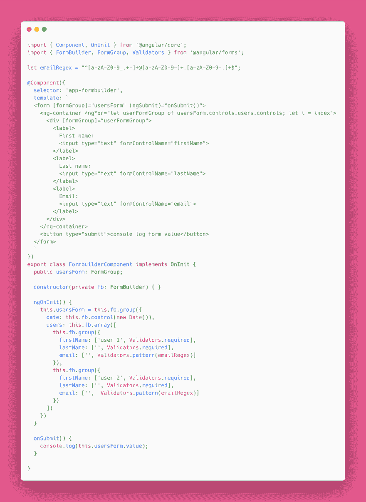
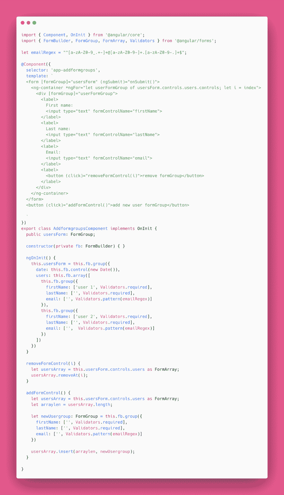

# 在 Angular 中管理嵌套和动态表单

> 原文：<https://dev.to/angular/managing-nested-and-dynamic-forms-in-angular-1he6>

Angulars ReactiveForms 通过其强大的 API 为我们提供了巨大的能力，但从许多人习惯的简单的旧模板驱动的表单开始，学习曲线可能有点陡峭。这个快速指南将解释 Angular 的表单元素，以及如何在几乎任何场景中组合、嵌套和动态创建它们。

## 抽检

首先，了解一下 **AbstractControl** 很重要，这个类扩展了我们将要使用的大多数表单元素。它有多个属性来管理从有效性状态到父元素可能是什么的一切，还有一些方法允许我们标记控件的状态(已触摸、未触摸、脏等)、启用/禁用控件、获取值、设置值等。本课程涉及很多内容，因此可以方便地查阅相关文档:

## [形控制](#formcontrol)

构建角形的基本元素是**窗体控件**。这个类表示页面上的 input 元素，它有一个您可能已经习惯看到的名称值。我们希望在表单中收集的任何信息，无论是输入、选择、下拉还是自定义元素，都需要有一个代表性的 FormControl。`[formControl]`指令用于将 DOM 中的 input 元素绑定到其各自的 FormControl。

FormControls 可以用一个值初始化，比如上面例子中的“你的名字在这里”,启用/禁用状态，并设置任何必要的验证器。

## 表单组

**FormGroup** 是一个允许我们将多个控件组合在一起的类。它还扩展了 AbstractControl 类，这意味着我们可以一起跟踪 FormGroup 中所有 FormControls 的有效性和值。这使得我们可以很容易地从整体上管理我们的表单。`[formGroup]`指令将 FormGroup 绑定到一个 DOM 元素。

## [调速器](#formarray)

**FormArray** 是一个将 FormControls 聚合成一个数组的类，类似于 FormGroup 从 FormControls 创建一个对象。FormArrays 可以像在普通 JS 中操作数组一样，将控件推入数组或从数组中移除控件，这为我们创建嵌套的动态表单提供了强大的功能和灵活性。

在这个例子中，我们使用一个`ngFor`循环来遍历`userForm.controls`，因为`userForm`是一个形式数组。在这个 FormArray 中是控件，所以当我们遍历控件时，我们需要确保使用`[formGroup]`指令将每个迭代的 DOM 元素绑定到其各自的 FormGroup 实例。

## [表单生成器](#formbuilder)

重复输入`new FormControl('')`、`new FormGroup({})`和`new FormArray([])`可能会变得有点乏味，尤其是在创建较大的表单时。幸运的是，多亏了 **FormBuilder** 类，Angular 有我们可以使用的速记语法。

现在我们已经了解了可以用来构建表单的各个部分，让我们来看看构建一个更复杂的表单示例。

## 动态创建和删除表单控件&表单组

假设我们想要创建一个允许用户创建无限数量用户的表单。该表单将需要能够允许用户添加新的表单组，以根据需要创建更多的用户，以及删除他们不想要的表单组。我们使用一个 FormArray 为我们想要创建的每个用户保存一组表单控件。为此，我们可以使用形式数组方法:

*   一个 **`insert`** 方法，它接受两个参数:要插入的索引和要插入的控件。
*   一个 **`removeAt`** 方法，它把控件的索引去掉。

现在我们有了一个动态添加和删除表单组的表单，允许用户创建任意多的用户。通过对 FormControl、FormGroup 和 FormArray 的透彻理解，我们可以创建任何表单结构来满足我们的数据提交需求。

要查看上面显示的所有代码片段的工作示例，请查看 stackblitz 上的 repo。

[https://stack blitz . com/github/tehfedaykin/angular-dynamic-forms](https://stackblitz.com/github/tehfedaykin/angular-dynamic-forms)