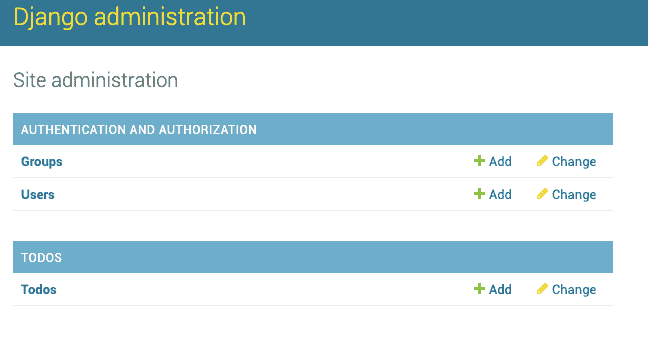
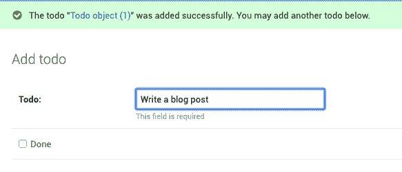

# 用 Django 创建一个简单的 ToDo Api

> 原文：<https://dev.to/wangonya/creating-a-simple-todo-api-with-django-2i1c>

在本教程中，我们将使用 Python 3 和 Django 2 创建一个简单的 todo api。

## 安装要求

创建一个虚拟环境并安装 Django。

```
$  virtualenv venv # creates a virtual environment
$  source venv/bin/activate # activates the virtual environment
(venv)$  pip install Django 
```

Enter fullscreen mode Exit fullscreen mode

这就是我们现在需要的。

## 创建项目

使用 Django `startproject`命令创建我们将要处理的项目。

```
$  django-admin startproject todoapi 
```

Enter fullscreen mode Exit fullscreen mode

这将创建一个包含生成文件的`todoapi`目录来开始我们的工作。该目录看起来应该是这样的:

```
manage.py
todoapi/
    __init__.py
    settings.py
    urls.py
    wsgi.py 
```

Enter fullscreen mode Exit fullscreen mode

## 数据库设置

为了简单起见，我们将使用 SQlite 数据库，所以我们不需要安装任何东西，因为它是 Python 自带的。另外，这已经在`todoapi/settings.py`中为我们设置好了。看一下代码，您应该会看到类似这样的内容:

```
# Database
# https://docs.djangoproject.com/en/2.1/ref/settings/#databases 
DATABASES = {
    'default': {
        'ENGINE': 'django.db.backends.sqlite3',
        'NAME': os.path.join(BASE_DIR, 'db.sqlite3'),
    }
} 
```

Enter fullscreen mode Exit fullscreen mode

## 创建模型

要为我们的数据库创建模型，我们首先需要创建一个 todos“应用程序”。这是我们实现我们特性的地方。

```
$  python manage.py startapp todos 
```

Enter fullscreen mode Exit fullscreen mode

这将创建一个包含以下文件的`todos`目录:

```
migrations/
    __init__.py
__init__.py
admin.py
apps.py
models.py
tests.py
views.py 
```

Enter fullscreen mode Exit fullscreen mode

这个应用程序应该添加到`todoapi/settings.py` :

```
INSTALLED_APPS = [
    ...,
    'todos'
] 
```

Enter fullscreen mode Exit fullscreen mode

好了，现在 Django 知道了我们的应用程序，打开`models.py`文件来添加模型。我们将只创建一个名为`Todo` :
的模型

```
from django.db import models

# Create your models here. class Todo(models.Model):
    todo = models.CharField(max_length=100, null=False,
                            help_text="This field is required")
    done = models.BooleanField(default=False) 
```

Enter fullscreen mode Exit fullscreen mode

这个模型将为我们创建一个带有`todo`和`done`列的表来保存我们的数据。`todo`列将保存实际的待办事项，而`done`列将保存状态——是否完成。注意，这是一个`BooleanField`，意味着我们将在完成时保存`True`，或者在未完成时保存`False`，这是默认设置。

现在我们需要做的就是运行`makemigrations`来通知 Django 我们的模型，并运行`migrate`来进行实际的迁移。

```
$  python manage.py makemigrations todos
$  python manage.py migrate 
```

Enter fullscreen mode Exit fullscreen mode

## 创建端点

我们现在有两个端点:

*   我们所有待办事项的列表
*   `/todos/<id>`到`GET`与 id 匹配的待办事项

为了测试这一点，我们将在`todos/view.py`文件中创建两个简单的视图。

```
from django.http import JsonResponse
from django.shortcuts import get_object_or_404

from .models import Todo

# Create your views here. def todos(request):
    todos_list = Todo.objects.all()
    data = {
        "todos": list(todos_list.values(
            "todo", "done"
        ))
    }
    return JsonResponse(data)

def single_todo(request, pk):
    todo = get_object_or_404(Todo, pk=pk)
    data = {
        "todo": todo.todo,
        "done": todo.done
    }
    return JsonResponse(data) 
```

Enter fullscreen mode Exit fullscreen mode

在你的`todos`应用中创建一个名为`urls.py`的新文件，并添加以下代码:

```
# todos/urls.py from django.urls import path

from .views import todos, single_todo

urlpatterns = [
    path("todos/", todos, name="todos"),
    path("todos/<int:pk>", single_todo, name="single_todo")
] 
```

Enter fullscreen mode Exit fullscreen mode

转到`todoapi/urls.py`并包含您刚刚创建的 todos URL:

```
# todoapi/urls.py from django.contrib import admin
from django.urls import path, include  # add include here 
urlpatterns = [
    path('admin/', admin.site.urls),
    path('', include('todos.urls'))  # add this ] 
```

Enter fullscreen mode Exit fullscreen mode

## 设置您的管理员并测试端点

创建超级用户:

```
$  python manage.py createsuperuser 
```

Enter fullscreen mode Exit fullscreen mode

接下来，在`/todos/admin.py`文件中注册您的模型，这样您就可以从管理仪表板中访问它们:

```
from django.contrib import admin
from .models import Todo

# Register your models here. admin.site.register(Todo) 
```

Enter fullscreen mode Exit fullscreen mode

就是这样！现在运行服务器并转到`http://127.0.0.1:8000/admin`。使用您在上面为超级用户注册的详细信息登录，以添加您的 todos。

[](https://res.cloudinary.com/practicaldev/image/fetch/s--G2PX6_ZS--/c_limit%2Cf_auto%2Cfl_progressive%2Cq_auto%2Cw_880/https://thepracticaldev.s3.amazonaws.com/i/x6voqtudx91zc4mnvede.png)

[](https://res.cloudinary.com/practicaldev/image/fetch/s--LP71uYKc--/c_limit%2Cf_auto%2Cfl_progressive%2Cq_auto%2Cw_880/https://thepracticaldev.s3.amazonaws.com/i/pmorh3sdlnknzfo1h2c2.png)

您可以通过端点检索通过 rest 客户端创建的 todos

*   `http://127.0.0.1:8000/todos`
*   `http://127.0.0.1:8000/todos/<id>`