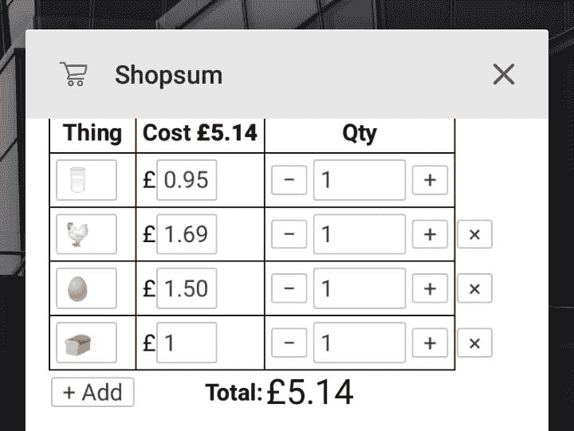

# 制作 PWA 不一定要很恐怖

> 原文：<https://dev.to/stegriff/making-a-pwa-doesn-t-have-to-be-scary-2i58>

# 我的第一次 PWA

渐进式网络应用程序是一个网站，你可以将其固定在主屏幕上，像应用程序一样离线使用。要将一个网站变成 PWA，你必须添加一些元数据和一个脚本。我将把这些归结为绝对的最小值——这个例子是一个简单的单页应用程序，只有一个`index.html`。

**TL；博士**你可以在 https://glitch.com/~shopsum[的 Glitch 上找到我的应用的源码](https://glitch.com/%7Eshopsum)

[](https://res.cloudinary.com/practicaldev/image/fetch/s--D8fz7-PH--/c_limit%2Cf_auto%2Cfl_progressive%2Cq_auto%2Cw_880/https://thepracticaldev.s3.amazonaws.com/i/h87m102zyahm233qz2s6.jpg)

## 1。你的网站必须是 HTTPS

艰难但真实。如果你不能在你的主机上轻松设置 HTTPS，考虑使用 Netlify，GitHub pages，Azure 网站，甚至 Glitch。所有这些都是 HTTPS 默认和大部分是免费的！

## 2。添加一个 manifest.json 并从 HTML 链接到它

下面是一个最小的示例文件:

```
{
  "name"              : "MyApp",
  "short_name"        : "MyApp",
  "description"       : "Faith, hope, love",
  "start_url"         : "/",
  "display"           : "standalone",
  "orientation"       : "any",
  "background_color"  : "#FFF",
  "theme_color"       : "#FFF",
  "icons": [
    {
      "src"           : "/img/android-icon-512.png",
      "sizes"         : "512x512",
      "type"          : "image/png"
    }
  ]
} 
```

Enter fullscreen mode Exit fullscreen mode

你不需要图标，但是如果你有，编辑上面的`icons/src`。您可以添加更多其他大小的图标。

`display`可以是:

*   `fullscreen`(像游戏一样)
*   `standalone`(类似原生 app)
*   `minimal-ui`(有一些浏览器控件)
*   `browser`(类似浏览器标签)

## 3。添加服务人员

**不要慌，很简单！**

如果您的站点已经有一个`main.js`或`client.js`或一些运行在页面上的脚本，添加以下语句:

```
if ('serviceWorker' in navigator) {
  navigator.serviceWorker.register('/sw.js');
} 
```

Enter fullscreen mode Exit fullscreen mode

...或者，在页面上创建一个新的`<script>`标签，并将其放入页面中！

现在将一个`sw.js`文件添加到与您刚才在上面注册的位置相匹配的项目中:

```
const version = 'v1';

self.addEventListener('install', function(event) {
  event.waitUntil(
    caches.open(version).then(function(cache) {
      return cache.addAll([
        '/',
        '/index.html',
        '/style.css',
        '/tachyons.css',
        '/vue.js',
        '/script.js',
        '/notfound.txt'
      ]);
    })
  );
});

self.addEventListener('fetch', function(event) {
  event.respondWith(caches.match(event.request).then(function(response) {
    // caches.match() always resolves
    // but in case of success response will have value
    if (response !== undefined) {
      return response;
    } else {
      return fetch(event.request).then(function (response) {
        // response may be used only once
        // we need to save clone to put one copy in cache
        // and serve second one
        let responseClone = response.clone();

        caches.open(version).then(function (cache) {
          cache.put(event.request, responseClone);
        });
        return response;
      }).catch(function () {
        return caches.match('/notfound.txt');
      });
    }
  }));
}); 
```

Enter fullscreen mode Exit fullscreen mode

...并修改由`cache.addAll`语句注册的文件列表以适应您的 web 应用程序。

## 4。你做到了！👍

您的网站现在可以脱机使用了！

离线用户只能访问您在上面列出的资产。因此，如果你的设置更复杂，你必须决定在哪里划线。服务工作者是一个机器人脚本，当用户离线时，它决定如何为用户获取资源；真理子用可爱的插图解释了它的作用，成为了有史以来最好的服务人员解释者。

如果你想制作一个专门的“哎呀，你离线了”页面，还有其他的指南！(见以下来源)

当您对应用程序进行更改时，您必须更改`version`变量来刷新客户端！这可能很烦人。可能有人知道更好的方法！😅

## 来源

我借鉴了这个 SitePoint 指南，[把你的网站改造成一个进步的网络应用](https://www.sitepoint.com/retrofit-your-website-as-a-progressive-web-app/#step2createawebappmanifest)，它相当简单，但还不够简单。MDN 的[服务人员演示](https://developer.mozilla.org/en-US/docs/Web/API/Service_Worker_API/Using_Service_Workers#Service_workers_demo)很棒，因为他们给出了我想做的事情的源代码(所以我的`sw.js`基本上是抄袭他们的——这是他们的 [GitHub 源代码](https://github.com/mdn/sw-test)

## 感谢

感谢阅读。我希望这个极度精简的指南对你有用！