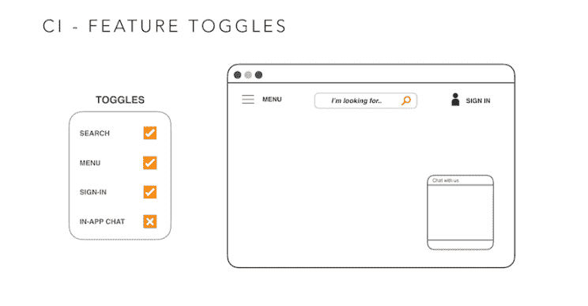
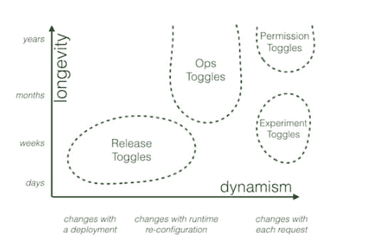

# 微服务的持续交付——基于主干的开发和功能切换

> 原文：<https://dev.to/gocd/continuous-delivery-of-microservices-trunk-based-development-and-feature-toggles-435d>

这是微服务系列- [CD 的第三篇帖子。在](https://www.gocd.org/tags/cd-for-microservices.html)[之前的帖子](https://www.gocd.org/2018/05/08/continuous-delivery-microservices-test-strategy/)中，我们讨论了在微服务架构上构建 CD 管道的测试策略。在本帖中，我们将深入探讨 CI 实践。

## 持续整合

持续集成是成功的持续交付策略中的关键实践。简单地说，这是一种要求开发人员一天几次将他们的代码集成到共享存储库中的实践。每一次签入都由自动化构建来验证，允许团队尽早发现问题。

我们将关注两个关键实践，基于主干的开发和特性切换。这两者对实施简单而稳健的 CI 流程大有帮助。

## 主干基础发展

在基于主干的开发(TBD)中，开发人员在一个称为“主干”的分支中就代码进行协作。主要的好处是避免开发分支中的漂移和由此产生的合并地狱。

这与维护长期特性和发布分支的实践相反。在分支模型中，尽管您可能在单个分支上运行构建，但可以说[您不是在进行持续集成](https://www.gocd.org/2017/05/16/its-not-CI-its-CI-theatre/)。在基于主干的开发中，您永远不会发现您的主干处于 CD 过程无法部署的状态。所有的代码都应该被检入主干，不断地构建和测试，并且代码库可以按需部署:所有这些都使得 CD 成为现实。

TBD 带来了更简单的 CD 工作流:您不必并行构建多个分支，将分支映射到环境，并在相同的功能合并到主干时重新测试。简化工作流在微服务环境中非常重要，因为随着微服务数量的增加，复杂性会增加。

[特征切换](https://martinfowler.com/articles/feature-toggles.html)是 TBD 的重要技术。

## 功能切换

功能切换允许提交正在进行的功能和已完成的功能的组合。使用这些开关，您可以在生产环境中关闭不完整特性的显示，直到这些特性在预生产环境中开发完成并经过充分测试。

这里有一个非常简单的例子。该团队正在为同一个应用开发四个功能:搜索、菜单、登录和应用内聊天。应用内聊天功能不完整(但你仍然可以在 TBD 登录 trunk ),或者你在生产前测试中发现了应用内聊天的问题。通过功能切换，你可以简单地关闭应用内聊天，甚至在运行时。

特性切换通常存储在靠近代码库的规范或配置文件中，并由 CD 管道中的自动化用来在特定环境中打开切换。它们只是代码库中的条件。您应该将这些切换的设置与实际的发布过程分开，以便您可以在运行时控制它。

在实现特性切换时，您应该考虑一些事情:

**功能切换应该是短暂的**

一旦一个特性通过了开发生命周期并在生产中启用，就应该放弃特性切换。它们被认为是需要清理的代码债务。

**使用工具管理触发器的生命周期**

不要低估管理这些切换所需的工作量。你可以很容易地碰到数百个这样的人。使用工具提供切换列表的可见性，在哪个环境中打开了什么，以及在下一个版本的生产中将打开哪些特性。

**考虑构建自己的实用程序**

没有太多的工具，所以考虑编写自己的实用程序来解决这些问题。同样，在实施微服务策略之前，将工具准备就绪是明智之举。

一旦有了维护特征切换的机制，就可以使用相同的机制引入其他类别的切换:

这个图是从我的同事 Pete Hodgson 那里借来的，他写了很多关于 toggles 的东西。在此图中，释放切换被定义为控制对未完成代码的访问的切换，这与功能切换相同。

Ops 切换控制生产代码的行为。季节性流量较大的零售网站使用 Ops toggles 来提供峰值负载时的降级体验。例如，当苹果发布新的 iPhone 时，它会有大量的流量来购买 iPhone，他们可以在高峰时间关闭用户推荐等功能，以支持销售交易。

权限切换用于打开特权用户的特定行为，如管理功能，或提供来宾用户浏览体验。

实验切换用于多变量测试。它用于在您将某个特性永久化之前测试它的接受程度。和 A/B 测试一样。

需要注意的一点是，每一类开关都有非常不同的生命周期和不同的开关方式。你需要做相应的计划。发布切换通常是比较短暂的，只在少数发布期间有效。一旦该特性完全发布，您就摆脱了切换并消除了您的技术债务。ops 切换经常用于生产中的功能，因此它的寿命要长得多。

## 总结

这是我们微服务博客系列 CD 的第 3 部分。我们已经深入讨论了 CI 实践，特别是基于主干的部署和特性切换。在下一篇文章中，我们将讨论第三个考虑因素:环境战略。