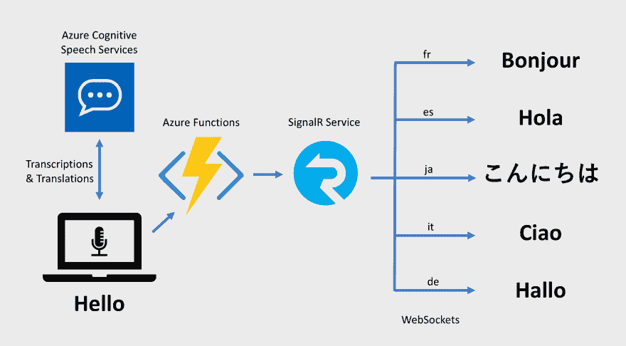
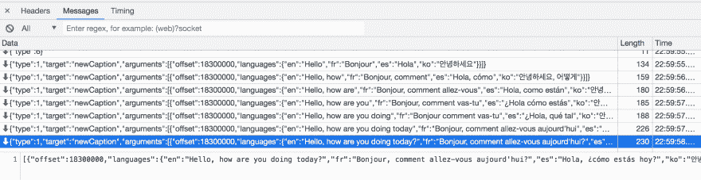
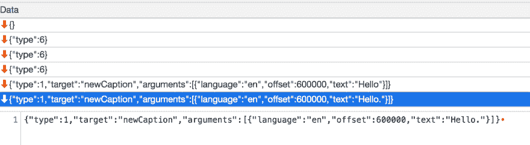

# 使用浏览器和云实时翻译语音

> 原文：<https://dev.to/azure/translating-speech-in-real-time-with-your-browser-and-the-cloud-1a9g>

[https://www.youtube.com/embed/YLtXoGk8A1c](https://www.youtube.com/embed/YLtXoGk8A1c)

当我们做现场演示时——无论是在线还是面对面——经常会有观众对我们说的语言感到不舒服，或者他们很难听到我们的声音。微软创造了[演示翻译器](https://translator.microsoft.com/help/presentation-translator/?WT.mc_id=devto-blog-antchu)通过将实时翻译的字幕发送到观众的设备来解决 PowerPoint 中的这个问题。

在本文中，我们将看看如何(用不太多的代码)构建一个在浏览器中运行的类似应用程序。它将使用浏览器的麦克风转录和翻译语音，并将结果实时广播给其他浏览器。因为我们在 Azure 上使用无服务器和完全托管的服务，它可以扩展到支持数千名观众成员。最重要的是，这些服务都有慷慨的免费层，所以我们可以开始没有支付任何东西！

## 概述

该应用程序由两个项目组成:

*   一个 Vue.js 应用，是我们的主界面。它使用[微软 Azure 认知服务语音](https://docs.microsoft.com/azure/cognitive-services/speech-service/speech-sdk?WT.mc_id=devto-blog-antchu) SDK 来监听设备的麦克风，并执行实时语音到文本和翻译。
*   一个提供无服务器 HTTP APIs 的 [Azure Functions](https://docs.microsoft.com/azure/azure-functions/?WT.mc_id=devto-blog-antchu) 应用程序，用户界面将调用该应用程序，使用 [Azure SignalR 服务](https://docs.microsoft.com/azure/azure-signalr/?WT.mc_id=devto-blog-antchu)向连接的设备广播翻译后的字幕。

[](https://res.cloudinary.com/practicaldev/image/fetch/s--S_9q5RXW--/c_limit%2Cf_auto%2Cfl_progressive%2Cq_auto%2Cw_880/https://thepracticaldev.s3.amazonaws.com/i/rsmu714lo28jxpd3ny0x.png)

## 面向认知服务的语音 SDK

从浏览器监听麦克风并调用认知语音服务来实时检索转录和翻译所需的大部分繁重工作都由该服务的 [JavaScript SDK](https://docs.microsoft.com/javascript/api/microsoft-cognitiveservices-speech-sdk/?WT.mc_id=devto-blog-antchu&view=azure-node-latest) 完成。

SDK 需要语音服务密钥。您可以创建一个免费帐户(每月最多 5 小时的语音转文本和翻译)并通过运行以下 [Azure CLI](https://docs.microsoft.com/cli/azure/install-azure-cli?WT.mc_id=devto-blog-antchu&view=azure-cli-latest) 命令查看其密钥:

```
az cognitiveservices account create -n $SPEECH_SERVICE_NAME -g $RESOURCE_GROUP_NAME --kind SpeechServices --sku F0 -l westus
az cognitiveservices account keys list -n $SPEECH_SERVICE_NAME -g $RESOURCE_GROUP_NAME 
```

Enter fullscreen mode Exit fullscreen mode

你也可以使用 Azure portal 创建一个免费的语音服务账户，使用[这个链接](https://portal.azure.com/?WT.mc_id=devto-blog-antchu#create/Microsoft.CognitiveServicesSpeechServices)(选择 *F0* 作为免费层)。

## 蓝色信号服务

Azure SignalR 服务是一个完全托管的实时消息平台，支持 WebSockets。我们将它与 Azure 函数结合使用，将翻译后的字幕从演示者的浏览器广播到每个观众的浏览器。SignalR 服务可以扩展到支持数十万个同时连接。

信号服务有一个免费层。要创建实例并获取其连接字符串，请使用以下 Azure CLI 命令:

```
az signalr create -n $SIGNALR_NAME -g $RESOURCE_GROUP_NAME --sku Free_DS2 -l westus
az signalr key list -n $SIGNALR_NAME -g $RESOURCE_GROUP_NAME 
```

Enter fullscreen mode Exit fullscreen mode

你也可以使用 Azure 门户通过使用[这个链接](https://portal.azure.com/?WT.mc_id=devto-blog-antchu#create/Microsoft.SignalRGalleryPackage)来创建一个。

## 浏览器中的语音转文本和翻译

认知服务的语音 SDK 真的很好用。首先，我们将它放入我们的 Vue 应用:

```
npm install microsoft-cognitiveservices-speech-sdk 
```

Enter fullscreen mode Exit fullscreen mode

然后我们只需要初始化并启动它:

```
// listen to the device's microphone
const audioConfig = AudioConfig.fromDefaultMicrophoneInput()
// use the key and region created for the Speech Services account
const speechConfig = SpeechTranslationConfig.fromSubscription(options.key, options.region)

// configure the language to listen for (e.g., 'en-US')
speechConfig.speechRecognitionLanguage = options.fromLanguage
// add one or more languages to translate to
for (const lang of options.toLanguages) {
  speechConfig.addTargetLanguage(lang)
}

this._recognizer = new TranslationRecognizer(speechConfig, audioConfig)

// assign callback when text is recognized ('recognizing' is a partial result)
this._recognizer.recognizing = this._recognizer.recognized = recognizerCallback.bind(this)
// start the recognizer
this._recognizer.startContinuousRecognitionAsync() 
```

Enter fullscreen mode Exit fullscreen mode

就是这样！只要文本被识别，就会调用`recognizerCallback`方法。它被传递了一个带有`translations`属性的事件参数，该属性包含我们请求的所有翻译。例如，我们可以用`e.translations.get('fr')`获得法语翻译。

## 向其他客户端播放字幕

由于认知服务语音 SDK，我们现在可以获得字幕和翻译，我们需要将这些信息广播给所有通过 WebSocket 连接到 SignalR 服务的观众，以便他们可以实时显示字幕。

首先，我们将创建一个 Azure 函数，只要识别出新文本，我们的 UI 就可以调用它。这是一个基本的 HTTP 函数，使用 Azure SignalR 服务输出绑定来发送消息。

输出绑定是在 function.json 中配置的，它接受由函数返回的 SignalR 消息对象，并将其发送给连接到名为`captions`的 SignalR 服务中心的所有客户端。

```
{  "disabled":  false,  "bindings":  [  {  "authLevel":  "anonymous",  "type":  "httpTrigger",  "direction":  "in",  "name":  "req",  "methods":  [  "post"  ]  },  {  "type":  "http",  "direction":  "out",  "name":  "res"  },  {  "type":  "signalR",  "name":  "$return",  "hubName":  "captions",  "direction":  "out"  }  ]  } 
```

Enter fullscreen mode Exit fullscreen mode

该函数简单地获取输入的有效负载，包括所有可用语言的翻译，并使用 SignalR 服务将其转发给客户端。(把每一种语言发送给每一个客户是相当低效的；我们将在以后的信号组中改进这一点。)

```
module.exports = async (context, req) => ({
    target: 'newCaption',
    arguments: [req.body]
}); 
```

Enter fullscreen mode Exit fullscreen mode

回到我们的 Vue 应用，我们引入了 SignalR SDK:

```
npm install @aspnet/signalr 
```

Enter fullscreen mode Exit fullscreen mode

> 注意，尽管这个包在 npm 上的 *@aspnet* org 下，但是它是 SignalR 的 JavaScript 客户端。它以后可能会移动到不同的组织，以便更容易找到。

当观众成员决定加入字幕会话并且安装了我们的 Vue 组件时，我们将启动与 SignalR 服务的连接。

```
async mounted() {
  this.connection = new signalR.HubConnectionBuilder()
    .withUrl(`${constants.apiBaseUrl}/api`)
    .build()
  this.connection.on('newCaption', onNewCaption.bind(this))
  await this.connection.start()
  console.log('connection started')

  function onNewCaption(caption) {
    // add the caption for the selected language to the view model
    // Vue updates the screen
  }
} 
```

Enter fullscreen mode Exit fullscreen mode

每当一个`newCaption`事件到达时，就会调用`onNewCaption`回调函数。我们挑选出与查看者选择的语言相匹配的标题，并将其添加到视图模型中。Vue 完成剩下的工作，并用新的标题更新屏幕。

我们还添加了一些代码，以便在 Vue 组件被破坏时(例如，当用户离开视图时)断开与 SignalR 服务的连接。

```
async beforeDestroy() {
  if (this.connection) {
    await this.connection.stop()
    console.log('connection stopped')
  }
} 
```

Enter fullscreen mode Exit fullscreen mode

这几乎是整个应用程序！它从麦克风捕捉语音，将其翻译成多种语言，并将翻译实时广播给成千上万的人。

## 用信号员组提高效率

到目前为止，我们构建的应用程序有一个缺陷:每个观众都会收到各种可用语言的字幕，但他们只需要自己选择的语言。有时字幕每秒发送多次，因此向每个客户发送每种语言会使用大量不必要的带宽。我们可以通过检查 WebSocket 流量来了解这一点:

[](https://res.cloudinary.com/practicaldev/image/fetch/s--Sail2Uov--/c_limit%2Cf_auto%2Cfl_progressive%2Cq_auto%2Cw_880/https://thepracticaldev.s3.amazonaws.com/i/3j53rflerwb9owufao5j.png)

为了解决这样的问题，SignalR 服务有一个叫做“组”的概念。组允许应用程序将用户放入任意的组。我们可以将消息发送给特定的群体，而不是将消息广播给每个有联系的人。在我们的例子中，我们将 Vue 应用程序的每个实例视为一个“用户”,我们将根据他们选择的语言将他们放入一个组中。

我们将发送更小的、有针对性的消息，每个消息只包含一种语言，而不是向每个人发送包含每种语言的单个消息。每条消息都发送给选择接收该语言字幕的用户组。

### 添加唯一的客户 ID

当应用程序启动时，我们可以生成一个唯一的 ID 来表示 Vue 实例。使用群组的第一步是应用程序使用该标识符作为用户 ID 来验证 SignalR 服务。我们通过修改我们的 *negotiate* Azure 函数来实现这一点。SignalR 客户端调用这个函数来检索一个访问令牌，它将使用这个令牌来连接到服务。到目前为止，我们一直使用匿名令牌。

我们将从更改 negotiate 函数的路由开始，以包含用户 ID。然后，我们使用路由中传递的用户 ID 作为 SignalRConnectionInfo 输入绑定中的用户 ID。该绑定会生成一个 SignalR 服务令牌，并对该用户进行身份验证。

```
{  "disabled":  false,  "bindings":  [  {  "authLevel":  "anonymous",  "type":  "httpTrigger",  "direction":  "in",  "name":  "req",  "methods":  [  "post"  ],  "route":  "{userId}/negotiate"  },  {  "type":  "http",  "direction":  "out",  "name":  "res"  },  {  "type":  "signalRConnectionInfo",  "direction":  "in",  "userId":  "{userId}",  "name":  "connectionInfo",  "hubName":  "captions"  }  ]  } 
```

Enter fullscreen mode Exit fullscreen mode

实际功能本身不需要任何改变。

接下来，我们需要更改我们的 Vue 应用程序，以在路由中传递 ID(`clientId`是我们的应用程序的这个实例生成的唯一 ID):

```
this.connection = new signalR.HubConnectionBuilder()
  .withUrl(`${constants.apiBaseUrl}/api/${this.clientId}`)
  .build() 
```

Enter fullscreen mode Exit fullscreen mode

SignalR 客户端将把`/negotiate`附加到 URL 的末尾，并用用户 ID 调用我们的函数。

### 将客户端添加到群组中

现在，每个客户端都用一个唯一的用户 ID 连接到 SignalR 服务，我们需要一种方法将一个用户 ID 添加到代表客户端所选语言的组中。

我们可以通过创建一个名为 *selectLanguage* 的 Azure 函数来做到这一点，我们的应用程序将调用该函数来将其自身添加到一个组中。与向 SignalR 服务发送消息的函数一样，该函数也使用 SignalR 输出绑定。我们将传递用于在组中添加和删除用户的组操作对象，而不是将 SignalR 消息传递给输出绑定。

```
const constants = require('../common/constants');

module.exports = async function (context, req) {
    const { languageCode, userId } = req.body;
    const signalRGroupActions =
        constants.languageCodes.map(lc => ({
            userId: userId,
            groupName: lc,
            action: (lc === languageCode) ? 'add' : 'remove'
        }));
    context.bindings.signalRGroupActions = signalRGroupActions;
}; 
```

Enter fullscreen mode Exit fullscreen mode

该函数通过函数体中的`languageCode`和`userId`来调用。我们将为应用程序支持的每种语言输出一个 SignalR 组动作——为我们选择订阅的语言设置一个动作`add`,为其余所有语言设置一个动作`remove`。这可以确保删除任何现有的订阅。

最后，我们需要修改我们的 Vue 应用程序，以便在创建组件时调用 *selectLanguage* 函数。我们通过在语言代码上创建一个监视器来实现这一点，只要用户更新它的值，这个监视器就会调用这个函数。此外，我们将手表的`immediate`属性设置为`true`,这样它将在手表最初创建时立即调用该函数。

```
methods: {
  async updateLanguageSubscription(languageCode) {
    await axios.post(`${constants.apiBaseUrl}/api/selectlanguage`, {
      languageCode,
      userId: this.clientId
    })
  }
},
watch: {
  toLanguageCode: {
    handler() {
      return this.updateLanguageSubscription(this.toLanguageCode)
    },
    immediate: true
  }
}, 
```

Enter fullscreen mode Exit fullscreen mode

### 向群组发送消息

我们要做的最后一件事是修改我们的 Azure 函数，该函数广播标题，将每条消息分成每种语言的一条消息，并将每条消息发送到相应的组。要向一组客户端发送消息，而不是向所有客户端广播，请向 SignalR 消息:
添加一个`groupName`属性(设置为语言代码)

```
module.exports = async function (context, req) {
    const captions = req.body;

    const languageCaptions = Object.keys(captions.languages).map(captionLanguage => ({
        language: captionLanguage,
        offset: captions.offset,
        text: captions.languages[captionLanguage]
    }));

    const signalRMessages = languageCaptions.map(lc => ({
        target: 'newCaption',
        groupName: lc.language,
        arguments: [ lc ]
    }));

    return signalRMessages;
}; 
```

Enter fullscreen mode Exit fullscreen mode

现在，当我们运行应用程序时，它仍然像以前一样工作，但如果我们检查 WebSocket 连接上的 SignalR 流量，每个标题只包含一种语言。

[](https://res.cloudinary.com/practicaldev/image/fetch/s--eLgOmKvP--/c_limit%2Cf_auto%2Cfl_progressive%2Cq_auto%2Cw_880/https://thepracticaldev.s3.amazonaws.com/i/w1vqlhqzioxkjn3lszma.png)

## 下一步

*   在 GitHub 上查看[源代码](https://github.com/anthonychu/captionr)
*   部署应用程序——[SignalR 服务无服务器编程指南](https://docs.microsoft.com/azure/azure-signalr/signalr-concept-serverless-development-config?WT.mc_id=devto-blog-antchu)中有更多详细信息
*   探索 Azure 语音服务和 Azure 功能的 T2 服务绑定

想法？有问题吗？请在下方留言或在 [Twitter](https://twitter.com/nthonyChu) 上找到我。