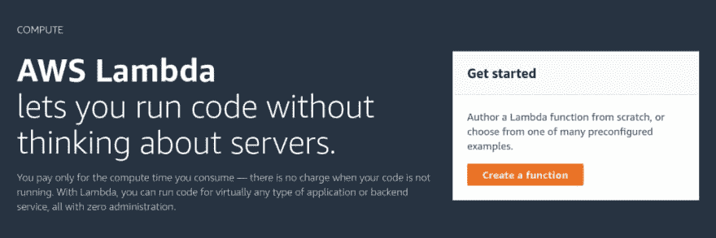
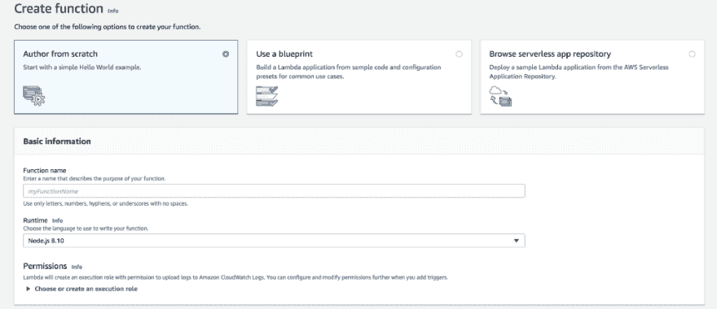
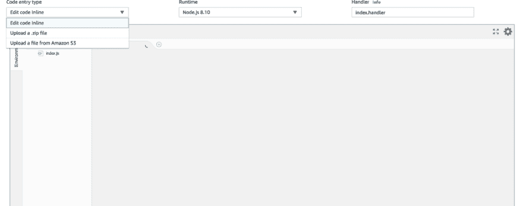
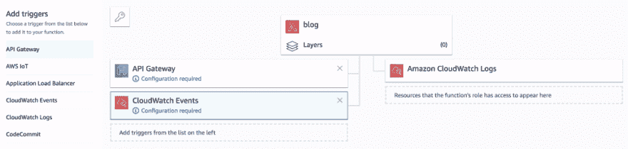
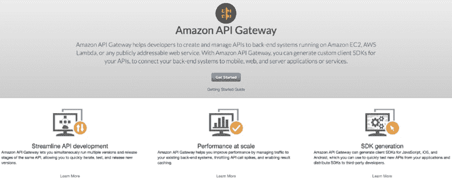
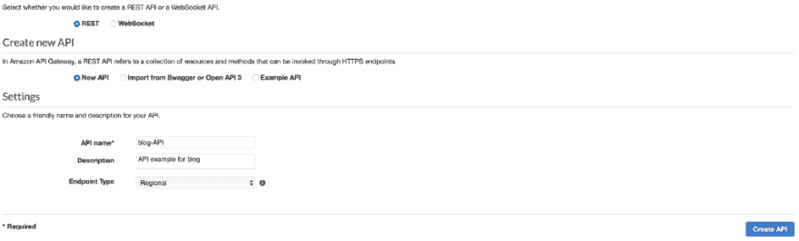
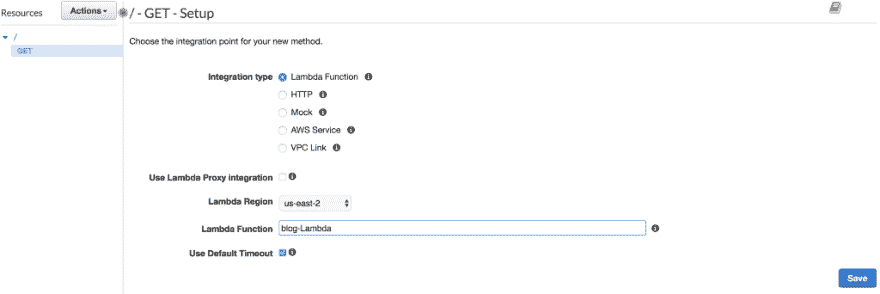
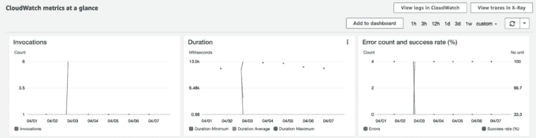

# 编写我的第一个 AWS Lambda 函数

> 原文：<https://dev.to/dhruv/writing-my-first-aws-lambda-function-295j>

首先，Lambda 函数是不可思议的！Lambda 最好的一点是，您只需为函数运行的时间付费，与运行 24x7 全天候 AWS EC2 实例相比，这为您节省了很多钱。

为了让 Lambda 函数正常工作，我们需要三样东西——工作代码、触发器和监控工具。

顾名思义，触发器是用来调用函数的。目前，AWS 有 12 种方式触发任何 Lambda 函数。

1.  API 网关
2.  AWS 物联网
3.  应用负载平衡器
4.  CloudWatch 事件
5.  CloudWatch 日志
6.  代码提交
7.  认知同步触发器
8.  DynamoDB
9.  由外界刺激引起的不随意运动
10.  S3
11.  社交网站（Social Network Site 的缩写）
12.  SQS

在这里，我将讨论其中的 3 个，我一直使用到现在。

### 创建 Lambda 函数

登录您的 AWS 控制台。在控制台中，您可以在服务下找到 AWS Lambda，这会将您带到 Lambda 控制台。

<figcaption>λ控制台页面</figcaption>

如果这是你第一次使用 Lambda，你会看到这个。点击**创建功能**按钮，启动您的第一个功能。

您将进入设置页面，在这里您可以配置功能(名称、运行时间、角色)。您可以从蓝图或无服务器应用程序存储库中创建 Lambda。我使用了* *作者从头开始** 选项。

 

<figcaption>创建λ函数配置</figcaption>

在决定如何调用我的函数之后，我可以选择我的运行时，AWS 有很多支持的语言和版本。Net、Go、Java、Node.js、Python、Ruby)。我的大多数项目都使用 Node.js 8.10。如果您还没有一个角色，您必须创建一个新角色。

#### 编写我的 Lambda 函数代码

AWS 给了我 3 个选项来编写我的代码

1.  使用内联代码编辑器(如果您的代码很短，并且只使用像 S3 这样的 amazon 依赖项，建议使用)
2.  上传 zip 文件夹(如果您使用非 amazon 依赖项，建议使用)
3.  从 S3 上传文件(如果您的 zip 文件大于 10MB，建议使用)

写完代码后，如果需要，您可以修改配置。我必须为我的用例增加默认的 3s 超时。

点击**保存**按钮，你的 lambda 功能就准备好了！

采用 TDD 方法，你总是可以测试你的代码。您还可以配置您的测试事件！

 

<figcaption>测试你的亚马逊 AWS Lambda 功能</figcaption>

### 创建触发器

到目前为止，我的所有项目都使用 API gateway 和 CloudWatch Events。当您打开函数时，您可以通过从列表中选择您喜欢的选项来添加触发器。

 

<figcaption>为λ函数添加触发器</figcaption>

#### 配置 API 网关

您可以选择现有的 API，也可以配置新的 API。如果这是您第一次使用，您可以在服务下找到 AWS API Gateway，它会将您带到 API Gateway 控制台。

T3】亚马逊 API 网关配置

点击**开始**按钮，它会带你到配置页面。选择协议，输入名称、描述等，然后创建新的 API

根据您的用例创建一个新方法，并将其集成到您的 lambda 函数中。保存后，您将获得 REST API 的一个端点。请求这个端点将触发你的 lambda 函数。

 

<figcaption>在亚马逊 API 网关中创建方法</figcaption>

#### 配置 CloudWatch 事件

您可以选择现有角色，也可以创建一个角色。创建新规则需要您输入名称、描述、规则类型等。在计划表达式中，您可以设置 Cron。所有 Cron 表达式都使用 UTC。

> cron(0 17 个？* MON-FRI *

这将在周一至周五格林威治时间 17:00:00 触发您的 lambda 功能。

### 监控

Lambda 的另一个好处是(一般来说是 AWS ),我们可以监控各种事件，比如调用、持续时间、错误等等。

 

<figcaption>在 AWS 中监控 Lambda</figcaption>

CloudWatch Logs 让您深入了解执行开始、执行结束、请求长度、每次执行*所使用的内存。*

如果您已经完成了这一步，我希望您在探索无服务器架构的过程中获得乐趣:)

这篇文章最初发表在[媒体](https://medium.com/@nendhruv/writing-my-first-aws-lambda-function-2d4e5b0015fe)上