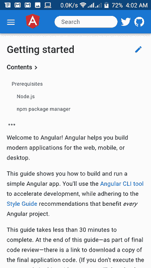
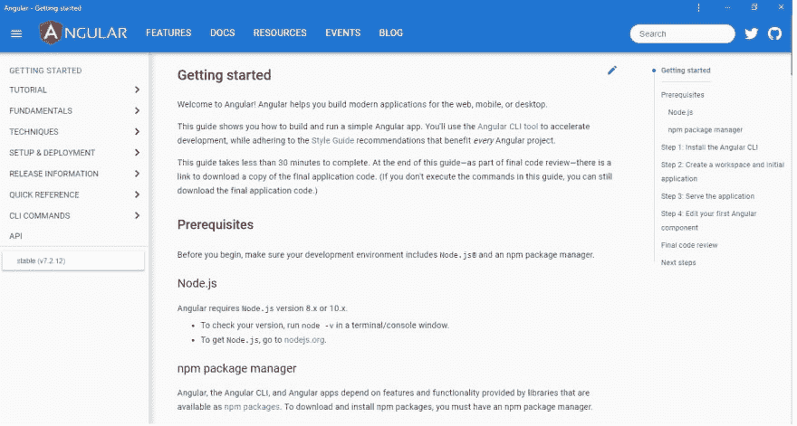

# 如何使用文档来理解 Angular

> 原文：<https://dev.to/angular/how-to-understand-angular-using-the-documentation-i87>

当学习一门新的语言或框架时，找到合适的资源可能很困难，依靠文档是你最好的选择。它为您提供了入门的基础知识。

> 手册是最重要的文件，没人看，我们很多人都没看过。

但是对于大多数开发人员来说，文档可能很难理解或者太大而无法阅读。

Angular 的文档是我看过的最详细的文档之一，团队在简化它方面做得很好。

在这篇文章中，我将解释我是如何阅读并充分利用 Angular 的文档的，这个模式帮助了我，我希望它能帮助你。

### 结构。

Angular 的文档旨在将你从初学者变成 Angular 开发者。

在 Angular 的官方页面 [angular.io](https://angular.io) ，点击**开始**。

<figure> 

<figcaption>移动视图</figcaption>

</figure>

<figure> 

<figcaption>桌面视图</figcaption>

</figure>

#### 文档的目录。

要查看文档的目录，单击屏幕左上方的汉堡菜单，导航菜单将会滑出。

来说说他们吧。

*   **入门**
    入门部分将指导您设置 Angular 环境，安装 Angular 使用的其他软件，以及第一个 Angular 应用程序。

*   教程
    教程部分将带你构建一个全功能的 Angular 应用程序，并附带一些代码和示例，为你提供生产就绪的 Angular 技能。

*   **基础知识**
    基础知识部分解释了 Angular 构建块背后的特性和架构师，Angular 是如何围绕这些特性构建的，以及这些特性如何帮助您编写更好的代码。

*   **技术**
    技术部分描述了 Angular 的新增特性和实现，包括如何使用第三方库和特性。

*   **设置和部署**
    设置和部署部分描述了文件结构、环境配置、其他概念，如应用程序的一般生命周期，以及应用程序如何与浏览器交互。

*   **发布信息**
    发布信息部分解释了为什么 Angular 会被社区频繁更新。框架的主要版本何时发布，会有哪些特性，包括如何将应用程序更新到最新版本。

*   **快速参考**
    你需要的其他信息、代码风格指南和文档中使用的术语定义。

*   CLI 命令
    Angular CLI 的 CLI 命令列表，带有可提高您工作效率的其他标志。

*   **API**
    所有 Angular 的 API 列表，并附有详细描述。

## 导航

上面提到的可能会让你不知所措，但是不要担心，让我告诉你一个秘密。

#### 去哪里

**第一次使用 Angular** :你是 Angular 的新手，你看过在线教程或者你正在进行框架切换。推荐你从*入门*开始，跟着指南走，通读理解。继续阅读*教程*部分，在教程结束后继续编码和练习。

**为什么**:入门部分将带你搭建你的应用，它将解释基本过程，如何安装 Angular CLI 以及如何开始或启动 Angular 项目。作为初学者，这是一个基本的指导。

教程部分将为您提供一个功能应用，涵盖了 Angular 构建应用的最重要部分，语法和特性将为您提供 Angular 的基础知识。

**继续前进**:接下来我建议你导航到*基础*，你不需要在这一部分做代码。通读理解，这将打开你看到引擎盖下的角度，这是字面上的 Aha 部分。

**为什么**:团队着重解释框架的每个组件如何相互作用，框架特性背后的概念，以及它是如何为开发人员提供构建应用程序的灵活性和能力的。当我读这部分的时候，感觉像是丹·布朗的小说😊😊。

**现在打破链条**:跳四步到 *CLI 命令*部分，像参考列表一样一个主题一个主题地阅读，练习每个主题，*不重要*但是你会看到这些命令能做什么。

**为什么**:在这个阶段，在你的教程/练习中，你已经使用了其中的一些命令，本节为你提供了每个命令的详细解释，以及一些你甚至不知道存在的命令，包括你可以通过的可能标志。完成后，您将像 Angular pro 一样编写 CLI 命令。

**后退一点点**:回到技术上，在这一点上你是一个棱角分明的天才，向前去建造。*愿 NGs 与你同在*。但是即使是天才也会犯错，要成为大师，你必须永不停止学习。
这些错误可能会导致你的应用程序出现安全漏洞，技术部分解释了帮助进行安全检查的最佳方法，以及一些*该做和不该做的事情*。本节将指导您如何实现一些最新的软件开发实践，比如实现 Angular PWA 的 Service Worker 和许多其他很酷的实践。

**我们还在这里吗**:好的，前往*设置和部署*部分，这更像是一个描述部分。它描述了如何为生产或开发环境准备您的 Angular 应用程序，如何测试和设置测试环境，以及如何生产和部署您的 Angular 应用程序*又名* `Hello World!`。

剩下的留到最后:我说过，“你永远不能停止学习”。API 部分是知识的海洋，这是它应该有的。我的建议可能是，但我的确认是，你不能一页一页地阅读 API，更令人困惑的是它是按字母顺序排列的。所以为了不混淆你的困惑，你不需要以正确的方式阅读这一部分。它应该是不时带您回到文档的部分。

## 结论

学习一个新的框架是一个激动人心的旅程，当你有合适的工具和资源来帮助你的时候，这将会很有趣。你学习或使用这些资源的方式会影响你的旅程。你可能有自己的学习方式，有些人通过视频、博客或物理辅导学习，有些人甚至不需要文档，“相信我，他们存在😉。我不是强迫你遵循这个指南，它确实在我的旅程中帮助了我。如果你有任何可能对你的旅程有所帮助的指南或资源，我会很高兴听到的，请在评论区分享，谢谢。
祝你在学习和理解 Angular 上好运，再次*“愿 NGs 与你同在……”*