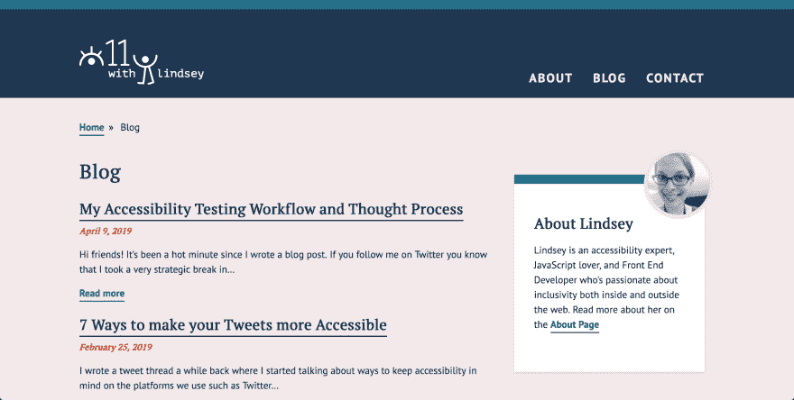
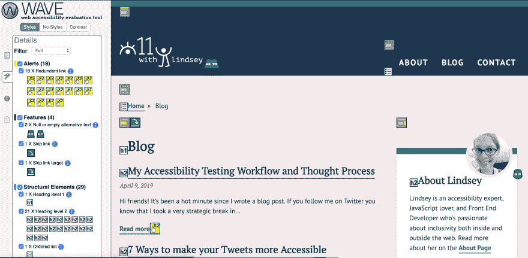
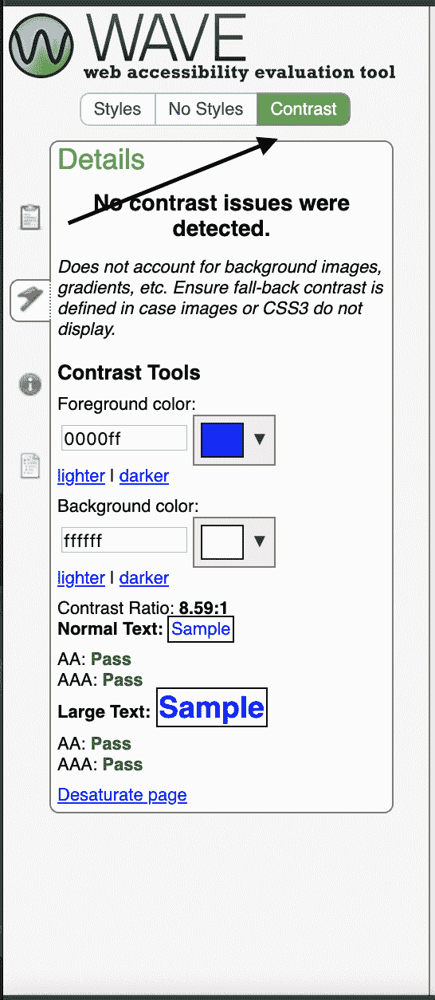

# 我的网页易访问性测试过程

> 原文：<https://dev.to/lkopacz/my-web-accessibility-testing-process-5b5h>

[https://api.parler.io/ss/player?url=https://www.parler.io/audio/7119149108/9e5dc5641e88e812e0903c9df90a0933946bc91c.67256623-e5a3-4d82-b83b-9d4c7502bb75.mp3](https://api.parler.io/ss/player?url=https://www.parler.io/audio/7119149108/9e5dc5641e88e812e0903c9df90a0933946bc91c.67256623-e5a3-4d82-b83b-9d4c7502bb75.mp3)

*原贴于[a11ywithlindsey.com](https://www.a11ywithlindsey.com/blog/web-accessibility-testing-process)T3】*

嗨，朋友们！自从我写了一篇博客帖子以来，这是一个炎热的时刻。如果你在 Twitter 上关注我[，你会知道我在三月份做了一次非常战略性的休息，努力走在事情的前面。所以现在我开始运行，我问一些追随者他们希望我下一步写什么。](https://twitter.com/LittleKope/status/1101112031355260928)

听起来好像人们对我的网页可访问性测试方法很好奇！因此，我将带你了解我的思维过程，我测试什么，我多早检查，我如何测试。这就像我的网页可访问性测试清单放在你的后口袋里一样。

## 入门

我的网页可访问性测试过程在我开始写代码之前就已经开始了。希望我没有孤立于设计师之外，并参与设计决策。即使我没有输入，我也开始查看设计，以及如何确保一切都是可访问的。

我看了一下设计，并评估了任何潜在的可访问性问题。例如，如果我正在看下面我的网站的设计:

我将开始思考如何在标记中展示这一点。

*   “博客”页面标题将是一个`<h1>`
*   日期将是`<time>`
*   博客文章标题将有`<h2>`链接
*   所有的博客预告都将包含在一个`<main>`标签中

我不会进一步去解释一个设计，因为这可能是一篇很长的文章。但是思考语义标记是我的过程中必不可少的一部分，我不想忽视它。从一个好的 HTML 基础开始对测试过程有很大的帮助。

## 通过 Wave 运行站点

在我工作的时候，我通常通过 [WebAIM Wave 工具](https://chrome.google.com/webstore/detail/wave-evaluation-tool/jbbplnpkjmmeebjpijfedlgcdilocofh?hl=en-US)来运行我的网站。每次我做新东西的时候，我都会看一眼。当我想知道我的问题在哪里时，使用 Wave 工具扩展在我的本地环境中工作得很好。通过这个练习，我了解到我有一些多余的链接。

冗余链接是我作为一个网页可访问性博客作者应该解决的问题。我应该在之前解决这个问题，但是为了透明和学习，我把它留在这里。在我发帖的时候，我可能已经纠正了这个问题，但是截图仍然会在这里。

正如您在这里看到的，我有 0 个错误(耶)和 18 个冗余链接警报。警报的优先级低于错误，但是因为我没有任何错误，所以我将专注于修复这些错误。我在这里要做的是创建一个拉请求并修复它们。我喜欢 Wave 工具的一点是，它告诉你为什么它很重要，以及如何解决这个问题。

也有人用谷歌 Chrome 上的灯塔工具！我也喜欢 Lighthouse，但是我倾向于在实时网站上使用它们作为可访问性审计工具，而不是在我构建时进行测试。

## 评估对比

我上面提到的波浪工具有一个对比度检查器。

通常，我已经测试过设计师给我的颜色组合。但是，当我收到一个有几个颜色的样式指南时，有时我会在没有仔细检查的情况下实现它。我们有时都会为此感到内疚，因为我们是人。当我第一次启动这个网站时，我忽略了一个对比问题。在日期元素的颜色上，以前是`#D73C13`，现在是`#C03711`。我没有按照我的设计师的建议，把原来的颜色放在我的背景上，这就是`#F3E9EA`。

有人友好地向我指出，我有一些颜色对比的问题。一旦我不再感到尴尬，我就用 [WebAIM 的对比检查器](https://webaim.org/resources/contrastchecker/)来评估它。我通过使用“亮度”输入使朱红变暗，很快解决了这个问题。我调整颜色，直到我在对比度检查器上得到及格分数。

## 标签页浏览我的网站

我总是点开浏览器的网址，按下`tab`键。我们希望确保我们仍然知道重点在哪里。我们希望能够访问控件来帮助我们查看内容。我们希望留意任何需要互动的事情。

这是我处理过的一些问题的例子

*   有一个封闭的汉堡菜单，并能够跳转到其中的链接。这种情况让键盘用户感到困惑，因为他们不确定他们关注的是什么链接。
*   在桌面视图中，用户无法用键盘打开汉堡包菜单。
*   去一个电子商务网站，看到一个“相关项目”幻灯片，却无法使用箭头。
*   使用弹出一个模态的“登录”按钮，焦点仍然在模态的“后面”，无法到达表单。

应对这些挑战是提高 JavaScript 技能的好方法！通过这种方式，我学到了很多关于 JavaScript 的知识。当链接不可见时，我需要 tabIndex 属性为`-1`。此外，当我们打开一个菜单时，我将使用一个事件监听器将`tabIndex`切换到`0`。我们还可以确保产品滑块箭头是按钮，以便它们在点击事件上工作！我在上一篇关于[提高键盘易用性的 3 个简单技巧](https://www.a11ywithlindsey.com/blog/3-simple-tips-improve-keyboard-accessibility)的文章中谈到了语义按钮的使用。如果你想看这方面的演示，并有一个 Egghead PRO 帐户，我在我的
[使用语义 HTML 提高汉堡菜单的可访问性](https://egghead.io/lessons/html-5-use-semantic-html-to-improve-hamburger-menu-accessibility)一课中演示了这一点。

## 屏幕阅读器测试

屏幕阅读器测试对我来说是最棘手的部分。我视力正常，因此并不真正理解这有多难。

然而，运行屏幕阅读器是帮助我发现我没有意识到存在的问题的关键。最近，我在一个条形图数据可视化中发现了一个问题，其中我有一个格式为“110k”的数字我觉得这个读成“11 万”会更好

我仍在努力学习如何更好地使用屏幕阅读器。我主要使用 VoiceOver，它是 Mac 的屏幕阅读器。我一直在使用 [Web Aim 的画外音指南](https://webaim.org/articles/voiceover/)来帮助我提高屏幕阅读器的使用率。我通常在测试的时候保持它，以防我忘记一个命令。需要记住的一件重要事情是，大多数指南都将“VO”作为一种快捷方式。“VO”相当于你 Mac 上的`control + option`。

## 结论

这篇文章有点长，因为我想确保我完成了我的个人项目。我想写一篇关于持续集成、所有测试库以及我如何使用 react-testing-library 进行集成测试的后续文章。现实是，我们大多数人都在团队中工作，我们需要在工作流程中内置一些自动化。那个帖子马上就来了！敬请期待！

请随时让我知道你在 Twitter 上的想法。如果你有兴趣从我这里听到更多内容[，订阅我的时事通讯](https://pages.convertkit.com/4218bd5fb5/68dc4e412a)(随时退订)